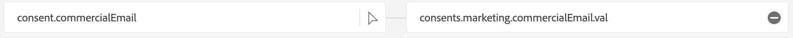

# 1.2.4 Ingestion de données à partir de sources hors ligne

Dans cet exercice, l’objectif est d’intégrer des données externes telles que les données CRM dans Platform.

## Objectifs d’apprentissage

- Découvrez comment générer des données de test.
- Découvrez comment ingérer du fichier CSV.
- Découvrez comment utiliser l’interface utilisateur web pour l’ingestion de données par le biais de workflows
- Comprendre les fonctionnalités de gouvernance des données d’Experience Platform

## Ressources

- Mockaroo : [https://www.mockaroo.com/](https://www.mockaroo.com/)
- Adobe Experience Platform : [https://experience.adobe.com/platform/](https://experience.adobe.com/platform/)

## Tâches

- Créez un fichier CSV avec des données de démonstration. Ingérez le fichier CSV dans Adobe Experience Platform à l’aide des workflows disponibles.
- Présentation des options de gouvernance des données dans Adobe Experience Platform

## Créer un jeu de données CRM à l’aide d’un outil de génération de données

Pour cet exercice, vous avez besoin de 1 000 lignes d’exemple de données CRM.

Ouvrez le modèle Mockaroo en accédant à [https://www.mockaroo.com/12674210](https://www.mockaroo.com/12674210).

Sur le modèle, vous remarquerez les champs suivants :

- identifiant
- first_name
- nom_de_famille
- E-mail
- gender
- birthDate
- home_latitude
- home_longitude
- country_code
- ville
- pays
- crmId
- consent.email
- consent.commercialEmail
- consent.any

Tous ces champs ont été définis pour produire des données compatibles avec Platform.

Pour générer votre fichier CSV, cliquez sur le bouton **[!UICONTROL Générer les données]** qui créera et téléchargera un fichier CSV contenant 1 000 lignes de données de démonstration.

Ouvrez votre fichier CSV pour visualiser son contenu.

Une fois votre fichier CSV prêt, vous pouvez procéder à l’ingestion dans AEP.

### Vérifier le jeu de données

Accédez à [https://experience.adobe.com/platform](https://experience.adobe.com/platform).

Avant de continuer, vous devez sélectionner un **[!UICONTROL sandbox]**. Le sandbox à sélectionner est nommé ``--aepSandboxName--``.

Dans Adobe Experience Platform, cliquez sur **[!UICONTROL Jeux de données]** dans le menu situé dans la partie gauche de l’écran.

Vous utiliserez un jeu de données partagé. Le jeu de données partagé a déjà été créé et est appelé **[!UICONTROL Système de démonstration - Jeu de données de profil pour CRM (global v1.1)]**. Cliquez dessus pour l’ouvrir.

Sur l’écran d’aperçu, vous pouvez voir 3 informations principales.

>[!NOTE]
>
>Il est possible que la vue de votre jeu de données soit vide, si aucune activité ne s’est produite au cours des 7 derniers jours.

Tout d’abord, le tableau de bord [!UICONTROL Activité du jeu de données] indique le nombre total d’enregistrements CRM dans le jeu de données et les lots ingérés, ainsi que leur statut

Ensuite, en faisant défiler la page vers le bas, vous pouvez vérifier quand les lots de données ont été ingérés, combien d’enregistrements ont été intégrés et également si l’intégration du lot a réussi ou non. Le **[!UICONTROL Identifiant de lot]** est l’identifiant d’un traitement par lots spécifique. Le **[!UICONTROL Identifiant de lot]** est important, car il peut être utilisé pour résoudre les problèmes d’intégration d’un lot spécifique.

Enfin, l’onglet d’informations [!UICONTROL Jeu de données] affiche des informations importantes telles que l’[!UICONTROL ID du jeu de données] (à nouveau, important du point de vue de la résolution des problèmes), le nom du jeu de données et si le jeu de données a été activé pour Profil.

Le paramètre le plus important ici est le lien entre le jeu de données et le schéma. Le schéma définit les données qui peuvent être ingérées et la manière dont elles doivent se présenter.

Dans ce cas, nous utilisons le **[!UICONTROL Système de démonstration - Schéma de profil pour CRM (global v1.1)]**, qui est mappé à la classe **[!UICONTROL Profil]** et a implémenté des extensions, également appelées groupes de champs.

En cliquant sur le nom du schéma, vous accédez à l’aperçu [!UICONTROL Schéma] où vous pouvez voir tous les champs qui ont été activés pour ce schéma.

Un descripteur principal personnalisé doit être défini pour chaque schéma. Dans le cas de notre jeu de données CRM, le schéma a défini que le champ **[!UICONTROL crmId]** doit être l’identifiant principal. Si vous souhaitez créer un schéma et le lier au [!UICONTROL profil client en temps réel], vous devez définir un [!UICONTROL groupe de champs] personnalisé qui fait référence à votre descripteur principal.

Vous pouvez également constater que notre identité principale se trouve dans `--aepTenantId--.identification.core.crmId`, liée à l’[!UICONTROL espace de noms] de **[!UICONTROL système de démonstration - CRMID]**.

Chaque schéma et, par conséquent, chaque jeu de données à utiliser dans le [!UICONTROL profil client en temps réel] doivent avoir un identifiant de [!UICONTROL Principal &#x200B;]. Cet identifiant de Principal  est l&#39;identifiant utilisé par la marque pour un client dans ce jeu de données. Dans le cas d’un jeu de données CRM, il peut s’agir de l’adresse e-mail ou de l’identifiant CRM, dans le cas d’un jeu de données Call Center, il peut s’agir du numéro de mobile d’un client.

Il est recommandé de créer un schéma distinct et spécifique pour chaque jeu de données et de définir le descripteur de chaque jeu de données spécifiquement pour correspondre au fonctionnement des solutions actuelles utilisées par la marque.

### Utilisation d’un workflow pour mapper un fichier CSV à un schéma XDM

L’objectif de cet exercice est d’intégrer des données CRM dans AEP. Toutes les données ingérées dans Platform doivent être mappées au schéma XDM spécifique. Vous disposez actuellement d’un jeu de données CSV avec 1 000 lignes d’un côté et un jeu de données lié à un schéma de l’autre côté. Pour charger ce fichier CSV dans ce jeu de données, un mappage doit avoir lieu. Pour faciliter cet exercice de mappage, nous disposons de **[!UICONTROL Workflows]** disponibles dans Adobe Experience Platform.

Cliquez sur **[!UICONTROL Mapper CSV à un schéma XDM]** puis sur **[!UICONTROL Launch]** pour lancer le processus.

Sur l’écran suivant, vous devez sélectionner un jeu de données dans lequel ingérer votre fichier. Vous avez le choix entre sélectionner un jeu de données existant ou en créer un nouveau. Pour cet exercice, nous allons réutiliser un exercice existant : veuillez sélectionner **[!UICONTROL Système de démonstration - Jeu de données de profil pour CRM (global v1.1)]** comme indiqué ci-dessous, puis laissez les autres paramètres définis sur par défaut.

Cliquez sur **Suivant**.

Faites glisser et déposez votre fichier CSV ou cliquez sur **[!UICONTROL Choisir les fichiers]** et accédez à votre ordinateur sur le bureau et sélectionnez votre fichier CSV.

Après avoir sélectionné votre fichier CSV, il sera chargé immédiatement et vous verrez un aperçu de votre fichier dans secondes.

Cliquez sur **Suivant**.

Vous devez maintenant mapper les en-têtes de colonne de votre fichier CSV avec une propriété XDM dans votre **[!UICONTROL Système de démonstration - Jeu de données de profil pour CRM]**.

Adobe Experience Platform a déjà fait quelques propositions pour vous, en essayant de lier les [!UICONTROL Attributs Source] avec les [!UICONTROL Champs de schéma cibles].

>[!NOTE]
>
>Si des erreurs s’affichent sur l’écran de mappage, ne vous inquiétez pas. Après avoir suivi les instructions ci-dessous, ces erreurs seront résolues.

Pour le [!UICONTROL Mappages de schéma], Adobe Experience Platform a déjà tenté de lier les champs entre eux. Cependant, toutes les propositions de cartographie ne sont pas correctes. Vous devez maintenant mettre à jour les **Champs cibles** un par un.

#### birthDate

Le champ Schéma Source **bornDate** doit être lié au champ cible **person.bornDate**.

#### ville

Le champ Schéma Source **ville** doit être lié au champ cible **homeAddress.city**.

#### pays

Le champ Schéma Source **pays** doit être lié au champ cible **homeAddress.country**.

#### country_code

Le champ Schéma Source **code_pays** doit être lié au champ cible **homeAddress.countryCode**.

#### E-mail

Le champ Schéma Source **email** doit être lié au champ cible **personalEmail.address**.

#### crmid

Le champ Schéma Source **crmid** doit être lié au champ cible **`--aepTenantId--`.identification.core.crmId**.

#### first_name

Le champ Schéma Source **first_name** doit être lié au champ cible **person.name.firstName**.

#### gender

Le champ Schéma Source **genre** doit être lié au champ cible **personne.genre**.

#### home_latitude

Le champ Schéma Source **home_latitude** doit être lié au champ cible **homeAddress._schema.latitude**.

#### home_longitude

Le champ Schéma Source **home_longitude** doit être lié au champ cible **homeAddress._schema.longitude**.

#### identifiant

Le champ Schéma Source **id** doit être lié au champ cible **_id**.

#### nom_de_famille

Le champ Schéma Source **last_name** doit être lié au champ cible **person.name.lastName**.

#### consents.marketing.email.val

Le champ Schéma Source **consentement.email** doit être lié au champ cible **consentements.marketing.email.val**.

#### consents.marketing.commercialEmail.val

Le champ Schéma Source **consentement.commercialEmail** doit être lié au champ cible **consentements.marketing.commercialEmail.val**.

#### consents.marketing.any.val

Le champ Schéma Source **consentement.any** doit être lié au champ cible **consentements.marketing.any.val**.

Vous devriez maintenant avoir ceci. Cliquez sur **Terminer**.

Après avoir cliqué sur **[!UICONTROL Terminer]**, vous verrez l’aperçu du **Flux de données** et, après quelques minutes, vous pourrez actualiser votre écran pour voir si votre workflow s’est terminé avec succès. Cliquez sur votre **nom du jeu de données cible**.

Vous verrez ensuite le jeu de données dans lequel votre ingestion a été traitée et vous verrez un [!UICONTROL Identifiant de lot] qui vient d’être ingéré, avec 1 000 enregistrements ingérés et un statut de **[!UICONTROL Succès]**. Cliquez sur **[!UICONTROL Prévisualiser le jeu de données]**.

Un petit échantillon du jeu de données s’affiche maintenant pour vous assurer que les données chargées sont correctes.

Une fois les données chargées, vous pouvez définir l’approche de gouvernance des données appropriée pour votre jeu de données.

### Ajouter la gouvernance des données à votre jeu de données

Maintenant que vos données client sont ingérées, vous devez vous assurer que ce jeu de données est correctement régi pour l’utilisation et le contrôle d’exportation. Cliquez sur l’onglet **[!UICONTROL Gouvernance des données]** et notez que vous pouvez définir plusieurs types de restrictions : Contrat, Identité, Sensible, Écosystème de partenaires et Personnalisé.

Restreignons les données d’identité pour l’ensemble du jeu de données. Passez la souris sur le nom de votre jeu de données, puis cliquez sur l’icône en forme de crayon pour modifier les paramètres.

Accédez à **[!UICONTROL Libellés d’identité]** et vous verrez que l’option **[!UICONTROL I2]** est cochée ; cela suppose que toutes les informations de ce jeu de données sont au moins indirectement identifiables pour la personne.

Cliquez sur **[!UICONTROL Enregistrer les modifications]**.

Dans un autre module, nous approfondirons le cadre de la gouvernance des données et des libellés.

Grâce à cela, vous avez désormais correctement ingéré et classé les données CRM dans Adobe Experience Platform.

## Étapes suivantes

Accédez à [1.2.5 Data Landing Zone](./ex5.md){target="_blank"}

Revenir à [Ingestion des données](./data-ingestion.md){target="_blank"}

Revenir à [Tous les modules](./../../../../overview.md){target="_blank"}
