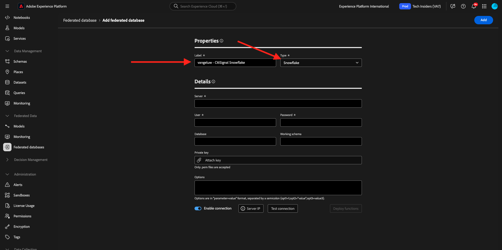
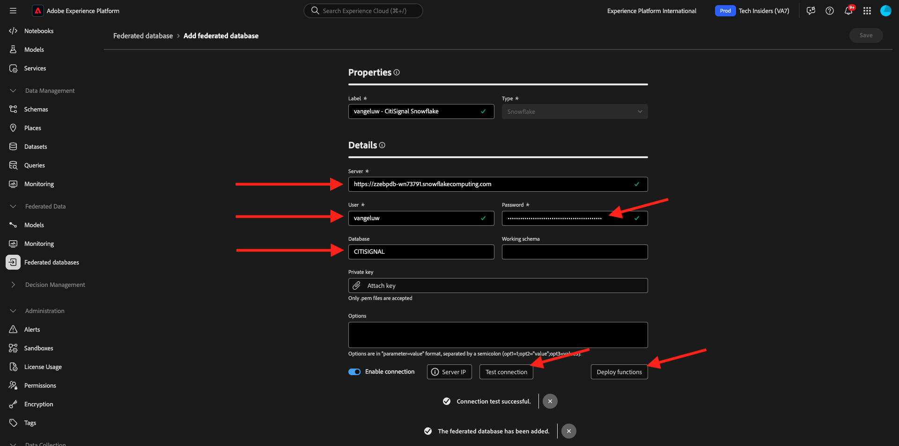
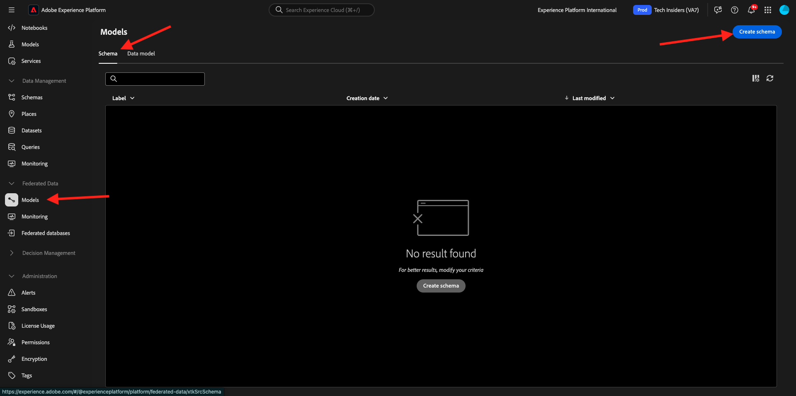
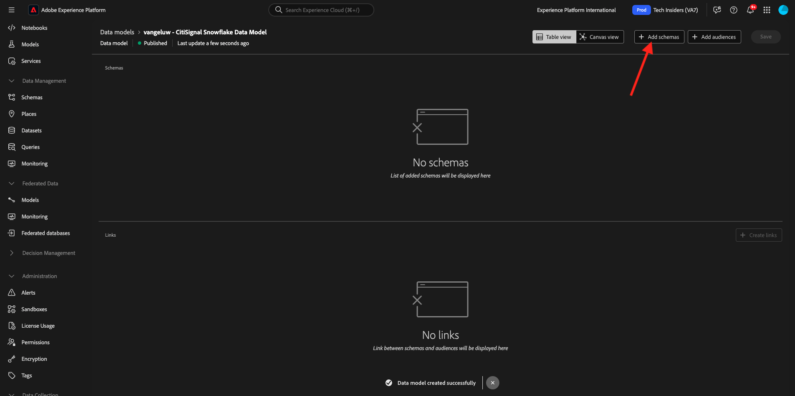
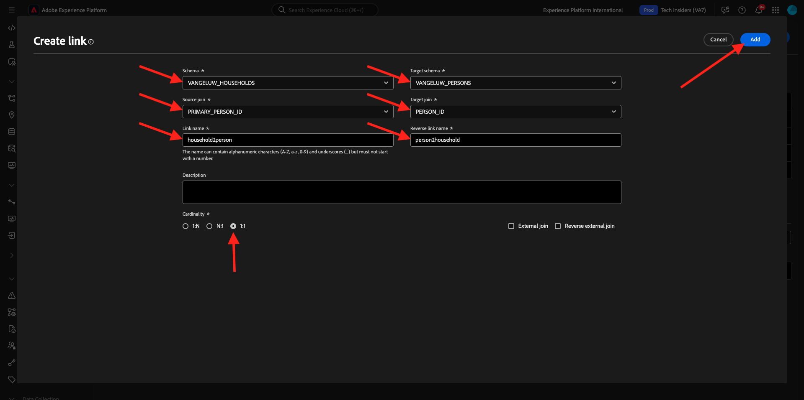
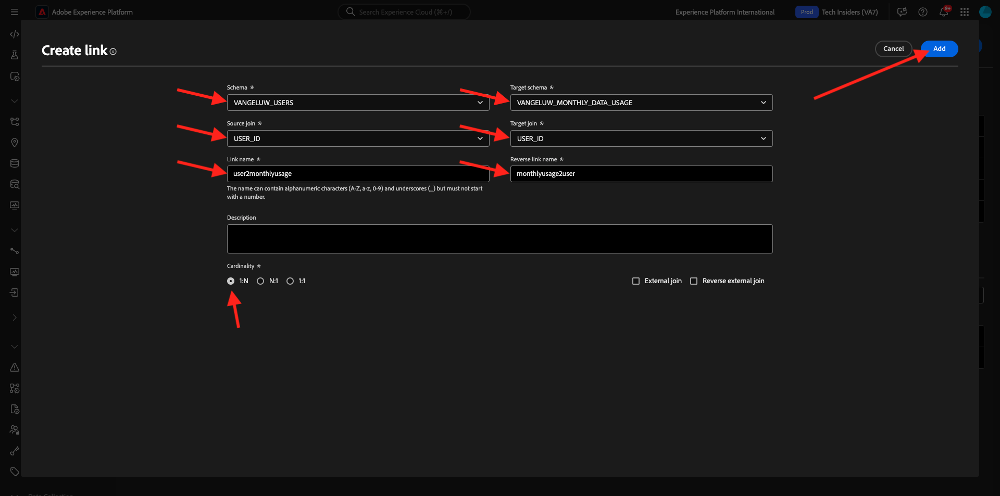
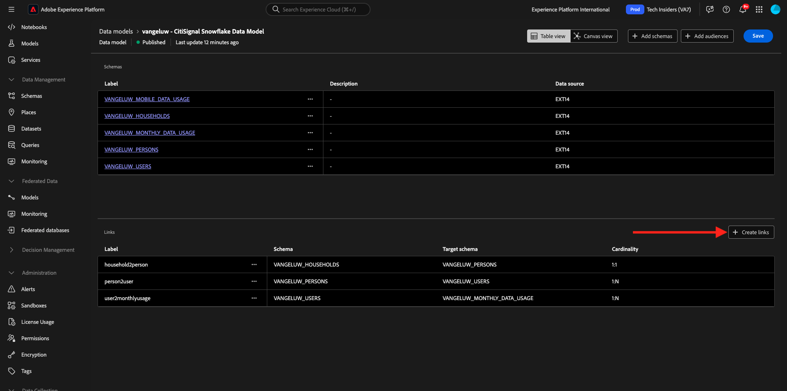
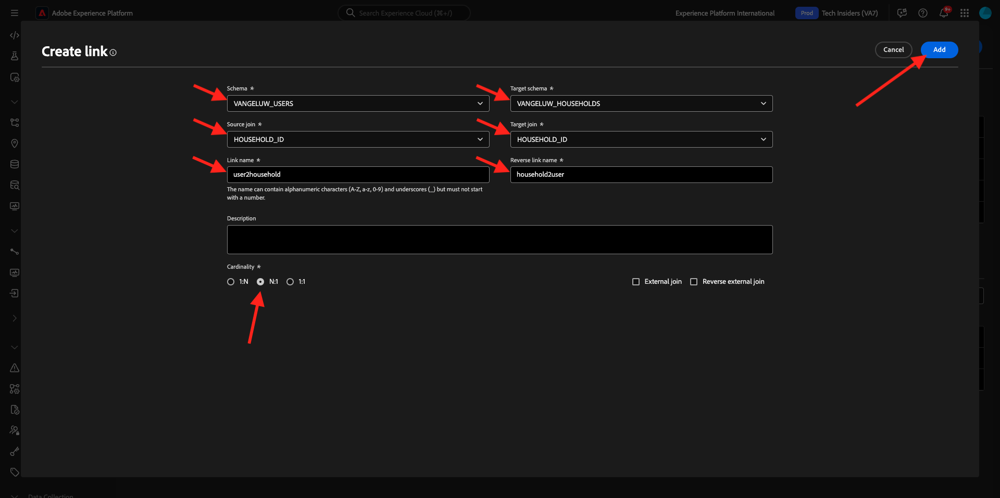
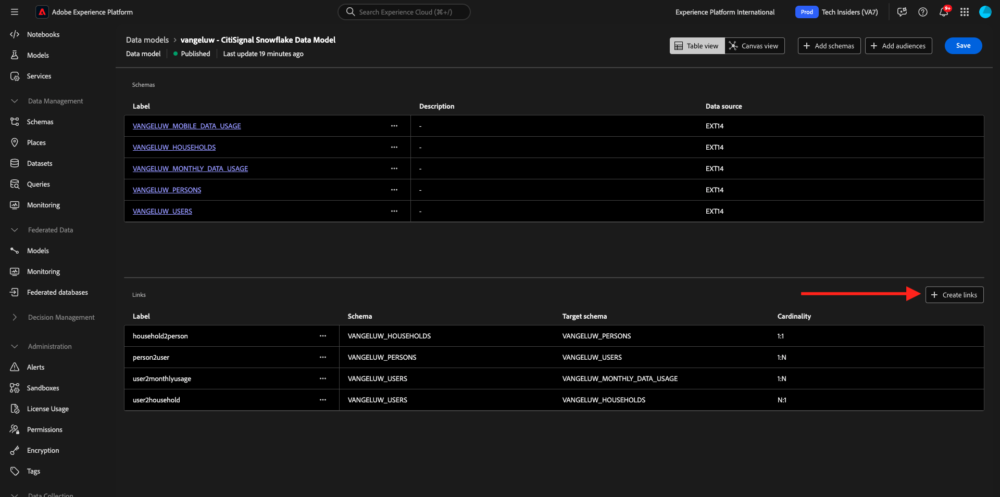
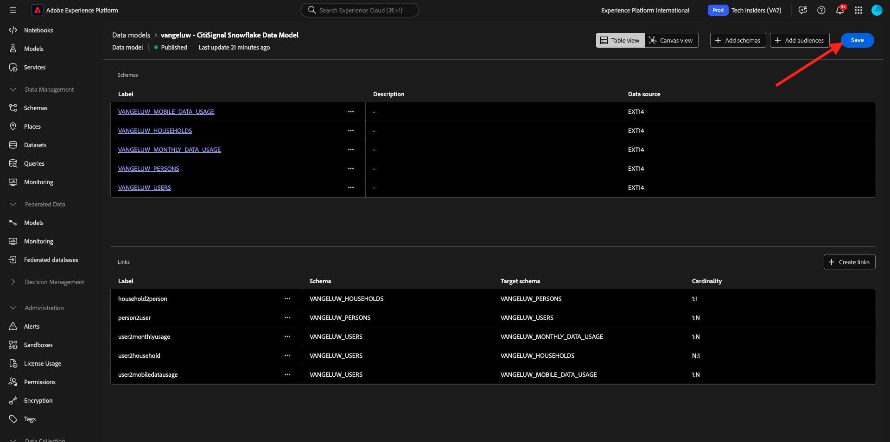

# 1.3.2 Création de schémas, de modèles de données et de liens

Vous pouvez désormais configurer votre base de données fédérée dans Adobe Experience Platform.

Connectez-vous à Adobe Experience Platform en accédant à cette URL : [https://experience.adobe.com/platform](https://experience.adobe.com/platform).

Une fois connecté, vous accédez à la page d’accueil de Adobe Experience Platform.

Avant de continuer, vous devez sélectionner un **sandbox**. Le sandbox à sélectionner est nommé ``--aepSandboxName--``. Après avoir sélectionné la sandbox appropriée, la modification d’écran s’affiche et vous êtes maintenant dans votre sandbox dédiée.

## 1.3.2.1 Configurer une base de données fédérée dans AEP

Cliquez sur **Bases de données fédérées** dans le menu de gauche. Cliquez ensuite sur **Ajouter une base de données fédérée**.

Comme **Libellé**, utilisez `--aepUserLdap-- - CitiSignal Snowflake` et pour le type, choisissez **Snowflake**.

Sous détails, vous devez remplir vos informations d’identification, qui ressembleront à ceci :

**Serveur** :

Dans Snowflake, accédez à **Admin > Comptes**. Cliquez sur le bouton 3 **...** en regard de votre compte, puis sur **Gérer les URL**.

Tu verras ça. Copiez l’**URL actuelle** et collez-la dans le champ **Serveur** d’AEP.

**Utilisateur** : nom d’utilisateur que vous avez créé précédemment, dans l’exercice 1.3.1.1
**Mot de passe** : mot de passe que vous avez créé précédemment, dans l’exercice 1.3.1.1
**Base de données** : utilisez **CITISIGNAL**

Donc, finalement, vous devriez avoir ceci. Cliquez sur **Tester la connexion**. Si le test réussit, cliquez sur **Déployer les fonctions**, ce qui créera des fonctions côté Snowflake qui sont nécessaires au moteur de workflow.

Une fois la connexion testée avec succès et les fonctions déployées, votre configuration sera stockée.

Lorsque vous revenez ensuite au menu **Bases de données fédérées**, votre connexion s’affiche.

## 1.3.2.2 Créer des schémas dans AEP

Dans le menu de gauche, cliquez sur **Modèles** puis accédez à **Schémas**. Cliquez sur **Créer un schéma**.

Sélectionnez votre base de données fédérée et cliquez sur **+ Ajouter des tables**.

Tu verras ça. Sélectionnez les 5 tables que vous avez créées précédemment dans Snowflake :

- `--aepUserLdap--_HOUSEHOLDS`
- `--aepUserLdap--_MOBILE_DATA_USAGE`
- `--aepUserLdap--_MONTHLY_DATA_USAGE`
- `--aepUserLdap--_PERSONS`
- `--aepUserLdap--_USERS`

Cliquez sur **Ajouter**.

AEP charge alors les informations de chaque tableau et les affiche dans l’interface utilisateur.

Pour chaque tableau, vous pouvez effectuer les actions suivantes :

- Modifier le libellé du schéma
- Ajouter une description
- Renommer tous les champs et décider de leur visibilité
- sélection de la clé primaire du schéma

Pour cet exercice, aucune modification n’est nécessaire.

Cliquez sur **Créer**.

Tu verras ça. Vous pouvez cliquer sur n’importe quel schéma et consulter les informations. Par exemple, cliquez sur **—aepUserLdap—_PERSON**.

Vous verrez alors ceci, avec la possibilité de modifier la configuration. Cliquez sur **Données** pour afficher un exemple des données contenues dans la base de données Snowflake.

Vous verrez ensuite un échantillon des données.

## 1.3.2.3 Créer un modèle dans AEP

Dans le menu de gauche, accédez à **Modèles** puis à **Modèle de données**. Cliquez sur **Créer un modèle de données**.

Pour l’étiquette, utilisez `--aepUserLdap-- - CitiSignal Snowflake Data Model`. Cliquez sur **Créer**.

Cliquez sur **Ajouter des schémas**.

Sélectionnez vos schémas et cliquez sur **Ajouter**.

Tu verras ça. Cliquez sur **Enregistrer**.

### PERSONNES - UTILISATEURS

Vous pouvez maintenant commencer à définir des liens entre les schémas. Pour commencer à définir un lien, vous devez cliquer sur **Créer des liens**.

Tout d’abord, définissons le lien entre le `--aepUserLdap--_USERS` de la table et `--aepUserLdap--_PERSONS`.

Cliquez sur **Ajouter**.

### MÉNAGES - PERSONNES

Tu seras de retour ici. Cliquez sur **Créer des liens** pour créer un autre lien.

Définissons ensuite le lien entre le `--aepUserLdap--_HOUSEHOLDS` de la table et `--aepUserLdap--_PERSONS`.

### UTILISATEURS - MONTHLY_DATA_USAGE

Tu seras de retour ici. Cliquez sur **Créer des liens** pour créer un autre lien.

Définissons ensuite le lien entre le `--aepUserLdap--_USERS` de la table et `--aepUserLdap--_MONTHLY_DATA_USAGE`.

### UTILISATEURS - FOYERS

Tu seras de retour ici. Cliquez sur **Créer des liens** pour créer un autre lien.

Définissons ensuite le lien entre le `--aepUserLdap--_USERS` de la table et `--aepUserLdap--_HOUSEHOLDS`.

### UTILISATEURS - MOBILE_DATA_USAGE

Tu seras de retour ici. Cliquez sur **Créer des liens** pour créer un autre lien.

Définissons ensuite le lien entre le `--aepUserLdap--_USERS` de la table et `--aepUserLdap--_MOBILE_DATA_USAGE`.

Vous devriez alors voir ceci. Cliquez sur **Enregistrer**.

Votre configuration dans AEP est maintenant terminée. Vous pouvez maintenant commencer à utiliser vos données fédérées dans une composition d’audience fédérée.

## Étapes suivantes

Accédez à [1.3.3 Créer une composition fédérée](./ex3.md){target="_blank"}

Revenez à [ Composition d’audience fédérée ](./fac.md){target="_blank"}

Revenir à [Tous les modules](./../../../../overview.md){target="_blank"}
