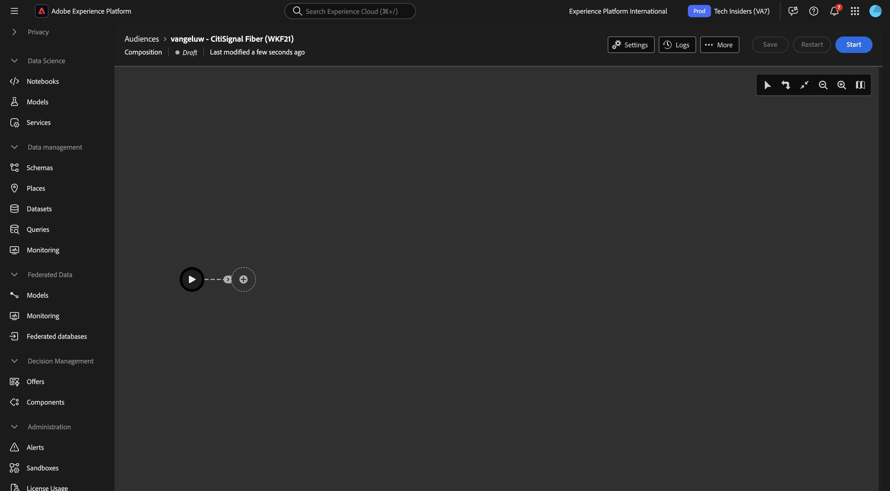
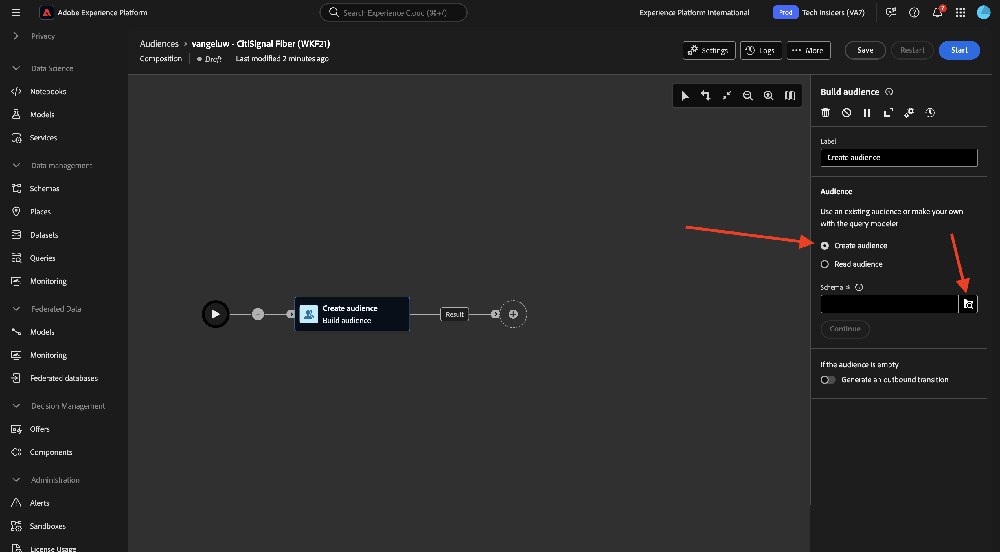
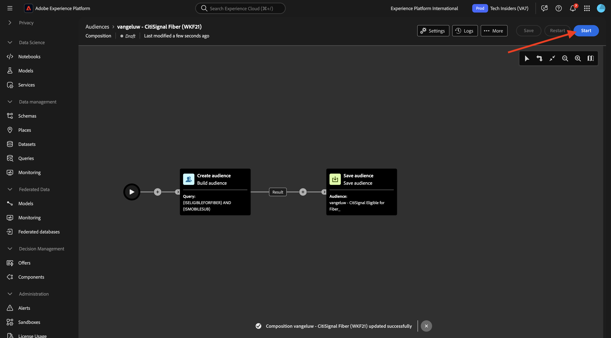

# 1.3.3 Créer une composition fédérée

Vous pouvez désormais configurer la composition de votre audience fédérée dans AEP.

Connectez-vous à Adobe Experience Platform en accédant à cette URL : [https://experience.adobe.com/platform](https://experience.adobe.com/platform).

Une fois connecté, vous accédez à la page d’accueil de Adobe Experience Platform.

Avant de continuer, vous devez sélectionner un **sandbox**. Le sandbox à sélectionner est nommé ``--aepSandboxName--``. Après avoir sélectionné la sandbox appropriée, la modification d’écran s’affiche et vous êtes maintenant dans votre sandbox dédiée.

## 1.3.3.1 Créer votre audience

Dans le menu de gauche, accédez à **Audiences** puis à **Compositions fédérées**. Cliquez sur **Créer une composition**.

Pour l’étiquette, utilisez la commande suivante : `--aepUserLdap-- - CitiSignal Fiber`. Sélectionnez le modèle de données que vous avez créé dans l’exercice précédent, qui est nommé `--aepUserLdap-- - CitiSignal Snowflake Data Model`. Cliquez sur **Créer**.

Tu verras ça.

Cliquez sur l’icône **+**, puis sur **Créer une audience**.

Tu verras ça. Sélectionnez **Créer une audience**. Cliquez sur l’icône **rechercher** pour sélectionner un schéma.

Sélectionnez le schéma **—aepUserLdap—_HOUSEHOLDS**. Cliquez sur **Confirmer**.

Cliquez ensuite sur **Continuer**.

Vous pouvez maintenant commencer à créer la requête qui sera envoyée à Snowflake. Cliquez sur l’icône **+**, puis sur **Condition personnalisée**.

Sélectionnez l’attribut **ISELIGIBLEFORFIBER** puis cliquez sur **Confirmer**.

Tu verras ça. Définissez le champ **Valeur** sur **Vrai**. Cliquez sur **Calculer** pour pousser la requête vers Snowflake et obtenir une estimation des profils qui remplissent désormais les critères.

Ensuite, cliquez de nouveau sur l’icône **+** et cliquez de nouveau sur **Condition personnalisée** pour ajouter une autre condition.

La deuxième condition à ajouter est : `Is the user an existing CitiSignal Mobile subscriber?`. La réponse à cette question consiste à utiliser la relation entre le ménage et le client principal du ménage, qui est définie dans une autre table, **—aepUserLdap—_PERSON**. Vous pouvez effectuer une analyse plus approfondie dans le menu d’attributs à l’aide du lien **household2person**.

Sélectionnez l’attribut **ISMOBILESUB** et cliquez sur **Confirmer**.

Définissez le champ **Valeur** sur **Vrai** Cliquez de nouveau sur **Calculer** pour mettre à jour le nombre de profils qui seront ciblés. Cliquez sur **Confirmer**.

Cliquez sur l’icône **+**, puis sur **Enregistrer l’audience**.

Définissez le **libellé Audience** sur `--aepUserLdap-- - CitiSignal Eligible for Fiber`.

Cliquez sur **+ Ajouter un mappage d’audience**.

Sélectionnez **HOUSEHOLD_ID** et cliquez sur **Confirmer**.

Cliquez sur **+ Ajouter un mappage d’audience**.

Analyser en cliquant sur **Dimension de ciblage**.

Explorez en cliquant sur le lien **household2person**.

Sélectionnez le champ **NOM**. Cliquez sur **Confirmer**.

Cliquez sur **+ Ajouter un mappage d’audience**.

Analyser en cliquant sur **Dimension de ciblage**.

Explorez en cliquant sur le lien **household2person**.

Sélectionnez le champ **E-MAIL**. Cliquez sur **Confirmer**.

Tu verras ça. Vous devez maintenant définir le champ d’identité du Principal ****, définissez-le sur **Household2person_EMAIL**. Définissez **Espace de noms d’identité** sur **E-mail**.

Cliquez sur **Enregistrer**.

Votre composition est maintenant terminée. Cliquez sur **Démarrer** pour l’exécuter.

La requête sera désormais transmise à Snowflake, qui y interrogera les données sources. Les résultats seront redirigés vers AEP, mais les données sources restent dans Snowflake.

L’audience est maintenant renseignée et peut être ciblée à partir de l’écosystème AEP.

## Étapes suivantes

Accédez à [ Résumé et avantages ](./summary.md){target="_blank"}

Revenez à [ Composition d’audience fédérée ](./fac.md){target="_blank"}

Revenir à [Tous les modules](./../../../../overview.md){target="_blank"}
