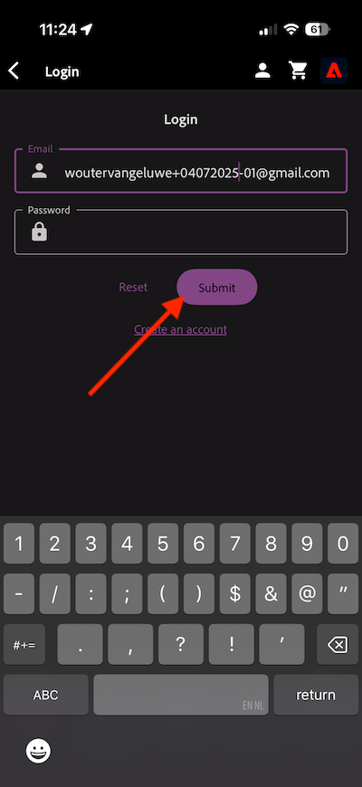
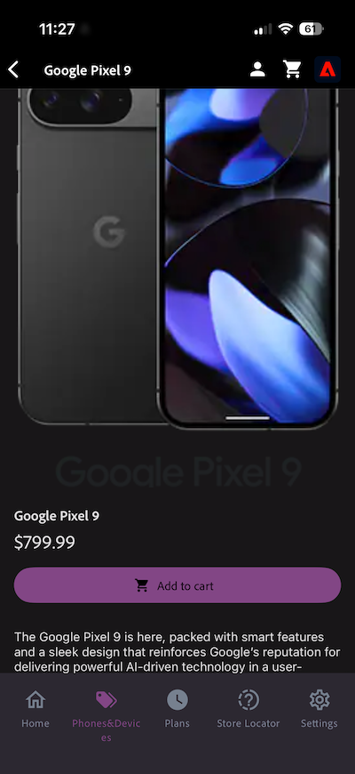

# 2.1.1 De l&#39;inconnu au connu sur le site

## Contexte

Le parcours de l&#39;inconnu au connu est l&#39;un des sujets les plus importants parmi les marques de nos jours, tout comme le parcours client de l&#39;acquisition à la rétention.

Adobe Experience Platform joue un rôle considérable dans ce parcours. La plateforme est le cerveau de la communication, le « système d&#39;expérience d&#39;enregistrement ».

Platform est un environnement dans lequel le mot client est plus large que les clients connus. Un visiteur inconnu sur le site web est également un client du point de vue de Platform. Par conséquent, tout le comportement en tant que visiteur inconnu est également envoyé à Platform. Grâce à cette approche, lorsque ce visiteur devient finalement un client connu, une marque peut également visualiser ce qui s’est passé avant ce moment. Cela est utile du point de vue de l’attribution et de l’optimisation de l’expérience.

## Flux de parcours client

Accédez à [https://dsn.adobe.com](https://dsn.adobe.com). Après vous être connecté avec votre Adobe ID, voici ce que vous verrez. Cliquez sur le **de 3 points...** sur le projet de votre site web, puis cliquez sur **Exécuter** pour l’ouvrir.

Vous verrez ensuite votre site web de démonstration s’ouvrir. Sélectionnez l’URL et copiez-la dans le presse-papiers.

Ouvrez une nouvelle fenêtre de navigateur en mode privé.

Collez l’URL de votre site web de démonstration, que vous avez copiée à l’étape précédente. Il vous sera ensuite demandé de vous connecter à l’aide de votre Adobe ID.

Sélectionnez votre type de compte et terminez le processus de connexion.

Votre site web est alors chargé dans une fenêtre de navigateur en mode privé. Pour chaque exercice, vous devrez utiliser une nouvelle fenêtre de navigateur en mode privé pour charger l’URL de votre site web de démonstration.

Cliquez sur l’icône du logo Adobe dans le coin supérieur gauche de l’écran pour ouvrir la visionneuse de profils.

Affichez le panneau Visionneuse de profils et le profil client en temps réel avec l’Experience Cloud ID **** comme identifiant principal pour ce client actuellement inconnu.

Vous pouvez également afficher tous les événements d’expérience qui ont été collectés en fonction du comportement du client ou de la cliente. La liste est actuellement vide, mais cela va bientôt changer.

Accédez à la catégorie de produits **Téléphones et appareils**. Cliquez ensuite sur le produit **iPhone 16 Pro**.

Vous verrez ensuite la page des détails du produit. Un événement de type **Vue du produit** a été envoyé à Adobe Experience Platform à l’aide de l’implémentation de Web SDK que vous avez examinée dans le module 1.

Ouvrez le panneau Visionneuse de profil et jetez un coup d’œil à vos **Événements**.

Revenez à la page de catégorie **Téléphones et appareils**, puis cliquez sur un autre produit. Un autre événement d’expérience a été envoyé à Adobe Experience Platform. Ouvrez le panneau Visionneuse de profils. Vous verrez désormais 2 événements de type **consultation du produit**. Bien que le comportement soit anonyme, avec le consentement approprié en place, vous pouvez suivre chaque clic et le stocker dans Adobe Experience Platform. Une fois que le client anonyme sera connu, nous pourrons fusionner automatiquement tous les comportements anonymes au profil connu.

Cliquez sur **Se connecter**.

Cliquez sur **Créer un compte**.

Renseignez vos informations et cliquez sur **S’inscrire** après quoi vous serez redirigé vers la page précédente.

Ouvrez le panneau Visionneuse de profils et accédez au profil client en temps réel. Dans le panneau Visionneuse de profil, toutes vos données personnelles doivent s’afficher, comme vos nouveaux identifiants d’e-mail et de téléphone ajoutés.

Dans le panneau Visionneuse de profil, accédez à Événements d’expérience. Vous verrez les 2 produits que vous avez consultés précédemment dans le panneau Visionneuse de profils. Ces deux événements sont désormais également liés à votre profil « connu ».

Vous avez maintenant ingéré des données dans Adobe Experience Platform et vous les avez liées à des identifiants tels que des ECID et des adresses e-mail. L’objectif est de comprendre le contexte commercial de ce que vous êtes sur le point de faire. Dans l’exercice suivant, vous allez commencer à configurer tout ce dont vous avez besoin pour rendre possible toute cette ingestion de données.

### Navigation dans l’application mobile

Après être devenu un client connu, il est temps de commencer à utiliser l’application mobile. Ouvrez l’application mobile sur votre iPhone, puis connectez-vous à l’application.

Si l&#39;application n&#39;est plus installée, ou si vous ne vous souvenez plus comment l&#39;installer, jetez un coup d&#39;œil ici : [Utiliser l&#39;application mobile](../../../getting-started/gettingstarted/ex5.md)

Après avoir installé l&#39;application comme indiqué, vous verrez la page de destination de l&#39;application avec la marque Citi Signal chargée. Cliquez sur l’icône de compte dans la partie supérieure gauche de votre écran.

Sur l’écran de connexion, connectez-vous avec l’adresse e-mail que vous avez utilisée sur le site Web de l’ordinateur de bureau. Cliquez sur **Connexion**.

Vous obtiendrez alors une confirmation de votre connexion.

Accédez à l’écran d’accueil de l’application et à la page **Téléphones et appareils**.

Cliquez sur un produit de la page.

Vous verrez ensuite la page des détails du produit.

Accédez à l’écran d’accueil dans l’application, puis cliquez sur l’icône Adobe pour afficher le panneau Visionneuse de profils. Vous verrez ensuite la vue **Attributs de profil**, qui affiche désormais une vue combinée de votre activité web et de votre application mobile. Accédez à **Événements**

Vous verrez ensuite le produit que vous venez de consulter dans la section **Événements d’expérience**, ainsi que toutes les consultations de produits de la session de site web précédente.

>[!NOTE]
>
>Il peut s’écouler quelques minutes avant que la vue consolidée ne s’affiche dans l’application et sur le site web.

Maintenant, revenez à votre ordinateur de bureau et actualisez la page d’accueil, après quoi le produit y apparaîtra également.

>[!NOTE]
>
>Il peut s’écouler quelques minutes avant que la vue consolidée ne s’affiche dans l’application et sur le site web.

Vous avez maintenant ingéré des données dans Adobe Experience Platform et vous les avez liées à des identifiants tels que des ECID et des adresses e-mail. L&#39;objectif de cet exercice était de comprendre le contexte commercial de ce que vous vous apprêtez à faire. Vous avez maintenant créé un profil client en temps réel sur plusieurs appareils. Dans l’exercice suivant, vous allez procéder à la visualisation de votre profil dans Adobe Experience Platform.

## Étapes suivantes

Accédez à [2.1.2 Visualiser votre propre profil client en temps réel - Interface utilisateur](./ex2.md){target="_blank"}

Revenez au [profil client en temps réel](./real-time-customer-profile.md){target="_blank"}

Revenir à [Tous les modules](./../../../../overview.md){target="_blank"}
