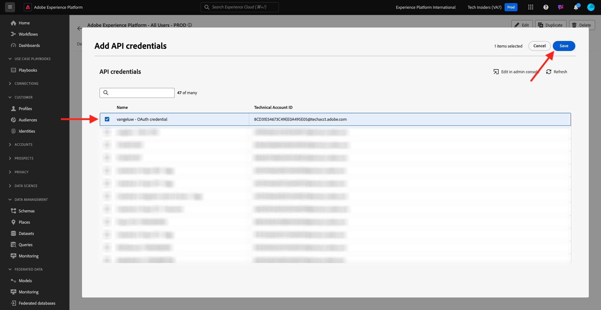

# 2.1.3 Visualiser votre propre profil client en temps réel - API

Dans cet exercice, vous allez utiliser Postman et Adobe I/O pour interroger les API de Adobe Experience Platform afin d’afficher votre propre profil client en temps réel.

## Contexte

Dans le profil client en temps réel, toutes les données de profil s’affichent avec les données d’événement, ainsi que les appartenances existantes à l’audience. Les données affichées peuvent provenir de n’importe où, des applications Adobe et des solutions externes. Il s’agit de la vue la plus puissante de Adobe Experience Platform, le système d’expérience d’enregistrement.

Le profil client en temps réel peut être utilisé par toutes les applications Adobe, mais également par des solutions externes telles que les centres d’appels ou les applications de clienteling en magasin. Pour ce faire, connectez ces solutions externes aux API Adobe Experience Platform.

## Vos Identifiants

Dans le panneau Visionneuse de profils du site web, vous pouvez trouver plusieurs identités. Chaque identité est liée à un espace de noms.


Sur le panneau Rayons X, nous pouvons voir 4 combinaisons différentes d’identifiants et d’espaces de noms :

| Identité | Espace de noms |
|:-------------:| :---------------:|
| Experience Cloud ID (ECID) | 79943948563923140522865572770524243489 |
| Experience Cloud ID (ECID) | 70559351147248820114888181867542007989 |
| ID d’e-mail | woutervangeluwe+18112024-01@gmail.com |
| ID du numéro de mobile | +32473622044+18112024-01 |

Mémorisez ces identifiants pour l’étape suivante.

## Configuration de votre projet Adobe I/O

Dans cet exercice, vous utiliserez Adobe I/O de manière assez intensive pour effectuer des requêtes sur les API de Platform. Pour configurer Adobe I/O, procédez comme suit.

Accédez à [https://developer.adobe.com/console/home](https://developer.adobe.com/console/home)


Veillez à sélectionner l’instance Adobe Experience Platform appropriée dans le coin supérieur droit de l’écran. Votre instance est `--aepImsOrgName--`. Cliquez sur **Créer un projet**.


Sélectionnez **+ Ajouter au projet** puis **API**.


Vous verrez alors ceci :


Sélectionnez **API Experience Platform** puis cliquez sur **Suivant**.


Vous allez voir ceci. Attribuez un nom à vos informations d’identification : `--aepUserLdap-- - OAuth credential`. Cliquez sur **Suivant**.


Ensuite, vous devez sélectionner un profil de produit qui définira les autorisations disponibles pour cette intégration.

Sélectionnez les profils de produit requis.

>[!NOTE]
>
> Les noms de profils de produit varient dans votre instance Adobe Experience Platform, car ils sont spécifiques à l’instance. Vous devez sélectionner au moins un profil de produit avec les droits d’accès appropriés, configurés dans le Adobe Admin Console et l’interface utilisateur des autorisations AEP.

Cliquez sur **Enregistrer l’API configurée**.


Votre intégration Adobe I/O est maintenant prête.


Cliquez sur le bouton **Télécharger pour Postman** puis sur **OAuth de serveur à serveur** pour télécharger un environnement Postman (patientez jusqu’à ce que l’environnement soit téléchargé, ce qui peut prendre quelques secondes).


Votre projet d&#39;E/S porte actuellement un nom générique. Vous devez donner un nom convivial à votre intégration. Cliquez sur **Projet X** (ou un nom similaire) comme indiqué


Cliquez sur **Modifier le projet**.


Saisissez un Nom et une Description pour votre intégration : `--aepUserLdap-- AEP Tutorial`.

Cliquez sur **Enregistrer**.


Votre intégration Adobe I/O est maintenant terminée.


>[!NOTE]
>
>Une étape supplémentaire est nécessaire pour s’assurer que ce projet Adobe I/O a accès aux paramètres d’autorisation de Adobe Experience Platform. Les informations d’identification d’API de votre projet doivent être ajoutées à l’interface utilisateur Autorisations de Adobe Experience Platform, pour laquelle les droits d’accès d’administrateur système sont requis. Les étapes sont décrites ci-dessous, mais vous devrez peut-être contacter votre administrateur système pour que ce dossier soit traité pour vous, au cas où vous ne disposeriez pas des droits d’accès requis.

## Autorisations AEP pour les informations d’identification d’API

>[!IMPORTANT]
>
>Si vous ne disposez pas des droits d’accès d’administrateur système, vous ne pourrez pas exécuter cette étape vous-même et vous ne serez pas autorisé à accéder à l’interface utilisateur **Autorisations**. Dans ce cas, contactez votre administrateur système ou posez votre question dans le canal d’assistance de votre entreprise.

Accédez à [Adobe Experience Platform](https://experience.adobe.com/platform). Une fois connecté, vous accédez à la page d’accueil de Adobe Experience Platform.

Accédez à **Autorisations**, à **Rôles**, puis cliquez sur le profil de produit approprié.

>[!NOTE]
>
> Les noms de profils de produit varient dans votre instance Adobe Experience Platform, car ils sont spécifiques à l’instance. Vous devez sélectionner au moins un profil de produit avec les droits d’accès appropriés, configurés dans le Adobe Admin Console et l’interface utilisateur des autorisations AEP.


Cliquez sur **Informations d’identification de l’API**.


Cliquez sur **+ Ajouter des informations d’identification d’API**.


Sélectionnez le projet Adobe I/O nouvellement créé et cliquez sur **Enregistrer**.



## Authentification à Adobe I/O

>[!IMPORTANT]
>
>Si vous êtes un employé d&#39;Adobe, veuillez suivre les instructions ici pour utiliser [PostBuster](./../../../../modules/getting-started/gettingstarted/ex8.md).

Accédez à [https://www.postman.com/downloads/](https://www.postman.com/downloads/).

Téléchargez et installez la version de Postman appropriée à votre système d’exploitation.


Après l’installation de Postman, démarrez l’application.

Dans Postman, il existe 2 concepts : Environnements et Collections.

- L’environnement contient toutes vos variables d’environnement qui sont plus ou moins cohérentes. Dans l’environnement , vous trouverez des éléments tels que l’IMSOrg de notre environnement Platform, ainsi que des informations d’identification de sécurité telles que votre clé privée et d’autres. Le fichier d’environnement est celui que vous avez téléchargé lors de la configuration d’Adobe I/O dans l’exercice précédent. Son nom est le suivant : **`oauth_server_to_server.postman_environment.json`**.

- La collection contient un certain nombre de requêtes d’API que vous pouvez utiliser. Nous utiliserons 2 collections
   - 1 collection pour l’authentification à Adobe I/O
   - 1 Collection pour les exercices de ce module
   - 1 collection pour les exercices dans le module Real-Time CDP, pour la création de destinations

Téléchargez le fichier [postman.zip](./../../../../assets/postman/postman_profile.zip) sur votre bureau local.

Dans ce fichier **postman.zip**, vous trouverez les fichiers suivants :

- `Adobe IO - OAuth.postman_collection.json`
- `AEP Tutorial.postman_collection.json`
- `Destination_Authoring_API.json`

Décompressez le fichier **postman.zip** et stockez ces 3 fichiers dans un dossier sur votre bureau, avec l’environnement Postman téléchargé à partir d’Adobe I/O. Vous devez avoir ces 4 fichiers dans ce dossier :


Revenez à Postman. Cliquez sur **Importer**.


Cliquez sur **fichiers**.


Accédez au dossier sur votre bureau dans lequel vous avez extrait les 4 fichiers téléchargés. Sélectionnez ces 4 fichiers simultanément et cliquez sur **Ouvrir**.


Après avoir cliqué sur **Ouvrir**, Postman vous présente un aperçu de l’environnement et des collections que vous êtes sur le point d’importer. Cliquez sur **Importer**.


Vous disposez désormais de tout ce dont vous avez besoin dans Postman pour commencer à interagir avec Adobe Experience Platform par le biais des API.

La première chose à faire est de vous assurer que vous êtes correctement authentifié. Pour être authentifié, vous devez demander un jeton d’accès.

Assurez-vous que l’environnement approprié est sélectionné avant d’exécuter toute requête. Vous pouvez vérifier l’environnement actuellement sélectionné en vérifiant la liste déroulante Environnement dans le coin supérieur droit.

L’environnement sélectionné doit porter un nom similaire à celui-ci, `--aepUserLdap-- OAuth Credential`.


Votre environnement et vos collections Postman sont maintenant configurés et fonctionnent. Vous pouvez désormais vous authentifier de Postman à Adobe I/O.

Dans la collection **Adobe IO - OAuth**, sélectionnez la requête portant le nom **POST - Obtenir le jeton d’accès**. Cliquez sur **Envoyer**.


Au bout de quelques secondes, une réponse devrait s’afficher dans la section **Corps** de Postman :


Si votre configuration a réussi, vous devriez voir une réponse similaire contenant les informations suivantes :

| Clé | Valeur |
|:-------------:| :---------------:| 
| token_type | **porteur** |
| access_token | **eyJhbGciOiJSU...jrNZ6mdaQ** |
| expires_in | **86399** |

Adobe I/O vous a fourni un jeton **porteur**, avec une valeur spécifique (le jeton access_token très long) et une fenêtre d’expiration.

Le jeton que nous avons reçu est maintenant valide pendant 24 heures. Cela signifie qu’au bout de 24 heures, si vous souhaitez utiliser Postman pour vous authentifier auprès d’Adobe I/O, vous devrez générer un nouveau jeton en exécutant à nouveau cette requête.

## API Real-time Customer Profile, schéma : Profil

Vous pouvez maintenant envoyer votre première requête aux API Real-time Customer Profile de Platform.

Dans Postman, recherchez la collection **Tutoriel AEP**.


Dans **1. Service de profil unifié** cliquez sur la première demande nommée **UPS - Profil GET par ID d’entité et NS**.


Pour cette requête, trois variables sont requises :

| Clé | Valeur | Définition |
|:-------------:| :---------------:| :---------------:| 
| entityId | **identifiant** | l’ID de client spécifique |
| entityIdNS | **espace de noms** | l’espace de noms spécifique applicable à l’identifiant |
| schema.name | **_xdm.context.profile** | schéma spécifique pour lequel vous souhaitez recevoir des informations |

Ainsi, si vous souhaitez demander aux API Adobe Experience Platform de vous renvoyer toutes les informations de profil pour votre propre ECID, vous devez configurer la requête comme suit :

| Clé | Valeur |
|:-------------:| :---------------:| 
| entityId | **yourECID** |
| entityIdNS | **ecid** |
| schema.name | **_xdm.context.profile** |


Vous devez également vérifier les champs **En-tête** - de votre requête. Accédez à **En-têtes**. Vous verrez alors ceci :


>[!NOTE]
>
>Vous devez spécifier le nom du sandbox Adobe Experience Platform que vous utilisez. Votre x-sandbox-name doit être `--aepSandboxName--`.

| Clé | Valeur |
| ----------- | ----------- |
| x-sandbox-name | `--aepSandboxName--` |


Une fois que vous avez vérifié le nom du sandbox, cliquez sur **Envoyer** pour envoyer votre requête à Platform.

Vous devriez obtenir une réponse immédiate de Platform, vous montrant quelque chose comme ceci :


Voici la réponse complète de Platform :

```javascript
{
    "A2_ETHkJxMvxbiEmIZlAj8Qn": {
        "entityId": "A2_ETHkJxMvxbiEmIZlAj8Qn",
        "mergePolicy": {
            "id": "64e4b0ed-dfc3-4084-8e67-643e977168d7"
        },
        "sources": [
            "672a10cdb015162aefedfc0f",
            "672a10b1a05e282aee19737c"
        ],
        "tags": [
            "0938B898-469A-4513-8E86-87464307120F:va7",
            "3ba34930-405e-4b31-aafa-bac22d35203e:va7"
        ],
        "identityGraph": [
            "G7z3JAFBY4I6Rzg",
            "A2_ETHkJxMvxbiEmIZlAj8Qn",
            "BkFvK4QcJpSPByuDGF4UAS0wMQ",
            "BUF9zMKLrXq72p4HpbsHv1SDGF4UAS0wMUBnbWFpbC5jb20",
            "A29btmFXmrfrYbXQWISCT9ZD"
        ],
        "entity": {
            "_experienceplatform": {
                "identification": {
                    "core": {
                        "ecid": "79943948563923140522865572770524243489",
                        "phoneNumber": "+32473622044+18112024-01",
                        "email": "woutervangeluwe+18112024-01@gmail.com"
                    }
                }
            },
            "userAccount": {
                "ID": "3688250"
            },
            "pushNotificationDetails": [
                {
                    "denylisted": false,
                    "token": "2E0945F186CE5ED8CBFD1EB519A8CF38BA2B28A67FB381D45AA15EE37D289214",
                    "identity": {
                        "namespace": {
                            "code": "ECID"
                        },
                        "id": "70559351147248820114888181867542007989"
                    },
                    "platform": "apns",
                    "appID": "com.adobe.demosystem.dxdemo"
                }
            ],
            "personalEmail": {
                "address": "woutervangeluwe+18112024-01@gmail.com"
            },
            "_repo": {
                "createDate": "2024-11-18T10:39:12.296Z"
            },
            "extSourceSystemAudit": {
                "lastUpdatedDate": "2024-11-19T07:46:52.001Z"
            },
            "testProfile": true,
            "mobilePhone": {
                "number": "+32473622044"
            },
            "consents": {
                "metadata": {
                    "time": "2024-11-19T07:46:52.001Z"
                },
                "idSpecific": {
                    "ECID": {
                        "70559351147248820114888181867542007989": {
                            "collect": {
                                "val": "y"
                            }
                        }
                    }
                }
            },
            "person": {
                "name": {
                    "lastName": "Van Geluwe",
                    "firstName": "Wouter"
                }
            },
            "userActivityRegions": {
                "IRL1": {
                    "captureTimestamp": "2024-11-19T07:46:51.239Z"
                }
            },
            "identityMap": {
                "ecid": [
                    {
                        "id": "70559351147248820114888181867542007989"
                    },
                    {
                        "id": "79943948563923140522865572770524243489"
                    }
                ],
                "email": [
                    {
                        "id": "woutervangeluwe+18112024-01@gmail.com"
                    }
                ],
                "phone": [
                    {
                        "id": "+32473622044+18112024-01"
                    }
                ],
                "userid": [
                    {
                        "id": "3688250"
                    }
                ]
            }
        },
        "lastModifiedAt": "2024-11-19T07:47:23Z"
    }
}
```

Il s’agit actuellement de toutes les données de profil disponibles dans Platform pour cet ECID.

Vous n’êtes pas tenu d’utiliser l’ECID pour demander des données de profil au profil client en temps réel de Platform. Vous pouvez utiliser n’importe quel identifiant dans n’importe quel espace de noms pour demander ces données.

Revenons à Postman et faisons semblant d’être le centre d’appel. Envoyons une requête à Platform spécifiant l’espace de noms de **Phone** et votre numéro de mobile.

Ainsi, si vous souhaitez demander aux API de Platform de vous renvoyer toutes les informations de profil pour un téléphone spécifique, vous devez configurer la requête comme suit :

| Clé | Valeur |
|:-------------:| :---------------:| 
| entityId | **votre numéro de téléphone** |
| entityIdNS | **téléphone** (remplacez ecid par téléphone) |
| schema.name | **_xdm.context.profile** |

Si votre numéro de téléphone contient des symboles spéciaux tels que **+**, vous devez sélectionner votre numéro de téléphone complet, faire un clic droit et cliquer sur **EncodeURIComponent**.


Voici ce que vous obtiendrez :


Vous devez également vérifier les champs **En-tête** - de votre requête. Accédez à **En-têtes**. Vous verrez alors ceci :


>[!NOTE]
>
>Vous devez spécifier le nom du sandbox Adobe Experience Platform que vous utilisez. Votre x-sandbox-name doit être `--aepSandboxName--`.

| Clé | Valeur |
| ----------- | ----------- |
| x-sandbox-name | `--aepSandboxName--` |


Cliquez sur **Envoyer** et vérifiez que la réponse est identique à ce qu’elle était lorsque vous utilisiez l’ECID en tant qu’identité.


Faisons la même chose pour votre adresse e-mail en spécifiant l’espace de noms de **e-mail** et votre adresse e-mail.

Ainsi, si vous souhaitez demander aux API de Platform de vous renvoyer toutes les informations de profil pour une adresse e-mail spécifique, vous devez configurer la requête comme suit :

| Clé | Valeur |
|:-------------:| :---------------:| 
| entityId | **youremail** |
| entityIdNS | **e-mail** (remplacez Téléphone par e-mail) |
| schema.name | **_xdm.context.profile** |

Si votre adresse e-mail contient des symboles spéciaux tels que **+**, vous devez sélectionner votre adresse e-mail complète, faire un clic droit et cliquer sur **EncodeURIComponent**.


Voici ce que vous obtiendrez :


Vous devez également vérifier les champs **En-tête** - de votre requête. Accédez à **En-têtes**. Vous verrez alors ceci :

>[!NOTE]
>
>Vous devez spécifier le nom du sandbox Adobe Experience Platform que vous utilisez. Votre x-sandbox-name doit être `--aepSandboxName--`.


| Clé | Valeur |
| ----------- | ----------- |
| x-sandbox-name | `--aepSandboxName--` |

Cliquez sur **Envoyer** et vérifiez la réponse. Vous verrez à nouveau qu’elle est identique à la précédente avec l’ECID et le numéro de téléphone.


C&#39;est un type de flexibilité très important qui est offert aux marques. Cela signifie que tout environnement peut envoyer une requête à Platform, à l’aide de son propre identifiant et de son propre espace de noms, sans avoir à comprendre la complexité de plusieurs espaces de noms et identifiants.

À titre d’exemple :

- le centre d’appel peut demander des données à Platform à l’aide de l’espace de noms **téléphone**
- Le système de fidélité peut demander des données à Platform à l’aide de l’espace de noms **e-mail**
- les applications en ligne peuvent utiliser l’espace de noms **ecid**

Le centre d&#39;appels ne sait pas nécessairement quel type d&#39;identifiant est utilisé dans le système de fidélité et le système de fidélité ne sait pas nécessairement quel type d&#39;identifiant est utilisé par les applications en ligne. Chaque système peut utiliser l&#39;information qu&#39;il possède et comprend pour obtenir l&#39;information dont il a besoin, au moment où il en a besoin.

## API Real-time Customer Profile, schéma : Profil et ExperienceEvent

Après avoir interrogé les API de Platform pour obtenir des données de profil, faisons maintenant de même avec les données ExperienceEvent.

Dans Postman, recherchez la collection **Tutoriel AEP**.


Dans **1. Unified Profile Service**, sélectionnez la deuxième requête nommée **UPS - GET Profile &amp; EE par ID d’entité et NS**.


Pour cette requête, quatre variables sont requises :

| Clé | Valeur | Définition |
|:-------------:| :---------------:|  :---------------:| 
| schema.name | **_xdm.context.experienceevent** | schéma spécifique pour lequel vous souhaitez recevoir des informations. Dans ce cas, nous recherchons des données qui sont mappées par rapport au schéma ExperienceEvent . |
| relatedSchema.name | **_xdm.context.profile** | Pendant que nous recherchons des données mappées par rapport au schéma ExperienceEvent, nous devons spécifier une identité pour laquelle nous voulons recevoir ces données. Le schéma qui a accès à l’identité est le Profile-schema. Par conséquent, le relatedSchema ici est le Profile-schema. |
| relatedEntityId | **identifiant** | l’identifiant client spécifique |
| relatedEntityIdNS | **espace de noms** | l’espace de noms spécifique applicable à l’identifiant |

Ainsi, si vous souhaitez demander aux API de Platform de vous renvoyer toutes les informations de profil pour votre propre ecid, vous devez configurer la requête comme suit :

| Clé | Valeur |
|:-------------:| :---------------:| 
| schema.name | **_xdm.context.experienceevent** |
| relatedSchema.name | **_xdm.context.profile** |
| relatedEntityId | **yourECID** |
| relatedEntityIdNS | **ecid** |


Vous devez également vérifier les champs **En-tête** - de votre requête. Accédez à **En-têtes**. Vous verrez alors ceci :


>[!NOTE]
>
>Vous devez spécifier le nom du sandbox Adobe Experience Platform que vous utilisez. Votre x-sandbox-name doit être `--aepSandboxName--`.

| Clé | Valeur |
| ----------- | ----------- |
| x-sandbox-name | `--aepSandboxName--` |

Cliquez sur **Envoyer** pour envoyer votre demande à Platform.

Vous devriez obtenir une réponse immédiate de Platform, vous montrant quelque chose comme ceci :


Vous trouverez ci-dessous la réponse complète de Platform. Dans cet exemple, il existe huit événements d’expérience liés à l’ECID de ce client. Jetez un coup d’œil au tableau ci-dessous pour voir les différentes variables de la requête, car ce que vous voyez ci-dessous est la conséquence directe de votre configuration dans Launch dans les exercices précédents.

En outre, lorsque le panneau de radiographie affiche des informations ExperienceEvent, il utilise la payload ci-dessous pour analyser et récupérer les informations telles que le nom du produit (recherchez productName dans la payload ci-dessous) et l’URL de l’image du produit (recherchez productImageUrl dans la payload ci-dessous).

```javascript
{
    "_page": {
        "orderby": "timestamp",
        "start": "b1325606-9b96-4e51-b7dd-73aacf527c72-0",
        "count": 14,
        "next": ""
    },
    "children": [
        {
            "relatedEntityId": "A2_ETHkJxMvxbiEmIZlAj8Qn",
            "entityId": "b1325606-9b96-4e51-b7dd-73aacf527c72-0",
            "sourceId": "672a10b1074ceb2af0aa7034",
            "timestamp": 1731923802848,
            "entity": {
                "environment": {
                    "ipV4": "141.134.241.99",
                    "type": "browser",
                    "browserDetails": {
                        "userAgentClientHints": {
                            "mobile": false,
                            "platform": "macOS",
                            "brands": [
                                {
                                    "brand": "Chromium",
                                    "version": "130"
                                },
                                {
                                    "brand": "Google Chrome",
                                    "version": "130"
                                },
                                {
                                    "brand": "Not?A_Brand",
                                    "version": "99"
                                }
                            ]
                        },
                        "userAgent": "Mozilla/5.0 (Macintosh; Intel Mac OS X 10_15_7) AppleWebKit/537.36 (KHTML, like Gecko) Chrome/130.0.0.0 Safari/537.36",
                        "viewportHeight": 992,
                        "viewportWidth": 1920
                    }
                },
                "web": {
                    "webPageDetails": {
                        "name": "Home",
                        "viewName": "Home",
                        "pageViews": {
                            "value": 1
                        },
                        "URL": "https://dsn.adobe.com/web/vangeluw-QIMU"
                    },
                    "webReferrer": {
                        "URL": "https://auth.services.adobe.com/"
                    }
                },
                "_experienceplatform": {
                    "interactionDetails": {
                        "core": {
                            "channel": "web"
                        }
                    },
                    "demoEnvironment": {
                        "brandName": "vangeluw-QIMU"
                    },
                    "identification": {
                        "core": {
                            "ecid": "79943948563923140522865572770524243489"
                        }
                    }
                },
                "implementationDetails": {
                    "name": "https://ns.adobe.com/experience/alloy/reactor",
                    "version": "2.24.0+2.27.0",
                    "environment": "browser"
                },
                "identityMap": {
                    "ECID": [
                        {
                            "id": "79943948563923140522865572770524243489",
                            "authenticatedState": "ambiguous",
                            "primary": true
                        }
                    ]
                },
                "eventType": "web.webpagedetails.pageViews",
                "_id": "b1325606-9b96-4e51-b7dd-73aacf527c72-0",
                "placeContext": {
                    "localTime": "2024-11-18T10:56:42.848+01:00",
                    "localTimezoneOffset": -60
                },
                "device": {
                    "screenOrientation": "landscape",
                    "screenWidth": 1920,
                    "screenHeight": 1080
                },
                "timestamp": "2024-11-18T09:56:42.848Z"
            },
            "lastModifiedAt": "2024-11-18T09:56:45Z"
        },
    "_links": {
        "next": {
            "href": ""
        }
    }
}
```

Il s’agit actuellement de toutes les données ExperienceEvent disponibles dans Platform pour cet ECID.

Vous n’êtes pas tenu d’utiliser l’ECID pour demander des données ExperienceEvent au profil en temps réel Adobe Experience Platform. Vous pouvez utiliser n’importe quel identifiant dans n’importe quel espace de noms pour demander ces données.

## Étapes suivantes

Accédez à [2.1.4 Création d’une audience - IU](./ex4.md){target="_blank"}

Revenez au [profil client en temps réel](./real-time-customer-profile.md){target="_blank"}

Revenir à [Tous les modules](./../../../../overview.md){target="_blank"}
