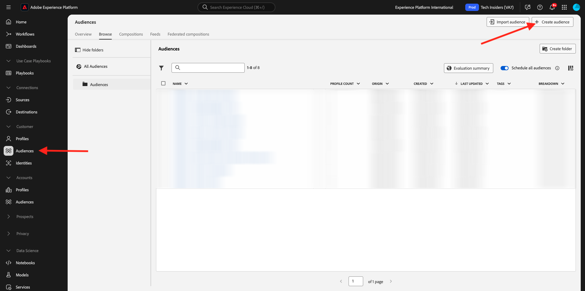
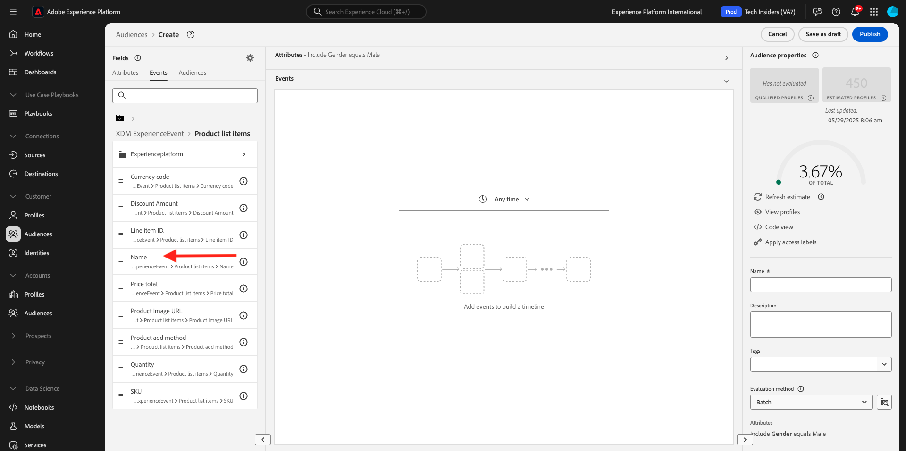

# 2.1.4 Création d’une audience - interface utilisateur

Dans cet exercice, vous allez créer une audience à l’aide du créateur d’audiences de Adobe Experience Platform.

Accédez à [Adobe Experience Platform](https://experience.adobe.com/platform). Une fois connecté, vous accédez à la page d’accueil de Adobe Experience Platform.


Avant de continuer, vous devez sélectionner un **sandbox**. Le sandbox à sélectionner est nommé ``--aepSandboxName--``. Après avoir sélectionné la [!UICONTROL sandbox] appropriée, la modification d’écran s’affiche et vous êtes maintenant dans votre [!UICONTROL sandbox] dédié.


Dans le menu de gauche, accédez à **Audiences**. Sur cette page, vous pouvez voir un aperçu de toutes les audiences existantes. Cliquez sur le bouton **+ Créer une audience** pour commencer à créer une audience.



Sélectionnez **Créer une règle** puis cliquez sur **Créer**.


Une fois que vous êtes dans le nouveau créateur d’audiences, vous remarquerez immédiatement l’option de menu **Attributs** et la référence **Profil individuel XDM**.


Dans la mesure où XDM est le langage qui alimente le secteur de l’expérience, XDM est également la base du créateur d’audience. Toutes les données ingérées dans Platform doivent être mappées à XDM. Ainsi, toutes les données font partie du même modèle de données, quelle que soit la provenance de ces données. Cela vous donne un grand avantage lors de la création d’audiences. En effet, à partir de cette interface utilisateur du créateur d’audiences, vous pouvez combiner des données de n’importe quelle origine dans le même workflow. Les audiences créées dans le créateur d’audiences peuvent être envoyées à des solutions comme Adobe Target, Adobe Campaign et Adobe Audience Manager pour activation.

Créons une audience qui comprend tous les clients **hommes**.

Pour accéder à l’attribut de genre, vous devez comprendre et connaître XDM.

Le genre est un attribut de la personne, qui se trouve sous Attributs. Pour y parvenir, vous allez commencer par cliquer sur **XDM Individual Profile**. Tu verras ça. Dans la fenêtre **Profil individuel XDM**, sélectionnez **Personne**.


Tu verras ça. Dans **Personne**, vous pouvez trouver l’attribut **Genre**. Faites glisser l’attribut Genre sur le créateur d’audiences.


Vous pouvez maintenant choisir le genre spécifique parmi les options préremplies. Dans ce cas, choisissons **Masculin**.


Après avoir sélectionné **Masculin**, vous pouvez obtenir une estimation de la population de l’audience en appuyant sur le bouton **Actualiser l’estimation**. Cela s’avère très utile pour un utilisateur chargé de la conception de parcours, afin qu’il puisse voir l’impact de certains attributs sur la taille d’audience résultante.


Vous verrez alors une estimation telle que celle ci-dessous :


Ensuite, vous devez affiner un peu votre audience. Vous devez créer une audience de tous les clients masculins qui ont consulté le produit **iPhone 15 Pro**.

Pour créer cette audience, vous devez ajouter un événement d’expérience. Pour trouver tous les événements d’expérience, cliquez sur l’icône **Événements** dans la barre de menus **Champs**. Ensuite, vous verrez le nœud de niveau supérieur **XDM ExperienceEvents**. Cliquez sur **XDM ExperienceEvent**.


Accédez à **Éléments de la liste de produits**.


Sélectionnez **Nom** et faites glisser l’objet **Name** du menu de gauche vers la zone de travail du créateur d’audience, puis déposez-le dans la section **Événements**.



Vous verrez alors ceci :


Le paramètre de comparaison doit être **égal à** et dans le champ de saisie, saisissez **iPhone 15 Pro**.


Chaque fois que vous ajoutez un élément au créateur d’audiences, vous pouvez cliquer sur le bouton **Actualiser l’estimation** pour obtenir une nouvelle estimation de la population de votre audience.

Jusqu’à présent, vous n’avez utilisé que l’interface utilisateur pour créer votre audience, mais il existe également une option de code pour créer une audience.

Lors de la création d’une audience, vous composez en fait une requête Profile Query Language (PQL). Pour visualiser le code PQL, vous pouvez cliquer sur le sélecteur **Affichage du code** dans le coin supérieur droit du créateur d’audiences.


L’instruction PQL complète s’affiche maintenant :

```sql
person.gender in ["male"] and CHAIN(xEvent, timestamp, [C0: WHAT(productListItems.exists(name.equals("iPhone 15 Pro", false)))])
```

Vous pouvez également prévisualiser un exemple de profils client qui font partie de cette audience en cliquant sur **Afficher les profils**.


Enfin, donnons un nom à votre audience.
définissez la **Méthode d’évaluation** sur **Diffusion en continu**, puis cliquez sur **Publier**.

Comme convention de nommage, utilisez :

- `--aepUserLdap-- - Male customers with interest in iPhone 15 Pro`


Vous revenez sur la page de présentation de l’audience.


## Étapes suivantes

Accédez à [2.1.5 Consultez votre profil client en temps réel en action dans le centre d’appels](./ex5.md){target="_blank"}

Revenez au [profil client en temps réel](./real-time-customer-profile.md){target="_blank"}

Revenir à [Tous les modules](./../../../../overview.md){target="_blank"}
