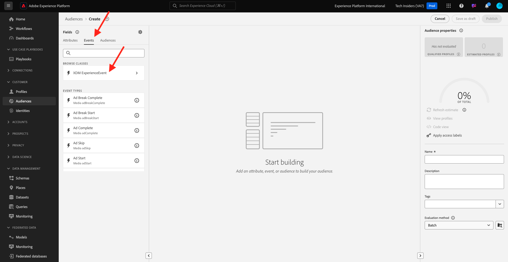
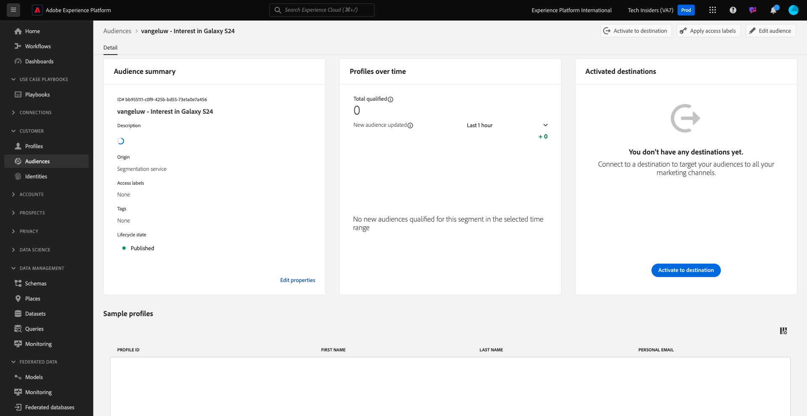

# 2.3.1 Création d’une audience

Dans cet exercice, vous allez créer une audience à l’aide du créateur d’audiences de Adobe Experience Platform.

## Contexte

La réponse à l’intérêt d’un client doit être en temps réel. L’une des manières de répondre au comportement des clients en temps réel consiste à utiliser une audience, à condition qu’elle soit qualifiée en temps réel. Dans cet exercice, vous devez créer une audience, en tenant compte de l’activité réelle sur le site web que nous avons utilisé.

## Identifiez le comportement auquel vous souhaitez réagir

Accédez à [https://dsn.adobe.com](https://dsn.adobe.com). Après vous être connecté avec votre Adobe ID, voici ce que vous verrez. Cliquez sur le **de 3 points...** sur le projet de votre site web, puis cliquez sur **Exécuter** pour l’ouvrir.

Vous verrez ensuite votre site web de démonstration s’ouvrir. Sélectionnez l’URL et copiez-la dans le presse-papiers.

Ouvrez une nouvelle fenêtre de navigateur en mode privé.

Collez l’URL de votre site web de démonstration, que vous avez copiée à l’étape précédente. Il vous sera ensuite demandé de vous connecter à l’aide de votre Adobe ID.

Sélectionnez votre type de compte et terminez le processus de connexion.

Votre site web est alors chargé dans une fenêtre de navigateur en mode privé. Pour chaque exercice, vous devrez utiliser une nouvelle fenêtre de navigateur en mode privé pour charger l’URL de votre site web de démonstration.

Dans cet exemple, vous souhaitez répondre à un client spécifique qui consulte un produit spécifique.
Sur la page d&#39;accueil de **Citi Signal**, accédez à **Téléphones et appareils**, puis cliquez sur le produit **Galaxy S24**.

Donc, quand quelqu&#39;un visite la page produit pour **Galaxy S24**, vous voulez être en mesure d&#39;agir. La première chose à faire pour agir est de définir une audience.

## Créer l’audience

Accédez à [Adobe Experience Platform](https://experience.adobe.com/platform). Une fois connecté, vous accédez à la page d’accueil de Adobe Experience Platform.

Avant de continuer, vous devez sélectionner un **sandbox**. Le sandbox à sélectionner est nommé ``--aepSandboxName--``. Après avoir sélectionné la [!UICONTROL sandbox] appropriée, la modification d’écran s’affiche et vous êtes maintenant dans votre [!UICONTROL sandbox] dédié.

Dans le menu sur le côté gauche, accédez à **Audiences** puis à **Parcourir** où vous pouvez voir un aperçu de toutes les audiences existantes. Cliquez sur le bouton **Créer une audience** pour commencer à créer une audience.

Sélectionnez **Créer une règle** puis cliquez sur **Créer**.

Comme mentionné ci-dessus, vous devez créer une audience de tous les clients qui ont consulté le produit **Galaxy S24**.

Pour créer cette audience, vous devez ajouter un événement. Pour trouver tous les événements, cliquez sur l’icône **Événements** dans la barre de menus **Audiences**.

Ensuite, vous verrez le nœud **XDM ExperienceEvent** de niveau supérieur.

Pour trouver les clients qui ont visité le produit **Galaxy S24**, cliquez sur **XDM ExperienceEvent**.

Faites défiler jusqu’à **Éléments de la liste de produits** et cliquez dessus.

Sélectionnez **Nom** et glissez-déposez l’objet **Name** du menu **Éléments de liste de produits** de gauche vers la zone de travail du créateur d’audiences dans la section **Événements**.

Le paramètre de comparaison doit être **égal à** et dans le champ de saisie, saisissez `Galaxy S24`.

Votre **règles d’événement** doit maintenant ressembler à ceci. Chaque fois que vous ajoutez un élément au créateur d’audiences, vous pouvez cliquer sur le bouton **Actualiser l’estimation** pour obtenir une nouvelle estimation de la population de votre audience.

Attribuez un nom à votre audience et définissez la **méthode d’évaluation** sur **Edge**.

Comme convention de nommage, utilisez :

- `--aepUserLdap-- - Interest in Galaxy S24`

Cliquez ensuite sur le bouton **Publier** pour enregistrer votre audience.

Vous revenez maintenant à la page de présentation de l’audience.

## Étapes suivantes

Accédez à la version [2.3.2. Découvrez comment configurer DV360 destination à l’aide de destinations](./ex2.md){target="_blank"}

Revenez à [Real-time CDP - Créer une audience et prendre des mesures](./real-time-cdp-build-a-segment-take-action.md){target="_blank"}

Revenir à [Tous les modules](./../../../../overview.md){target="_blank"}
