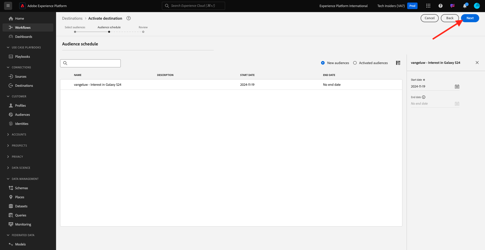

# 2.3.3 Agir : envoyez votre audience à DV360

Accédez à [Adobe Experience Platform](https://experience.adobe.com/platform). Une fois connecté, vous accédez à la page d’accueil de Adobe Experience Platform.

Avant de continuer, vous devez sélectionner un **sandbox**. Le sandbox à sélectionner est nommé ``--aepSandboxName--``. Après avoir sélectionné la [!UICONTROL sandbox] appropriée, la modification d’écran s’affiche et vous êtes maintenant dans votre [!UICONTROL sandbox] dédié.

Dans le menu de gauche, accédez à **Destinations**, puis à **Parcourir**. Vous verrez alors la destination **DV360**. Cliquez sur le **de 3 points...**, puis sur **Activer les audiences**.

Dans la liste des audiences disponibles, sélectionnez l’audience que vous avez créée dans l’exercice précédent. Cliquez sur **Suivant**.

Sur la page **Planification de l’audience**, cliquez sur **Suivant**.

Enfin, sur la page **Réviser**, cliquez sur **Terminer**.

Votre audience est maintenant liée à Google DV360. Chaque fois qu’un client se qualifie pour cette audience, un signal est envoyé à Google DV360 pour l’inclure dans l’audience côté DV360 Google.

## Étapes suivantes

Accédez à [2.3.4 Prendre des mesures : envoyer votre audience vers une destination S3](./ex4.md){target="_blank"}

Revenez à [Real-time CDP - Créer une audience et prendre des mesures](./real-time-cdp-build-a-segment-take-action.md){target="_blank"}

Revenir à [Tous les modules](./../../../../overview.md){target="_blank"}
