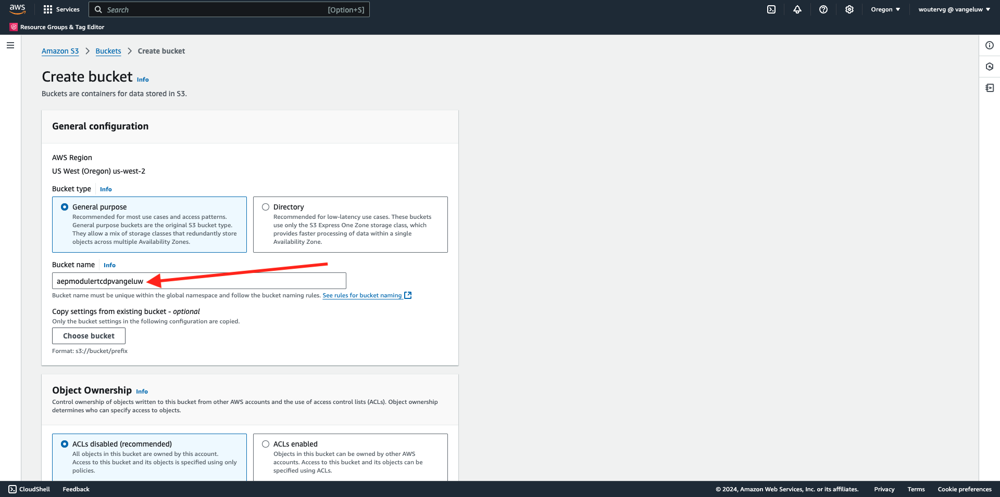
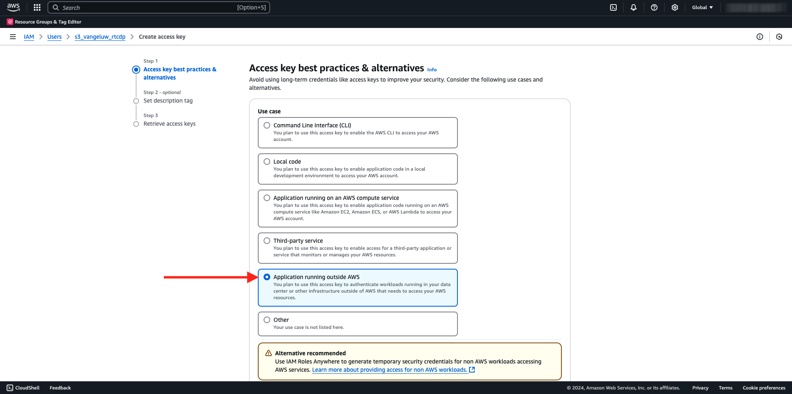
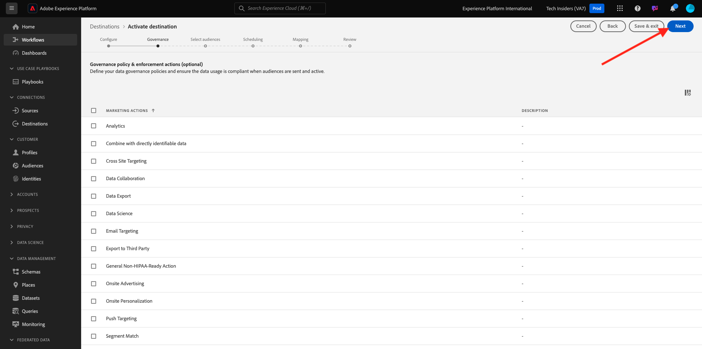

# 2.3.4 Prendre des mesures : envoyer votre audience vers une destination S3

Adobe Experience Platform peut également partager des audiences avec des destinations de marketing par e-mail telles que Salesforce Marketing Cloud, Oracle Eloqua, Oracle Responsys et Adobe Campaign.

Vous pouvez utiliser un FTP ou un SFTP dans le cadre des destinations dédiées pour chacune de ces destinations de marketing par e-mail, ou vous pouvez utiliser AWS S3 pour échanger des listes de clients entre Adobe Experience Platform et ces destinations de marketing par e-mail.

Dans ce module, vous allez configurer une telle destination à l’aide d’un compartiment AWS S3.

## Créer votre compartiment S3

Accédez à [https://console.aws.amazon.com](https://console.aws.amazon.com) et connectez-vous.

>[!NOTE]
>
>Si vous ne disposez pas encore d’un compte AWS, créez un compte AWS à l’aide de votre adresse e-mail personnelle.

Après vous être connecté, vous serez redirigé vers la **console de gestion AWS**.

Dans la barre de recherche, recherchez **s3**. Cliquez sur le premier résultat de la recherche : **S3 - Scalable Storage in the Cloud**.

Vous verrez alors la page d’accueil **Amazon S3**. Cliquez sur **Créer un compartiment**.

Sur l’écran **Créer un compartiment**, utilisez le nom `aepmodulertcdp--aepUserLdap--`

Gardez tous les autres paramètres par défaut tels quels. Faites défiler vers le bas et cliquez sur **Créer un compartiment**.

Votre compartiment est alors en cours de création et est redirigé vers la page d’accueil S3 d’Amazon.

## Définir les autorisations d’accès à votre compartiment S3

L’étape suivante consiste à configurer l’accès à votre compartiment S3.

Pour ce faire, accédez à [https://console.aws.amazon.com/iam/home](https://console.aws.amazon.com/iam/home).

L’accès aux ressources AWS est contrôlé par Amazon Identity and Access Management (IAM).

Cette page s’affiche maintenant.

Dans le menu de gauche, cliquez sur **Utilisateurs**. L’écran **Utilisateurs** s’affiche alors. Cliquez sur **Créer un utilisateur**.

Configurez ensuite votre utilisateur ou utilisatrice :

- Nom d’utilisateur : utilisez `s3_--aepUserLdap--_rtcdp`

Cliquez sur **Suivant**.

Cet écran d’autorisations s’affiche alors. Cliquez sur **Joindre directement des politiques**.

Saisissez le terme de recherche **s3** pour afficher toutes les politiques S3 associées. Sélectionnez la politique **AmazonS3FullAccess**. Faites défiler vers le bas et cliquez sur **Suivant**.

Vérifiez votre configuration. Cliquez sur **Créer un utilisateur**.

Tu verras ça. Cliquez sur **Afficher utilisateur**.

Cliquez sur **Informations d’identification de sécurité** puis sur **Créer une clé d’accès**.

Sélectionnez **Application s’exécutant en dehors d’AWS**. Faites défiler vers le bas et cliquez sur **Suivant**.

Cliquez sur **Créer une clé d’accès**

Tu verras ça. Cliquez sur **Afficher** pour afficher votre clé d’accès secrète :

Votre **clé d’accès secrète** s’affiche maintenant.

>[!IMPORTANT]
>
>Stockez vos informations d’identification dans un fichier texte sur votre ordinateur.
>
> - ID de clé d&#39;accès : ...
> - Clé d’accès secrète : ...
>
> Une fois que vous aurez cliqué sur **Terminé** vos informations d’identification ne s’afficheront plus.

Cliquez sur **Terminé**.

Vous avez maintenant créé un compartiment AWS S3 et vous avez créé un utilisateur disposant des autorisations pour accéder à ce compartiment.

## Configuration de la destination dans Adobe Experience Platform

Accédez à [Adobe Experience Platform](https://experience.adobe.com/platform). Une fois connecté, vous accédez à la page d’accueil de Adobe Experience Platform.

Avant de continuer, vous devez sélectionner un **sandbox**. Le sandbox à sélectionner est nommé ``--aepSandboxName--``. Après avoir sélectionné la [!UICONTROL sandbox] appropriée, la modification d’écran s’affiche et vous êtes maintenant dans votre [!UICONTROL sandbox] dédié.

Dans le menu de gauche, accédez à **Destinations**, puis à **Catalogue**. Vous verrez ensuite le **Catalogue des destinations**.

Cliquez sur **Espace de stockage**, puis sur le bouton **Configurer** (ou sur **Activer les audiences**, selon votre environnement) sur la vignette **Amazon S3**.

Sélectionnez **Clé d’accès** comme type de compte. Veuillez utiliser les informations d’identification S3 qui vous ont été fournies à l’étape précédente :

| Identifiant de la clé d’accès | Clé d’accès secrète |
|:-----------------------:| :-----------------------:|
| AKIA ..... | 7Icm..... |

Cliquez sur **Se connecter à la destination**.

Une confirmation visuelle s’affiche alors indiquant que cette destination est désormais connectée.

Vous devez fournir les détails du compartiment S3 afin que Adobe Experience Platform puisse se connecter au compartiment S3.

Comme convention de nommage, veuillez utiliser les éléments suivants :

| Identifiant de la clé d’accès | Clé d’accès secrète |
|:-----------------------:| :-----------------------:|
| Nom | `AWS - S3 - --aepUserLdap--` |
| Description | `AWS - S3 - --aepUserLdap--` |
| Nom du compartiment | `aepmodulertcdp--aepUserLdap--` |
| Chemin du dossier | /now |

Sélectionnez **Audiences**.

Pour **Type de fichier**, sélectionnez **CSV** et laissez les paramètres par défaut inchangés.

Faites défiler vers le bas. Pour **Format de compression**, sélectionnez **Aucun**. Cliquez sur **Suivant**.

Vous pouvez désormais éventuellement joindre une politique de gouvernance des données à votre nouvelle destination. Cliquez sur **Suivant**.

Dans la liste des audiences, recherchez l’audience que vous avez créée dans l’exercice précédent, `--aepUserLdap-- - Interest in Galaxy S24` et sélectionnez-la. Cliquez sur **Suivant**.

Tu verras ça. Si vous le souhaitez, vous pouvez modifier le planning et le nom de fichier en cliquant sur l’icône **crayon**. Cliquez sur **Suivant**.

Vous pouvez désormais sélectionner des attributs de profil pour l’exportation vers AWS S3. Cliquez sur **Ajouter un nouveau champ** et assurez-vous que le `--aepTenantId--.identification.core.ecid` du champ est ajouté et marqué comme **Clé de déduplication**.

Vous pouvez éventuellement ajouter autant d’autres attributs de profil que nécessaire.

Une fois tous les champs ajoutés, cliquez sur **Suivant**.

Vérifiez votre configuration. Cliquez sur **Terminer** pour terminer la configuration.

Vous revenez alors à l’écran d’activation de la destination et votre audience est ajoutée à cette destination.

Si vous souhaitez ajouter d’autres exportations d’audiences, vous pouvez cliquer sur **Activer les audiences** pour redémarrer le processus et ajouter d’autres audiences.

## Étapes suivantes

Accédez à [2.3.5 Prendre des mesures : envoyer votre audience à Adobe Target](./ex5.md){target="_blank"}

Revenez à [Real-time CDP - Créer une audience et prendre des mesures](./real-time-cdp-build-a-segment-take-action.md){target="_blank"}

Revenir à [Tous les modules](./../../../../overview.md){target="_blank"}
