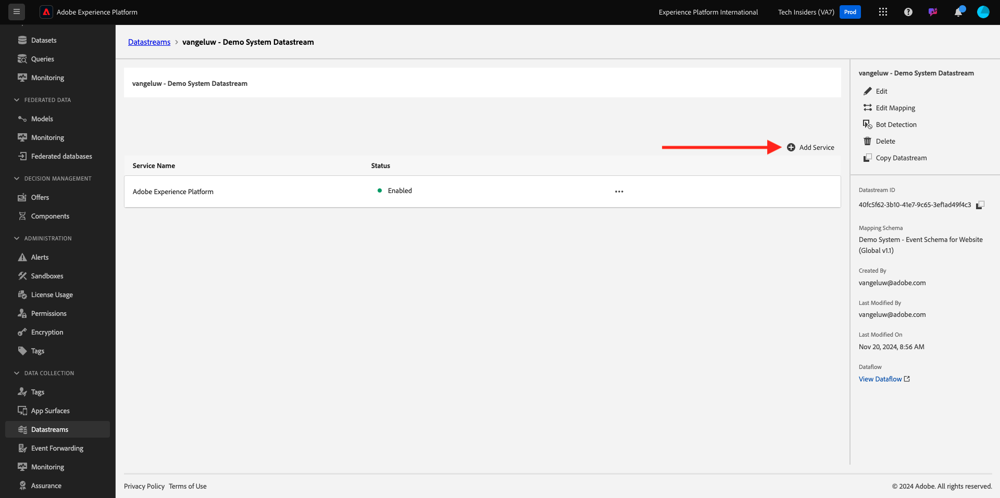
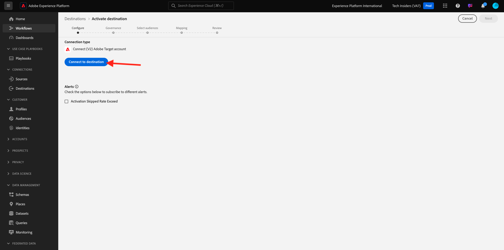
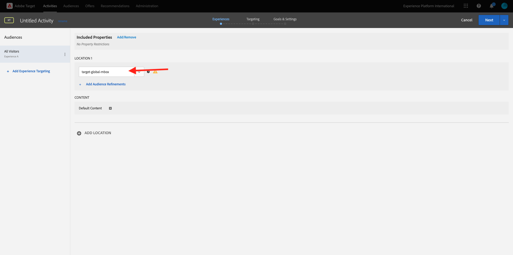
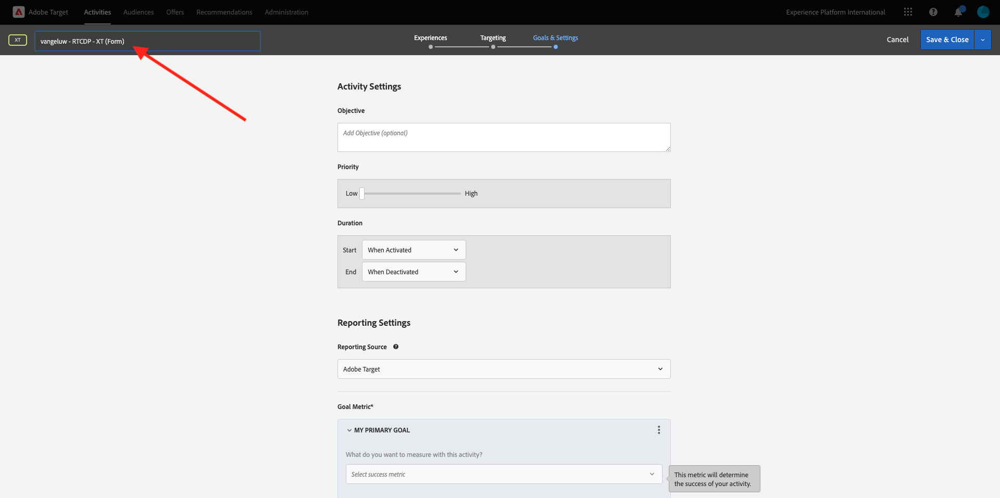

# 2.3.5 Agir : envoyez votre audience à Adobe Target

Accédez à [Adobe Experience Platform](https://experience.adobe.com/platform). Une fois connecté, vous accédez à la page d’accueil de Adobe Experience Platform.


Avant de continuer, vous devez sélectionner un **sandbox**. Le sandbox à sélectionner est nommé ``--aepSandboxName--``. Après avoir sélectionné la [!UICONTROL sandbox] appropriée, la modification d’écran s’affiche et vous êtes maintenant dans votre [!UICONTROL sandbox] dédié.


## Vérifier le flux de données

La destination Adobe Target dans Real-Time CDP est connectée au flux de données utilisé pour ingérer des données dans Adobe Edge Network. Si vous souhaitez configurer votre destination Adobe Target, vous devez d’abord vérifier si votre flux de données est déjà activé pour Adobe Target. Votre flux de données a été configuré dans [Exercice 0.2 : créer votre flux de données](./../../../modules/../getting-started/gettingstarted/ex2.md) et a été nommé `--aepUserLdap-- - Demo System Datastream`.

Dans le menu de gauche, faites défiler l’écran vers le bas et cliquez sur **Flux de données**. Dans Flux de données, recherchez le flux de données nommé `--aepUserLdap-- - Demo System Datastream`. Cliquez sur votre flux de données pour l’ouvrir.


Vous verrez alors ceci, cliquez sur **...** en regard de **Adobe Experience Platform** puis cliquez sur **Modifier**.


Cochez les cases pour **Segmentation Edge** et **Destinations Personalization**. Cliquez sur **Enregistrer**.


Cliquez ensuite sur **+ Ajouter un service**.



Sélectionnez le service **Adobe Target**. Cliquez sur **Enregistrer**.


Votre flux de données est maintenant configuré pour Adobe Target.


## Configurer votre destination Adobe Target

Adobe Target est disponible en tant que destination depuis Real-Time CDP. Pour configurer votre intégration Adobe Target, accédez à **Destinations**, puis à **Catalogue**.

Cliquez sur **Personalization** dans le menu **Catégories**. La carte de destination **(v2) Adobe Target** s’affiche alors.


Cliquez sur **Se connecter à la destination**.



Tu verras ça. Vous devez créer votre propre destination Adobe Target, suivez ces instructions :

- Nom : utilisez le nom `--aepUserLdap-- - Adobe Target v2  (Web)`.
- Identifiant du flux de données : vous devez sélectionner le flux de données que vous avez configuré dans [Exercice 0.2 : créer votre flux de données](./../../../modules/../getting-started/gettingstarted/ex2.md). Le nom de votre flux de données doit être : `--aepUserLdap-- - Demo System Datastream`.
- Workspace : relatif aux espaces de travail Adobe Target. Si aucun espace de travail spécifique ne doit être utilisé, sélectionnez **Workspace par défaut**.

Cliquez sur **Suivant**.


Vous pouvez désormais éventuellement sélectionner une politique de gouvernance des données. Cliquez sur **Suivant**.


Dans la liste des audiences disponibles, sélectionnez l’audience que vous avez créée dans l’exercice précédent [Créer une audience](./ex1.md), qui est nommée `--aepUserLdap-- - Interest in Galaxy S24`. Cliquez ensuite sur **Suivant**.


Sur l’écran **Mappage**, vous pouvez mapper les attributs de profil pour qu’ils soient disponibles dans Adobe Target. Cela vous permet d’ajouter une couche de personnalisation supplémentaire à votre site web. Cliquez sur **Ajouter un nouveau champ**.


Pour le nouveau champ, sélectionnez le champ **person.name.firstName**. Cliquez sur **Enregistrer**.


Tu auras alors ceci. Cliquez sur **Suivant**.


Cliquez sur **Terminer**.


Votre audience est maintenant activée vers Adobe Target.


>[!IMPORTANT]
>
>Lorsque vous venez de créer votre destination Adobe Target dans Real-Time CDP, la mise en ligne de la destination peut prendre jusqu’à une heure. Il s’agit d’un temps d’attente unique, en raison de la configuration du serveur principal. Une fois le temps d’attente initial d’une heure et la configuration du serveur principal terminés, les nouvelles audiences ajoutées à la destination Adobe Target seront disponibles pour le ciblage en temps réel.

## Configuration de votre activité Adobe Target basée sur les formulaires

Maintenant que votre audience Real-Time CDP est configurée pour être envoyée à Adobe Target, vous pouvez configurer votre activité de ciblage d’expérience dans Adobe Target. Dans cet exercice, vous allez configurer une activité basée sur des formulaires.

Accédez à la page d’accueil de Adobe Experience Cloud en vous rendant sur [https://experiencecloud.adobe.com/](https://experiencecloud.adobe.com/). Cliquez sur **Target** pour l’ouvrir.


Sur la page d’accueil **Adobe Target**, toutes les activités existantes s’affichent. Cliquez sur **Créer une activité**, puis sur **Ciblage d’expérience**.


Sélectionnez **Web**, **Formulaire** et **Aucune restriction de propriété**. Cliquez sur **Créer**.


Vous êtes maintenant dans le compositeur d’activité basé sur les formulaires.


Pour le champ **EMPLACEMENT 1**, sélectionnez **target-global-mbox**.



L’audience par défaut est actuellement **Tous les visiteurs**. Cliquez sur les points **3** à côté de **Tous les visiteurs** et cliquez sur **Modifier l’audience**.


La liste des audiences disponibles s’affiche maintenant. L’audience Adobe Experience Platform que vous avez créée précédemment et envoyée à Adobe Target fait désormais partie de cette liste. Sélectionnez l’audience que vous avez précédemment créée dans Adobe Experience Platform. Cliquez sur **Attribuer l’audience**.


Votre audience Adobe Experience Platform fait maintenant partie de cette activité de ciblage d’expérience.


Changeons maintenant l’image principale sur la page d’accueil du site web. Cliquez pour ouvrir la liste déroulante en regard de **Contenu par défaut** puis cliquez sur **Créer une offre HTML**.


Collez le code suivant.

```javascript
<script>document.querySelector("#SpectrumProvider > div.App > div > div.Page.home > main > div.Banner.Banner--alignment-right.Banner--verticalAlignment-middle.main-banner > div.Image > img").src="https://one-adobe-tech-insiders.s3.us-west-2.amazonaws.com/citisignal-new-hero.png"; document.querySelector("#SpectrumProvider > div.App > div > div.Page.home > main > div.Banner.Banner--alignment-right.Banner--verticalAlignment-middle.main-banner > div.Banner__content > div > div > h1").innerHTML="Hi there ";
document.querySelector("#SpectrumProvider > div.App > div > div.Page.home > main > div.Banner.Banner--alignment-right.Banner--verticalAlignment-middle.main-banner > div.Banner__content > div > div > div > div > p").innerHTML="What about 10% off of your next Galaxy S24 smartphone?";
</script>
```


Vous devez ensuite ajouter un jeton de personnalisation à partir des attributs de profil Adobe Experience Platform. N’oubliez pas que lorsque vous avez activé l’audience dans Adobe Target, vous sélectionnez également le champ **person.name.firstName** à partager avec Adobe Target. Pour récupérer le champ, sélectionnez la source **Adobe Experience Platform**, sélectionnez votre sandbox (qui doit être `--aepSandboxName--`), puis sélectionnez l’attribut **person.name.firstName**.


Avant de cliquer sur le bouton **Ajouter**, assurez-vous d&#39;aller à la ligne où vous voyez `... > h1").innerHTML="Hi there ";` et de mettre votre curseur à l&#39;intérieur des crochets après le mot `there`, comme suit :

```
... > h1").innerHTML="Hi there ";
```

Cliquez ensuite sur le bouton **Ajouter** qui doit alors ajouter le jeton, ce qui mettra à jour le code comme suit :

```
... > h1").innerHTML="Hi there ${aep.person.name.firstName}";
```


Cliquez sur **Suivant**.


Vous verrez ensuite un aperçu de votre expérience avec la nouvelle image, pour l’audience sélectionnée. Cliquez sur **Suivant**.


Cliquez sur le titre de votre activité dans le coin supérieur gauche pour la renommer, comme suit : `--aepUserLdap-- - RTCDP - XT (Form)`



Sur la page **Objectifs et paramètres** - , accédez à **Mesures d’objectif**. Définissez l’objectif du Principal sur **Engagement** - **Temps passé sur le site**. Cliquez sur **Enregistrer et fermer**.


Vous êtes maintenant sur la page **Aperçu de l’activité**. Vous devez encore activer votre activité. Cliquez sur le champ **Inactif** et sélectionnez **Activer**.


Vous obtiendrez alors une confirmation visuelle de la mise en ligne de votre activité.


Votre activité est maintenant en ligne et peut être testée sur le site web de démonstration.

>[!IMPORTANT]
>
>Lorsque vous venez de créer votre destination Adobe Target dans Real-Time CDP, la mise en ligne de la destination peut prendre jusqu’à une heure. Il s’agit d’un temps d’attente unique, en raison de la configuration du serveur principal. Une fois le temps d’attente initial d’une heure et la configuration du serveur principal terminés, les nouvelles audiences Edge ajoutées qui sont envoyées à la destination Adobe Target seront disponibles pour le ciblage en temps réel.

Si vous revenez maintenant à votre site web de démonstration et consultez la page produit pour Galaxy S24, vous serez alors éligible à l’audience que vous avez créée et l’activité Adobe Target s’affichera sur la page d’accueil en temps réel.


## Étapes suivantes

Accédez à [2.3.6 Destinations SDK](./ex6.md){target="_blank"}

Revenez à [Real-time CDP - Créer une audience et prendre des mesures](./real-time-cdp-build-a-segment-take-action.md){target="_blank"}

Revenir à [Tous les modules](./../../../../overview.md){target="_blank"}
