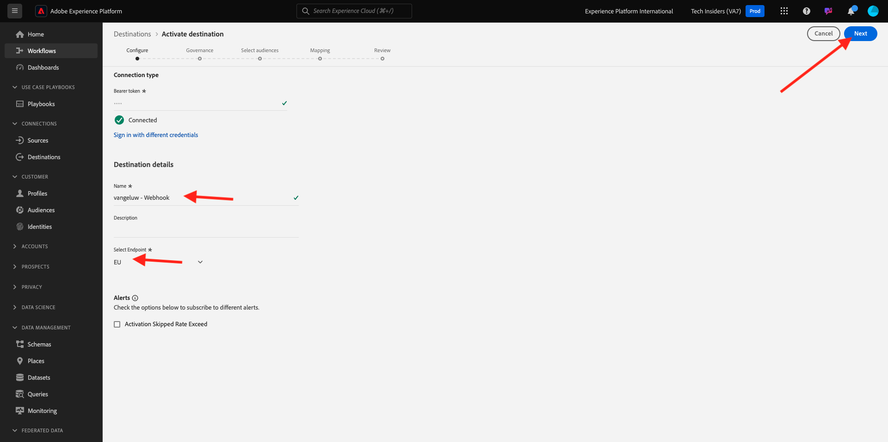
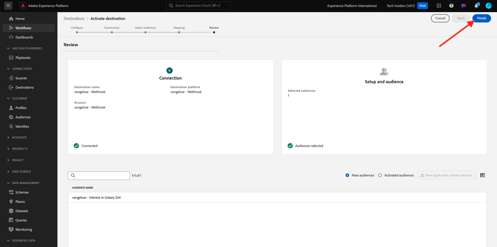

# 2.3.6 Destinations SDK

## Configuration de votre projet Adobe I/O

Dans cet exercice, vous utiliserez à nouveau Adobe I/O pour interroger les API de Adobe Experience Platform. Si vous n’avez pas encore configuré votre projet Adobe I/O, revenez à l’[Exercice 3 du module 2.1](../rtcdpb2c-1/ex3.md) et suivez les instructions qui s’y trouvent.

>[!IMPORTANT]
>
>Si vous êtes un employé d&#39;Adobe, veuillez suivre les instructions ici pour utiliser [PostBuster](./../../../../modules/getting-started/gettingstarted/ex8.md).

## Authentification à Adobe I/O

Dans cet exercice, vous utiliserez à nouveau Postman pour interroger les API Adobe Experience Platform. Si vous n’avez pas encore configuré votre application Postman, revenez à l’[exercice 3 du module 2.1](../rtcdpb2c-1/ex3.md) et suivez les instructions qui s’y trouvent.

>[!IMPORTANT]
>
>Si vous êtes un employé d&#39;Adobe, veuillez suivre les instructions ici pour utiliser [PostBuster](./../../../../modules/getting-started/gettingstarted/ex8.md).

## Définir le point d’entrée et le format

Pour cet exercice, vous avez besoin d’un point d’entrée à configurer afin que lorsqu’une audience se qualifie, l’événement de qualification puisse être diffusé en continu vers ce point d’entrée. Dans cet exercice, vous allez utiliser un exemple de point d’entrée à l’aide de [https://pipedream.com/requestbin](https://pipedream.com/requestbin). Accédez à [https://pipedream.com/requestbin](https://pipedream.com/requestbin), créez un compte, puis un espace de travail. Une fois l’espace de travail créé, un élément similaire s’affiche.

Cliquez sur **copier** pour copier l’URL. Vous devrez spécifier cette URL dans l’exercice suivant. Dans cet exemple, l’URL est `https://eodts05snjmjz67.m.pipedream.net`.


En ce qui concerne le format, nous utiliserons un modèle standard qui diffusera les qualifications ou les disqualifications d’audience, ainsi que des métadonnées telles que les identifiants de client. Les modèles peuvent être personnalisés pour répondre aux attentes de points d’entrée spécifiques, mais dans cet exercice, nous réutiliserons un modèle standard, ce qui se traduira par une payload comme celle-ci qui sera diffusée en continu au point d’entrée.

```json
{
  "profiles": [
    {
      "identities": [
        {
          "type": "ecid",
          "id": "64626768309422151580190219823409897678"
        }
      ],
      "AdobeExperiencePlatformSegments": {
        "add": [
          "f58c723c-f1e5-40dd-8c79-7bb4ab47f041"
        ],
        "remove": []
      }
    }
  ]
}
```

## Créer une configuration de serveur et de modèle

La première étape pour créer votre propre destination dans Adobe Experience Platform consiste à créer une configuration de serveur et de modèle à l’aide de Postman.

Pour ce faire, ouvrez votre application Postman, accédez à **API de création de destination**, à **Serveurs de destination et modèles**, puis cliquez pour ouvrir la requête **POST - Création d’une configuration de serveur de destination**.

>[!NOTE]
>
>Si vous ne disposez pas de cette collection Postman, revenez à l’[exercice 3 du module 2.1](../rtcdpb2c-1/ex3.md) et suivez les instructions pour configurer Postman avec les collections Postman fournies.

Tu verras ça. Sous **En-têtes**, vous devez mettre à jour manuellement la valeur de la clé **x-sandbox-name** et la définir sur `--aepSandboxName--`. Sélectionnez l’**{{SANDBOX_NAME}}** de valeur.


Remplacez-le par `--aepSandboxName--`.


Ensuite, allez à **Corps**. sélectionnez l’espace réservé **{{body}}**.


Vous devez maintenant remplacer l’espace réservé **{{body}}** par le code ci-dessous :

```json
{
    "name": "Custom HTTP Destination",
    "destinationServerType": "URL_BASED",
    "urlBasedDestination": {
        "url": {
            "templatingStrategy": "PEBBLE_V1",
            "value": "yourURL"
        }
    },
    "httpTemplate": {
        "httpMethod": "POST",
        "requestBody": {
            "templatingStrategy": "PEBBLE_V1",
            "value": "{\n    \"profiles\": [\n    \n        {\n            \"identities\": [\n            \n            \n                \n                {\n                    \"type\": \"{{ namespace }}\",\n                    \"id\": \"{{ identity.id }}\"\n                },\n                ,\n            \n            ],\n            \"AdobeExperiencePlatformSegments\": {\n                \"add\": [\n                \n                    \"{{ segment.key }}\",\n                \n                ],\n                \"remove\": [\n                {#- Alternative syntax for filtering segments by status: -#}\n                \n                    \"{{ segment.key }}\",\n                \n                ]\n            }\n        },\n    \n    ]\n}"
        },
        "contentType": "application/json"
    }
}
```

Après avoir collé le code ci-dessus, vous devez mettre à jour manuellement le champ **urlBasedDestination.url.value** et le définir sur l’URL du webhook que vous avez créé à l’étape précédente, qui a été `https://eodts05snjmjz67.m.pipedream.net` dans cet exemple.


Après la mise à jour du champ **urlBasedDestination.url.value**, il doit ressembler à ceci. Cliquez sur **Envoyer**.


>[!NOTE]
>
>N’oubliez pas qu’avant d’envoyer une demande à Adobe I/O, vous devez disposer d’une `access_token` valide. Pour obtenir un `access_token` valide, exécutez la requête **POST - Get Access Token** dans la collection **Adobe IO - OAuth**.

Après avoir cliqué sur **Envoyer**, votre modèle de serveur est créé et, dans le cadre de la réponse, un champ nommé **instanceId** s’affiche. Notez-le, car vous en aurez besoin à l&#39;étape suivante. Dans cet exemple, le **instanceId** est
`52482c90-8a1e-42fc-b729-7f0252e5cebd`.


## Création de la configuration de destination

Dans Postman, sous **API de création de destinations**, accédez à **Configurations de destination** et cliquez pour ouvrir la requête **POST - Création d’une configuration de destination**. Tu verras ça. Sous **En-têtes**, vous devez mettre à jour manuellement la valeur de la clé **x-sandbox-name** et la définir sur `--aepSandboxName--`. Sélectionnez la valeur **{{SANDBOX_NAME}}** et remplacez-la par `--aepSandboxName--`.


Ensuite, allez à **Corps**. sélectionnez l’espace réservé **{{body}}**.


Vous devez maintenant remplacer l’espace réservé **{{body}}** par le code ci-dessous :

```json
{
    "name": "--aepUserLdap-- - Webhook",
    "description": "Exports segment qualifications and identities to a custom webhook via Destination SDK.",
    "status": "TEST",
    "customerAuthenticationConfigurations": [
        {
            "authType": "BEARER"
        }
    ],
    "customerDataFields": [
        {
            "name": "endpointsInstance",
            "type": "string",
            "title": "Select Endpoint",
            "description": "We could manage several instances across the globe for REST endpoints that our customers are provisioned for. Select your endpoint in the dropdown list.",
            "isRequired": true,
            "enum": [
                "US",
                "EU",
                "APAC",
                "NZ"
            ]
        }
    ],
    "uiAttributes": {
        "documentationLink": "https://experienceleague.adobe.com/docs/experience-platform/destinations/home.html?lang=fr",
        "category": "streaming",
        "connectionType": "Server-to-server",
        "frequency": "Streaming"
    },
    "identityNamespaces": {
        "ecid": {
            "acceptsAttributes": true,
            "acceptsCustomNamespaces": false
        }
    },
    "segmentMappingConfig": {
        "mapExperiencePlatformSegmentName": true,
        "mapExperiencePlatformSegmentId": true,
        "mapUserInput": false
    },
    "aggregation": {
        "aggregationType": "BEST_EFFORT",
        "bestEffortAggregation": {
            "maxUsersPerRequest": "1000",
            "splitUserById": false
        }
    },
    "schemaConfig": {
        "profileRequired": false,
        "segmentRequired": true,
        "identityRequired": true
    },
    "destinationDelivery": [
        {
            "authenticationRule": "NONE",
            "destinationServerId": "yourTemplateInstanceID"
        }
    ]
}
```


Après avoir collé le code ci-dessus, vous devez mettre à jour manuellement le champ **destinationDelivery. destinationServerId**, et vous devez le définir sur **instanceId** du modèle de serveur de destination que vous avez créé à l’étape précédente, qui a été `52482c90-8a1e-42fc-b729-7f0252e5cebd` dans cet exemple. Cliquez ensuite sur **Envoyer**.


Vous verrez alors cette réponse.


Votre destination est maintenant créée dans Adobe Experience Platform. Allons voir ça.

Accédez à [Adobe Experience Platform](https://experience.adobe.com/platform). Une fois connecté, vous accédez à la page d’accueil de Adobe Experience Platform.


Avant de continuer, vous devez sélectionner un **sandbox**. Le sandbox à sélectionner est nommé ``--aepSandboxName--``. Après avoir sélectionné la [!UICONTROL sandbox] appropriée, la modification d’écran s’affiche et vous êtes maintenant dans votre [!UICONTROL sandbox] dédié.


Dans le menu de gauche, accédez à **Destinations**, cliquez sur **Catalogue** et faites défiler l’écran jusqu’à la catégorie **Diffusion en continu**. Votre destination est disponible sur ce site.


## Lier votre audience à la destination

Dans **Destinations** > **Catalogue**, cliquez sur **Configurer** sur la destination pour commencer à ajouter des audiences à la nouvelle destination.


Saisissez une valeur aléatoire pour le **jeton du porteur**, par exemple **1234**. Cliquez sur **Se connecter à la destination**.


Tu verras ça. Utilisez `--aepUserLdap-- - Webhook` comme nom de destination. Sélectionnez un point d’entrée de choix, dans cet exemple **EU**. Cliquez sur **Suivant**.



Vous pouvez éventuellement sélectionner une politique de gouvernance des données. Cliquez sur **Suivant**.


Sélectionnez l’audience que vous avez créée précédemment et qui est nommée `--aepUserLdap-- - Interest in Galaxy S24`. Cliquez sur **Suivant**.


Tu verras ça. Veillez à mapper le champ **SOURCE** `--aepTenantId--.identification.core.ecid` au champ `Identity: ecid`. Cliquez sur **Suivant**.


Cliquez sur **Terminer**.



Votre destination est maintenant en ligne. Les nouvelles qualifications d’audience seront diffusées en continu sur votre webhook personnalisé maintenant.


## Tester l’activation de votre audience

Accédez à [https://dsn.adobe.com](https://dsn.adobe.com). Après vous être connecté avec votre Adobe ID, voici ce que vous verrez. Cliquez sur le **de 3 points...** sur le projet de votre site web, puis cliquez sur **Exécuter** pour l’ouvrir.


Vous verrez ensuite votre site web de démonstration s’ouvrir. Sélectionnez l’URL et copiez-la dans le presse-papiers.


Ouvrez une nouvelle fenêtre de navigateur en mode privé.


Collez l’URL de votre site web de démonstration, que vous avez copiée à l’étape précédente. Il vous sera ensuite demandé de vous connecter à l’aide de votre Adobe ID.


Sélectionnez votre type de compte et terminez le processus de connexion.


Votre site web est alors chargé dans une fenêtre de navigateur en mode privé. Pour chaque exercice, vous devrez utiliser une nouvelle fenêtre de navigateur en mode privé pour charger l’URL de votre site web de démonstration.


Dans cet exemple, vous souhaitez répondre à un client spécifique qui consulte un produit spécifique.
Sur la page d&#39;accueil de **Citi Signal**, accédez à **Téléphones et appareils**, puis cliquez sur le produit **Galaxy S24**.


La page produit pour Galaxy S24 a été consultée, votre audience sera donc qualifiée pour votre profil dans les minutes qui suivent.


Lorsque vous ouvrez la visionneuse de profils et accédez à **Audiences**, l’audience est qualifiée.


Revenez maintenant à votre webhook ouvert sur [https://eodts05snjmjz67.m.pipedream.net](https://eodts05snjmjz67.m.pipedream.net), où vous devriez voir une nouvelle requête entrante, qui provient de Adobe Experience Platform et qui contient l’événement de qualification de l’audience.


## Étapes suivantes

Accédez à [ Résumé et avantages ](./summary.md){target="_blank"}

Revenez à [Real-time CDP - Créer une audience et prendre des mesures](./real-time-cdp-build-a-segment-take-action.md){target="_blank"}

Revenir à [Tous les modules](./../../../../overview.md){target="_blank"}
