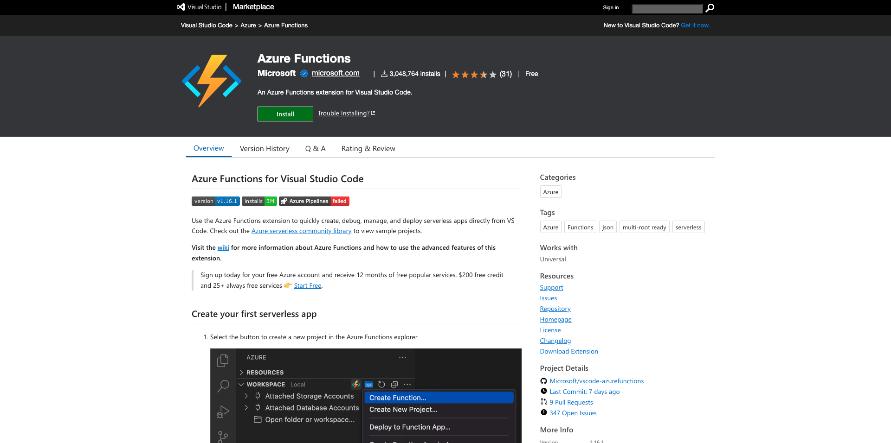

# 2.4.1 Configuration de votre environnement

## Créer un abonnement Azure

>[!NOTE]
>
>Si vous disposez déjà d’un abonnement Azure, vous pouvez ignorer cette étape. Dans ce cas, veuillez procéder au prochain exercice.

Accédez à [https://portal.azure.com](https://portal.azure.com) et connectez-vous avec votre compte Azure. Si vous n’en avez pas, veuillez utiliser votre adresse e-mail personnelle pour créer votre compte Azure.


Une fois la connexion établie, l’écran suivant s’affiche :


Cliquez sur le menu de gauche et sélectionnez **Toutes les ressources**. L’écran d’abonnement Azure s’affiche si vous n’êtes pas encore abonné. Dans ce cas, sélectionnez **Démarrer avec une version d’évaluation gratuite d’Azure**.


Remplissez le formulaire d&#39;abonnement Azure, fournissez votre téléphone mobile et votre carte de crédit pour l&#39;activation (vous aurez un niveau gratuit pendant 30 jours et vous ne serez pas facturé, sauf si vous effectuez une mise à niveau).

Une fois le processus d’abonnement terminé, tout est prêt :


## Installation de Visual Code Studio

Vous utiliserez Microsoft Visual Code Studio pour gérer votre projet Azure. Vous pouvez le télécharger via [ce lien](https://code.visualstudio.com/download). Suivez les instructions d’installation de votre système d’exploitation spécifique sur ce même site web.

## Installation des extensions de code visuel

Installez les fonctions Azure pour Visual Studio Code à partir de [https://marketplace.visualstudio.com/items?itemName=ms-azuretools.vscode-azurefunctions](https://marketplace.visualstudio.com/items?itemName=ms-azuretools.vscode-azurefunctions). Cliquez sur le bouton d’installation :



Installez le compte Azure et connectez-vous pour Visual Studio Code à partir de [https://marketplace.visualstudio.com/items?itemName=ms-vscode.azure-account](https://marketplace.visualstudio.com/items?itemName=ms-vscode.azure-account). Cliquez sur le bouton d’installation :


## Installation de node.js

>[!NOTE]
>
>Si node.js est déjà installé, vous pouvez ignorer cette étape. Dans ce cas, veuillez procéder au prochain exercice.

### macOS

Assurez-vous d’abord d’avoir installé [Homebrew](https://brew.sh/). Suivez les instructions [ici](https://brew.sh/).


Une fois Homebrew installé, exécutez la commande suivante :

```javascript
brew install node
```

### Windows

Téléchargez le [&#x200B; Windows Installer &#x200B;](https://nodejs.org/en/#home-downloadhead) directement sur le site web [nodejs.org](https://nodejs.org/en/).

## Vérification de la version node.js

Pour ce module, node.js version 18 doit être installé. Toute autre version de node.js peut entraîner des problèmes avec cet exercice.

Avant de poursuivre, vérifiez votre version de node.js.

Exécutez cette commande pour vérifier votre version de node.js :

```javascript
node -v
```

Si votre version est inférieure ou supérieure à 18, vous devez effectuer une mise à niveau ou une rétrogradation.

### Mise à niveau/rétrogradation de la version node.js sur macOS

Assurez-vous que le package **n** est installé.

Pour installer le package **n**, exécutez la commande suivante :

```javascript
sudo npm install -g n
```

Si votre version est inférieure ou supérieure à la version 12, exécutez cette commande pour mettre à niveau ou rétrograder :

```javascript
sudo n 18
```

### Mise à niveau/rétrogradation de la version node.js sous Windows

Désinstallez node.js à partir de Windows > Panneau de Contrôle > Ajouter ou supprimer des programmes.

Installation de la version requise à partir du site web [nodejs.org](https://nodejs.org/en/).

## Installer le package NPM : requête

Vous devez installer le package **request** dans le cadre de votre configuration node.js.

Pour installer le package **requête**, exécutez la commande suivante :

```javascript
npm install request
```

## Installez les outils principaux des fonctions Azure :

```
brew tap azure/functions
brew install azure-functions-core-tools@4
```

## Étapes suivantes

Accédez à [2.4.2 Configuration de votre environnement Microsoft Azure EventHub](./ex2.md){target="_blank"}

Revenez à [Real-Time CDP : Audience Activation vers Microsoft Azure Event Hub](./segment-activation-microsoft-azure-eventhub.md){target="_blank"}

Revenir à [Tous les modules](./../../../../overview.md){target="_blank"}
