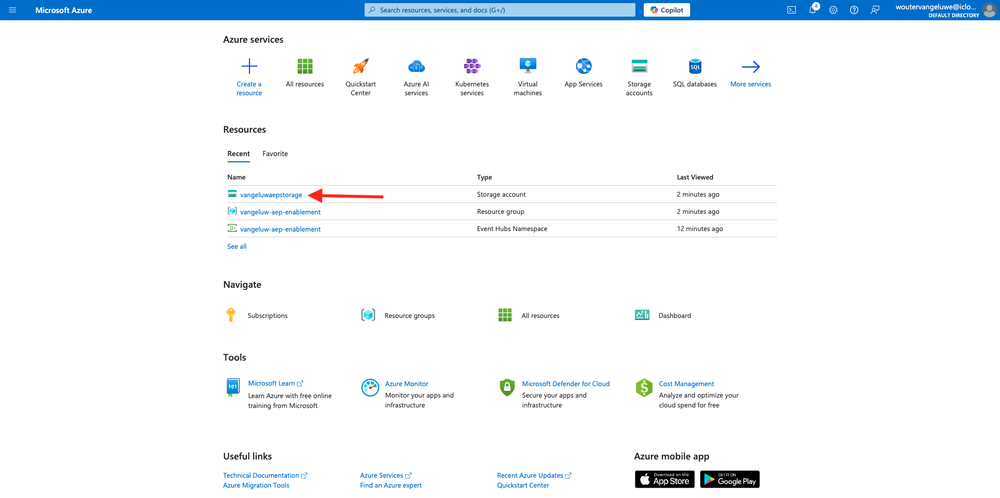

# 2.4.2 Configuration de votre environnement Microsoft Azure EventHub

Azure Event Hubs est un service de publication-abonnement hautement évolutif, capable d’ingérer des millions d’événements par seconde et de les diffuser dans plusieurs applications. Vous pouvez ainsi traiter et analyser les énormes quantités de données produites par vos appareils et applications connectés.

## Qu’est-ce qu’Azure Event Hubs ?

Azure Event Hubs est une plateforme de streaming Big Data et un service d&#39;ingestion d&#39;événements. Il peut recevoir et traiter des millions d’événements par seconde. Les données envoyées à un centre d’événements peuvent être transformées et stockées à l’aide de n’importe quel fournisseur d’analyses en temps réel ou de cartes de traitement par lots/stockage.

Event Hubs représente la **porte d’entrée** d’un pipeline d’événement, souvent appelé « ingéreur d’événement » dans les architectures de solution. Un ingéreur d’événements est un composant ou un service qui se trouve entre les éditeurs d’événements (comme Adobe Experience Platform RTCDP) et les consommateurs d’événements afin de découpler la production d’un flux d’événements de la consommation de ces événements. Event Hubs fournit une plateforme de streaming unifiée avec une mémoire tampon de rétention du temps, découplant les producteurs d’événements des consommateurs d’événements.

## Créer un espace de noms Concentrateur d’événements

Accédez à [https://portal.azure.com/#home](https://portal.azure.com/#home) puis sélectionnez **Créer une ressource**.

Dans l’écran des ressources, saisissez **Événement** dans la barre de recherche. Recherchez la carte **Concentrateur d’événements**, cliquez sur **Créer** puis sur **Concentrateur d’événements**..

Si c’est la première fois que vous créez une ressource dans Azure, vous devez créer un nouveau **groupe de ressources**. Si vous disposez déjà d’un groupe de ressources, vous pouvez le sélectionner (ou en créer un nouveau).

Cliquez sur **Créer** et nommez votre `--aepUserLdap---aep-enablement` de groupe, puis cliquez sur **OK**.

Renseignez le reste des champs comme indiqué :

- Espace de noms : définissez votre espace de noms (il doit être unique) à l’aide du modèle suivant `--aepUserLdap---aep-enablement`
- Emplacement : choisissez un emplacement
- Niveau de tarification : **De base**
- Unités de débit : **1**

Cliquez sur **Vérifier + créer**.

Cliquez sur **Créer**.

Le déploiement de votre groupe de ressources peut prendre entre 1 et 2 minutes. Une fois l’opération réussie, l’écran suivant s’affiche :

## Configurer votre hub d’événements dans Azure

Accédez à [https://portal.azure.com/#home](https://portal.azure.com/#home) puis sélectionnez **Toutes les ressources**.

Dans la liste des ressources, cliquez sur votre espace de noms Concentrateur d’événements `--aepUserLdap---aep-enablement` :

Dans `--aepUserLdap---aep-enablement`’écran de détails, accédez à **Entités** et cliquez sur **Concentrateur d’événements** :

Cliquez sur **+ Event Hub**.

Utilisez `--aepUserLdap---aep-enablement-event-hub` comme nom et cliquez sur **Vérifier + Créer**.

Cliquez sur **Créer**.

Dans **Event Hubs**, sous l’espace de noms de votre hub d’événements, le **Event Hub** apparaît désormais dans la liste.

## Configurer votre compte de stockage Azure

Pour déboguer votre fonction Azure Event Hub dans des exercices ultérieurs, vous devrez fournir un compte de stockage Azure dans le cadre de la configuration de votre projet Visual Studio Code. Vous allez maintenant créer ce compte de stockage Azure.

Accédez à [https://portal.azure.com/#home](https://portal.azure.com/#home) puis sélectionnez **Créer une ressource**.

Saisissez **compte de stockage** dans la recherche, recherchez la carte correspondant à **Compte de stockage** et cliquez sur **Compte de stockage**..

Spécifiez votre **Groupe de ressources** (créé au début de cet exercice), utilisez `--aepUserLdap--aepstorage` comme nom de compte de stockage et sélectionnez **Stockage redondant local (LRS)**, puis cliquez sur **Vérifier + créer**.

Cliquez sur **Créer**.

La création de notre compte de stockage prendra quelques secondes :

Lorsque vous avez terminé, votre écran affiche le bouton **Accéder à la ressource**.

Cliquez sur **Accueil**.

Votre compte de stockage est maintenant visible sous **Ressources récentes**.

## Étapes suivantes

Accédez à [2.4.3 Configuration de la destination Azure Event Hub dans Adobe Experience Platform](./ex3.md){target="_blank"}

Revenez à [Real-Time CDP : Audience Activation vers Microsoft Azure Event Hub](./segment-activation-microsoft-azure-eventhub.md){target="_blank"}

Revenir à [Tous les modules](./../../../../overview.md){target="_blank"}
