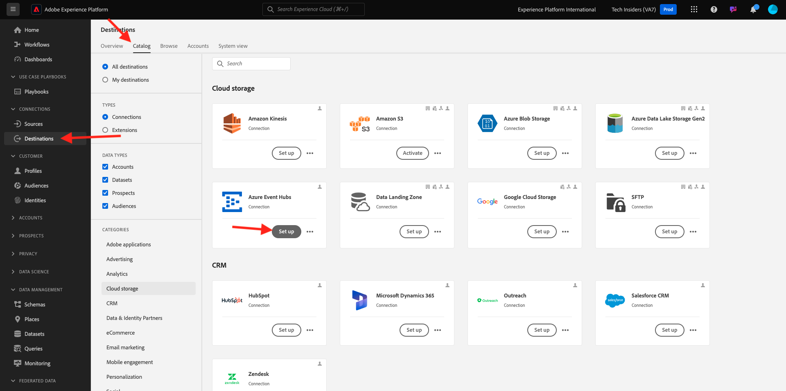
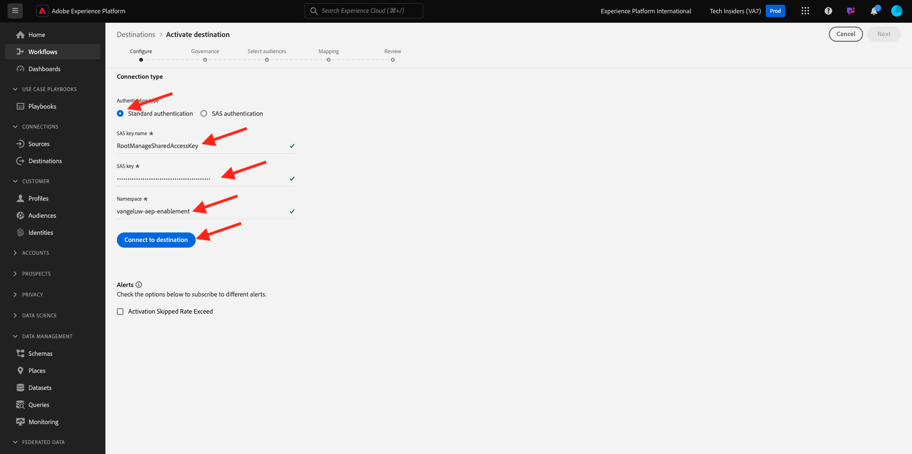

# 2.4.3 Configuration de la destination Azure Event Hub dans Adobe Experience Platform

## Identifier les paramètres de connexion Azure requis

Pour configurer une destination Event Hub dans Adobe Experience Platform, vous avez besoin des éléments suivants :

- Espace de noms Event Hubs
- Concentrateur d’événements
- Nom de la clé SAS Azure
- Clé SAS Azure

Event Hub et l’espace de noms EventHub ont été définis dans l’exercice précédent : [Configuration d’Event Hub dans Azure](./ex2.md)

### Espace de noms Event Hubs

Pour rechercher les informations ci-dessus dans le portail Azure, accédez à [https://portal.azure.com/#home](https://portal.azure.com/#home). Assurez-vous d’utiliser le compte Azure approprié.

Cliquez sur **Toutes les ressources** sur votre portail Azure :

Recherchez votre **espace de noms Hubs d’événements** dans la liste, puis cliquez dessus.

Le nom de votre **espace de noms Event Hubs** est désormais clairement visible. Il doit être similaire à `--aepUserLdap---aep-enablement`.

### Concentrateur d’événements

Sur votre page **Espace de noms Event Hubs**, cliquez sur **Entités > Concentrateurs d’événements** pour obtenir une liste des concentrateurs d’événements définis dans votre espace de noms Event Hubs. Si vous avez suivi les conventions de dénomination utilisées dans l’exercice précédent, vous trouverez un concentrateur d’événements nommé `--aepUserLdap---aep-enablement-event-hub`. Prenez-en note, vous en aurez besoin lors du prochain exercice.

### Nom de la clé SAS

Sur la page **Espace de noms Hubs d’événements**, cliquez sur **Paramètres > Politiques d’accès partagé**. La liste des politiques d’accès partagé s’affiche. La clé SAS que nous recherchons est **RootManageSharedAccessKey**, qui est le nom de la clé **SAS. Prends-le en note.

### Valeur de la clé SAS

Cliquez ensuite sur la **RootManageSharedAccessKey** pour obtenir la valeur de la clé SAS. Appuyez ensuite sur l’icône **Copier dans le presse-papiers** pour copier la touche de Principal **&#x200B;**, dans ce cas `pqb1jEC0KLazwZzIf2gTHGr75Z+PdkYgv+AEhObbQEY=`.

### Résumé des valeurs de destination

À ce stade, vous devriez avoir identifié toutes les valeurs nécessaires pour définir la destination Azure Event Hub dans la plateforme de données clients en temps réel Adobe Experience Platform.

| Nom de l’attribut de destination | Valeur d’attribut de destination | Exemple de valeur |
|---|---|---|
| sasKeyName | Nom de la clé SAS | RootManageSharedAccessKey |
| sasKey | Valeur de la clé SAS | pqb1jEC0KLazwZzIf2gTHGr75Z+PdkYgv+AEhObbQEY= |
| espace de noms | Espace de noms Event Hubs | `--aepUserLdap---aep-enablement` |
| eventHubName | Concentrateur d’événements | `--aepUserLdap---aep-enablement-event-hub` |

## Créer une destination Azure Event Hub dans Adobe Experience Platform

Connectez-vous à Adobe Experience Platform en accédant à cette URL : [https://experience.adobe.com/platform](https://experience.adobe.com/platform).

Une fois connecté, vous accédez à la page d’accueil de Adobe Experience Platform.

Avant de continuer, vous devez sélectionner un **sandbox**. Le sandbox à sélectionner est nommé ``--aepSandboxName--``. Après avoir sélectionné la sandbox appropriée, la modification d’écran s’affiche et vous êtes maintenant dans votre sandbox dédiée.

Accédez à **Destinations**, puis à **Catalogue**. Sélectionnez **Espace de stockage**, accédez à **Azure Event Hubs** et cliquez sur **Configurer**.

Sélectionnez **Authentification standard**. Renseignez les détails de connexion que vous avez collectés au cours de l’exercice précédent. Cliquez ensuite sur **Se connecter à la destination**.

Si vos informations d’identification étaient correctes, une confirmation s’affiche : **Connecté**.

Vous devez maintenant saisir le nom et la description au format `--aepUserLdap---aep-enablement`. Saisissez le **eventHubName** (voir l’exercice précédent, il ressemble à ceci : `--aepUserLdap---aep-enablement-event-hub`) et cliquez sur **Suivant**.

Vous pouvez éventuellement sélectionner une politique de gouvernance des données. Cliquez sur **Enregistrer et quitter**.

Votre destination est maintenant créée et disponible dans Adobe Experience Platform.

## Étapes suivantes

Accédez à [2.4.4 Création d’une audience](./ex4.md){target="_blank"}

Revenez à [Real-Time CDP : Audience Activation vers Microsoft Azure Event Hub](./segment-activation-microsoft-azure-eventhub.md){target="_blank"}

Revenir à [Tous les modules](./../../../../overview.md){target="_blank"}
