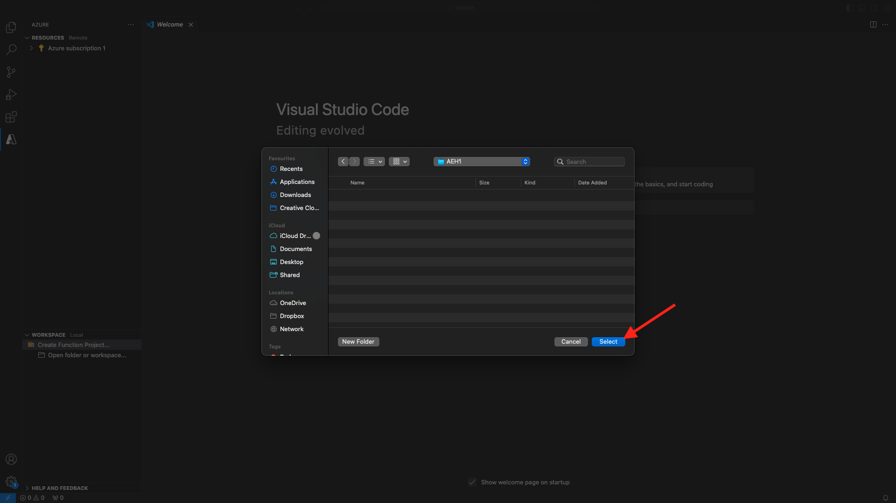

# 2.4.6 Création de votre projet Microsoft Azure

## Se familiariser avec les fonctions Azure Event Hub

Les fonctions Azure vous permettent d’exécuter de petits éléments de code (appelés **fonctions**) sans vous soucier de l’infrastructure d’application. Grâce aux fonctions Azure, l’infrastructure cloud fournit tous les serveurs à jour dont vous avez besoin pour que votre application s’exécute à grande échelle.
Une fonction est **déclenchée** par un type d’événement spécifique. Les déclencheurs pris en charge incluent la réponse aux modifications de données, la réponse aux messages (par exemple, Event Hubs), l’exécution selon un planning ou à la suite d’une requête HTTP.
Azure Functions est un service de calcul sans serveur qui vous permet d’exécuter du code déclenché par un événement sans avoir à configurer ou gérer explicitement l’infrastructure.
Azure Event Hubs s&#39;intègre à Azure Functions pour une architecture sans serveur.
## Ouvrez Visual Studio Code et connectez-vous à Azure

Visual Studio Code facilite la...
- définir et lier des fonctions Azure à Event Hubs- test local- déployer sur Azure- exécution de la fonction de journal à distance
### Ouvrir Visual Studio Code

### Connexion à Azure

Lorsque vous vous connectez avec votre compte Azure que vous avez utilisé pour vous enregistrer dans l&#39;exercice précédent, Visual Studio Code vous permet de rechercher et de lier toutes les ressources Event Hub.
Ouvrez Visual Studio Code et cliquez sur l’icône **Azure**.
Sélectionnez ensuite **Se connecter à Azure** :

Vous serez redirigé vers votre navigateur pour vous connecter. N’oubliez pas de sélectionner le compte Azure que vous avez utilisé pour l’enregistrement.
Lorsque l’écran suivant s’affiche dans votre navigateur, vous êtes connecté avec Visual Code Studio :

Revenez à Visual Code Studio (vous verrez le nom de votre abonnement Azure, par exemple **abonnement Azure 1**) :

## Créer un projet Azure

Cliquez sur **Créer un projet de fonction...** :

Sélectionnez ou créez un dossier local de votre choix pour enregistrer le projet et cliquez sur **Sélectionner** :

Vous accédez maintenant à l’assistant de création de projet. Cliquez sur **Javascript** comme langue de votre projet :

Sélectionnez ensuite **Modèle v4**.

Sélectionnez **Déclencheur Azure Event Hub** comme premier modèle de fonction de votre projet :

Saisissez un nom pour votre fonction, utilisez le format `--aepUserLdap---aep-event-hub-trigger` et appuyez sur Entrée :

Sélectionnez **Créer un paramètre d’application locale** :

Cliquez pour sélectionner l’espace de noms du hub d’événements que vous avez créé précédemment et qui est nommé `--aepUserLdap---aep-enablement`.

Cliquez ensuite sur pour sélectionner le hub d’événements que vous avez créé précédemment et qui est nommé `--aepUserLdap---aep-enablement-event-hub`.

Cliquez pour sélectionner **RootManageSharedAccessKey** comme stratégie Event Hub :

Sélectionnez **Ajouter à l’espace de travail** pour savoir comment ouvrir votre projet :

Vous pourriez alors recevoir un message comme celui-ci. Dans ce cas, cliquez sur **Oui, je fais confiance aux auteurs**.

Une fois le projet créé, ouvrez le fichier `--aepUserLdap---aep-event-hub-trigger.js` dans l’éditeur :

La payload envoyée par Adobe Experience Platform à votre hub d&#39;événements ressemblera à ceci :
```json
{
  "identityMap": {
    "ecid": [
      {
        "id": "36281682065771928820739672071812090802"
      }
    ]
  },
  "segmentMembership": {
    "ups": {
      "94db5aed-b90e-478d-9637-9b0fad5bba11": {
        "createdAt": 1732129904025,
        "lastQualificationTime": "2024-11-21T07:33:52Z",
        "mappingCreatedAt": 1732130611000,
        "mappingUpdatedAt": 1732130611000,
        "name": "vangeluw - Interest in Plans",
        "status": "realized",
        "updatedAt": 1732129904025
      }
    }
  }
}
```

Mettez à jour le code dans le `--aepUserLdap---aep-event-hub-trigger.js` de votre Visual Studio Code avec le code ci-dessous. Ce code sera exécuté chaque fois que Real-Time CDP envoie les qualifications d’audience à votre destination Event Hub. Dans cet exemple, le code se contente d’afficher la payload entrante, mais vous pouvez imaginer tout type de fonction supplémentaire pour traiter les qualifications d’audience en temps réel et les utiliser plus bas dans votre écosystème de pipeline de données.
La ligne 11 de votre `--aepUserLdap---aep-event-hub-trigger.js` de fichier affiche actuellement ceci :
```javascript
context.log('Event hub message:', message);
```

Modifiez la ligne 11 dans `--aepUserLdap---aep-event-hub-trigger.js` pour qu’elle ressemble à ceci :
```javascript
context.log('Event hub message:', JSON.stringify(message));
```

La payload totale doit alors être du type :
```javascript
const { app } = require('@azure/functions');

app.eventHub('--aepUserLdap---aep-event-hub-trigger', {
    connection: '--aepUserLdap--aepenablement_RootManageSharedAccessKey_EVENTHUB',
    eventHubName: '--aepUserLdap---aep-enablement-event-hub',
    cardinality: 'many',
    handler: (messages, context) => {
        if (Array.isArray(messages)) {
            context.log(`Event hub function processed ${messages.length} messages`);
            for (const message of messages) {
                context.log('Event hub message:', message);
            }
        } else {
            context.log('Event hub function processed message:', messages);
        }
    }
});
```


Le résultat doit ressembler à ceci :

## Exécuter un projet Azure

Il est maintenant temps d’exécuter votre projet. À ce stade, nous ne déploierons pas le projet sur Azure. Nous l’exécuterons localement en mode de débogage. Sélectionnez l’icône Exécuter , puis cliquez sur la flèche verte.

La première fois que vous exécutez votre projet en mode débogage, vous devez joindre un compte de stockage Azure, cliquez sur **Sélectionner un compte de stockage**.

puis sélectionnez le compte de stockage que vous avez créé précédemment et qui est nommé `--aepUserLdap--aepstorage`.

Votre projet est maintenant opérationnel et répertorie les événements dans le centre d’événements. Dans l’exercice suivant, vous allez démontrer le comportement sur le site web de démonstration de CitiSignal qui vous qualifiera pour les audiences. Par conséquent, vous recevrez une payload de qualification d’audience dans le terminal de votre fonction de déclenchement Event Hub.

## Arrêter le projet Azure

Pour arrêter votre projet, accédez au menu **PILE D’APPELS** dans VSC, cliquez sur la flèche de votre projet en cours, puis cliquez sur **Arrêter**.

## Étapes suivantes

Accédez au scénario de bout en bout [2.4.7](./ex7.md){target="_blank"}
Revenez à [Real-Time CDP : Audience Activation vers Microsoft Azure Event Hub](./segment-activation-microsoft-azure-eventhub.md){target="_blank"}
Revenir à [Tous les modules](./../../../../overview.md){target="_blank"}
