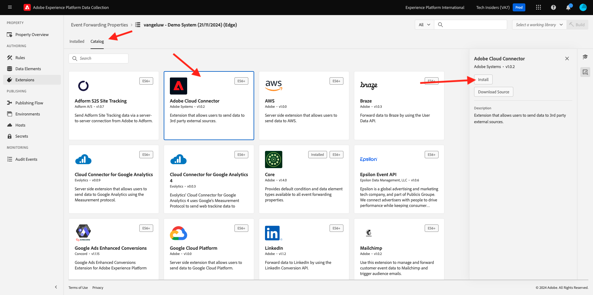

# 2.5.1 Création d’une propriété Transfert d’événement de la collecte de données Adobe Experience Platform

## Qu’est-ce qu’une propriété Transfert d’événement de collecte de données Adobe Experience Platform ?

En règle générale, lorsque des données sont collectées à l’aide de la collecte de données Adobe Experience Platform, elles le sont du **côté client**. Le **côté client** est un environnement tel qu’un site web ou une application mobile. Dans Prise en main et collecte de données, la configuration d’une propriété Client de collecte de données Adobe Experience Platform a été traitée en détail et vous avez implémenté cette propriété Client de collecte de données Adobe Experience Platform sur votre site web et votre application mobile, de sorte que les données puissent y être collectées lorsqu’un client interagit avec le site web et l’application mobile.

Lorsque ces données d’interaction sont collectées par la propriété Client de collecte de données Adobe Experience Platform, une requête est envoyée par le site web ou l’application mobile à Adobe Edge. Edge est l’environnement de collecte de données d’Adobe et le point d’entrée des données de parcours de navigation dans l’écosystème Adobe. À partir d’Edge, ces données collectées sont ensuite envoyées à des applications telles que Adobe Experience Platform, Adobe Analytics, Adobe Audience Manager ou Adobe Target.

Avec l’ajout d’une propriété Transfert d’événement de la collecte de données Adobe Experience Platform, il est désormais possible de configurer une propriété de collecte de données Adobe Experience Platform qui écoute les données entrantes sur l’Edge. Lorsque la propriété Transfert d’événement de la collecte de données Adobe Experience Platform en cours d’exécution sur Edge voit des données entrantes, elle peut utiliser ces données et les transférer vers un autre emplacement. Cet autre emplacement peut désormais être un webhook externe non Adobe, ce qui permet d’envoyer ces données, par exemple, au lac de données de votre choix, à une application Decisioning ou à toute autre application pouvant ouvrir un webhook.

La configuration d’une propriété Transfert d’événement de collecte de données Adobe Experience Platform semble familière à une propriété côté client. Il est possible de configurer les éléments de données et les règles comme par le passé avec les propriétés du client de collecte de données Adobe Experience Platform. Cependant, la manière dont ces données seront accessibles et utilisées sera légèrement différente, selon votre cas d’utilisation.

Commençons par créer la propriété Transfert d’événement de la collecte de données Adobe Experience Platform.

## Création d’une propriété Transfert d’événement de collecte de données Adobe Experience Platform

Accédez à [https://experience.adobe.com/#/data-collection/](https://experience.adobe.com/#/data-collection/). Dans le menu de gauche, cliquez sur **Transfert d’événement**. Vous verrez ensuite un aperçu de toutes les propriétés de transfert d’événement de la collecte de données Adobe Experience Platform disponibles. Cliquez sur le bouton **Créer une propriété**.

Si d’autres propriétés de transfert d’événement ont déjà été créées, l’interface utilisateur sera un peu différente. Dans ce cas, cliquez sur **Nouvelle propriété**.

Vous devez maintenant saisir un nom pour votre propriété Transfert d’événement de collecte de données Adobe Experience Platform. Comme convention de nommage, utilisez `--aepUserLdap-- - Demo System (DD/MM/YYYY) (Edge)`. Par exemple, dans cet exemple, le nom est **vangeluw - Demo System (22/02/2022) (Edge)**. Cliquez sur **Enregistrer**.

Vous revenez alors dans la liste des propriétés de transfert d’événement de la collecte de données Adobe Experience Platform . Cliquez pour ouvrir la propriété que vous venez de créer.

## Configuration de l’extension Adobe Cloud Connector

Dans le menu de gauche, accédez à **Extensions**. L’extension **Core** est déjà configurée.

Accédez à **Catalogue**. Vous verrez l’extension **Adobe Cloud Connector**, parmi de nombreuses autres. Cliquez sur **Installer** pour l’installer.

L’extension sera alors ajoutée. Il n’y a aucune configuration à effectuer à cette étape. Vous serez renvoyé à l’aperçu des extensions installées.

## Déployez votre propriété Transfert d’événement de collecte de données Adobe Experience Platform

Dans le menu de gauche, accédez à **Flux de publication**. Cliquez sur **Ajouter une bibliothèque**.

Saisissez le nom **Principal**, sélectionnez l’environnement **Développement (développement)** puis cliquez sur **+ Ajouter toutes les ressources modifiées**.

Tu verras ça. Cliquez sur **Enregistrer et générer pour le développement**.

Votre bibliothèque sera alors créée, ce qui peut prendre entre 1 et 2 minutes.

## Étapes suivantes

Accédez à [2.5.2 Mettre à jour votre flux de données pour rendre les données disponibles pour votre propriété Transfert d’événement de collecte de données](./ex2.md){target="_blank"}

Revenez à [Connexions Real-Time CDP : transfert d’événement](./aep-data-collection-ssf.md){target="_blank"}

Revenir à [Tous les modules](./../../../../overview.md){target="_blank"}
