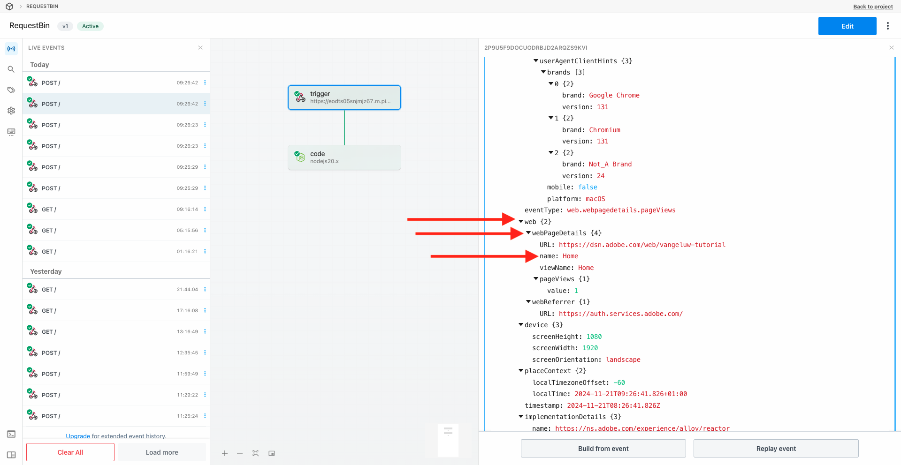

# 2.5.3 Création et configuration d’un webhook personnalisé

## Créer votre webhook personnalisé

Accédez à [https://pipedream.com/requestbin](https://pipedream.com/requestbin). Vous avez déjà utilisé cette application dans [Exercice 2.3.6 Destinations SDK](./../../../../modules/delivery-activation/rtcdp-b2c/rtcdpb2c-3/ex6.md)

Si vous n’avez pas encore utilisé ce service, créez un compte, puis créez un espace de travail. Une fois l’espace de travail créé, un élément similaire s’affiche.

Cliquez sur **copier** pour copier l’URL. Vous devrez spécifier cette URL dans l’exercice suivant. Dans cet exemple, l’URL est `https://eodts05snjmjz67.m.pipedream.net`.

Ce site web a maintenant créé ce webhook pour vous. Vous pourrez le configurer dans votre **[!DNL Event Forwarding property]** pour commencer à tester le transfert des événements.

## Mettre à jour votre propriété Transfert d’événement : créer un élément de données

Accédez à [https://experience.adobe.com/#/data-collection/](https://experience.adobe.com/#/data-collection/) puis à **Transfert d’événement**. Recherchez votre propriété Transfert d’événement et cliquez dessus pour l’ouvrir.

Dans le menu de gauche, accédez à **Éléments de données**. Cliquez sur **Créer un élément de données**.

Un nouvel élément de données à configurer s’affiche alors.

Effectuez la sélection suivante :

- Saisissez **Nom**, puis **Événement XDM**.
- Sélectionnez **Extension**, puis **Core**.
- Pour le **Type d’élément de données**, sélectionnez **Chemin**.
- En tant que **Chemin d’accès**, sélectionnez **Lecture de données à partir de XDM (arc.event.xdm)**. En sélectionnant ce chemin d’accès, vous allez filtrer la section **XDM** de la payload d’événement envoyée par le site web ou l’application mobile vers Adobe Edge.

Vous allez prendre ceci. Cliquez sur **Enregistrer**.

>[!NOTE]
>
>Dans le chemin ci-dessus, une référence est faite à **arc**. **arc** signifie Adobe Resource Context et **arc** signifie toujours l’objet disponible le plus élevé disponible dans le contexte côté serveur. Des enrichissements et des transformations peuvent être ajoutés à cet objet **arc** à l’aide des fonctions du serveur de collecte de données Adobe Experience Platform.
>
>Dans le chemin ci-dessus, une référence est faite à **event**. **event** signifie un événement unique et le serveur de collecte de données Adobe Experience Platform évaluera toujours chaque événement individuellement. Parfois, vous pouvez voir une référence à **events** dans la payload envoyée par Web SDK côté client, mais dans Adobe Experience Platform Data Collection Server, chaque événement est évalué individuellement.

## Mettre à jour la propriété du serveur de collecte de données Adobe Experience Platform : Créer une règle

Dans le menu de gauche, accédez à **Règles**. Cliquez sur **Créer une règle**.

Une nouvelle règle s’affiche alors pour la configuration. Saisissez le **Nom** : **Toutes les pages**. Pour cet exercice, vous n’avez pas besoin de configurer de condition. À la place, vous allez configurer une action. Cliquez sur le bouton **+ Ajouter** sous **Actions**.

Tu verras ça. Effectuez la sélection suivante :

- Sélectionnez l’**Extension** : **Adobe Cloud Connector**.
- Sélectionnez le **Type d’action** : **Effectuer l’appel de récupération**.

Cela devrait vous donner le **Nom** suivant : **Adobe Cloud Connector - Effectuer l’appel de récupération**. Vous devriez maintenant voir ceci :

Configurez ensuite les éléments suivants :

- Remplacez la méthode de requête de GET par **POST**
- Saisissez l’URL du webhook personnalisé que vous avez créé à l’une des étapes précédentes, qui ressemble à ceci : `https://eodts05snjmjz67.m.pipedream.net`

Vous devriez maintenant avoir ceci. Ensuite, allez à **Corps**.

Tu verras ça. Cliquez sur l’icône de l’élément de données comme indiqué ci-dessous.

Dans la fenêtre contextuelle, sélectionnez l’élément de données **Événement XDM** que vous avez créé à l’étape précédente. Cliquez sur **Sélectionner**.

Tu verras ça. Cliquez sur **Conserver les modifications**.

Tu verras ça. Cliquez sur **Enregistrer**.

Vous avez maintenant configuré votre première règle dans une propriété Transfert d’événement. Accédez à **Flux de publication** pour publier vos modifications.
Ouvrez votre bibliothèque de développement **Principal** en cliquant sur **Modifier** comme indiqué.

Cliquez sur le bouton **Ajouter toutes les ressources modifiées**, après quoi votre règle et votre élément de données apparaîtront dans cette bibliothèque. Cliquez ensuite sur **Enregistrer et créer pour développement**. Vos modifications sont en cours de déploiement.

Au bout de quelques minutes, vous verrez que le déploiement est terminé et prêt à être testé.

## Tester votre configuration

Accédez à [https://dsn.adobe.com](https://dsn.adobe.com). Après vous être connecté avec votre Adobe ID, voici ce que vous verrez. Cliquez sur le **de 3 points...** sur le projet de votre site web, puis cliquez sur **Exécuter** pour l’ouvrir.

Vous verrez ensuite votre site web de démonstration s’ouvrir. Sélectionnez l’URL et copiez-la dans le presse-papiers.

Ouvrez une nouvelle fenêtre de navigateur en mode privé.

Collez l’URL de votre site web de démonstration, que vous avez copiée à l’étape précédente. Il vous sera ensuite demandé de vous connecter à l’aide de votre Adobe ID.

Sélectionnez votre type de compte et terminez le processus de connexion.

Votre site web est alors chargé dans une fenêtre de navigateur en mode privé. Pour chaque exercice, vous devrez utiliser une nouvelle fenêtre de navigateur en mode privé pour charger l’URL de votre site web de démonstration.

Lorsque vous ouvrez la vue du développeur de votre navigateur, vous pouvez examiner les requêtes réseau comme indiqué ci-dessous. Lorsque vous utilisez le filtre **interaction**, les requêtes réseau envoyées par le client de collecte de données Adobe Experience Platform à Adobe Edge s’affichent.

Si vous sélectionnez la payload brute, accédez à [https://jsonformatter.org/json-pretty-print](https://jsonformatter.org/json-pretty-print) puis collez la payload. Cliquez sur **Minifier/embellir**. Vous verrez alors la payload JSON, l’objet **events** et l’objet **xdm**. Lors de l’une des étapes précédentes, lorsque vous avez défini l’élément de données, vous avez utilisé la référence **arc.event.xdm**, ce qui vous a permis d’analyser l’objet **xdm** de cette payload.

Basculez votre vue vers votre webhook personnalisé [https://pipedream.com/requestbin](https://pipedream.com/requestbin) que vous avez utilisé lors de l’une des étapes précédentes. Vous devriez maintenant avoir une vue similaire à celle-ci, avec les requêtes réseau affichées dans le menu de gauche. La payload **xdm** qui a été filtrée en dehors de la requête réseau qui a été affichée ci-dessus s’affiche.

Faites défiler la payload vers le bas pour trouver le nom de la page, qui dans ce cas est **accueil**.

Si vous naviguez maintenant sur le site web, vous verrez des requêtes réseau supplémentaires devenir disponibles sur ce webhook personnalisé en temps réel.

Vous avez maintenant configuré le transfert d’événement côté serveur des payloads Web SDK/XDM vers un webhook personnalisé externe. Dans les exercices suivants, vous allez configurer une approche similaire et vous enverrez ces mêmes données vers Google Cloud Platform et AWS.

## Étapes suivantes

Accédez à [2.5.4 Transférer les événements à GCP Pub/Sub](./ex4.md){target="_blank"}

Revenez à [Connexions Real-Time CDP : transfert d’événement](./aep-data-collection-ssf.md){target="_blank"}

Revenir à [Tous les modules](./../../../../overview.md){target="_blank"}
