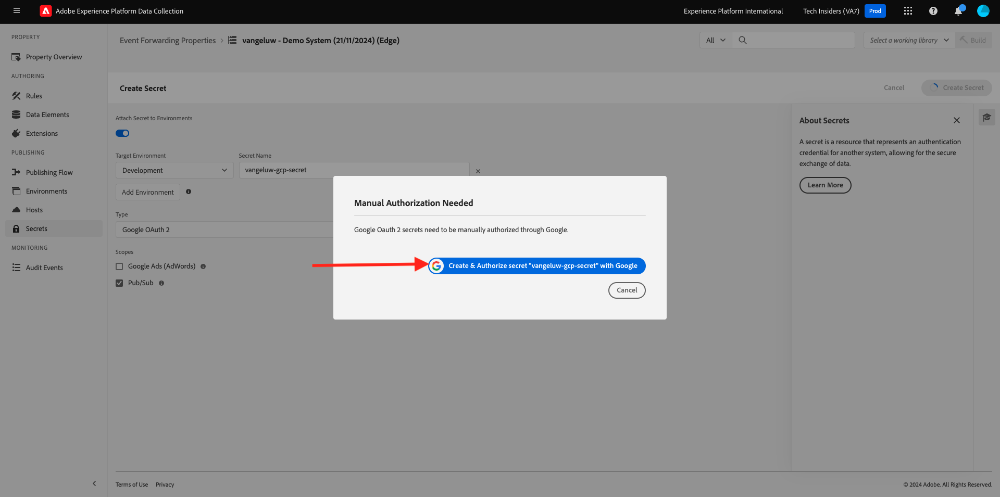
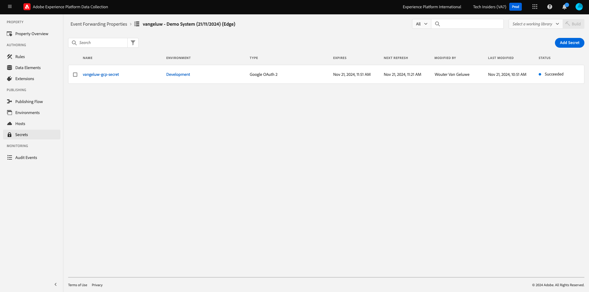
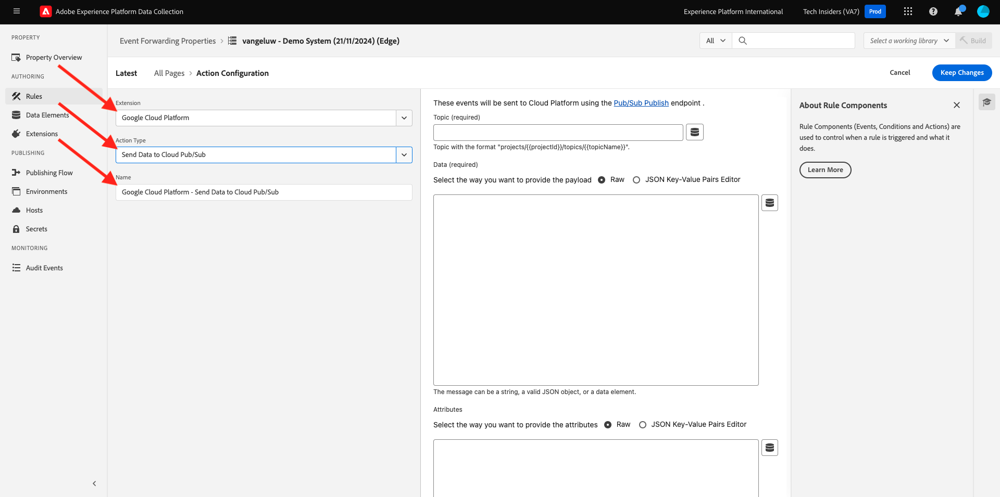
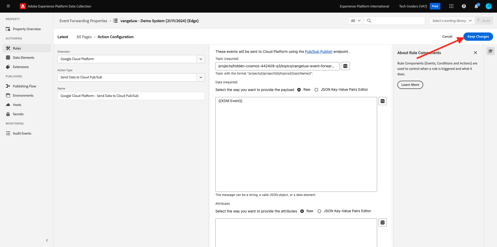

# 2.5.4 Transférer les événements au GCP Pub/Sub

>[!NOTE]
>
>Pour cet exercice, vous devez accéder à un environnement Google Cloud Platform. Si vous n&#39;avez pas encore accès à GCP, créez un compte en utilisant votre adresse e-mail personnelle.

## Création de votre publication/sous-rubrique Google Cloud

Accédez à [https://console.cloud.google.com/](https://console.cloud.google.com/). Dans la barre de recherche, saisissez `pub/sub`. Cliquez sur le résultat de la recherche **Pub/Sub - Global real-time messaging**.

Tu verras ça. Cliquez sur **CRÉER UNE RUBRIQUE**.

Tu verras ça. Pour votre ID de sujet, utilisez `--aepUserLdap---event-forwarding`. Cliquez sur **Créer**.

Votre rubrique est maintenant créée. Cliquez sur le sujet **ID d’abonnement**.

Tu verras ça. Copiez le **nom du sujet** dans le presse-papiers et enregistrez-le, car vous en aurez besoin dans les exercices suivants.

Accédons maintenant à Transfert d’événement de la collecte de données Adobe Experience Platform pour mettre à jour votre propriété Transfert d’événement afin de commencer à transférer les événements vers Pub/Sub.

## Mettez à jour votre propriété Transfert d’événement : Secrets

**Secrets** dans les propriétés de transfert d’événement sont utilisés pour stocker les informations d’identification qui seront utilisées pour s’authentifier sur les API externes. Dans cet exemple, vous devez configurer un secret pour stocker votre jeton OAuth de Google Cloud Platform, qui sera utilisé pour s’authentifier lors de l’utilisation de Pub/Sub pour diffuser des données vers GCP.

Accédez à [https://experience.adobe.com/#/data-collection/](https://experience.adobe.com/#/data-collection/) puis à **Secrets**. Cliquez sur **Créer un secret**.

Tu verras ça. Suivez ces instructions :

- Nom : use `--aepUserLdap---gcp-secret`
- Environnement cible : sélectionnez **Développement**
- Type : **Google OAuth 2**
- Cochez la case **Pub/Sub**

Cliquez sur **Créer un secret**.

Après avoir cliqué sur **Créer un secret**, une fenêtre contextuelle s’affiche pour configurer l’authentification entre le secret de votre propriété de transfert d’événement et Google. Cliquez sur **Créer et autoriser des `--aepUserLdap---gcp-secret` secrètes avec Google**.

Cliquez pour sélectionner votre compte Google.

Cliquez sur **Continuer**.

>[!NOTE]
>
>Votre message contextuel peut varier. Veuillez autoriser/autoriser l’accès demandé afin de poursuivre l’exercice.

Une fois l’authentification réussie, voici ce que vous verrez.

Votre secret est maintenant configuré avec succès et peut être utilisé dans un élément de données.

## Mettez à jour votre propriété Transfert d’événement : Élément de données

Pour utiliser votre secret dans votre propriété Transfert d’événement, vous devez créer un élément de données qui stockera la valeur du secret.

Accédez à [https://experience.adobe.com/#/data-collection/](https://experience.adobe.com/#/data-collection/) puis à **Transfert d’événement**. Recherchez votre propriété Transfert d’événement et cliquez dessus pour l’ouvrir.

Dans le menu de gauche, accédez à **Éléments de données**. Cliquez sur **Ajouter un élément de données**.

Configurez votre élément de données comme suit :

- Nom : **Secret GCP**
- Extension : **Core**
- Type D’Élément De Données : **Secret**
- Secret de développement : sélectionnez le secret que vous avez créé, nommé `--aepUserLdap---gcp-secret`

Cliquez sur **Enregistrer**.

## Mettez à jour votre propriété Transfert d’événement : Extension

Une fois votre secret et votre élément de données configurés, vous pouvez configurer l’extension de la plateforme cloud Google dans votre propriété Transfert d’événement.

Accédez à [https://experience.adobe.com/#/data-collection/](https://experience.adobe.com/#/data-collection/), accédez à **Transfert d’événement** et ouvrez votre propriété Transfert d’événement.

Ensuite, accédez à **Extensions**, à **Catalogue**. Cliquez sur l’extension **Google Cloud Platform**, puis sur **Installer**.

Tu verras ça. Cliquez sur l’icône Élément de données .

Sélectionnez l’élément de données que vous avez créé dans l’exercice précédent, qui est nommé **Secret GCP**. Cliquez sur **Sélectionner**.

Tu verras ça. Cliquez sur **Enregistrer**.

## Mettre à jour votre propriété Transfert d’événement : mettre à jour une règle

Maintenant que votre extension Google Cloud Platform est configurée, vous pouvez définir une règle pour commencer à transférer les données d’événement vers votre rubrique Pub/Sub. Pour ce faire, vous devez mettre à jour la règle **Toutes les pages** que vous avez créée dans l’un des exercices précédents.

Dans le menu de gauche, accédez à **Règles**. Dans l’exercice précédent, vous avez créé la règle **Toutes les pages**. Cliquez sur cette règle pour l’ouvrir.

Tu feras ça. Cliquez sur l’icône **+** sous **Actions** pour ajouter une nouvelle action.

Tu verras ça. Effectuez la sélection suivante :

- Sélectionnez l’**Extension** : **Google Cloud Platform**.
- Sélectionnez le **Type d’action** : **Envoyer les données à Cloud Pub/Sub**.

Cela devrait vous donner le **Nom** suivant : **Plateforme cloud Google - Envoyer les données à Cloud Pub/Sub**. Vous devriez maintenant voir ceci :

Vous devez maintenant configurer la rubrique Pub/Sub que vous avez créée précédemment.

Vous pouvez trouver le **nom du sujet** ici, puis le copier.

Collez le **nom de la rubrique** dans votre configuration de règle. Cliquez ensuite sur l’icône de l’élément de données en regard du champ **Données (obligatoire)**.

Sélectionnez **Événement XDM** et cliquez sur **Sélectionner**.

Tu verras ça. Cliquez sur **Conserver les modifications**.

Cliquez sur **Enregistrer**.

Tu verras ça.

## Publier vos modifications

Votre configuration est maintenant terminée. Accédez à **Flux de publication** pour publier vos modifications. Ouvrez votre bibliothèque de développement **Principal** en cliquant sur **Modifier** comme indiqué.

Cliquez sur le bouton **Ajouter toutes les ressources modifiées**, après quoi votre règle et votre élément de données apparaîtront dans cette bibliothèque. Cliquez ensuite sur **Enregistrer et créer pour développement**. Vos modifications sont en cours de déploiement.

Au bout de quelques minutes, vous verrez que le déploiement est terminé et prêt à être testé.

## Tester votre configuration

Accédez à [https://dsn.adobe.com](https://dsn.adobe.com). Après vous être connecté avec votre Adobe ID, voici ce que vous verrez. Cliquez sur le **de 3 points...** sur le projet de votre site web, puis cliquez sur **Exécuter** pour l’ouvrir.

Vous verrez ensuite votre site web de démonstration s’ouvrir. Sélectionnez l’URL et copiez-la dans le presse-papiers.

Ouvrez une nouvelle fenêtre de navigateur en mode privé.

Collez l’URL de votre site web de démonstration, que vous avez copiée à l’étape précédente. Il vous sera ensuite demandé de vous connecter à l’aide de votre Adobe ID.

Sélectionnez votre type de compte et terminez le processus de connexion.

Votre site web est alors chargé dans une fenêtre de navigateur en mode privé. Pour chaque exercice, vous devrez utiliser une nouvelle fenêtre de navigateur en mode privé pour charger l’URL de votre site web de démonstration.

Basculez votre vue sur votre Google Cloud Pub/Sub et accédez à **MESSAGES**. Cliquez sur **EXTRAIRE** et au bout de quelques secondes, vous verrez des messages dans la liste. Cliquez sur un message pour visualiser son contenu.

Vous pouvez désormais voir la payload XDM de votre événement dans Google Pub/Sub. Vous avez maintenant envoyé avec succès les données collectées par la collecte de données Adobe Experience Platform, en temps réel, vers un point d’entrée Google Cloud Pub/Sub. De là, ces données peuvent être utilisées par n’importe quelle application Google Cloud Platform, telle que BigQuery pour le stockage et les rapports ou pour les cas d’utilisation de machine learning.

## Étapes suivantes

Accédez à [2.5.5 Transférer les événements vers AWS Kinesis et AWS S3](./ex5.md){target="_blank"}

Revenez à [Connexions Real-Time CDP : transfert d’événement](./aep-data-collection-ssf.md){target="_blank"}

Revenir à [Tous les modules](./../../../../overview.md){target="_blank"}
