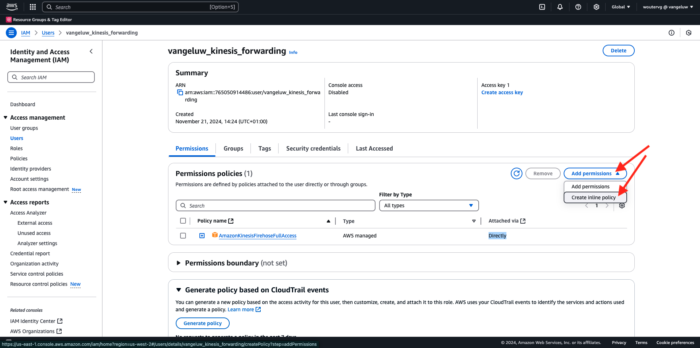
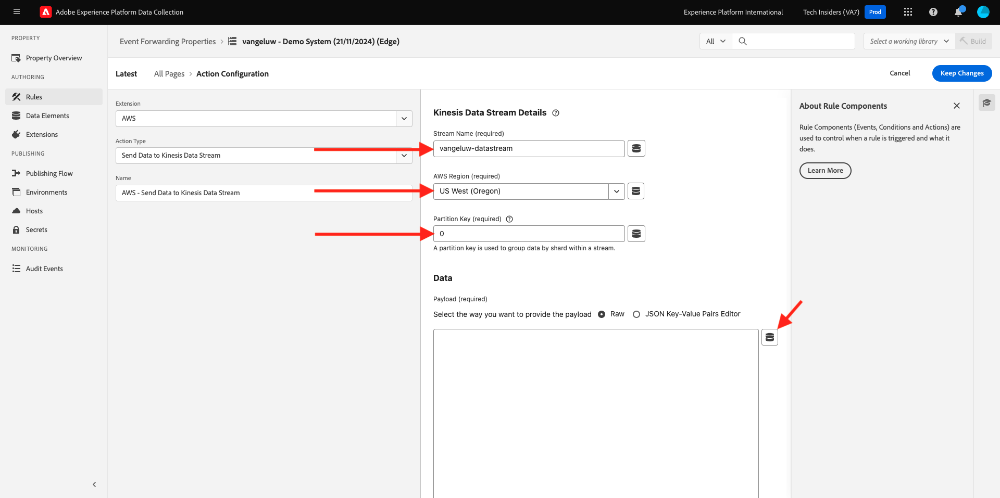

# 2.5.5 Transfert d’événements vers AWS Kinesis et AWS S3

>[!IMPORTANT]
>
>La réalisation de cet exercice est facultative et un coût est impliqué dans l’utilisation d’AWS Kinesis. Alors qu’AWS propose un compte de niveau gratuit qui vous permet de tester et de configurer de nombreux services sans frais, AWS Kinesis ne fait pas partie de ce compte de niveau gratuit. Afin de mettre en œuvre et de tester cet exercice, l’utilisation d’AWS Kinesis entraînera des coûts.

## Bon à savoir

Adobe Experience Platform prend en charge divers services Amazon en tant que destination.
Kinesis et S3 sont toutes deux des [destinations d’exportation de profils](https://experienceleague.adobe.com/docs/experience-platform/destinations/destination-types.html?lang=fr) et peuvent être utilisées dans le cadre de Adobe Experience Platform Real-Time CDP.
Vous pouvez facilement alimenter les systèmes de votre choix en événements de segment à forte valeur ajoutée et en attributs de profil associés.

Dans cet exercice, vous apprendrez à configurer votre propre flux Amazon Kinesis pour diffuser des données d’événement provenant de l’écosystème Adobe Experience Platform Edge vers une destination d’espace de stockage, telle qu’Amazon S3. Cela s’avère utile si vous souhaitez collecter des événements d’expérience à partir de propriétés web et mobiles et les intégrer à votre lac de données pour analyse et création de rapports opérationnels. Les jeux de données ingèrent généralement les données par lots avec d’importantes importations de fichiers quotidiennes. Ils n’exposent pas de point d’entrée HTTP public qui peut être utilisé conjointement avec le transfert d’événement.

La prise en charge des cas d’utilisation ci-dessus implique que les données diffusées doivent être mises en mémoire tampon ou placées dans une file d’attente avant d’être écrites dans un fichier. Veillez à ne pas ouvrir de fichier pour l’accès en écriture sur plusieurs processus. Déléguer cette tâche à un système dédié est idéal pour s&#39;adapter parfaitement tout en assurant un niveau de service élevé, c&#39;est là que Kinesis vient à la rescousse.

Amazon Kinesis Data Streams se concentre sur l’ingestion et le stockage des flux de données. Kinesis Data Firehouse se concentre sur la diffusion de flux de données vers des destinations sélectionnées, telles que les compartiments S3.

Dans le cadre de cet exercice, vous allez...

- Effectuer une configuration de base d’un flux de données Kinesis
- Créer un flux de diffusion Firehouse et utiliser le compartiment S3 comme destination
- Configurez la passerelle API Amazon en tant que point d’entrée de l’API REST pour recevoir vos données d’événement
- Transférer les données brutes d’événement d’Adobe Edge vers votre flux Kinesis

## Configurer votre compartiment AWS S3

Accédez à [https://console.aws.amazon.com](https://console.aws.amazon.com) et connectez-vous avec votre compte Amazon.

Après vous être connecté, vous serez redirigé vers la **console de gestion AWS**.

Dans le menu **Rechercher des services**, recherchez **s3**. Cliquez sur le premier résultat de la recherche : **S3 - Scalable Storage in the Cloud**.

Vous verrez alors la page d’accueil **Amazon S3**. Cliquez sur **Créer un compartiment**.

Dans l’écran **Créer un compartiment**, vous devez configurer deux éléments :

- Nom : utilisez le nom `eventforwarding---aepUserLdap--`.

Gardez tous les autres paramètres par défaut tels quels. Faites défiler vers le bas et cliquez sur **Créer un compartiment**.

Votre compartiment est alors en cours de création et est redirigé vers la page d’accueil S3 d’Amazon.

## Configurer votre flux de données AWS Kinesis

Dans le menu **Rechercher des services**, recherchez **kinesis**. Cliquez sur le premier résultat de la recherche : **Kinesis - Utilisation des données de streaming en temps réel**.

Sélectionnez **Flux de données Kinesis**. Cliquez sur **Créer un flux de données**.

Pour le **nom du flux de données**, utilisez `--aepUserLdap---datastream`.

Il n’est pas nécessaire de modifier les autres paramètres. Faites défiler vers le bas et cliquez sur **Créer un flux de données**.

Tu verras ça. Une fois votre flux de données créé, vous pouvez passer à l’exercice suivant.

## Configurer votre flux de diffusion de Firehouse AWS

Dans le menu **Rechercher des services**, recherchez **kinesis**. Cliquez sur **Kinesis Data Firehose**.

Cliquez sur **Créer un flux Firehose**.

Pour **Source**, sélectionnez **Flux de données Amazon Kinesis**. Pour **Destination**, sélectionnez **Amazon S3**. Cliquez sur **Parcourir** pour sélectionner votre flux de données.

Sélectionnez votre flux de données. Cliquez sur **Choisir**.

Tu verras ça. Mémorisez le **nom du flux Firehose** car vous en aurez besoin plus tard.

Faites défiler vers le bas jusqu’à afficher **Paramètres de destination**. Cliquez sur **Parcourir** pour sélectionner votre compartiment S3.

Sélectionnez votre compartiment S3 et cliquez sur **Choisir**.

Vous verrez alors quelque chose comme ceci. Mettez à jour les paramètres suivants :

- Nouveau délimiteur de ligne : défini sur **Activé**
- Partitionnement dynamique : défini sur **Non activé**

Faites défiler l’écran vers le bas et cliquez sur **Créer un flux Firehose**

Après quelques minutes, votre flux Firehose sera créé et **Actif**.

## Créer un utilisateur IAM

Dans le menu IAM d’AWS de gauche, cliquez sur **Utilisateurs**. L’écran **Utilisateurs** s’affiche alors. Cliquez sur **Créer un utilisateur**.

Configurez ensuite votre utilisateur ou utilisatrice :

- Nom d’utilisateur : utilisez `--aepUserLdap--_kinesis_forwarding`

Cliquez sur **Suivant**.

Cet écran d’autorisations s’affiche alors. Cliquez sur **Joindre directement des politiques**.

Saisissez le terme de recherche **kinesisfirehose** pour afficher toutes les politiques associées. Sélectionnez la politique **AmazonKinesisFirehoseFullAccess**. Faites défiler vers le bas et cliquez sur **Suivant**.

Vérifiez votre configuration. Cliquez sur **Créer un utilisateur**.

Tu verras ça. Cliquez sur **Afficher utilisateur**.

Cliquez sur **Ajouter des autorisations** puis sur **Créer une politique intégrée**.

Tu verras ça. Sélectionnez le service **Kinesis**.

Accédez à **Write** et cochez la case correspondant à **PutRecord**.

Faites défiler jusqu’à **Ressources** et sélectionnez **Tout**. Cliquez sur **Suivant**.

Nommez votre politique comme suit : **Kinesis_PutRecord**, puis cliquez sur **Créer une politique**.

Tu verras ça. Cliquez sur **Informations d’identification de sécurité**.

Cliquez sur **Créer une clé d’accès**.

Sélectionnez **Application s’exécutant en dehors d’AWS**. Faites défiler vers le bas et cliquez sur **Suivant**.

Cliquez sur **Créer une clé d’accès**

Tu verras ça. Cliquez sur **Afficher** pour afficher votre clé d’accès secrète :

Votre **clé d’accès secrète** s’affiche maintenant.

>[!IMPORTANT]
>
>Stockez vos informations d’identification dans un fichier texte sur votre ordinateur.
>
> - ID de clé d&#39;accès : ...
> - Clé d’accès secrète : ...
>
> Une fois que vous aurez cliqué sur **Terminé** vos informations d’identification ne s’afficheront plus.

Cliquez sur **Terminé**.

Vous avez maintenant créé un utilisateur IAM avec les autorisations appropriées, que vous devrez spécifier lors de la configuration de l’extension AWS dans votre propriété Transfert d’événement.

## Mettez à jour votre propriété Transfert d’événement : Extension

Une fois votre secret et votre élément de données configurés, vous pouvez configurer l’extension de la plateforme cloud Google dans votre propriété Transfert d’événement.

Accédez à [https://experience.adobe.com/#/data-collection/](https://experience.adobe.com/#/data-collection/), accédez à **Transfert d’événement** et ouvrez votre propriété Transfert d’événement.

Ensuite, accédez à **Extensions**, à **Catalogue**. Cliquez sur l’extension **AWS**, puis sur **Installer**.

Saisissez les informations d’identification de l’utilisateur IAM que vous avez générées dans l’exercice précédent. Cliquez sur **Enregistrer**.

Ensuite, vous devez configurer une règle qui lance le transfert de données d’événement vers Kinesis.

## Mettez à jour votre propriété Transfert d’événement : Règle

Dans le menu de gauche, accédez à **Règles**. Cliquez pour ouvrir la règle **Toutes les pages** que vous avez créée dans l’un des exercices précédents.

Tu verras ça. Cliquez sur l’icône **+** pour ajouter une nouvelle action.

Tu verras ça. Effectuez la sélection suivante :

- Sélectionnez l’**Extension** : **AWS**
- Sélectionnez le **Type d’action** : **Envoyer les données au flux de données Kinesis**
- Nom : **AWS - Envoyer des données au flux de données Kinesis**

Vous devriez maintenant voir ceci :

Configurez ensuite les éléments suivants :

- Nom du flux : `--aepUserLdap---datastream`
- Région AWS : vérifiez votre région dans la configuration de votre flux de données AWS.
- Clé de partition : **0**

Votre région AWS est visible ici :

Vous devriez maintenant avoir ceci. Cliquez ensuite sur l’icône de l’élément de données pour le champ **Données**.

Sélectionnez **Événement XDM** et cliquez sur **Sélectionner**.

Tu auras alors ceci. Cliquez sur **Conserver les modifications**.

Tu verras ça. Cliquez sur **Enregistrer**.

Accédez à **Flux de publication** pour publier vos modifications.
Ouvrez votre bibliothèque de développement en cliquant sur **Principal**.

Cliquez sur le bouton **Ajouter toutes les ressources modifiées**, après quoi les modifications apportées aux règles et aux éléments de données apparaîtront dans cette bibliothèque. Cliquez ensuite sur **Enregistrer et créer pour développement**. Vos modifications sont en cours de déploiement.

Au bout de quelques minutes, vous verrez que le déploiement est terminé et prêt à être testé.

## Tester votre configuration

Accédez à [https://dsn.adobe.com](https://dsn.adobe.com). Après vous être connecté avec votre Adobe ID, voici ce que vous verrez. Cliquez sur le **de 3 points...** sur le projet de votre site web, puis cliquez sur **Exécuter** pour l’ouvrir.

Vous verrez ensuite votre site web de démonstration s’ouvrir. Sélectionnez l’URL et copiez-la dans le presse-papiers.

Ouvrez une nouvelle fenêtre de navigateur en mode privé.

Collez l’URL de votre site web de démonstration, que vous avez copiée à l’étape précédente. Il vous sera ensuite demandé de vous connecter à l’aide de votre Adobe ID.

Sélectionnez votre type de compte et terminez le processus de connexion.

Votre site web est alors chargé dans une fenêtre de navigateur en mode privé. Pour chaque exercice, vous devrez utiliser une nouvelle fenêtre de navigateur en mode privé pour charger l’URL de votre site web de démonstration.

Basculez votre vue sur **AWS**. En ouvrant votre flux de données et en accédant à l’onglet **Surveillance**, vous verrez désormais le trafic entrant.

Lorsque vous ouvrez ensuite votre flux Data Firehouse et accédez à l’onglet **Surveillance**, vous verrez également le trafic entrant.

Enfin, lorsque vous examinerez votre compartiment S3, vous remarquerez désormais que des fichiers y sont créés suite à l’ingestion de vos données.

Lorsque vous téléchargez un tel fichier et que vous l’ouvrez à l’aide d’un éditeur de texte, vous verrez qu’il contient la payload XDM des événements qui ont été transférés.

>[!IMPORTANT]
>
>Une fois que votre configuration fonctionne comme prévu, n’oubliez pas de désactiver votre flux de données AWS Kinesis et votre pare-feu de données pour éviter d’être chargé !

## Étapes suivantes

Accédez à [&#x200B; Résumé et avantages &#x200B;](./summary.md){target="_blank"}

Revenez à [Connexions Real-Time CDP : transfert d’événement](./aep-data-collection-ssf.md){target="_blank"}

Revenir à [Tous les modules](./../../../../overview.md){target="_blank"}
