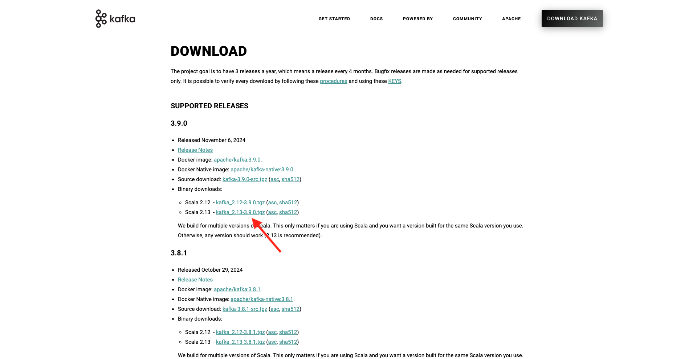
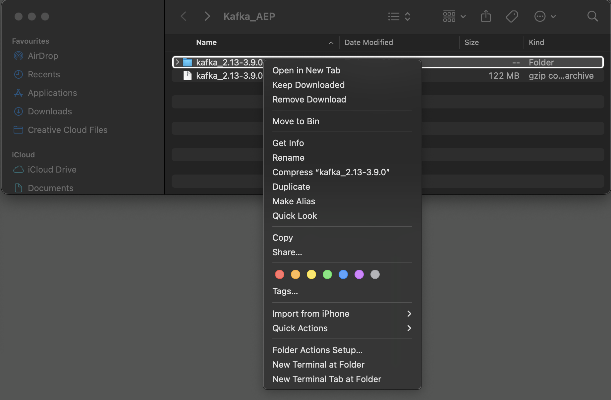
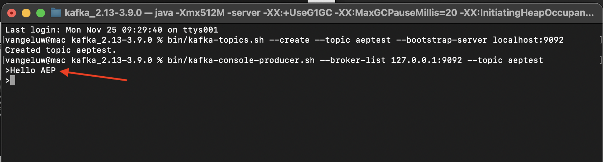
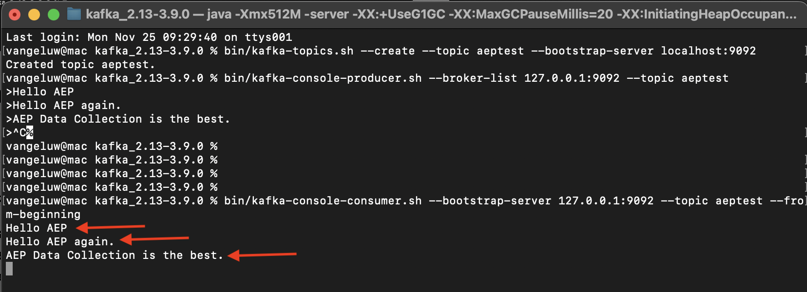

# 2.6.2 Installation et configuration de votre cluster Kafka

## Télécharger Apache Kafka

Accédez à [https://kafka.apache.org/downloads](https://kafka.apache.org/downloads) et téléchargez la dernière version publiée. Sélectionnez la dernière version binaire, dans ce cas **3.9.0**. Votre téléchargement va commencer.

Créez un dossier nommé **Kafka_AEP** sur votre bureau et placez le fichier téléchargé dans ce répertoire.

Ouvrez une fenêtre **Terminal** en cliquant avec le bouton droit sur votre dossier et en cliquant sur **Nouveau terminal dans le dossier**.

Exécutez cette commande dans la fenêtre de votre terminal pour décompresser le fichier téléchargé :

`tar -xvf kafka_2.13-3.9.0.tgz`

>[!NOTE]
>
>Vérifiez que la commande ci-dessus correspond à la version du fichier que vous avez téléchargé. Si votre version est plus récente, vous devrez mettre à jour la commande ci-dessus pour qu’elle corresponde à cette version.

Vous verrez alors ceci :

Après avoir décompressé ce fichier, vous disposez désormais d’un répertoire comme celui-ci :

Et dans ce répertoire, vous verrez les sous-répertoires suivants :

Revenez à la fenêtre Terminal. Saisissez la commande suivante :

`cd kafka_2.13-3.9.0`

>[!NOTE]
>
>Vérifiez que la commande ci-dessus correspond à la version du fichier que vous avez téléchargé. Si votre version est plus récente, vous devrez mettre à jour la commande ci-dessus pour qu’elle corresponde à cette version.

Saisissez ensuite la `bin/kafka-topics.sh` de commande.

Vous devriez alors voir cette réponse. Cela signifie que Kafka est correctement installé et que Java fonctionne correctement. (Rappel : pour que cela fonctionne, Java 23 JDK doit être installé. Vous pouvez voir quelle version Java vous avez installée à l’aide de la commande `java -version`.)

## Démarrer Kafka

Pour démarrer Kafka, vous devez démarrer Kafka Zookeeper et Kafka, dans cet ordre.

Ouvrez une fenêtre **Terminal** en cliquant avec le bouton droit sur votre dossier **kafka_2.13-3.9.0** et en cliquant sur **Nouveau terminal dans le dossier**.

Saisissez la commande suivante :

`bin/zookeeper-server-start.sh config/zookeeper.properties`

Vous verrez alors ceci :

Gardez cette fenêtre ouverte pendant que vous faites ces exercices !

Ouvrez une autre fenêtre **Terminal** en cliquant avec le bouton droit sur votre dossier **kafka_2.13-3.9.0** et en cliquant sur **Nouveau terminal dans le dossier**.

Saisissez la commande suivante :

`bin/kafka-server-start.sh config/server.properties`

Vous verrez alors ceci :

Gardez cette fenêtre ouverte pendant que vous faites ces exercices !

## Créer une rubrique Kafka

Ouvrez une fenêtre **Terminal** en cliquant avec le bouton droit sur votre dossier **kafka_2.13-3.9.0** et en cliquant sur **Nouveau terminal dans le dossier**.

Saisissez cette commande pour créer une nouvelle rubrique Kafka nommée **aeptest**. Cette rubrique sera utilisée à des fins de test dans cet exercice.

`bin/kafka-topics.sh --create --topic aeptest --bootstrap-server localhost:9092`

Une confirmation s’affiche ensuite :

Saisissez cette commande pour créer une nouvelle rubrique Kafka nommée **aep**. Cette rubrique sera utilisée par le connecteur de récepteur Adobe Experience Platform que vous allez configurer dans les exercices suivants.

`bin/kafka-topics.sh --create --topic aep --bootstrap-server localhost:9092`

Une confirmation similaire s’affiche ensuite :

## Produire des événements

Revenez à la fenêtre Terminal dans laquelle vous avez créé votre première rubrique Kafka et saisissez la commande suivante :

`bin/kafka-console-producer.sh --broker-list 127.0.0.1:9092 --topic aeptest`

Tu verras ça. Chaque nouvelle ligne suivie du bouton Entrée entraîne l’envoi d’un nouveau message dans la rubrique **aeptest**.

Saisissez `Hello AEP` et appuyez sur Entrée. Votre premier événement a maintenant été envoyé à votre instance Kafka locale, dans la rubrique **aeptest**.

Saisissez `Hello AEP again.` et appuyez sur Entrée.

Saisissez `AEP Data Collection is the best.` et appuyez sur Entrée.

Vous avez maintenant produit 3 événements dans le sujet **aeptest**. Ces événements peuvent désormais être utilisés par une application qui peut avoir besoin de ces données.

Sur votre clavier, cliquez sur `Control` et `C` en même temps pour fermer votre producteur.

## Consommer des événements

Dans la même fenêtre Terminal que celle utilisée pour générer les événements, saisissez la commande suivante :

`bin/kafka-console-consumer.sh --bootstrap-server 127.0.0.1:9092 --topic aeptest --from-beginning`

Tous les messages générés dans l’exercice précédent pour le sujet **aeptest** s’affichent alors dans l’écran du client. Voici comment fonctionne Apache Kafka : un producteur crée des événements dans un pipeline et un consommateur consomme ces événements.

Sur votre clavier, cliquez sur `Control` et `C` en même temps pour fermer votre producteur.

Dans cet exercice, vous avez parcouru toutes les bases pour configurer un cluster Kafka local, créer un sujet Kafka, produire des événements et consommer des événements.

L’objectif de ce module est de simuler ce qui se passerait si une organisation réelle avait déjà implémenté un cluster Apache Kafka et souhaitait diffuser des données de son cluster Kafka vers Adobe Experience Platform.

Pour faciliter une telle implémentation, un connecteur de récepteur Adobe Experience Platform a été créé, qui peut être implémenté à l’aide de Kafka Connect. Vous trouverez la documentation de ce connecteur de récepteur Adobe Experience Platform ici : [https://github.com/adobe/experience-platform-streaming-connect](https://github.com/adobe/experience-platform-streaming-connect).

Dans les exercices suivants, vous implémenterez tout ce dont vous avez besoin pour utiliser ce connecteur de récepteur Adobe Experience Platform à partir de votre propre cluster Kafka local.

Fermez la fenêtre de votre terminal.

Vous avez terminé cet exercice.

## Étapes suivantes

Accédez à [2.6.3 Configuration du point d’entrée de l’API HTTP dans Adobe Experience Platform](./ex3.md){target="_blank"}

Revenez à [Diffuser des données d’Apache Kafka vers Adobe Experience Platform](./aep-apache-kafka.md){target="_blank"}

Revenir à [Tous les modules](./../../../../overview.md){target="_blank"}
