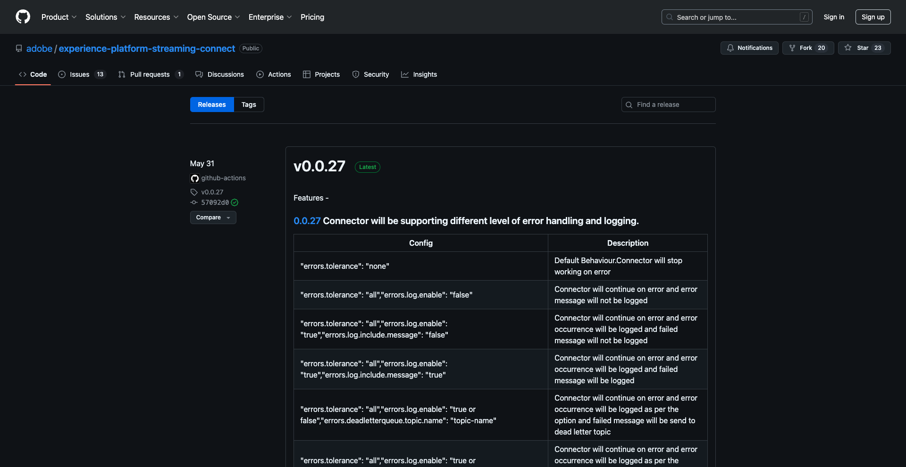
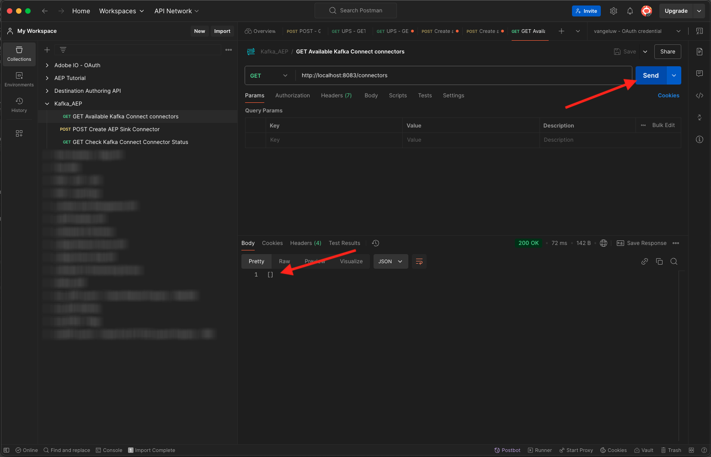
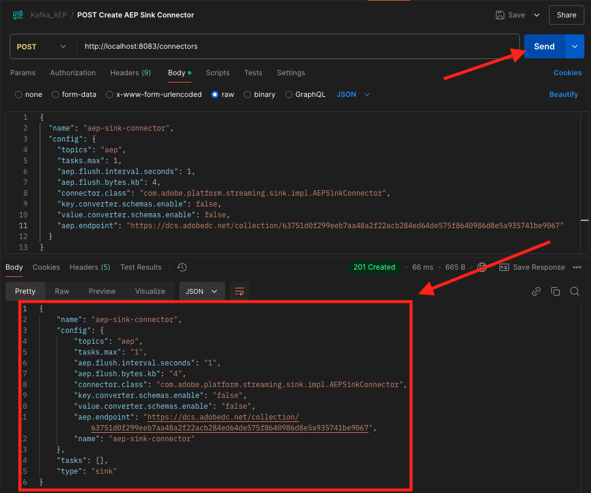

# 2.6.4 Installation et configuration de Kafka Connect et du connecteur de récepteur Adobe Experience Platform

## Téléchargement du connecteur de récepteur Adobe Experience Platform

Accédez à [https://github.com/adobe/experience-platform-streaming-connect/releases](https://github.com/adobe/experience-platform-streaming-connect/releases) et téléchargez la dernière version officielle du connecteur de récepteur Adobe Experience Platform.



Téléchargez le fichier **streaming-connect-sink-0.0.27-java-11.jar**.


Placez le fichier de téléchargement **streaming-connect-sink-0.0.27-java-11.jar** sur votre bureau.


## Configurer Kafka Connect

Accédez au dossier sur votre bureau nommé **Kafka_AEP** et accédez au dossier `kafka_2.13-3.9.0/config`.
Dans ce dossier, ouvrez le fichier **connect-published.properties** à l’aide d’un éditeur de texte.


Dans l’éditeur de texte, accédez aux lignes 34 et 35 et veillez à définir les champs `key.converter.schemas.enable` et `value.converter.schemas.enable` sur `false`

```json
key.converter.schemas.enable=false
value.converter.schemas.enable=false
```

Enregistrez vos modifications dans ce fichier.


Ensuite, revenez à la `kafka_2.13-3.1.0` du dossier et créez manuellement un dossier, puis nommez-le `connectors`.


Cliquez avec le bouton droit sur le nouveau dossier et cliquez sur **Nouveau terminal dans Dossier**.


Tu verras ça. Saisissez la `pwd` de commande pour récupérer le chemin d’accès complet de ce dossier. Sélectionnez le chemin d’accès complet et copiez-le dans le presse-papiers.


Revenez à votre éditeur de texte, au fichier **connect-published.properties** et faites défiler l’écran jusqu’à la dernière ligne (ligne 89 de la capture d’écran). Vous devez supprimer les commentaires de la ligne (supprimer `#`) qui commence par `# plugin.path=` et coller le chemin d’accès complet dans le dossier nommé `connectors`. Le résultat doit ressembler à ceci :

`plugin.path=/Users/woutervangeluwe/Desktop/Kafka_AEP/kafka_2.13-3.9.0/connectors`

Enregistrez vos modifications dans le fichier **connect-published.properties** et fermez l’éditeur de texte.


Copiez ensuite la dernière version officielle du connecteur de récepteur Adobe Experience Platform que vous avez téléchargé dans le dossier nommé `connectors`. Le fichier que vous avez téléchargé précédemment est nommé **streaming-connect-sink-0.0.27-java-11.jar**. Il vous suffit de le déplacer dans le dossier `connectors`.


Ouvrez ensuite une nouvelle fenêtre Terminal au niveau du dossier **kafka_2.13-3.9.0**. Cliquez avec le bouton droit sur ce dossier et cliquez sur **Nouveau terminal dans le dossier**.

Dans la fenêtre Terminal , collez la commande suivante : `bin/connect-distributed.sh config/connect-distributed.properties` et cliquez sur **Entrée**. Cette commande démarre Kafka Connect et charge la bibliothèque du connecteur de récepteur Adobe Experience Platform.


Au bout de quelques secondes, vous verrez quelque chose comme ceci :


## Création de votre connecteur de récepteur Adobe Experience Platform à l’aide de Postman

Vous pouvez désormais interagir avec Kafka Connect à l’aide de Postman. Pour ce faire, téléchargez [cette collection Postman](./../../../../assets/postman/postman_kafka.zip) et décompressez-la sur votre ordinateur local sur le bureau. Vous obtiendrez alors un fichier appelé `Kafka_AEP.postman_collection.json`.


Vous devez importer ce fichier dans Postman. Pour ce faire, ouvrez Postman, cliquez sur **Importer**, faites glisser et déposez le fichier `Kafka_AEP.postman_collection.json` dans la fenêtre contextuelle et cliquez sur **Importer**.


Vous retrouverez ensuite cette collection dans le menu de gauche de Postman. Cliquez sur la première demande, **Connecteurs Kafka Connect disponibles pour GET** pour l&#39;ouvrir.


Tu verras ça. Cliquez sur le bouton bleu **Envoyer**, après quoi vous devriez voir un `[]` de réponse vide. La réponse vide est due au fait qu&#39;aucun connecteur Kafka Connect n&#39;est actuellement défini.



Pour créer un connecteur, cliquez sur pour ouvrir la deuxième requête de la collection Kafka, **POST Créer un connecteur d’évier AEP** et accédez à **Corps**. Tu verras ça. À la ligne 11, où il est indiqué **« aep.endpoint » : « »**, vous devez coller l’URL du point d’entrée de flux continu d’API HTTP que vous avez reçue à la fin de l’un des exercices précédents. L’URL du point d’entrée de flux continu d’API HTTP ressemble à ceci : `https://dcs.adobedc.net/collection/63751d0f299eeb7aa48a2f22acb284ed64de575f8640986d8e5a935741be9067`.


Après l’avoir collé, le corps de votre requête doit ressembler à ceci. Cliquez sur le bouton bleu **Envoyer** pour créer votre connecteur. Vous obtiendrez une réponse immédiate à la création de votre connecteur.



Cliquez sur la première demande, **Connecteurs Kafka Connect disponibles pour GET** pour l&#39;ouvrir à nouveau et cliquez sur le bouton bleu **Envoyer**. vous verrez maintenant qu&#39;il existe un connecteur Kafka Connect.


Ouvrez ensuite la troisième requête de la collection Kafka, **GET Check Kafka Connect Connector Status**. Cliquez sur le bouton bleu **Envoyer**, vous obtiendrez ensuite une réponse similaire à celle ci-dessous, indiquant que le connecteur est en cours d’exécution.


## Génération d’un événement d’expérience

Ouvrez une nouvelle fenêtre **Terminal** en cliquant avec le bouton droit sur votre dossier **kafka_2.13-3.9.0** et en cliquant sur **Nouveau terminal dans le dossier**.


Saisissez la commande suivante :

`bin/kafka-console-producer.sh --broker-list 127.0.0.1:9092 --topic aep`

Tu verras ça. Chaque nouvelle ligne suivie du bouton Entrée entraîne l’envoi d’un nouveau message dans la rubrique **aep**.


Vous pouvez désormais envoyer un message, qui sera consommé par le connecteur de récepteur Adobe Experience Platform et qui sera ingéré dans Adobe Experience Platform en temps réel.

Prenez l’exemple de payload d’événement d’expérience ci-dessous et copiez-le dans un éditeur de texte.

```json
{
  "header": {
    "datasetId": "61fe23fd242870194a6d779c",
    "imsOrgId": "--aepImsOrgID--",
    "source": {
      "name": "Launch"
    },
    "schemaRef": {
      "id": "https://ns.adobe.com/experienceplatform/schemas/b0190276c6e1e1e99cf56c99f4c07a6e517bf02091dcec90",
      "contentType": "application/vnd.adobe.xed-full+json;version=1"
    }
  },
  "body": {
    "xdmMeta": {
      "schemaRef": {
        "id": "https://ns.adobe.com/experienceplatform/schemas/b0190276c6e1e1e99cf56c99f4c07a6e517bf02091dcec90",
        "contentType": "application/vnd.adobe.xed-full+json;version=1"
      }
    },
    "xdmEntity": {
      "eventType": "callCenterInteractionKafka",
      "_id": "",
      "timestamp": "2024-11-25T09:54:12.232Z",
      "_experienceplatform": {
        "identification": {
          "core": {
            "phoneNumber": ""
          }
        },
        "interactionDetails": {
          "core": {
            "callCenterAgent": {
              "callID": "Support Contact - 3767767",
              "callTopic": "contract",
              "callFeeling": "negative"
            }
          }
        }
      }
    }
  }
}
```

Tu verras ça. Vous devez mettre à jour manuellement 2 champs :

- **_id** : définissez-le sur un id aléatoire, par exemple `--aepUserLdap--1234`
- **horodatage** : mettez à jour l’horodatage sur la date et l’heure actuelles
- **phoneNumber** : saisissez le numéro de téléphone du compte qui a été créé précédemment sur le site web de démonstration. Vous pouvez le trouver dans le panneau Visionneuse de profils sous **Identités**.

Vous devez également vérifier et peut-être mettre à jour ces champs :

- **datasetId** : vous devez copier l’ID du jeu de données Système de démonstration - Jeu de données d’événement pour le centre d’appels (global v1.1)


- **imsOrgID** : votre ID d’organisation IMS est `--aepImsOrgId--`

>[!NOTE]
>
>Le champ **_id** doit être unique pour chaque ingestion de données. Si vous générez plusieurs événements, veillez à mettre à jour le champ **_id** à chaque fois avec une nouvelle valeur unique.

Vous devriez alors disposer de l’élément suivant :


Copiez ensuite votre événement d’expérience complet dans le presse-papiers. L’espace blanc de votre payload JSON doit être supprimé et nous utiliserons un outil en ligne pour ce faire. Accédez à [http://jsonviewer.stack.hu/](http://jsonviewer.stack.hu/) pour ce faire.

Collez votre événement d’expérience dans l’éditeur, puis cliquez sur **Supprimer l’espace blanc**.


Sélectionnez ensuite tout le texte de sortie et copiez-le dans le presse-papiers.


Revenez à la fenêtre Terminal.


Collez la nouvelle payload sans espaces dans la fenêtre Terminal et cliquez sur **Entrée**.


Ensuite, revenez à votre site web de démonstration et actualisez la page. Vous devriez maintenant voir un événement d’expérience sur votre profil, sous **Événements d’expérience**, comme celui ci-dessous :


>[!NOTE]
>
>Si vous souhaitez que vos interactions de centre d’appels apparaissent dans le panneau Visionneuse de profils, vous devez ajouter le libellé et le filtre ci-dessous dans votre projet sur [https://dsn.adobe.com](https://dsn.adobe.com), en accédant à l’onglet **Visionneuse de profils** et en ajoutant une nouvelle ligne sous **Événements**, avec les variables suivantes :
>- **Libellé Type d’événement** : Interactions du centre d’appels
>- **Filtre de type d’événement** : callCenterInteractionKafka
>- **Titre** : `--aepTenantId--.interactionDetails.core.callCenterAgent.callID`


Vous avez terminé cet exercice.

## Étapes suivantes

Revenez à [Diffuser des données d’Apache Kafka vers Adobe Experience Platform](./aep-apache-kafka.md){target="_blank"}

Revenir à [Tous les modules](./../../../../overview.md){target="_blank"}
