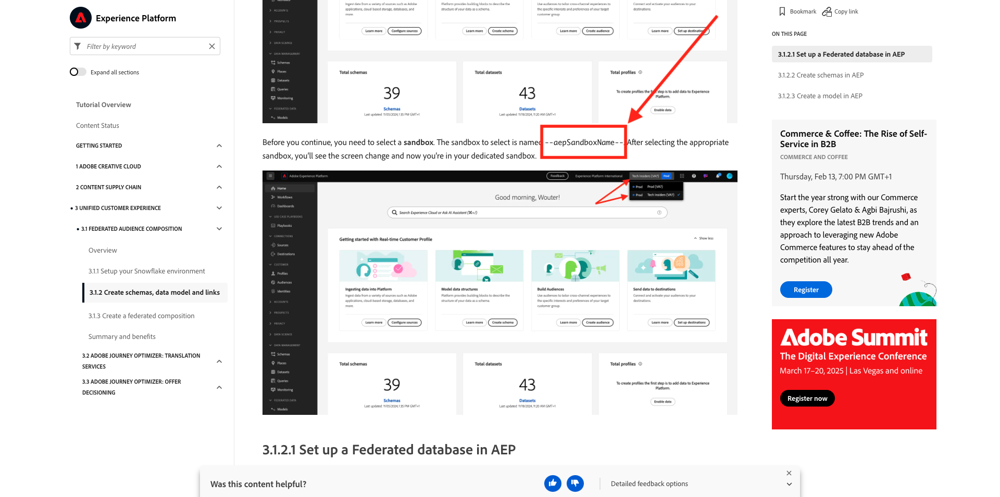
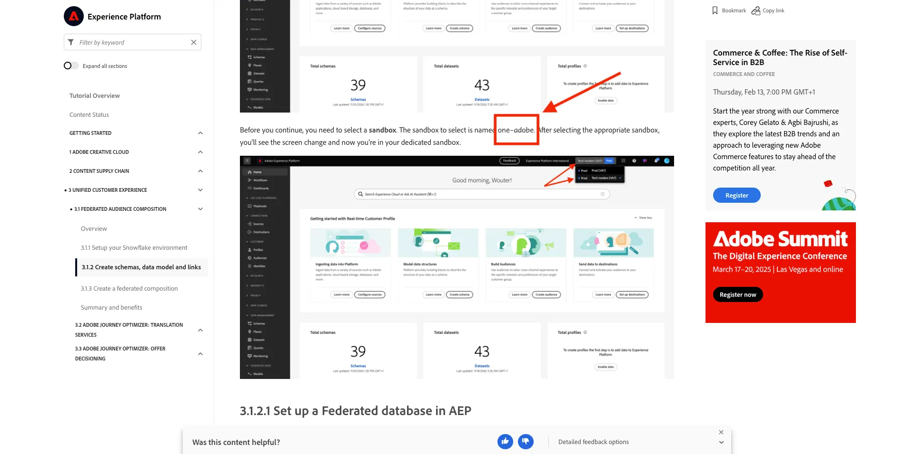
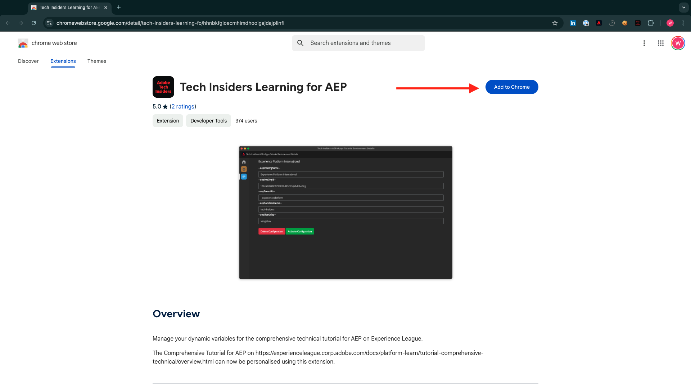
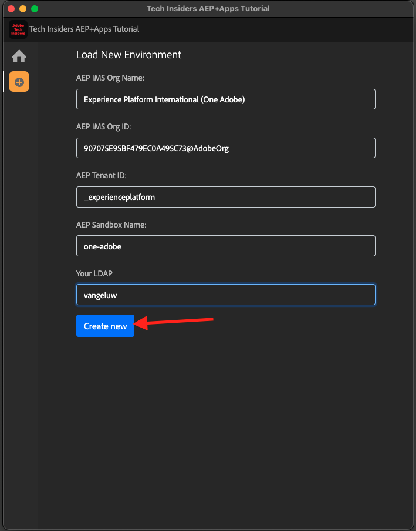

# Installation de l’extension Chrome pour la documentation Experience League

## À propos de l’extension Chrome

Ce tutoriel a été rendu générique afin qu’il puisse être facilement réutilisé par n’importe qui, à l’aide de n’importe quelle instance Adobe Experience Cloud.

Pour rendre la documentation réutilisable, les **variables d’environnement** ont été introduites dans le tutoriel, ce qui signifie que vous trouverez les **espaces réservés** ci-dessous dans la documentation. Chaque espace réservé est une variable spécifique pour un environnement spécifique, et l’extension Chrome modifiera cette variable pour vous afin de vous permettre de copier facilement le code et le texte des pages du tutoriel et de les coller dans les différentes interfaces utilisateur que vous utiliserez dans le cadre du tutoriel.

Vous trouverez ci-dessous un exemple de ces valeurs. Actuellement, ces valeurs ne peuvent pas encore être utilisées, mais dès que vous installez et activez l’extension Chrome, ces variables sont transformées en texte normal que vous pouvez copier et réutiliser.

| Nom | Clé | Exemple |
|:-------------:| :---------------:| :---------------:|
| Identifiant de l’organisation IMS | `--aepImsOrgId--` | `907075E95BF479EC0A495C73@AdobeOrg` |
| Nom de l’organisation IMS | `--aepImsOrgName--` | `Experience Platform International` |
| ID de client AEP | `--aepTenantId--` | `_experienceplatform` |
| Nom du sandbox AEP | `--aepSandboxName--` | `one-adobe` |
| Learner Profile LDAP | `--aepUserLdap--` | `vangeluw` |

Par exemple, dans la capture d’écran ci-dessous, vous pouvez voir une référence à `aepSandboxName`.

Une fois l’extension installée, le même texte est automatiquement modifié pour refléter les valeurs spécifiques à votre instance.

## Installation de l’extension Chrome

Pour installer cette extension Chrome, ouvrez votre navigateur Chrome et accédez à : [https://chromewebstore.google.com/detail/tech-insiders-learning-fo/hhnbkfgioecmhimdhooigajdajplinfi](https://chromewebstore.google.com/detail/tech-insiders-learning-fo/hhnbkfgioecmhimdhooigajdajplinfi){target="_blank"}. Tu verras ça.

Cliquez sur **Ajouter à Chrome**.

Tu verras ça. Cliquez sur **Ajouter une extension**.

L’extension sera ensuite installée et une notification similaire s’affichera.

Dans le menu **extensions**, cliquez sur l’icône **puzzle** et épinglez l’extension **Platform Learn - Configuration** dans le menu d’extension.

## Configuration de l’extension Chrome

Accédez à [https://experienceleague.adobe.com/en/docs/platform-learn/tutorial-comprehensive-technical/overview](https://experienceleague.adobe.com/en/docs/platform-learn/tutorial-comprehensive-technical/overview){target="_blank"} puis cliquez sur l’icône de l’extension pour l’ouvrir.

Vous verrez alors cette fenêtre contextuelle. Cliquez sur l’icône **+** .

Saisissez les valeurs comme indiqué ci-dessous, qui sont toutes liées à votre instance Adobe Experience Platform.

Si vous ne savez pas exactement quelles valeurs saisir pour ces champs, suivez les conseils ci-dessous.

**Votre LDAP**

Il s’agit du nom d’utilisateur qui sera utilisé dans le cadre du tutoriel. Dans cet exemple, le LDAP est basé sur l’adresse e-mail de cet utilisateur. L’adresse e-mail est **vangeluw@adobe.com** le protocole LDAP devient donc **vangeluw**.

Le LDAP est utilisé pour vous assurer que la configuration que vous effectuerez sera liée à vous et n’entrera pas en conflit avec d’autres utilisateurs susceptibles d’utiliser la même instance et le même sandbox que vous utilisez.

Vos valeurs doivent ressembler à celles-ci.
Enfin, cliquez sur **Créer**.

Dans le menu de gauche de l’extension, une nouvelle icône contenant les initiales de votre environnement s’affiche. Cliquez dessus. Le mappage entre les **variables d’environnement** et les valeurs de votre instance Adobe Experience Platform s’affiche alors. Cliquez sur **Activer la configuration**.

Une fois la configuration activée, un point vert s’affiche en regard des initiales de votre environnement. Cela signifie que votre environnement est désormais actif.

## Vérifier le contenu du tutoriel

Pour tester, accédez à [cette page](https://experienceleague.adobe.com/en/docs/platform-learn/tutorial-one-adobe/activation/dc/dc13/ex2){target="_blank"}.

Vous devriez maintenant voir que toutes les **variables d’environnement** de cette page ont été remplacées par leurs valeurs vraies, en fonction de l’environnement activé dans l’extension Chrome.

Vous devriez maintenant bénéficier d’une vue similaire à celle ci-dessous, où la variable d’environnement `aepSandboxName` a été remplacée par votre véritable nom de sandbox AEP, qui est dans ce cas **one-adobe**.

## Étapes suivantes

Accédez à [Configurer votre projet Adobe I/O](./ex2.md){target="_blank"}

Revenez à [Prise en main - GenStudio](./getting-started-genstudio.md){target="_blank"}

Revenir à [Tous les modules](./../../../overview.md){target="_blank"}
