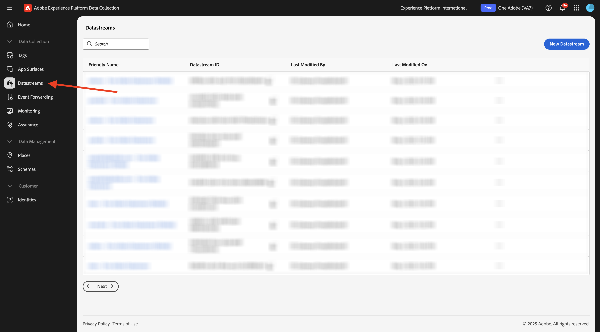
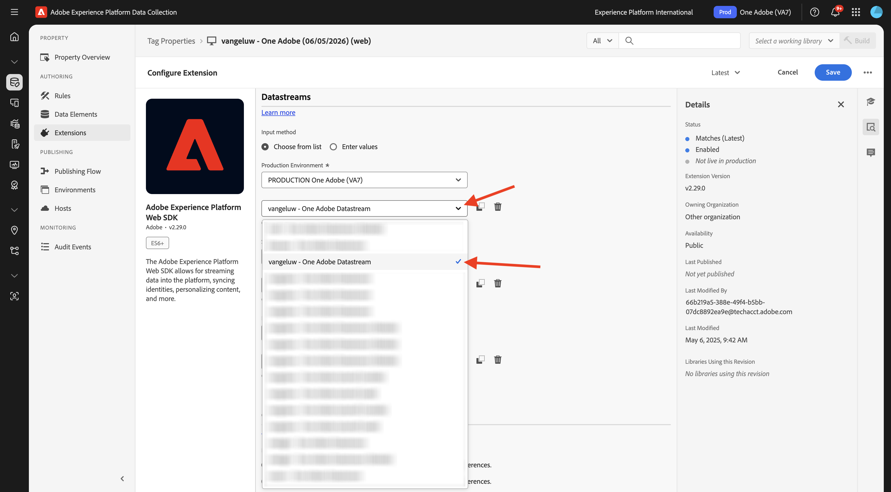
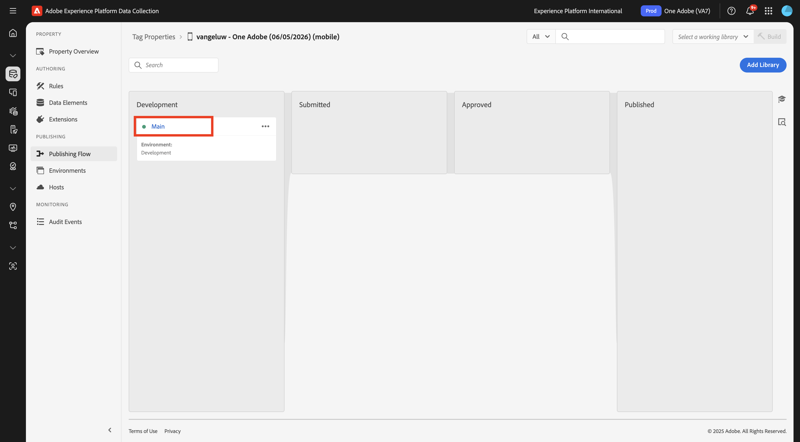

# Créer votre flux de données

Accédez à [https://experience.adobe.com/#/data-collection/](https://experience.adobe.com/#/data-collection/).

Dans le menu de gauche, cliquez sur **[!UICONTROL Balises]**. Après l’exercice précédent, vous disposez désormais de 3 propriétés de collecte de données : une pour le web, une pour le mobile et une pour l’application CX.

Ces propriétés sont presque prêtes à être utilisées, mais avant de pouvoir commencer à collecter des données à l’aide de ces propriétés, vous devez configurer un flux de données. Vous obtiendrez plus d’informations sur le concept de flux de données et ce qu’il signifie dans un exercice ultérieur du module Collecte de données .

Pour l’instant, procédez comme suit.

## Créer un flux de données pour le web

Cliquez sur **[!UICONTROL Flux de données]**.

Dans le coin supérieur droit de l’écran, sélectionnez le nom du sandbox, qui doit être `--aepSandboxName--`.

Cliquez sur **[!UICONTROL Nouveau flux de données]**.

Pour le **[!UICONTROL Nom]** et pour la description facultative, saisissez `--aepUserLdap-- - One Adobe Datastream`. Pour **Schéma de mappage**, sélectionnez **Système de démonstration - Schéma d’événement pour le site web (global v1.1)**. Cliquez sur **Enregistrer**.

Tu verras ça. Cliquez sur **Ajouter un service**.

Sélectionnez le service **[!UICONTROL Adobe Experience Platform]**, qui exposera des champs supplémentaires. Tu verras ça.

Pour Jeu de données d’événement, sélectionnez **Système de démonstration - Jeu de données d’événement pour le site web (global v1.1)** et pour Jeu de données de profil, sélectionnez **Système de démonstration - Jeu de données de profil pour le site web (global v1.1)**. Cliquez sur **Enregistrer**.

Vous allez voir ceci.

Dans le menu de gauche, cliquez sur **[!UICONTROL Balises]**.

Filtrez les résultats de la recherche pour afficher les propriétés de la collecte de données. Ouvrez la propriété pour **Web** en cliquant dessus.

Tu verras ça. Cliquez sur **Extensions**.

Cliquez d’abord sur l’extension Adobe Experience Platform Web SDK, puis sur **Configurer**.

Tu verras ça. Consultez le menu **Flux de données** et assurez-vous que le bon sandbox est sélectionné, ce qui, dans votre cas, doit être `--aepSandboxName--`.

Ouvrez la liste déroulante **Flux de données** et sélectionnez le flux de données que vous avez créé précédemment.

Assurez-vous d’avoir sélectionné votre **flux de données** dans les trois environnements différents. Cliquez ensuite sur **Enregistrer**.

Accédez à **Flux de publication**.

Cliquez sur le **...** pour **Principal**, puis sur **Modifier**.

Cliquez sur **Ajouter toutes les ressources modifiées** puis sur **Enregistrer et créer pour développement**.

Vos modifications sont maintenant publiées et seront prêtes dans quelques minutes, après quoi vous verrez le point vert à côté de **Main**.

## Créer votre flux de données pour Mobile

Accédez à [https://experience.adobe.com/#/data-collection/](https://experience.adobe.com/#/data-collection/).

Cliquez sur **[!UICONTROL Flux de données]**.

Dans le coin supérieur droit de l’écran, sélectionnez le nom du sandbox, qui doit être `--aepSandboxName--`.

Cliquez sur **[!UICONTROL Nouveau flux de données]**.

Pour le **[!UICONTROL Nom convivial]** et pour la description facultative, saisissez `--aepUserLdap-- - One Adobe Datastream (Mobile)`. Pour **Schéma de mappage**, sélectionnez **Système de démonstration - Schéma d’événement pour l’application mobile (global v1.1)**. Cliquez sur **Enregistrer**.

Cliquez sur **[!UICONTROL Enregistrer]**.

Tu verras ça. Cliquez sur **Ajouter un service**.

Sélectionnez le service **[!UICONTROL Adobe Experience Platform]**, qui exposera des champs supplémentaires. Tu verras ça.

Pour Jeu de données d’événement, sélectionnez **Système de démonstration - Jeu de données d’événement pour l’application mobile (Global v1.1)** et pour Jeu de données de profil, sélectionnez **Système de démonstration - Jeu de données de profil pour l’application mobile (Global v1.1)**. Cliquez sur **Enregistrer**.

Tu verras ça.

Votre flux de données est maintenant prêt à être utilisé dans votre propriété Client de collecte de données Adobe Experience Platform pour Mobile.

Accédez à **Balises** et filtrez les résultats de la recherche pour afficher vos deux propriétés de collecte de données. Ouvrez la propriété pour **Mobile** en cliquant dessus.

Tu verras ça. Cliquez sur **Extensions**.

Cliquez sur l’extension **Adobe Experience Platform Edge Network**, puis sur **Configurer**.

Tu verras ça. Vous devez maintenant sélectionner le sandbox et le flux de données corrects que vous venez de configurer. Le sandbox à utiliser est `--aepSandboxName--` et le flux de données est appelé `--aepUserLdap-- - Demo System Datastream (Mobile)`.

Pour le domaine **Edge Network**, veuillez utiliser le domaine par défaut.

Cliquez sur **Enregistrer** pour enregistrer vos modifications.

Accédez à **Flux de publication**.

Cliquez sur le **...** en regard de **Principal**, puis cliquez sur **Modifier**.

Cliquez sur **Ajouter toutes les ressources modifiées**, puis sur **Enregistrer et créer pour développement**.

Vos modifications sont maintenant publiées et seront prêtes dans quelques minutes, après quoi vous verrez le point vert à côté de **Main**.

Étape suivante : [Utiliser le site web](./ex4.md)

[Revenir à la prise en main](./getting-started.md)

[Revenir à tous les modules](./../../../overview.md)
