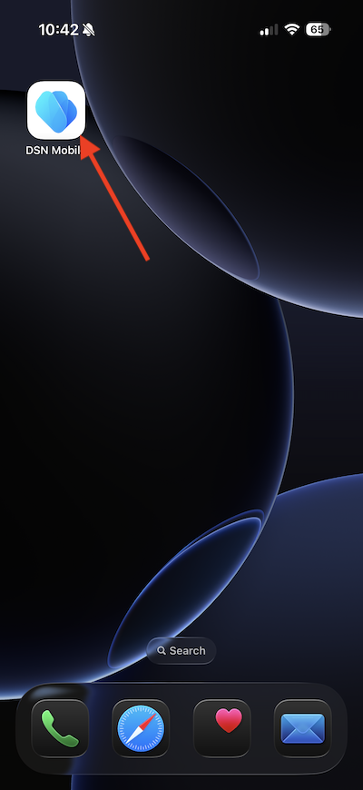

# Utilisation de l’application mobile

## Télécharger l’application

Accédez à [https://dsn.adobe.com/install](https://dsn.adobe.com/install){target="_blank"} sur votre ordinateur, puis à **Version de Beta**. Connectez-vous à l’aide de votre Adobe ID, vous verrez ceci.

Utilisez l&#39;application **Camera** sur votre smartphone pour installer l&#39;application mobile correspondant au système d&#39;exploitation de votre appareil. Pour cette activation, vous devez installer la version **0.6.1** (ou ultérieure) qui utilise le SDK Mobile Adobe Experience Platform.

>[!NOTE]
>
>Après la première installation de l’application sur un appareil iOS, il se peut que vous receviez un message d’erreur lors de l’ouverture de l’application indiquant : **Développeur d’entreprise non approuvé**. Pour résoudre ce problème, vous devez accéder à **Paramètres > Général > Gestion des VPN et des appareils > Adobe Systems Inc.** et cliquer sur **Faire confiance à Adobe Systems Inc.**.

Après avoir analysé le code QR, sélectionnez **Installer**.

Une fois l&#39;application installée, vous la trouverez sur l&#39;écran d&#39;accueil de votre appareil. Cliquez sur l’icône pour ouvrir l’application.

Après vous être connecté, une notification s’affichera pour vous demander l’autorisation d’envoyer des notifications. Nous enverrons des notifications dans le cadre du tutoriel. Cliquez donc sur **Autoriser**.

Vous verrez alors la page d’accueil de l’application. Accédez à **Paramètres**.

Dans les paramètres, vous verrez qu’un **Projet public** est actuellement chargé dans l’application. Cliquez sur **Projet personnalisé**.

Vous pouvez désormais charger un projet personnalisé. Cliquez sur le code QR pour charger facilement votre projet.

Après l’exercice précédent, vous avez obtenu le résultat suivant. Cliquez pour ouvrir le **projet Mobile Edge Telco** qui a été créé pour vous.

Si vous avez fermé accidentellement la fenêtre de votre navigateur ou pour des sessions de démonstration ou d’activation ultérieures, vous pouvez également accéder à votre projet de site web en accédant à [https://dsn.adobe.com](https://dsn.adobe.com){target="_blank"}. Après vous être connecté avec votre Adobe ID, voici ce que vous verrez. Cliquez sur le **de points de suspension...** dans votre projet d’application mobile, puis cliquez sur **Modifier**.

Sur la page **Intégrations**, vous devez sélectionner la propriété Collecte de données qui a été créée dans l’exercice précédent. Pour ce faire, cliquez sur **Sélectionner l’environnement**.

Cliquez sur **Sélectionner** sur la propriété Collecte de données qui a été créée à l’étape précédente, qui est nommée `--aepUserLdap - One Adobe (DD/MM/YYYY) (mobile)`. Cliquez ensuite sur **Enregistrer**.

Tu verras ça. Cliquez ensuite sur **Exécuter**.

Vous verrez ensuite cette fenêtre contextuelle, qui contient un code QR. Scannez ce code QR à partir de l’application mobile.

Votre ID de projet est alors chargé dans l’application, après quoi vous pouvez cliquer sur **Basculer**.

Vous devriez alors voir la marque de démonstration **CitiSignal** chargée. Votre application est maintenant prête à être utilisée.

## Étapes suivantes

Accédez à [Configurer votre projet Adobe I/O](./ex6.md){target="_blank"}

Revenir à [Prise en main](./getting-started.md){target="_blank"}

Revenir à [Tous les modules](./../../../overview.md){target="_blank"}