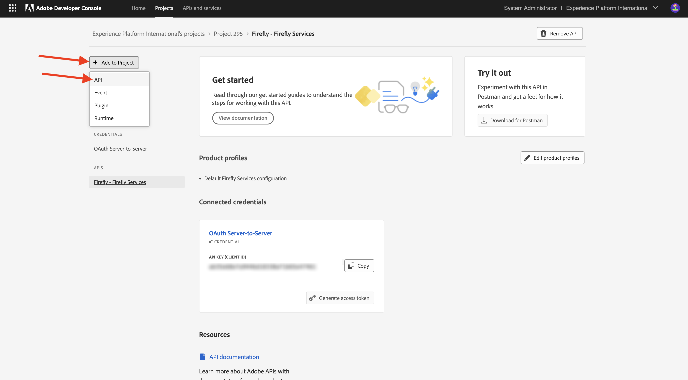
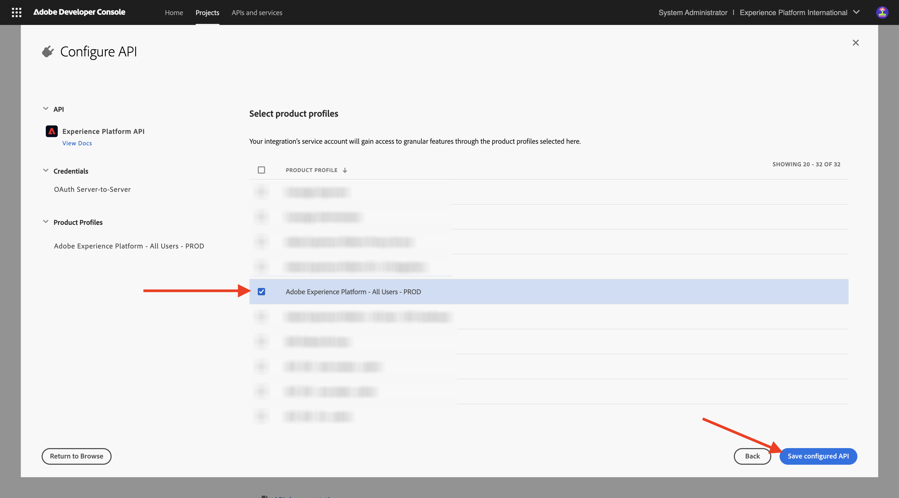

# Configuration de votre projet Adobe I/O

## Création de votre projet Adobe I/O

Dans cet exercice, Adobe I/O est utilisé pour interroger divers points d’entrée Adobe. Pour configurer Adobe I/O, procédez comme suit.

Accédez à [https://developer.adobe.com/console/home](https://developer.adobe.com/console/home){target="_blank"}.

Veillez à sélectionner l’instance appropriée dans le coin supérieur droit de l’écran. Votre instance est `--aepImsOrgName--`.

>[!NOTE]
>
> La capture d’écran ci-dessous montre une organisation spécifique sélectionnée. Lorsque vous parcourez ce tutoriel, il est très probable que votre organisation porte un nom différent. Lorsque vous vous êtes inscrit à ce tutoriel, les détails de l’environnement à utiliser vous ont été fournis. Veuillez suivre ces instructions.

Sélectionnez ensuite **Créer un projet**.

### API FIREFLY SERVICES

>[!IMPORTANT]
>
>Selon le parcours d’apprentissage que vous avez sélectionné, vous n’avez peut-être pas accès à l’API Firefly Services. Vous n’aurez accès à l’API Firefly Services que si vous êtes sur le parcours d’apprentissage **Firefly**, **Workfront Fusion**, **ALL** ou lorsque vous participez à un **atelier en personne**. Vous pouvez ignorer cette étape si vous n’êtes pas sur l’un de ces parcours d’apprentissage.

Vous devriez alors voir ceci. Sélectionnez **+ Ajouter au projet** et choisissez **API**.

Sélectionnez **Adobe Firefly Services** puis choisissez **Firefly - Firefly Services**, puis sélectionnez **Suivant**.

Attribuez un nom à vos informations d’identification : `--aepUserLdap-- - One Adobe OAuth credential` et sélectionnez **Suivant**.

Sélectionnez le profil par défaut **Configuration Firefly Services par défaut** et sélectionnez **Enregistrer l’API configurée**.

Vous devriez alors voir ceci.

### API PHOTOSHOP SERVICES

>[!IMPORTANT]
>
>Selon le parcours d’apprentissage que vous avez sélectionné, vous n’avez peut-être pas accès à l’API Photoshop Services. Vous n’aurez accès à l’API Photoshop Services que si vous êtes sur le parcours d’apprentissage **Firefly**, **Workfront Fusion**, **ALL** ou lorsque vous participez à un **atelier en personne**. Vous pouvez ignorer cette étape si vous n’êtes pas sur l’un de ces parcours d’apprentissage.
>
Sélectionnez **+ Ajouter au projet** puis sélectionnez **API**.

Sélectionnez **Adobe Firefly Services** puis **Photoshop - Firefly Services**. Sélectionnez **Suivant**.

Sélectionnez **Suivant**.

Ensuite, vous devez sélectionner un profil de produit qui définit les autorisations disponibles pour cette intégration.

Sélectionnez **Configuration Firefly Services par défaut** et **Configuration des services d’automatisation de Creative Cloud par défaut**.

Sélectionnez **Enregistrer l’API configurée**.

Vous devriez alors voir ceci.

### API ADOBE EXPERIENCE PLATFORM

>[!IMPORTANT]
>
>Selon le parcours d’apprentissage que vous avez sélectionné, vous n’avez peut-être pas accès à l’API Adobe Experience Platform. Vous n’aurez accès à l’API Adobe Experience Platform que si vous êtes sur le parcours d’apprentissage **AEP + Applications**, **TOUS** ou lorsque vous participez à un **atelier en personne**. Vous pouvez ignorer cette étape si vous n’êtes pas sur l’un de ces parcours d’apprentissage.

Sélectionnez **+ Ajouter au projet** puis sélectionnez **API**.

Sélectionnez **Adobe Experience Platform** puis **API Experience Platform**. Sélectionnez **Suivant**.

Sélectionnez **Suivant**.

Ensuite, vous devez sélectionner un profil de produit qui définit les autorisations disponibles pour cette intégration.

Sélectionnez **Adobe Experience Platform - Tous les utilisateurs - PROD**.

>[!NOTE]
>
>Le nom du profil de produit pour AEP dépend de la configuration de l’environnement. Si le profil de produit mentionné ci-dessus ne s’affiche pas, il se peut que vous disposiez d’un profil de produit appelé **Tous les accès de production par défaut**. Si vous ne savez pas lequel choisir, adressez-vous à votre administrateur système AEP.

Sélectionnez **Enregistrer l’API configurée**.

Vous devriez alors voir ceci.

### API Frame.io

>[!IMPORTANT]
>
>Selon le parcours d’apprentissage que vous avez sélectionné, vous n’avez peut-être pas accès à l’API Frame.io. Vous n’aurez accès à l’API Frame.io que si vous êtes sur le parcours d’apprentissage **Workfront Fusion**, **ALL** ou lorsque vous participez à un **atelier en personne**. Vous pouvez ignorer cette étape si vous n’êtes pas sur l’un de ces parcours d’apprentissage.

Sélectionnez **+ Ajouter au projet** puis sélectionnez **API**.

Sélectionnez **Creative Cloud** puis choisissez **API Frame.io**. Sélectionnez **Suivant**.

Sélectionnez **Authentification de serveur à serveur** puis cliquez sur **Suivant**.

Sélectionnez **OAuth de serveur à serveur** puis cliquez sur **Suivant**.

Ensuite, vous devez sélectionner un profil de produit qui définit les autorisations disponibles pour cette intégration.

Sélectionnez **Default Frame.io Enterprise - Prime Configuration** et cliquez sur **Enregistrer l’API configurée**.

Vous devriez alors voir ceci.

### Nom du projet

Cliquez sur le nom de votre projet.

{zoomable="yes"}

Sélectionnez **Modifier le projet**.

{zoomable="yes"}

Saisissez un nom convivial pour votre intégration : `--aepUserLdap-- One Adobe tutorial` et sélectionnez **Enregistrer**.

{zoomable="yes"}

La configuration de votre projet Adobe I/O est maintenant terminée.

{zoomable="yes"}

## Étapes suivantes

Accédez à [Option 1 : configuration de Postman](./ex7.md){target="_blank"}

Accédez à [Option 2 : configuration de PostBuster](./ex8.md){target="_blank"}

Revenir à [Prise en main](./getting-started.md){target="_blank"}

Revenir à [Tous les modules](./../../../overview.md){target="_blank"}
