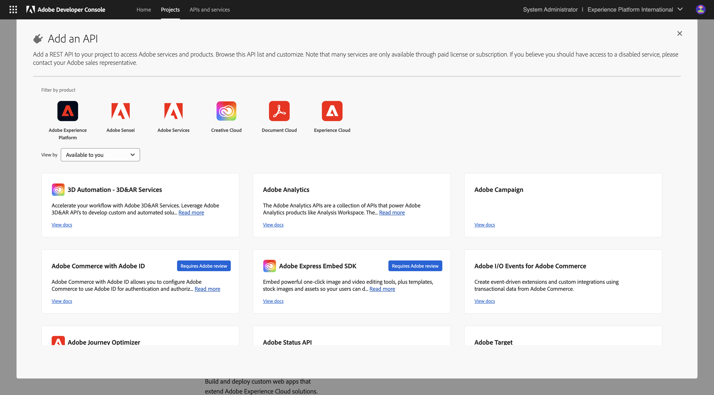
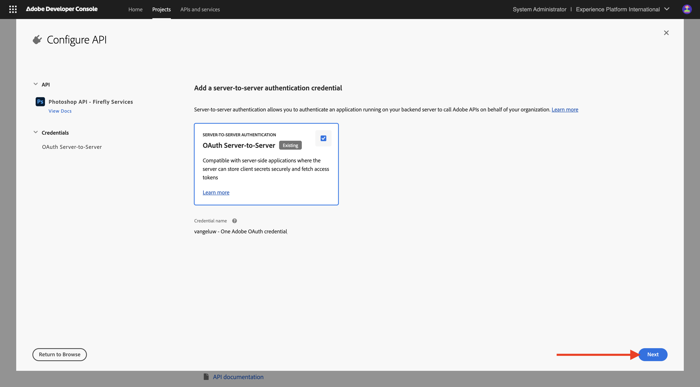

# Configuration de votre projet Adobe I/O

## Création de votre projet Adobe I/O

Dans cet exercice, Adobe I/O est utilisé pour interroger divers points d’entrée Adobe. Pour configurer Adobe I/O, procédez comme suit.

Accédez à [https://developer.adobe.com/console/home](https://developer.adobe.com/console/home){target="_blank"}.

{zoomable="yes"}

Veillez à sélectionner l’instance appropriée dans le coin supérieur droit de l’écran. Votre instance est `--aepImsOrgName--`.

>[!NOTE]
>
> La capture d’écran ci-dessous montre une organisation spécifique sélectionnée. Lorsque vous parcourez ce tutoriel, il est très probable que votre organisation porte un nom différent. Lorsque vous vous êtes inscrit à ce tutoriel, les détails de l’environnement à utiliser vous ont été fournis. Veuillez suivre ces instructions.

Sélectionnez ensuite **Créer un projet**.

{zoomable="yes"}

### API FIREFLY SERVICES

Vous devriez alors voir ceci. Sélectionnez **+ Ajouter au projet** et choisissez **API**.

{zoomable="yes"}

Votre écran devrait ressembler à ceci.

{zoomable="yes"}

Sélectionnez **Creative Cloud** puis choisissez **Firefly - Firefly Services**, puis sélectionnez **Suivant**.

{zoomable="yes"}

Attribuez un nom à vos informations d’identification : `--aepUserLdap-- - One Adobe OAuth credential`, puis sélectionnez **Suivant**.

{zoomable="yes"}

Sélectionnez le profil par défaut **Configuration Firefly Services par défaut** et sélectionnez **Enregistrer l’API configurée**.

{zoomable="yes"}

Vous devriez alors voir ceci.

{zoomable="yes"}

### API PHOTOSHOP SERVICES

Sélectionnez **+ Ajouter au projet** puis sélectionnez **API**.

{zoomable="yes"}

Sélectionnez **Creative Cloud** puis **Photoshop - Firefly Services**. Sélectionnez **Suivant**.

{zoomable="yes"}

Sélectionnez **Suivant**.

{zoomable="yes"}

Ensuite, vous devez sélectionner un profil de produit qui définit les autorisations disponibles pour cette intégration.

Sélectionnez **Configuration Firefly Services par défaut** et **Configuration des services d’automatisation de Creative Cloud par défaut**.

Sélectionnez **Enregistrer l’API configurée**.

{zoomable="yes"}

Vous devriez alors voir ceci.

{zoomable="yes"}

### API ADOBE EXPERIENCE PLATFORM

Sélectionnez **+ Ajouter au projet** puis sélectionnez **API**.

{zoomable="yes"}

Sélectionnez **Adobe Experience Platform** puis **API Experience Platform**. Sélectionnez **Suivant**.

{zoomable="yes"}

Sélectionnez **Suivant**.

{zoomable="yes"}

Ensuite, vous devez sélectionner un profil de produit qui définit les autorisations disponibles pour cette intégration.

Sélectionnez **Adobe Experience Platform - Tous les utilisateurs - PROD**.

Sélectionnez **Enregistrer l’API configurée**.

{zoomable="yes"}

Vous devriez alors voir ceci.

{zoomable="yes"}

### Nom du projet

Cliquez sur le nom de votre projet.

{zoomable="yes"}

Sélectionnez **Modifier le projet**.

{zoomable="yes"}

Saisissez un nom convivial pour votre intégration : `--aepUserLdap-- One Adobe tutorial`et sélectionnez **Enregistrer**.

{zoomable="yes"}

La configuration de votre projet Adobe I/O est maintenant terminée.

{zoomable="yes"}

## Étapes suivantes

Accédez à [Option 1 : configuration de Postman](./ex7.md){target="_blank"}

Accédez à [Option 2 : configuration de PostBuster](./ex8.md){target="_blank"}

Revenir à [Prise en main](./getting-started.md){target="_blank"}

Revenir à [Tous les modules](./../../../overview.md){target="_blank"}
