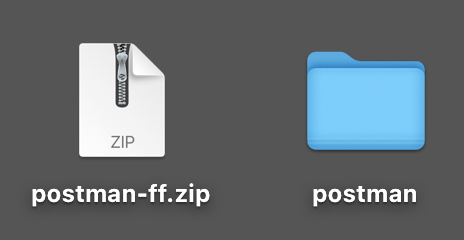

# Option 1 : utiliser Postman

>[!IMPORTANT]
>
>Si vous êtes employé d’Adobe, suivez les instructions pour [installer PostBuster](./ex8.md){target="_blank"} !

## Vidéo

Dans cette vidéo, vous obtiendrez une explication et une démonstration de toutes les étapes impliquées dans cet exercice.

>[!VIDEO](https://video.tv.adobe.com/v/3476495?quality=12&learn=on)

## Téléchargement de l’environnement Postman

Accédez à [https://developer.adobe.com/console/home](https://developer.adobe.com/console/home){target="_blank"} et ouvrez votre projet.

Cliquez sur l’API **Firefly - Firefly Services**. Cliquez ensuite sur **Télécharger pour Postman** et choisissez **OAuth serveur à serveur** pour télécharger un environnement Postman.

## Authentification Postman à Adobe I/O

Téléchargez et installez la version de Postman appropriée à votre système d’exploitation sur [Postman Downloads](https://www.postman.com/downloads/){target="_blank"}.

Démarrez l’application.

Dans Postman, il existe 2 concepts : Environnements et Collections.

Le fichier d’environnement contient toutes vos variables d’environnement qui sont plus ou moins cohérentes. Dans l’environnement , vous trouverez des éléments tels que l’IMSOrg de votre environnement Adobe, ainsi que des informations d’identification de sécurité telles que votre identifiant client et d’autres. Vous avez téléchargé le fichier d’environnement lors de la configuration précédente d’Adobe I/O et il est nommé **`oauth_server_to_server.postman_environment.json`**.

La collection contient un certain nombre de requêtes d’API que vous pouvez utiliser. Vous utiliserez les collections suivantes :

- 1 collection pour l’authentification à Adobe I/O
- 1 collecte pour les exercices des services Adobe Firefly de ce module
- 1 Collection pour les exercices Adobe Frame.io V4 dans ce module

Téléchargez [postman-ff.zip](./../../../assets/postman/postman-ff.zip){target="_blank"} sur votre bureau local.

Dans le fichier **postman-ff.zip** se trouvent les fichiers suivants :

- `Adobe IO - OAuth.postman_collection.json`
- `FF - Firefly Services Tech Insiders.postman_collection.json`
- `Frame.io V4 - Tech Insiders.postman_collection.json`

Décompressez **postman-ff.zip** et stockez les fichiers suivants dans un dossier sur votre bureau :

- `Adobe IO - OAuth.postman_collection.json`
- `FF - Firefly Services Tech Insiders.postman_collection.json`
- `Frame.io V4 - Tech Insiders.postman_collection.json`
- `oauth_server_to_server.postman_environment.json`

Dans Postman, sélectionnez **Importer**.

Sélectionnez **Fichiers**.

Sélectionnez tous les fichiers du dossier, puis sélectionnez **Ouvrir** et **Importer**.

Cliquez sur **Importer**.

Vous disposez désormais de tout ce dont vous avez besoin dans Postman pour commencer à interagir avec Firefly Services par le biais des API.

## Demander un jeton d’accès

Ensuite, pour vous assurer que vous êtes correctement authentifié, vous devez demander un jeton d’accès.

Assurez-vous que l’environnement approprié est sélectionné avant d’exécuter une requête en vérifiant la liste déroulante Environnement dans le coin supérieur droit. L’environnement sélectionné doit porter un nom similaire à celui-ci, `--aepUserLdap-- One Adobe OAuth Credential`.

L’environnement sélectionné doit porter un nom similaire à celui-ci, `--aepUserLdap-- One Adobe OAuth Credential`.

Maintenant que votre environnement Postman et vos collections sont configurés et fonctionnent, vous pouvez vous authentifier de Postman à Adobe I/O.

Dans la collection **Adobe IO - OAuth**, sélectionnez la requête nommée **POST - Obtenir le jeton d’accès** et sélectionnez **Envoyer**.

Notez que sous **Paramètres de requête**, deux variables sont référencées : `API_KEY` et `CLIENT_SECRET`. Ces variables sont extraites de l’environnement sélectionné, `--aepUserLdap-- One Adobe OAuth Credential`.

En cas de réussite, une réponse contenant un jeton porteur, un jeton d’accès et une fenêtre d’expiration s’affiche dans la section **Corps** de Postman.

Vous devriez voir une réponse similaire contenant les informations suivantes :

| Clé | Valeur |
|:-------------:| :---------------:| 
| token_type | **porteur** |
| access_token | **eyJhbGciOiJSUz** |
| expires_in | **86399** |

L’Adobe I/O **bearer-token** a une valeur spécifique (le très long access_token) et une fenêtre d’expiration et est désormais valide pendant 24 heures. Cela signifie qu’au bout de 24 heures, si vous souhaitez utiliser Postman pour interagir avec les API Adobe, vous devrez générer un nouveau jeton en exécutant à nouveau cette requête.

Votre environnement Postman est maintenant configuré et fonctionne.

## Étapes suivantes

Accédez à [ Applications à installer ](./ex9.md){target="_blank"}

Revenir à [Prise en main](./getting-started.md){target="_blank"}

Revenir à [Tous les modules](./../../../overview.md){target="_blank"}
