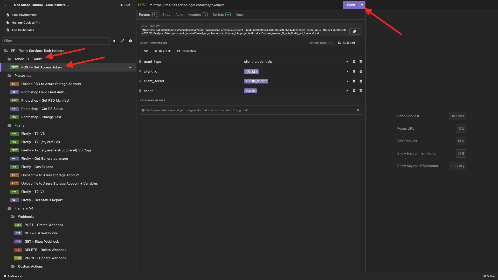

# Option 2 : configuration de PostBuster

>[!IMPORTANT]
>
>Si vous n’êtes pas employé d’Adobe, suivez les instructions pour [installer Postman](./ex7.md){target="_blank"}. Les instructions ci-dessous sont destinées uniquement aux employés d’Adobe.

## Vidéo

Dans cette vidéo, vous obtiendrez une explication et une démonstration de toutes les étapes impliquées dans cet exercice.

>[!VIDEO](https://video.tv.adobe.com/v/3476496?quality=12&learn=on)

## Installer PostBuster

Accédez à [https://adobe.service-now.com/esc?id=adb_esc_kb_article&sysparm_article=KB0020542](https://adobe.service-now.com/esc?id=adb_esc_kb_article&sysparm_article=KB0020542){target="_blank"}.

Cliquez pour télécharger la dernière version de **PostBuster**.


Cliquez sur la version appropriée pour votre système d’exploitation.


Téléchargez le fichier .


Une fois le téléchargement terminé et installé, ouvrez PostBuster. Vous devriez alors voir ceci. Cliquez sur **Importer**.


Téléchargez [postbuster.json.zip](./../../../assets/postman/postbuster.json.zip){target="_blank"} et extrayez-le sur votre bureau.


Cliquez sur **Choisir un fichier**.


Sélectionnez le fichier **postbuster.json**. Cliquez sur **Ouvrir**.


Vous devriez alors voir ceci. Cliquez sur **Scan**.


Cliquez sur **Importer**.


Vous devriez alors voir ceci. Cliquez pour ouvrir la collection importée.


Maintenant, vous voyez votre collection. Vous devez toujours configurer un environnement pour contenir certaines variables d’environnement.


Cliquez sur **Environnement de base** puis sur l’icône **Modifier**.


Vous devriez alors voir ceci.


Copiez l’espace réservé d’environnement ci-dessous et collez-le dans l’**Environnement de base** en remplaçant ce qui s’y trouve.

```json
{
	"CLIENT_SECRET": "",
	"API_KEY": "",
	"ACCESS_TOKEN": "",
	"SCOPES": [
		"openid",
		"AdobeID",
		"read_organizations", 
		"additional_info.projectedProductContext", 
		"session",
		"ff_apis",
		"firefly_api",
		"frame.s2s.all"
	],
	"TECHNICAL_ACCOUNT_ID": "",
	"IMS": "ims-na1.adobelogin.com",
	"IMS_ORG": "",
	"access_token": "",
	"IMS_TOKEN": "",
	"AZURE_STORAGE_URL": "",
	"AZURE_STORAGE_CONTAINER": "",
	"AZURE_STORAGE_SAS_READ": "",
	"AZURE_STORAGE_SAS_WRITE": "",
	"FRAME_IO_BASE_URL": "https://api.frame.io",
	"FRAME_IO_ACCOUNT_ID": "",
	"FRAME_IO_WORKSPACE_ID": ""
}
```

Tu devrais avoir ça.


## Saisir vos variables Adobe I/O

Accédez à [https://developer.adobe.com/console/home](https://developer.adobe.com/console/home){target="_blank"} et ouvrez votre projet.


Accédez à **OAuth de serveur à serveur**.


Vous devez maintenant copier les valeurs suivantes à partir de votre projet Adobe I/O et les coller dans votre environnement de base PostBuster.

- Identifiant client
- Secret Client (Cliquez Sur **Récupérer Le Secret Client**)
- Identifiant de compte technique
- Identifiant de l’organisation (faites défiler la page vers le bas pour trouver votre identifiant d’organisation)


Copiez les variables ci-dessus une par une et collez-les dans votre **Environnement de base** dans PostBuster.

| Nom de variable dans Adobe I/O | Nom de variable dans l’environnement de base PostBuster |
|:-------------:| :---------------:| 
| Identifiant client | `API_KEY` |
| Secret client | `CLIENT_SECRET` |
| Identifiant de compte technique | `TECHNICAL_ACCOUNT_ID` |
| ID d’organisation | `IMS_ORG` |

Après avoir copié ces variables une par une, votre environnement de base PostBuster doit ressembler à ceci.

Cliquez sur **Fermer**.


Dans la collection **Adobe IO - OAuth**, sélectionnez la requête nommée **POST - Obtenir le jeton d’accès** et sélectionnez **Envoyer**.



Vous devriez voir une réponse similaire contenant les informations suivantes :

| Clé | Valeur |
|:-------------:| :---------------:| 
| token_type | **porteur** |
| access_token | **eyJhbGciOiJS** |
| expires_in | **86399** |

L’Adobe I/O **bearer-token** a une valeur spécifique (le très long access_token) et une fenêtre d’expiration et est désormais valide pendant 24 heures. Cela signifie qu’au bout de 24 heures, si vous souhaitez utiliser Postman pour interagir avec les API Adobe, vous devrez générer un nouveau jeton en exécutant à nouveau cette requête.


Votre environnement PostBuster est maintenant configuré et fonctionne. Vous avez maintenant terminé cet exercice.

## Étapes suivantes

Accédez à [&#x200B; Applications à installer &#x200B;](./ex9.md){target="_blank"}

Revenir à [Prise en main](./getting-started.md){target="_blank"}

Revenir à [Tous les modules](./../../../overview.md){target="_blank"}
