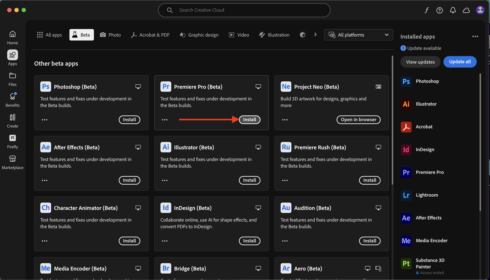
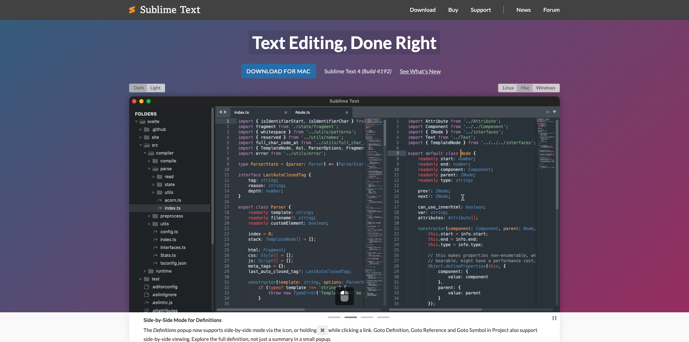

# Applications à installer

Vous trouverez ci-dessous un aperçu des applications qui devront être installées sur votre ordinateur avant de commencer le tutoriel.

## Adobe Creative Cloud

Accédez à [https://creativecloud.adobe.com/apps/download/creative-cloud](https://creativecloud.adobe.com/apps/download/creative-cloud){target="_blank"}.

## Adobe Photoshop

Ouvrez l’application **Adobe Creative Cloud**, puis accédez à **Applications**. Installez Photoshop sur votre ordinateur.

## Adobe Illustrator

Ouvrez l’application **Adobe Creative Cloud**, puis accédez à **Applications**. Installez Illustrator sur votre ordinateur.

## Adobe Premiere Pro

Installez la version Adobe Premiere Pro Beta sur votre ordinateur à partir de [https://helpx.adobe.com/fr/premiere-pro/using/premiere-pro-beta.html](https://helpx.adobe.com/fr/premiere-pro/using/premiere-pro-beta.html)

Cliquez sur **Ouvrir l’application de bureau Creative Cloud**.

Cliquez sur **Installer** sur la carte de l’application **Premiere Pro (Beta)**.

## Application de transfert Frame.io

Accédez à [https://frame.io/transfer](https://frame.io/transfer) puis téléchargez la version correspondant à votre ordinateur.

## Visual Studio Code

Accédez à [https://code.visualstudio.com/](https://code.visualstudio.com/){target="_blank"}, téléchargez et installez **Visual Studio Code**.

## Éditeur de texte

Si vous ne disposez pas d’une application d’éditeur de texte, vous pouvez accéder à [https://www.sublimetext.com/](https://www.sublimetext.com/){target="_blank"} télécharger et installer cet éditeur de texte.

## Compte GitHub

Si vous ne disposez pas encore d’un compte GitHub, accédez à [https://github.com/](https://github.com/){target="_blank"} puis cliquez sur **S’inscrire**. Utilisez votre adresse e-mail personnelle et créez votre compte.

## Bureau GitHub

Accédez à [https://desktop.github.com/download/](https://desktop.github.com/download/){target="_blank"}, téléchargez et installez **Github Desktop**.

## Explorateur de stockage Azure

[Téléchargez l’explorateur de stockage Azure Microsoft pour gérer vos fichiers](https://azure.microsoft.com/en-us/products/storage/storage-explorer#Download-4){target="_blank"}. Sélectionnez la version appropriée pour votre système d’exploitation spécifique, téléchargez-la et installez-la.

{zoomable="yes"}

Vous avez maintenant terminé le module Prise en main .

## Étapes suivantes

Revenir à [Prise en main](./getting-started.md){target="_blank"}

Revenez à [Tous les modules](./../../../overview.md){target="_blank"}./images
