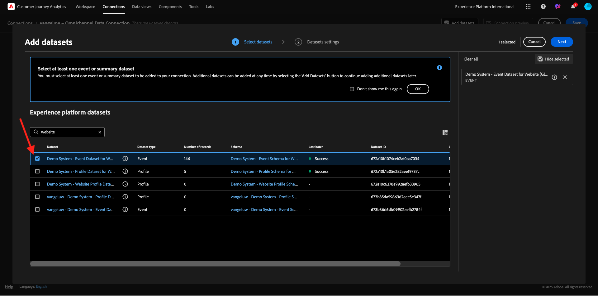
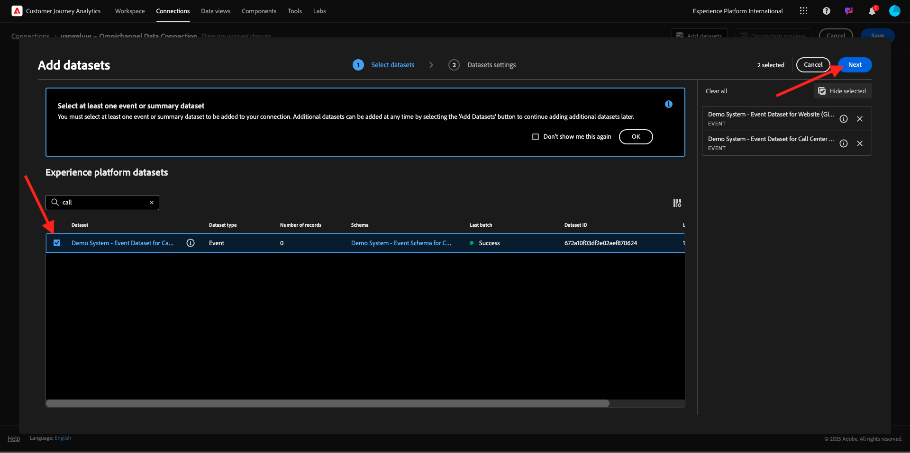
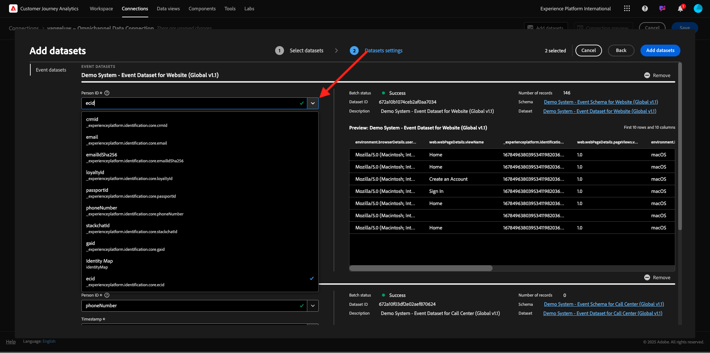

# 1.1.2 Connexion de jeux de données Adobe Experience Platform dans Customer Journey Analytics

## Objectifs

- Présentation de l’interface utilisateur de Data Connection
- Importation de données Adobe Experience Platform dans CJA
- Comprendre l’ID de personne et l’assemblage des données
- Découvrez le concept de diffusion de données en continu dans Customer Journey Analytics

## Connexion 1.1.2.1

Accédez à [analytics.adobe.com](https://analytics.adobe.com) pour Customer Journey Analytics.

Sur la page d’accueil de Customer Journey Analytics, accédez à **Connexions**.

Vous pouvez voir ici toutes les différentes connexions établies entre CJA et Platform. Ces connexions ont le même objectif que les suites de rapports dans Adobe Analytics. Cependant, la collecte des données est totalement différente. Toutes les données proviennent de jeux de données Adobe Experience Platform.

Créons votre première connexion. Cliquez sur **Créer une connexion**.

L’interface utilisateur **Créer une connexion** s’affiche alors.

Vous pouvez maintenant donner un nom à votre connexion.

Utilisez la convention de nommage suivante : `--aepUserLdap-- – Omnichannel Data Connection`.

Vous devez également sélectionner le sandbox approprié à utiliser. Dans le menu Sandbox , sélectionnez votre sandbox, qui doit être `--aepSandboxName--`. Dans cet exemple, le sandbox est **Insiders techniques**. Vous devez également définir le **nombre moyen d’événements quotidiens** sur **moins d’un million**.

Après avoir sélectionné votre sandbox, vous pouvez commencer à ajouter des jeux de données. Cliquez sur **Ajouter des jeux de données**.

## 1.1.2.2 Sélectionner des jeux de données Adobe Experience Platform

Recherchez l’`Demo System - Event Dataset for Website (Global v1.1)` du jeu de données. Activez la case à cocher de ce jeu de données pour l’ajouter à cette connexion.

Restez sur le même écran, puis recherchez et cochez la case pour `Demo System - Event Dataset for Call Center (Global v1.1)`.

Tu auras alors ceci. Cliquez sur **Suivant**.

## ID de personne 1.1.2.3 et assemblage des données

### ID de personne

L’objectif est désormais de joindre ces jeux de données. Pour chaque jeu de données sélectionné, un champ appelé **ID de personne** s’affiche. Chaque jeu de données possède son propre champ d’ID de personne.

Comme vous pouvez le constater, l’ID de personne est automatiquement sélectionné dans la plupart des cas. En effet, une identité de Principal est sélectionnée dans chaque schéma de Adobe Experience Platform. À titre d’exemple, voici le schéma de `Demo System - Event Schema for Website (Global v1.1)`, où vous pouvez voir que l’identité du Principal est définie sur `ecid`.

Cependant, vous pouvez toujours influencer l’identifiant qui sera utilisé pour regrouper les jeux de données pour votre connexion. Vous pouvez utiliser n’importe quel identifiant configuré dans le schéma lié à votre jeu de données. Cliquez sur la liste déroulante pour explorer les identifiants disponibles sur chaque jeu de données.

Comme mentionné, vous pouvez définir différents ID de personne pour chaque jeu de données. Cela vous permet de rassembler différents jeux de données provenant de plusieurs origines dans CJA. Imaginez que vous apportiez des données NPS ou des données d&#39;enquête qui seraient très intéressantes et utiles pour comprendre le contexte et pourquoi quelque chose s&#39;est produit.

Le nom du champ d’ID de personne n’a pas d’importance, à condition que la valeur des champs d’ID de personne corresponde. Supposons que nous ayons `email` dans un jeu de données et `emailAddress` dans un autre jeu de données défini comme ID de personne. Si `delaigle@adobe.com` est la même valeur pour le champ ID de personne sur les deux jeux de données, CJA pourra assembler les données.

Consultez les FAQ sur CJA ici pour comprendre les nuances de la combinaison d’identités : [FAQ](https://experienceleague.adobe.com/docs/analytics-platform/using/cja-overview/cja-faq.html?lang=fr).

### Assemblage des données à l’aide de l’ID de personne

Maintenant que vous comprenez le concept de regroupement de jeux de données à l’aide de l’ID de personne, choisissons `email` comme ID de personne pour chaque jeu de données.

Accédez à chaque jeu de données pour mettre à jour l’ID de personne. Renseignez maintenant le champ ID de personne en choisissant le `email` dans la liste déroulante.

Une fois que vous avez assemblé les deux jeux de données, vous êtes prêt à continuer.

| Jeu de données | ID de personne |
| ----------------- |-------------| 
| Système de démonstration - Jeu de données d’événement pour le site web (Global v1.1) | e-mail |
| Système de démonstration - Jeu de données d’événement pour le centre d’appels (version globale v1.1) | e-mail |

Vous devez également vous assurer que, pour les deux jeux de données, ces options sont activées :

- Importer toutes les nouvelles données
- Renvoyer toutes les données existantes

(N’oubliez pas d’activer ces deux options pour le deuxième jeu de données)

Vous devez également sélectionner un **type de source de données** pour chaque jeu de données.

Il s’agit des paramètres du jeu de données **Système de démonstration - Jeu de données d’événement pour le site web (global v1.1)**.

Il s’agit des paramètres du jeu de données **Système de démonstration - Jeu de données d’événement pour le site web (global v1.1)**.

Cliquez sur **Ajouter des jeux de données**.

Cliquez sur **Enregistrer** et passez à l’exercice suivant.

Après avoir créé votre **Connexion** il peut s’écouler quelques heures avant que vos données ne soient disponibles dans CJA.

## Étapes suivantes

Accédez à [1.1.3 Création d’une vue de données](./ex3.md){target="_blank"}

Revenir à [Customer Journey Analytics](./customer-journey-analytics-build-a-dashboard.md){target="_blank"}

Revenir à [Tous les modules](./../../../../overview.md){target="_blank"}
