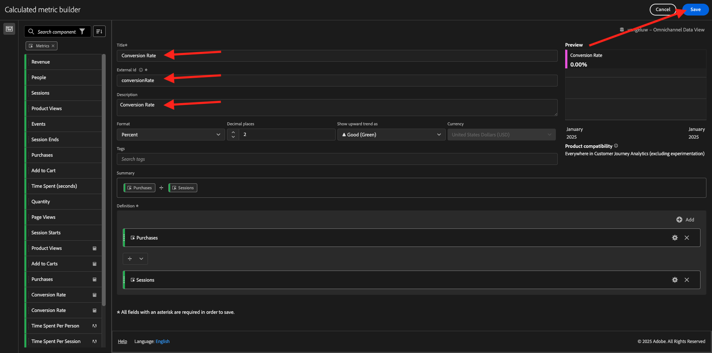

# 1.1.4 Préparation des données dans Analysis Workspace

## Objectifs

- Comprendre l’interface utilisateur d’Analysis Workspace dans CJA
- Comprendre les concepts de préparation des données dans Analysis Workspace
- Découvrez comment effectuer des calculs de données

## 1.1.4.1 de l’interface utilisateur d’Analysis Workspace dans CJA

Analysis Workspace supprime toutes les limitations standard d’un seul rapport Analytics. Il fournit une zone de travail robuste et flexible pour créer des projets d’analyse personnalisés. Faites glisser et déposez un nombre illimité de tableaux de données, de visualisations et de composants (dimensions, mesures, segments et granularités temporelles) dans un projet. Créez instantanément des répartitions et des segments, créez des cohortes pour l’analyse, créez des alertes, comparez les segments, analysez les flux et les abandons, et organisez et planifiez des rapports à partager avec tous les membres de votre entreprise.

Customer Journey Analytics ajoute cette solution aux données de Platform. Nous vous recommandons vivement de regarder cette vidéo de présentation de quatre minutes :

>[!VIDEO](https://video.tv.adobe.com/v/35109?quality=12&learn=on)

Si vous n’avez encore jamais utilisé Analysis Workspace, nous vous recommandons vivement de regarder cette vidéo :

>[!VIDEO](https://video.tv.adobe.com/v/3424559?quality=12&learn=on&captions=fre_fr)

### Création De Votre Projet

Il est maintenant temps de créer votre premier espace de travail CJA. Accédez à l’onglet **Workspace** dans CJA.
Cliquez sur **Créer un projet**.

Tu verras ça. Sélectionnez **Projet Workspace vierge** puis cliquez sur **Créer**.

Vous verrez alors un projet vide.

Tout d’abord, veillez à sélectionner la vue de données appropriée dans le coin supérieur droit de l’écran. La Vue de données à sélectionner est `--aepUserLdap-- - Omnichannel Data View`.

Ensuite, vous allez enregistrer votre projet et lui donner un nom. Vous pouvez utiliser la commande suivante pour enregistrer :

| SE | Raccourci |
| ----------------- |-------------| 
| Windows | Ctrl+S |
| Mac | Commande + S |

Cette fenêtre contextuelle s’affiche :

Veuillez utiliser cette convention de nommage :

| Nom | Description |
| ----------------- |-------------| 
| `--aepUserLdap-- - Omnichannel Analysis` | `--aepUserLdap-- - Omnichannel Analysis` |

Cliquez ensuite sur **Enregistrer**.

## 1.1.4.2 des mesures calculées

Bien que nous ayons organisé tous les composants dans la vue de données, vous devez encore en adapter certains, afin que les utilisateurs professionnels soient prêts à commencer leur analyse. En outre, au cours de toute analyse, vous pouvez créer des mesures calculées pour approfondir les résultats des informations.

Par exemple, nous allons créer un **taux de conversion** calculé à l’aide de la mesure/de l’événement **Achats** que nous avons défini dans la vue de données.

### Taux de conversion

Commençons à ouvrir le créateur de mesures calculées. Cliquez sur le **+** pour créer votre première mesure calculée dans Analysis Workspace.

Le **Créateur de mesures calculées** s’affiche :

Recherchez le **Achats** dans la liste des Mesures du menu de gauche. Sous **Mesures** cliquez sur **Tout afficher**

Faites maintenant glisser la mesure **Achats** vers la définition de la mesure calculée.

En règle générale, le taux de conversion signifie **Conversions/sessions**. Effectuons donc le même calcul dans la zone de travail de définition des mesures calculées. Recherchez la mesure **Sessions** et faites-la glisser et déposez-la dans le créateur de définitions, sous l’événement **Achats**.

Notez que l&#39;opérateur de division est automatiquement sélectionné.

Le taux de conversion est généralement représenté en pourcentage. Modifions donc le format en pourcentage et sélectionnons également 2 décimales.

Enfin, modifiez le nom et la description de la mesure calculée :

| Titre | Description | Identifiant externe |
| ----------------- |-------------| -------------| 
| Taux de conversion | Taux de conversion | conversionRate |

Vous aurez alors ceci. Cliquez sur **Enregistrer**.

Cliquez de nouveau sur **Enregistrer**.

## 1.1.4.3 dimensions calculées : filtres (segmentation) et périodes

### Filtres : dimensions calculées

Les calculs ne sont pas destinés aux seules mesures . Avant de commencer toute analyse, il est également intéressant de créer des **dimensions calculées**. Cela signifiait essentiellement **segments** de retour dans Adobe Analytics. Dans Customer Journey Analytics, ces segments sont appelés **Filtres**.

La création de filtres aidera les utilisateurs professionnels à commencer l’analyse avec des dimensions calculées importantes. Cela permettra d’automatiser certaines tâches et d’aider le volet adoption. Voici quelques exemples :

1. Média propre, Média payant,
2. Nouvelles visites et visites récurrentes
3. Clients avec panier abandonné

Ces filtres peuvent être créés avant ou pendant la partie analyse (ce que vous ferez dans l&#39;exercice suivant).

### Périodes : dimensions de temps calculé

Les dimensions Temps constituent un autre type de dimensions calculées. Certaines sont déjà créées, mais vous avez également la possibilité de créer vos propres dimensions temporelles personnalisées lors de la phase de préparation des données.

Ces dimensions de temps calculé nous aideront les analystes et les utilisateurs professionnels à mémoriser les dates importantes et à les utiliser pour filtrer et modifier l’heure de création de rapports. Les questions et les doutes typiques qui nous viennent à l’esprit lorsque nous effectuons une analyse :

- Quand était le Black Friday l&#39;année dernière ? Du 21 au 29 ?
- Quand avons-nous mené cette campagne télévisée en décembre?
- À partir de quand avons-nous fait les ventes d&#39;été 2018 ? Je veux le comparer à 2019. Au fait, connaissez-vous les jours exacts de 2019?

Vous avez maintenant terminé l’exercice de préparation des données à l’aide de CJA Analysis Workspace.

## Étapes suivantes

Accédez à la visualisation [1.1.5 à l’aide de Customer Journey Analytics](./ex5.md)(./ex2.md){target="_blank"}

Revenir à [Customer Journey Analytics](./customer-journey-analytics-build-a-dashboard.md){target="_blank"}

Revenir à [Tous les modules](./../../../../overview.md){target="_blank"}
