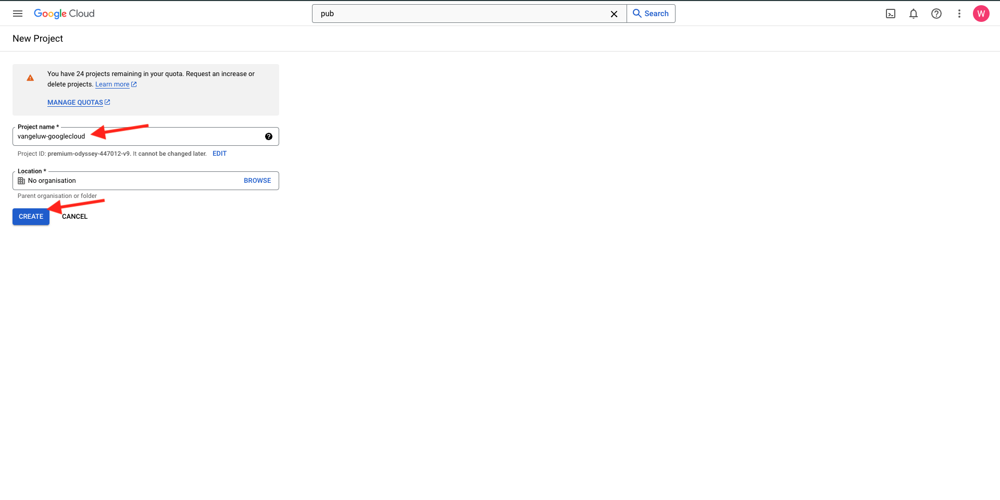

# 1.2.1 Commencer à utiliser Google Cloud Platform

>[!NOTE]
>
>Pour cet exercice, vous devez accéder à un environnement Google Cloud Platform. Si vous n&#39;avez pas encore accès à GCP, créez un compte en utilisant votre adresse e-mail personnelle.

## 1.2.1.1 Pourquoi connecter Google BigQuery à Adobe Experience Platform pour obtenir des données Google Analytics

Google Cloud Platform (GCP) est une suite de services de cloud computing public proposés par Google. La plateforme cloud Google comprend toute une gamme de services hébergés pour le développement informatique, de stockage et d’applications qui s’exécutent sur du matériel Google.

BigQuery fait partie de ces services et est toujours inclus dans Google Analytics 360. Les données Google Analytics sont fréquemment échantillonnées lorsque nous tentons d’obtenir des données directement à partir de celles-ci (API par exemple). C’est pourquoi Google inclut BigQuery pour obtenir des données non échantillonnées, afin que les marques puissent effectuer des analyses avancées à l’aide de SQL et bénéficier de la puissance de GCP.

Les données Google Analytics sont chargées quotidiennement dans BigQuery à l’aide d’un mécanisme par lots. Par conséquent, il n’est pas logique d’utiliser cette intégration GCP/BigQuery pour les cas d’utilisation de la personnalisation et de l’activation en temps réel.

Si une marque souhaite diffuser des cas d’utilisation de personnalisation en temps réel basés sur des données Google Analytics, elle peut collecter ces données sur le site web avec Google Tag Manager, puis les diffuser sur Adobe Experience Platform en temps réel.

Le connecteur Source GCP/BigQuery doit être utilisé pour...

- suivez tous les comportements des clients sur le site web et chargez ces données dans Adobe Experience Platform pour des cas d’utilisation d’analyse, de science des données et de personnalisation qui ne nécessitent pas d’activation en temps réel.
- chargement des données historiques Google Analytics dans Adobe Experience Platform, toujours pour des cas d’utilisation d’analyse et de science des données

## 1.2.1.2 votre compte Google

>[!NOTE]
>
>Pour cet exercice, vous devez accéder à un environnement Google Cloud Platform. Si vous n&#39;avez pas encore accès à GCP, créez un compte en utilisant votre adresse e-mail personnelle.

## 1.2.1.3 Sélectionner ou créer un projet

Accédez à [https://console.cloud.google.com/](https://console.cloud.google.com/).

Cliquez ensuite sur **Sélectionner un projet** ou sur un projet existant.

Si vous n’avez pas encore de projet, cliquez sur **NOUVEAU PROJET**. Si vous disposez déjà d’un projet, vous pouvez choisir de le sélectionner et de passer à l’étape suivante.

Nommez votre projet selon cette convention de nommage. Cliquez sur **CRÉER**.

| Convention |
| ----------------- |
| `--aepUserLdap---googlecloud` |

Patientez jusqu’à ce que la notification en haut à droite de l’écran vous indique que la création est terminée. Cliquez ensuite sur **SÉLECTIONNER UN PROJET**.

Ensuite, accédez à la barre de recherche en haut de l’écran et saisissez **BigQuery**. Sélectionnez le premier résultat.

L’objectif de ce module est d’obtenir des données Google Analytics dans Adobe Experience Platform. Pour ce faire, vous avez besoin de données factices dans un jeu de données Google Analytics pour commencer.

Cliquez sur **+ Ajouter** puis sur **Jeux de données publics** dans le menu de droite.

Vous verrez alors cette fenêtre :

Saisissez le terme de recherche **Google Analytics Sample** dans la barre de recherche et cliquez sur le premier résultat de la recherche.

L’écran suivant contient une description du jeu de données. Cliquez sur **AFFICHER LE JEU DE DONNÉES**.

Vous serez ensuite redirigé vers BigQuery, où vous verrez ce jeu de données **bigquery-public-data** sous **Explorer**.

Dans **l’Explorateur**, vous devriez maintenant voir un certain nombre de tableaux. N’hésitez pas à les explorer. Accédez à `google_analytics_sample`.

Cliquez pour ouvrir le tableau `ga_sessions`.

Avant de passer à l&#39;exercice suivant, notez les éléments suivants dans un fichier texte séparé sur votre ordinateur :

| Informations d’identification | Attribution d&#39;un nom | Exemple |
| ----------------- |-------------| -------------|
| Nom du projet | `--aepUserLdap---googlecloud` | vangeluw-googlecloud |
| ID de projet | random | possible-bee-447102-h3 |

Vous pouvez trouver votre nom de projet et votre ID de projet en cliquant sur votre **nom du projet** dans la barre de menu supérieure :

Votre ID de projet s’affiche alors sur le côté droit :

Vous pouvez maintenant passer à l’exercice suivant dans lequel vous vous salirez les mains en interrogeant des données Google Analytics.

## Étapes suivantes

Accédez à [1.2.2 Création de votre première requête dans BigQuery](./ex2.md){target="_blank"}

Revenez à [Ingérer et analyser des données Google Analytics dans Adobe Experience Platform avec le connecteur Source BigQuery](./customer-journey-analytics-bigquery-gcp.md){target="_blank"}

Revenir à [Tous les modules](./../../../../overview.md){target="_blank"}
