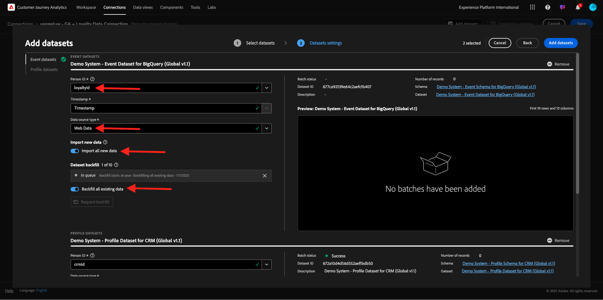
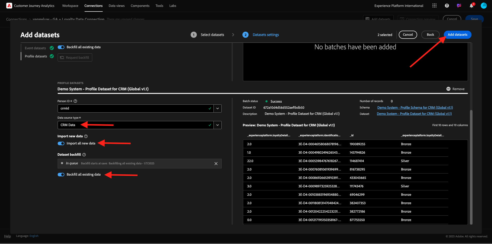
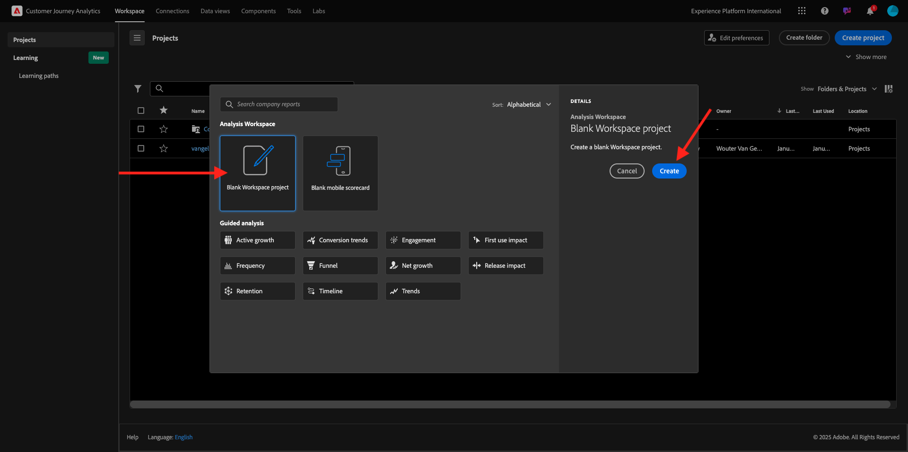
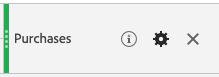
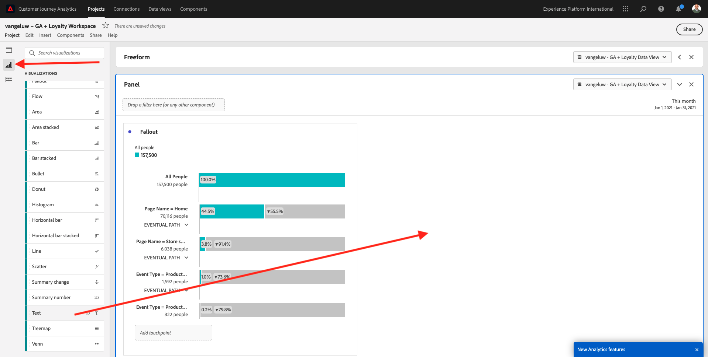
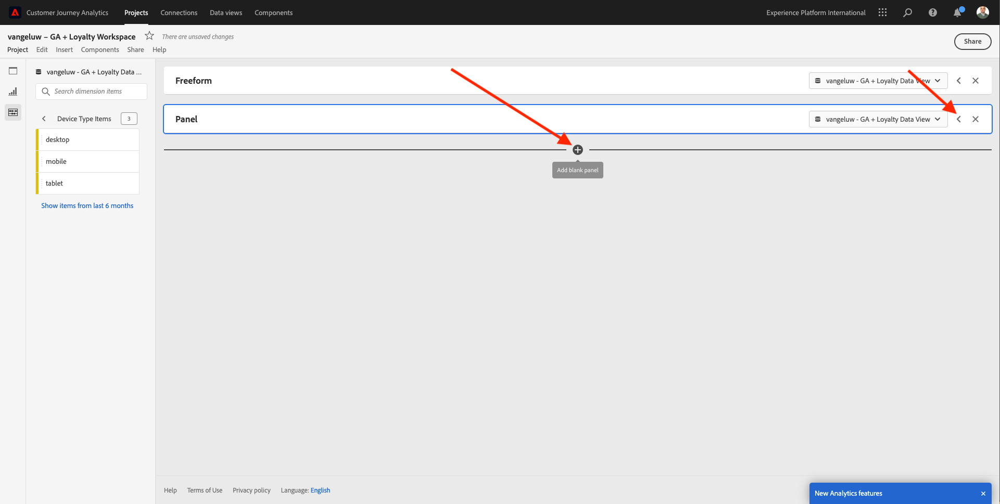
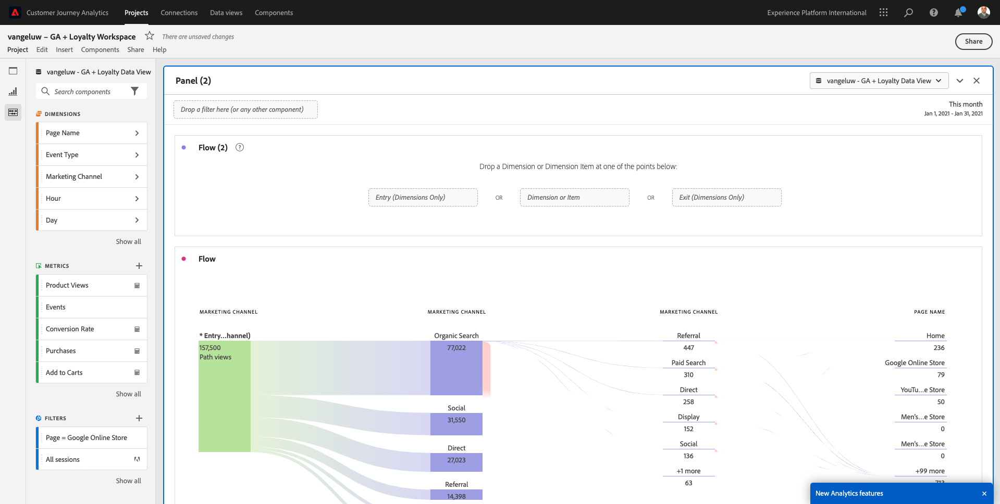
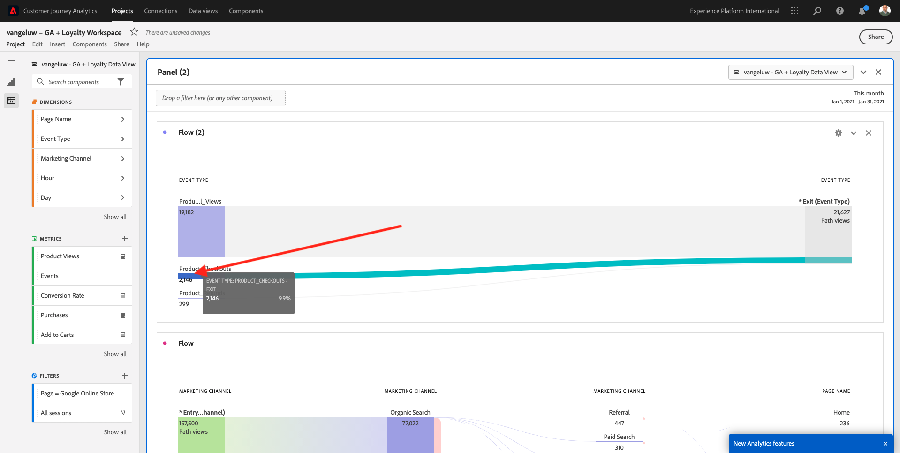

# 1.2.5 Analyse des données Google Analytics à l’aide de Customer Journey Analytics

## Objectifs

- Connecter notre jeu de données BigQuery à Customer Journey Analytics (CJA)
- Connectez-vous et rejoignez Google Analytics avec Loyalty Data.
- Se familiariser avec l’interface utilisateur de CJA

## 1.2.5.1 Créer une connexion

Accédez à [analytics.adobe.com](https://analytics.adobe.com) pour Customer Journey Analytics.

Sur la page d’accueil de Customer Journey Analytics, accédez à **Connexions**.

Vous pouvez voir ici toutes les différentes connexions établies entre CJA et Platform. Ces connexions ont le même objectif que les suites de rapports dans Adobe Analytics. Cependant, la collecte des données est totalement différente. Toutes les données proviennent de jeux de données Adobe Experience Platform.

Cliquez sur **Créer une connexion**.

L’interface utilisateur **Créer une connexion** s’affiche alors.

Pour le nom, utilisez ceci : `--aepUserLdap-- - GA + Loyalty Data Connection`.

Vous devez sélectionner le sandbox approprié à utiliser. Dans le menu Sandbox , sélectionnez votre sandbox, qui doit être `--aepSandboxName--`. Dans cet exemple, le sandbox à utiliser est **Insiders techniques**.

Définissez la **Nombre moyen d’événements quotidiens** sur **moins d’un million**.

Dans le menu des jeux de données, vous pouvez maintenant commencer à ajouter des jeux de données. Cliquez sur **Ajouter des jeux de données**.

Les jeux de données à ajouter sont :
- `Demo System - Profile Dataset for CRM (Global v1.1)`
- `Demo System - Event Dataset for BigQuery (Global v1.1)`

Recherchez les deux jeux de données, cochez leur case, puis cliquez sur **Suivant**.

Vous verrez alors ceci :

Pour l’`Demo System - Event Dataset for BigQuery (Global v1.1)` du jeu de données, remplacez **ID de personne** par **loyaltyId** et définissez **Type de source de données** sur **Données web**. Activez les deux options pour **Importer toutes les nouvelles données** et **Renvoyer toutes les données existantes**.

Pour l’`Demo System - Event Dataset for BigQuery (Global v1.1)` du jeu de données, vérifiez que l’**ID de personne** est défini sur **crmId** et définissez le **Type de source de données** sur **Données web**. Activez les deux options pour **Importer toutes les nouvelles données** et **Renvoyer toutes les données existantes**. Cliquez sur **Ajouter des jeux de données**.

Tu seras là. Cliquez sur **Enregistrer**.

Après avoir créé votre **Connexion** il peut s’écouler quelques heures avant que vos données ne soient disponibles dans CJA.

Votre connexion apparaît alors dans la liste des connexions disponibles.

## 1.2.5.2 Créer une vue de données

Une fois la connexion établie, vous pouvez passer à l’influence de la visualisation. Une différence entre Adobe Analytics et CJA réside dans le fait que CJA a besoin d’une vue de données pour nettoyer et préparer les données avant la visualisation.

Une vue de données est similaire au concept des suites de rapports virtuelles dans Adobe Analytics, où vous définissez des définitions de visite adaptées au contexte, un filtrage et également la manière dont les composants sont appelés.

Vous aurez besoin d’au moins une vue de données par connexion. Cependant, pour certains cas d’utilisation, il est préférable d’avoir plusieurs vues de données pour la même connexion, dans le but de donner des informations différentes à différentes équipes.

Si vous souhaitez que votre entreprise devienne axée sur les données, vous devez adapter la manière dont les données sont vues dans chaque équipe. Voici quelques exemples :

- Mesures UX uniquement pour l’équipe de conception UX
- Utilisez les mêmes noms pour les indicateurs clés de performance et les mesures pour Google Analytics que pour Customer Journey Analytics afin que l’équipe d’analyse numérique ne puisse parler qu’une seule langue.
- vue de données filtrée pour afficher, par exemple, les données pour 1 marché uniquement, ou 1 marque, ou uniquement pour les appareils mobiles.

Dans l’écran **Connexions**, cochez la case en regard de la connexion que vous venez de créer. Cliquez sur **Créer une vue de données**.

Vous serez redirigé vers le workflow **Créer une vue de données**.

Vous pouvez maintenant configurer les définitions de base pour votre vue de données. Par exemple, le fuseau horaire, le délai d’expiration de la session ou le filtrage des vues de données (la partie de segmentation est similaire aux suites de rapports virtuelles dans Adobe Analytics).

Le **Connexion** créé dans l’exercice précédent est déjà sélectionné. Votre connexion est nommée `--aepUserLdap-- - GA + Loyalty Data Connection`.

Attribuez ensuite un nom à votre vue de données en suivant cette convention d’affectation de nom : `--aepUserLdap-- - GA + Loyalty Data View`.

Saisissez la même valeur pour la description : `--aepUserLdap-- - GA + Loyalty Data View`.

Avant d’effectuer toute analyse ou visualisation, nous devons créer une vue de données avec tous les champs, dimensions et mesures, ainsi que leurs paramètres d’attribution.

| Champ | Convention d’affectation des noms |
| ----------------- |-------------|  
| Nommer la connexion | `--aepUserLdap-- - GA + Loyalty Data View` | vangeluw - GA + Vue de données de fidélité |
| Description | `--aepUserLdap-- - GA + Loyalty Data View` |
| Identifiant externe | `--aepUserLdap--GA` |

Cliquez sur **Enregistrer et continuer**.

Cliquez sur **Enregistrer**.

Vous pouvez désormais ajouter des composants à votre vue de données. Comme vous pouvez le constater, certaines mesures et dimensions sont ajoutées automatiquement.

Ajoutez les composants ci-dessous à la vue de données. Veillez également à mettre à jour les noms de champ vers des noms conviviaux. Pour ce faire, sélectionnez la mesure ou la dimension et mettez à jour le champ **Nom du composant** dans le menu de droite.

| Type de composant | Nom d’origine du composant | Nom d’affichage | Chemin du composant |
| -----------------| -----------------|-----------------|-----------------|
| Mesure | commerce.checkouts.value | Passages en caisse | `commerce.checkouts.value` |
| Mesure | commerce.productListRemovals.value | Retraits du panier | `commerce.productListRemovals.value` |
| Mesure | commerce.productListAdds | Ajouts au panier | `commerce.productListAdds` |
| Mesure | commerce.productViews.value | Consultations produits | `commerce.productViews.value` |
| Mesure | commerce.purchases.value | Achats | `commerce.purchases.value` |
| Mesure | web.webPageDetails.pageViews | Pages vues | `web.webPageDetails.pageViews` |
| Mesure | points | Points de fidélité | `_experienceplatform.loyaltyDetails.points` |
| Dimension | niveau | Niveau de fidélité | `_experienceplatform.loyaltyDetails.level` |
| Dimension | channel.mediaType | Medium de trafic | `channel.mediaType` |
| Dimension | channel.typeAtSource | Source de trafic | `channel.typeAtSource` |
| Dimension | Code de suivi | Canal marketing | `marketing.trackingCode` |
| Dimension | gaid | GOOGLE ANALYTICS ID | `_experienceplatform.identification.core.gaid` |
| Dimension | web.webPageDetails.name | Titre de la page | `web.webPageDetails.name` |
| Dimension | Fournisseur | Navigateur | `environment.browserDetails.vendor` |
| Dimension | Type | Type d’appareil | `device.type` |
| Dimension | loyaltyId | ID de fidélité | `_experienceplatform.identification.core.loyaltyId` |
| Dimension | commerce.order.payments.transactionID | Identifiant de transaction | `commerce.order.payments.transactionID` |
| Dimension | eventType | Type d’événement | `eventType` |
| Dimension | date et heure | Date et heure | `timestamp` |
| Dimension | `_id` | Identifiant | `_id` |

Vous aurez alors quelque chose comme ceci :

Ensuite, vous devez apporter des modifications au contexte Personne et Session pour certains de ces composants en modifiant les **Paramètres d’attribution ou de persistance**.

Modifiez les **Paramètres d’attribution** pour les composants ci-dessous :

| Composant |
| -----------------|
| Source de trafic |
| Canal marketing |
| Navigateur |
| Medium de trafic |
| Type d’appareil |
| GOOGLE ANALYTICS ID |

Pour ce faire, sélectionnez le composant, cliquez sur **Utiliser un modèle d’attribution personnalisé** et définissez le **Modèle** sur **Le plus récent**, puis le **Expiration** sur **Fenêtre de création de rapports de personne**. Répétez cette opération pour tous les composants mentionnés ci-dessus.

Après avoir apporté les modifications aux paramètres d’attribution pour tous les composants mentionnés ci-dessus, vous devriez alors disposer de cette vue. Cliquez sur **Enregistrer et continuer**.

Aucune modification n’est requise sur l’écran **Paramètres**. Cliquez sur **Enregistrer et terminer**.

Vous êtes maintenant prêt à analyser les données Google Analytics dans Adobe Analytics Analysis Workspace. Passons au prochain exercice.

## 1.2.5.3 Créer votre projet

Dans Customer Journey Analytics, accédez à **Workspace**. Cliquez sur **Créer un projet**

Sélectionnez **Projet Workspace vierge** puis cliquez sur **Créer**.

Vous disposez maintenant d’un projet vierge :

Tout d’abord, enregistrez votre projet et donnez-lui un nom. Vous pouvez utiliser la commande suivante pour enregistrer :

| SE | Raccourci |
| ----------------- |-------------| 
| Windows | Ctrl+S |
| Mac | Commande + S |

Vous verrez cette fenêtre contextuelle. Veuillez utiliser cette convention de nommage :

| Nom | Description |
| ----------------- |-------------| 
| `--aepUserLdap-- – GA + Loyalty Workspace` | `--aepUserLdap-- – GA + Loyalty Workspace` |

Cliquez ensuite sur **Enregistrer**.

Ensuite, veillez à sélectionner la vue de données appropriée dans le coin supérieur droit de votre écran. Il s’agit de la vue de données que vous avez créée dans l’exercice précédent, avec la convention de nommage `--aepUserLdap-- - GA + Loyalty Data View`.

### 1.2.5.3.1 Tableaux à structure libre

Les tableaux à structure libre fonctionnent plus ou moins comme des tableaux croisés dynamiques dans Excel. Vous choisissez un élément dans la barre de gauche, puis vous le faites glisser et le déposez dans la structure libre pour obtenir un rapport tabulaire.

Les tableaux à structure libre sont presque illimités. Vous pouvez faire (presque) n’importe quoi, ce qui est très utile par rapport à Google Analytics (car cet outil présente certaines limites en matière d’analyse). C’est l’une des raisons pour lesquelles charger des données Google Analytics dans un autre outil d’analyse.

Découvrez deux exemples dans lesquels vous devez utiliser SQL, BigQuery et du temps pour répondre à des questions simples qui ne sont pas possibles dans l’interface utilisateur de Google Analytics ou Google Data Studio :

- Combien de personnes arrivent au passage en caisse à partir du navigateur Safari divisé par canal marketing ? Vérifiez que la mesure de passage en caisse est filtrée par le navigateur Safari. Nous avons simplement fait glisser et déposé la variable Browser = Safari en haut de la colonne checkout.

- En tant qu’analyste, je peux constater que le canal marketing social présente de faibles conversions. J’utilise l’attribution Dernière touche par défaut, mais qu’en est-il de la première touche ? Pointez sur une mesure, les paramètres de mesure s’affichent. Là, je peux sélectionner le modèle d’attribution de mon choix. Vous pouvez effectuer Attribution dans GA (et non dans data studio) en tant qu’activité autonome, mais vous ne pouvez pas avoir d’autres mesures ou dimensions non liées à l’analyse d’attribution dans la même table.

Répondons à ces questions et à d’autres avec Analysis Workspace dans CJA.

Sélectionnez tout d’abord la période appropriée (**Aujourd’hui**) sur le côté droit du panneau. Cliquez sur **Appliquer**.

>[!NOTE]
>
>Si vous venez de créer les **Connexion de données** et **Vue de données** il se peut que vous deviez attendre quelques heures. CJA a besoin d’un certain temps pour renvoyer les données historiques lorsqu’il y a un grand nombre d’enregistrements de données.

Faisons glisser et déposez quelques dimensions et mesures pour analyser les canaux marketing. Commencez par utiliser la dimension **Canal marketing**, puis faites-la glisser et déposez-la dans la zone de travail du **tableau à structure libre**. (Cliquez sur **Tout afficher** au cas où vous ne verriez pas immédiatement la mesure dans le menu Mesures )

Vous verrez alors ceci :

Vous devez ensuite ajouter les mesures au tableau à structure libre. Ajoutez les mesures suivantes : **Personnes**, **Sessions**, **Consultations de produit**, **Passages en caisse**, **Achats**, **Taux de conversion** (mesure calculée).

Avant de pouvoir procéder, vous devez créer la mesure calculée **taux de conversion**. Pour ce faire, cliquez sur l’icône **+** en regard de Mesures :

Pour nommer la mesure calculée, utilisez **Taux de conversion** et **taux de conversion** pour **ID externe**. Faites ensuite glisser les mesures **achat** et **sessions** sur la zone de travail. Définissez **Format** sur **Pourcentage** et **Nombre de décimales** sur **2**. Enfin, cliquez sur **Enregistrer**.

Cliquez sur **Enregistrer**.

Ensuite, pour utiliser toutes ces mesures dans le **Tableau à structure libre**, faites-les glisser une par une sur le **Tableau à structure libre**. Voir l’exemple ci-dessous.

Vous vous retrouverez avec une table comme celle-ci :

Comme mentionné ci-dessus, les **tableaux à structure libre** vous donnent la liberté dont vous avez besoin pour effectuer une analyse approfondie. Par exemple, vous pouvez sélectionner n’importe quel autre Dimension pour ventiler une mesure spécifique à l’intérieur du tableau.

Par exemple, accédez aux dimensions, puis recherchez et sélectionnez la variable **Browser**.

Vous verrez ensuite un aperçu des valeurs disponibles pour ce Dimension.

Sélectionnez le Dimension **Safari** et glissez-déposez-le en haut d’une mesure, par exemple **Passages en caisse**. Vous verrez alors ceci :

Ce faisant, vous venez de répondre à une question potentielle que vous aviez : combien de personnes arrivent sur la page de passage en caisse à l’aide de Safari, divisé par canal marketing ?

Répondons maintenant à la question Attribution .

Recherchez la mesure **Achat** dans le tableau.

Pointez sur la mesure pour afficher une icône **Paramètres**. Cliquez dessus.

Un menu contextuel s’affiche. Cochez la case **modèle d’attribution autre que par défaut**.

Dans la fenêtre contextuelle qui s’affiche, vous pouvez facilement modifier les modèles d’attribution et l’intervalle de recherche en amont (ce qui est assez complexe à obtenir avec SQL).

Sélectionnez **Première touche** comme modèle d’attribution.

Sélectionnez **Personne** pour l’intervalle de recherche en amont.

Cliquez maintenant sur **Appliquer**.

Vous pouvez maintenant constater que le modèle d’attribution pour cette mesure en particulier est Désormais Première touche.

Vous pouvez effectuer autant de répartition que vous le souhaitez, sans limites de types de variables, de segments, de dimensions ou de périodes.

Un aspect encore plus spécial est la possibilité de joindre n’importe quel jeu de données de Adobe Experience Platform pour enrichir les données comportementales numériques de Google Analytics. Par exemple, les données hors ligne, de centre d’appel, de fidélité ou de gestion de la relation client.

Pour présenter cette fonctionnalité, nous allons configurer votre première répartition qui combine des données hors ligne avec des données en ligne. Sélectionnez la dimension **Niveau de fidélité**, puis faites-la glisser et déposez-la sur n’importe quel **Canal marketing**, par exemple, **Recherche organique** :

Analysons ensuite quel **type d’appareil** est utilisé par les clients qui se sont rendus sur le site à l’aide de **recherche organique** avec un **niveau de fidélité** qui est **bronze**. Prenez le Dimension **Type d’appareil** et glissez-déposez-le sur **Bronze**. Vous verrez alors ceci :

Comme vous pouvez le constater, le niveau de fidélité est utilisé pour votre première répartition. Cette dimension provient d’un jeu de données et d’un schéma différents de celui que vous avez utilisé pour le connecteur BigQuery. L’ID de personne **loyaltyID** (système de démonstration - schéma d’événement pour BigQuery (global v1.1)) et **loyaltyID** (système de démonstration - schéma de profil pour la fidélité (global v1.1)) correspondent. Par conséquent, vous pouvez combiner les événements d’expérience de Google Analytics avec les données de profil du schéma de fidélité.

Nous pouvons continuer à fractionner les lignes avec des segments ou des périodes spécifiques (peut-être pour refléter des campagnes TV spécifiques) pour poser des questions à Customer Journey Analytics et obtenir les réponses en déplacement.

Obtenir le même résultat final avec SQL, puis un outil de visualisation tiers, est un véritable défi. Surtout quand on pose des questions et qu&#39;on essaie d&#39;obtenir des réponses à la volée. Customer Journey Analytics ne présente pas ce problème et permet aux analystes de données d’interroger les données de manière flexible et en temps réel.

## 1.2.5.3.2 Analyse de l’entonnoir ou des abandons

Les entonnoirs sont un excellent mécanisme pour comprendre les principales étapes d’un parcours client. Ces étapes peuvent également provenir d’interactions hors ligne (par exemple, depuis le centre d’appel), puis vous pouvez les combiner avec des points de contact numériques dans le même entonnoir.

Customer Journey Analytics vous permet de le faire, et bien plus encore. Si vous vous souvenez du Module 13, nous avons pu cliquer avec le bouton droit et faire des choses comme :

- Analyser la destination des utilisateurs après une étape d’abandon
- Créer un segment à partir de n’importe quel point de l’entonnoir
- Afficher la tendance à n’importe quelle étape d’une visualisation de graphique linéaire

Voyons une autre chose que vous pouvez faire : comment se porte mon entonnoir de Parcours client ce mois-ci par rapport au mois précédent ? Qu’en est-il des appareils mobiles par rapport aux ordinateurs de bureau ?

Vous allez créer deux panneaux ci-dessous :

- Analyse de l’entonnoir (janvier)
- Analyse de l’entonnoir (février)

Vous verrez que nous comparons un entonnoir sur différentes périodes (janvier et février) fractionnées par type d’appareil.

Ce type d’analyse n’est pas possible dans l’interface utilisateur de Google Analytics ou est très limité. CJA ajoute donc une nouvelle fois beaucoup de valeur aux données capturées par Google Analytics.

Pour créer votre première visualisation des abandons. Fermez le panneau actuel pour en démarrer un nouveau.

Regardez le côté droit du panneau et cliquez sur la flèche pour le fermer.

Cliquez ensuite sur **+** pour créer un panneau.

Sélectionnez maintenant la visualisation **Abandons**.

En tant qu’analyste, imaginez que vous souhaitez comprendre ce qui se passe avec votre entonnoir principal d’e-commerce : Accueil > Recherche interne > Détails du produit > Passage en caisse > Achat.

Commençons par ajouter de nouvelles étapes à l’entonnoir. Pour ce faire, ouvrez la dimension **Nom de la page**.

Vous verrez ensuite toutes les pages disponibles qui ont été visitées.

Effectuez un glisser-déposer **Accueil** vers la première étape.

Lors de la deuxième étape, utilisez les résultats de la recherche **Store**

Vous devez maintenant ajouter des actions d’e-commerce. Dans la section Dimensions, recherchez la dimension Dimension **Type d’événement**. Cliquez pour ouvrir la dimension.

Sélectionnez **Product_Detail_Views** et faites-le glisser et déposez-le à l’étape suivante.

Sélectionnez **Product_Checkouts** et glissez-déposez-le à l’étape suivante.

Redimensionnez la visualisation des abandons.

Votre visualisation des abandons est maintenant prête.

Pour commencer à analyser et à documenter les informations, il est toujours préférable d’utiliser une visualisation **Texte**. Pour ajouter une visualisation **Texte**, cliquez sur l’icône **Graphique** dans le menu de gauche pour afficher toutes les visualisations disponibles. Faites ensuite glisser et déposez la visualisation **Texte** sur la zone de travail. Redimensionnez-le et déplacez-la afin qu’elle ressemble à l’image ci-dessous.

Et encore une fois, redimensionnez-le pour l’adapter au tableau de bord :

Les visualisations des abandons permettent également les répartitions. Utilisez la dimension **Type d’appareil** en l’ouvrant, puis faites glisser et déposez certaines des valeurs une par une sur la visualisation :

Vous obtiendrez une visualisation plus avancée :

Customer Journey Analytics vous permet de le faire, et bien plus encore. En cliquant avec le bouton droit n’importe où dans l’abandon, vous pouvez...

- Analysez la direction prise par les utilisateurs à partir d’une étape d’abandon
- Créer un segment à partir de n’importe quel point de l’entonnoir
- Génération de tendances pour n’importe quelle étape d’une visualisation Ligne
- Comparez visuellement n’importe quel entonnoir à différentes périodes.

Par exemple, effectuez un clic droit à n’importe quelle étape de l’abandon pour afficher certaines de ces options d’analyse.

## 1.2.5.3.3 Analyse et visualisation des flux

Si vous souhaitez effectuer une analyse de flux avancée à l’aide de Google Analytics, vous devez utiliser le langage SQL pour extraire les données, puis utiliser une solution tierce pour la partie visualisation. Customer Journey Analytics vous aidera à cet égard.

Au cours de cette étape, vous allez configurer une analyse de flux pour répondre à cette question : quels sont les principaux canaux contribuant à une page de destination spécifique ?  Avec deux glisser-déposer et un clic, en tant qu’analyste, vous pouvez découvrir le flux de l’utilisateur vers la page de destination avec les deux dernières touches des canaux marketing.

Autres questions auxquelles Customer Journey Analytics peut vous aider à répondre :

- Quelle est la principale combinaison de canaux avant une page de destination spécifique ?
- Qu’est-ce qui pousse un utilisateur à quitter la session lorsqu’il arrive au passage en caisse du produit ? Où en sont les étapes précédentes ?

Commençons encore une fois par un panneau vierge pour répondre à ces questions. Fermez le panneau actuel et cliquez sur **+**.

Sélectionnez maintenant la visualisation **Flux**.

Nous allons maintenant configurer une analyse de flux de canal marketing à chemins multiples. Faites glisser et déposez la dimension **Canal marketing** dans la zone **Dimensions d’entrée**.

Vous pouvez maintenant voir les premiers chemins d’entrée :

Cliquez sur le premier chemin d’accès pour l’analyser en profondeur.

Vous pouvez maintenant voir le chemin suivant (Canal marketing).

Faisons un troisième examen plus approfondi. Cliquez sur la première option du nouveau chemin, **Référence**.

Vous devriez maintenant voir la visualisation comme suit :

Compliquons les choses. Imaginez que vous souhaitiez analyser ce qu’était la page de destination après deux chemins marketing ? Pour ce faire, vous pouvez utiliser une dimension secondaire pour modifier le dernier chemin d’accès. Recherchez la dimension **Nom de la page** et effectuez un glisser-déposer comme suit :

Vous verrez maintenant ceci :

Faisons une autre analyse de flux. Cette fois, vous analyserez ce qui s&#39;est passé après un point de sortie spécifique. D’autres solutions Analytics nécessitent l’utilisation de SQL/ETL et, encore une fois, d’un outil de visualisation tiers pour obtenir le même résultat.

Ajoutez une nouvelle **Visualisation de flux** au panneau.

Voici ce que vous obtiendrez :

Recherchez le Dimension **Type d’événement** et faites-le glisser et déposez-le dans la zone **Dimension de sortie**.

Vous pouvez maintenant voir quels **types d’événement** chemins d’accès ont conduit les clients à la sortie.

Examinons ce qui s’est passé avant la sortie de l’action de passage en caisse. Cliquez sur le chemin **Product_Checkouts** :

Un nouveau chemin d’action s’affiche avec des données qui ne sont pas instructives.

Analysons plus en détail ! Recherchez le Dimension **Nom de la page**, puis faites-le glisser et déposez-le sur le nouveau chemin d’accès généré.

Vous disposez désormais d’une analyse avancée de flux effectuée en quelques minutes. Vous pouvez cliquer sur les différents chemins pour voir comment ils se connectent de la sortie aux étapes précédentes.

Vous disposez désormais d’un kit puissant pour analyser les entonnoirs et explorer les chemins du comportement des clients sur les points de contact numériques mais également hors ligne.

N’oubliez pas d’enregistrer vos modifications !

## 1.2.5.4 Partager le projet

>[!IMPORTANT]
>
>Le contenu ci-dessous est fourni à titre d’information. Vous n’avez **PAS** à partager votre projet avec qui que ce soit d’autre.

À titre d’information - Vous pouvez partager ce projet avec des collègues pour collaborer ou analyser des questions commerciales ensemble.

## Étapes suivantes

Accédez à [ Résumé et avantages ](./summary.md){target="_blank"}

Revenez à [Ingérer et analyser des données Google Analytics dans Adobe Experience Platform avec le connecteur Source BigQuery](./customer-journey-analytics-bigquery-gcp.md){target="_blank"}

Revenir à [Tous les modules](./../../../../overview.md){target="_blank"}
