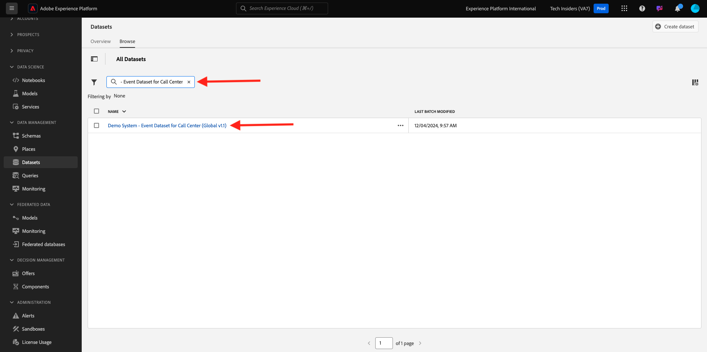

# 2.1.2 Prise En Main

## Se familiariser avec l’interface utilisateur de Adobe Experience Platform

Accédez à [Adobe Experience Platform](https://experience.adobe.com/platform). Une fois connecté, vous accédez à la page d’accueil de Adobe Experience Platform.

Avant de continuer, vous devez sélectionner un **sandbox**. Le sandbox à sélectionner est nommé ``--aepSandboxName--``. Après avoir sélectionné la [!UICONTROL sandbox] appropriée, la modification d’écran s’affiche et vous êtes maintenant dans votre [!UICONTROL sandbox] dédié.

## Explorer des données sur la plateforme

Importer des données provenant de différents canaux est une tâche difficile pour toute marque. Dans le cadre de cet exercice, les clients de Citi Signal interagissent avec Citi Signal sur son site web et son application mobile, les données d&#39;achat sont collectées par le système de point de vente de Citi Signal et ils disposent de données de gestion de la relation client et de fidélité. Citi Signal utilise Adobe Analytics et Adobe Launch pour capturer des données sur son site web, son application mobile ainsi que son système de point de vente, de sorte que ces données circulent déjà dans Adobe Experience Platform. Commençons par explorer toutes les données de Citi Signal qui existent déjà dans Adobe Experience Platform.

Dans le menu de gauche, accédez à **Jeux de données**.

Citi Signal diffuse des données en continu dans Adobe Experience Platform et ces données sont disponibles dans le jeu de données `Demo System - Event Dataset for Website (Global v1.1)`. Recherchez `Demo System - Event Dataset for Website`.

Les données d&#39;interaction du centre d&#39;appel de Citi Signal sont capturées dans le jeu de données `Demo System - Event Dataset for Call Center (Global v1.1)`. Recherchez des données `Demo System - Event Dataset for Call Center` dans la zone de recherche. Cliquez sur le nom du jeu de données pour l’ouvrir.

Après avoir cliqué sur le jeu de données, vous obtiendrez un aperçu de l’activité du jeu de données, tel que les lots ingérés et en échec. Cliquez sur **Prévisualiser le jeu de données** pour afficher un exemple des données stockées dans `Demo System - Event Dataset for Call Center (Global v1.1)` jeu de données.

Le panneau de gauche affiche la structure du schéma de ce jeu de données et, sur le côté droit, vous verrez un exemple des données ingérées.

Cliquez sur **Fermer** pour fermer la fenêtre **Prévisualiser le jeu de données**.

## Présentation de Query Service

Pour accéder à Query Service, cliquez sur **Requêtes** dans le menu de gauche.

En accédant à **Journal**, vous verrez la page Liste des requêtes, qui fournit une liste de toutes les requêtes qui ont été exécutées dans cette organisation, la dernière en date étant en haut.

Cliquez sur une requête SQL de la liste et observez les détails fournis dans le rail de droite.

Vous pouvez faire défiler la fenêtre pour afficher la requête entière ou cliquer sur l’icône mise en surbrillance ci-dessous pour copier l’intégralité de la requête dans votre bloc-notes. Il n’est pas nécessaire de copier la requête pour le moment.

Vous ne pouvez pas simplement voir les requêtes qui ont été exécutées. Cette interface utilisateur vous permet de créer de nouveaux jeux de données à partir de requêtes. Ces jeux de données peuvent être liés au profil client en temps réel de Adobe Experience Platform ou peuvent être utilisés comme entrée pour Adobe Experience Platform Data Science Workspace.

## Connecter le client PSQL à Query Service

Query Service prend en charge les clients avec un pilote pour PostgreSQL. Dans ce cadre, nous utiliserons PSQL, une interface de ligne de commande, et Power BI ou Tableau. Se connecter à PSQL.

Cliquez sur **Informations d’identification**.

L’écran ci-dessous s’affiche. L’écran fournit des informations sur le serveur et des informations d’identification pour l’authentification à Query Service. Pour l’instant, nous allons nous concentrer sur le côté droit de l’écran qui contient une commande de connexion pour PSQL. Cliquez sur le bouton Copier pour copier la commande dans le presse-papiers.

Pour Windows : ouvrez la ligne de commande en appuyant sur la touche Windows et en tapant cmd, puis en cliquant sur le résultat de l’invite de commande.

Pour macOS : ouvrez terminal.app via la recherche Spotlight :

Collez la commande de connexion que vous avez copiée à partir de l’interface utilisateur de Query Service et appuyez sur Entrée dans la fenêtre d’invite de commande :

Windows :

MACOS :

Vous êtes désormais connecté à Query Service à l’aide de PSQL.

Dans les exercices suivants, il y aura une certaine interaction avec cette fenêtre. Nous l’appellerons votre interface de ligne de commande **PSQL**.

Vous êtes maintenant prêt à commencer à envoyer des requêtes.

## Étapes suivantes

Accédez à la version [2.1.3 en utilisant Query Service](./ex3.md){target="_blank"}

Revenez à [Query Service](./query-service.md){target="_blank"}

Revenir à [Tous les modules](./../../../../overview.md){target="_blank"}
