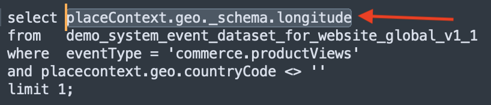

# 2.1.3 Utilisation de Query Service

## Objectif

- Rechercher et explorer les jeux de données
- Découvrez comment traiter les objets et les attributs des modèles de données d’expérience dans vos requêtes

## Contexte

Dans cette vidéo, vous apprendrez à utiliser PSQL pour récupérer des informations sur les jeux de données disponibles, comment écrire des requêtes pour le modèle de données d’expérience (XDM) et écrire vos premières requêtes de création de rapports simples à l’aide des jeux de données Query Service et Citi Signal.

## Requêtes de base

Dans cette section, vous découvrirez les méthodes permettant de récupérer des informations sur les jeux de données disponibles et comment récupérer correctement des données avec une requête à partir d’un jeu de données XDM.

Tous les jeux de données que nous avons explorés via Adobe Experience Platform au début de l’année 1 sont également disponibles à l’accès via une interface SQL sous forme de tables. Pour répertorier ces tableaux, vous pouvez utiliser la commande **show tables;**.

Exécutez `show tables;` dans votre interface de ligne de commande **PSQL**. (n’oubliez pas de terminer votre commande par un point-virgule).

Copiez la `show tables;` de commande et collez-la à l&#39;invite :


Le résultat est le suivant :

```text
tech-insiders:all=> show tables;
                               name                               |                                                  dataSetId                                                   |                                       dataSet                                        | description |        labels        
------------------------------------------------------------------+--------------------------------------------------------------------------------------------------------------+--------------------------------------------------------------------------------------+-------------+----------------------
 ajo_bcc_feedback_event_dataset                                   | 672a07cb7728e82aefa1ec56                                                                                     | AJO BCC Feedback Event Dataset                                                       |             | 
 ajo_classification_dataset                                       | 672a07cab55b0d2aef6f9626                                                                                     | AJO Classification Dataset                                                           |             | 
 ajo_consent_service_dataset                                      | 672a07c80fd5fd2aee4155ca                                                                                     | AJO Consent Service Dataset                                                          |             | 'PROFILE'
 ajo_email_tracking_experience_event_dataset                      | 672a07c926d57d2aef020230                                                                                     | AJO Email Tracking Experience Event Dataset                  :
                               name                               |                                                  dataSetId                                                   |                                       dataSet                                        | description |        labels        
------------------------------------------------------------------+--------------------------------------------------------------------------------------------------------------+--------------------------------------------------------------------------------------+-------------+----------------------
 ajo_bcc_feedback_event_dataset                                   | 672a07cb7728e82aefa1ec56                                                                                     | AJO BCC Feedback Event Dataset                                                       |             | 
 ajo_classification_dataset                                       | 672a07cab55b0d2aef6f9626                                                                                     | AJO Classification Dataset                                                           |             | 
 ajo_consent_service_dataset                                      | 672a07c80fd5fd2aee4155ca                                                                                     | AJO Consent Service Dataset                                                          |             | 'PROFILE'
 ajo_email_tracking_experience_event_dataset                      | 672a07c926d57d2aef020230                                                                                     | AJO Email Tracking Experience Event Dataset   
```

Au signe deux-points, appuyez sur la barre d’espace pour afficher la page suivante du jeu de résultats ou saisissez `q` pour revenir à l’invite de commande.

Chaque jeu de données dans AEP possède son tableau Query Service correspondant. Vous pouvez trouver une table de jeu de données via l’interface utilisateur des jeux de données :


La table `demo_system_event_dataset_for_website_global_v1_1` est la table Query Service qui correspond au jeu de données `Demo System - Event Schema for Website (Global v1.1)`.

Pour obtenir des informations sur l’emplacement d’affichage d’un produit, nous sélectionnons les informations **géographiques**.

Copiez la requête ci-dessous et collez-la à l’invite de votre interface de ligne de commande **PSQL** et appuyez sur Entrée :

```sql
select placecontext.geo
from   demo_system_event_dataset_for_website_global_v1_1
where  eventType = 'commerce.productViews'
and placecontext.geo.countryCode <> ''
limit 1;
```

Dans le résultat de votre requête, vous remarquerez que les colonnes du modèle de données d’expérience (XDM) peuvent être de types complexes et pas seulement de types scalaires. Dans la requête ci-dessus, nous aimerions identifier les emplacements géographiques où un **commerce.productViews** s’est produit. Pour identifier un **commerce.productViews** nous devons parcourir le modèle XDM à l’aide de l’**.notation** (point).

```text
tech-insiders:all=> select placecontext.geo
from   demo_system_event_dataset_for_website_global_v1_1
where  eventType = 'commerce.productViews'
and placecontext.geo.countryCode <> ''
limit 1;
                 geo                  
--------------------------------------
 ("(51.59119,-1.407848)",Charlton,GB)
(1 row)
```

Notez que le résultat est un objet plat plutôt qu’une valeur unique ? L’objet **placecontext.geo** contient quatre attributs : schema, country et city. Et lorsqu’un objet est déclaré en tant que colonne, il renvoie l’objet entier en tant que chaîne. Le schéma XDM peut être plus complexe que vous ne le connaissez, mais il est très puissant et a été conçu pour prendre en charge de nombreuses solutions, canaux et cas d’utilisation.

Pour sélectionner les propriétés individuelles d’un objet, utilisez la **.notation** (point).

Copiez l’instruction ci-dessous et collez-la à l’invite de votre interface de ligne de commande **PSQL** :

```sql
select placecontext.geo._schema.longitude
      ,placecontext.geo._schema.latitude
      ,placecontext.geo.city
      ,placecontext.geo.countryCode
from   demo_system_event_dataset_for_website_global_v1_1
where  eventType = 'commerce.productViews'
and placecontext.geo.countryCode <> ''
limit 1;
```

Le résultat de la requête ci-dessus doit ressembler à ceci.
Le résultat est maintenant un ensemble de valeurs simples :

```text
tech-insiders:all=> select placecontext.geo._schema.longitude
      ,placecontext.geo._schema.latitude
      ,placecontext.geo.city
      ,placecontext.geo.countryCode
from   demo_system_event_dataset_for_website_global_v1_1
where  eventType = 'commerce.productViews'
and placecontext.geo.countryCode <> ''
limit 1;
 longitude | latitude |   city   | countrycode 
-----------+----------+----------+-------------
 -1.407848 | 51.59119 | Charlton | GB
(1 row)
```

Ne vous inquiétez pas, il existe un moyen facile d’obtenir le chemin d’accès à une propriété spécifique. Dans la partie suivante, vous apprendrez comment procéder.

Vous devrez modifier une requête. Ouvrons donc d’abord un éditeur.

Sous Windows : utilisez **Bloc-notes**

Sous Mac : installez l’application d’éditeur de texte de votre choix et ouvrez-la.

Copiez l’instruction suivante dans votre éditeur de texte :

```sql
select your_attribute_path_here
from   demo_system_event_dataset_for_website_global_v1_1
where  eventType = 'commerce.productViews'
and placecontext.geo.countryCode <> ''
limit 1;
```

Revenez à l’interface utilisateur de Adobe Experience Platform (doit s’ouvrir dans votre navigateur) ou accédez à [Adobe Experience Platform](https://experience.adobe.com/platform).

Sélectionnez **Schémas**, saisissez `Demo System - Event Schema for Website` dans le champ **rechercher** et cliquez pour ouvrir le `Demo System - Event Schema for Website (Global v1.1) Schema` de schéma.


Explorez le modèle XDM pour **Système de démonstration - Schéma d’événement pour un site web (version 1.1 globale)** en cliquant sur un objet. Développez l’arborescence pour **placecontext**, **geo** et **schema**. Lorsque vous sélectionnez l’attribut réel **longitude**, le chemin d’accès complet s’affiche dans la zone rouge en surbrillance. Pour copier le chemin d’accès de l’attribut, cliquez sur l’icône Copier le chemin .


Basculez vers votre bloc-notes/vos crochets et supprimez **your_attribute_path_here** de la première ligne. Placez le curseur après **select** sur la première ligne et collez-le (Ctrl+V).



Copiez l’instruction modifiée et collez-la à l’invite de votre interface de ligne de commande **PSQL** et appuyez sur Entrée.

Le résultat doit ressembler à ceci :

```text
tech-insiders:all=> select placeContext.geo._schema.longitude
from   demo_system_event_dataset_for_website_global_v1_1
where  eventType = 'commerce.productViews'
and placecontext.geo.countryCode <> ''
limit 1;
 longitude 
-----------
 -1.407848
(1 row)
```

## Étapes suivantes

Accédez à [2.1.4 Requêtes, requêtes, requêtes... et analyse de l’attrition](./ex4.md){target="_blank"}

Revenez à [Query Service](./query-service.md){target="_blank"}

Revenir à [Tous les modules](./../../../../overview.md){target="_blank"}
