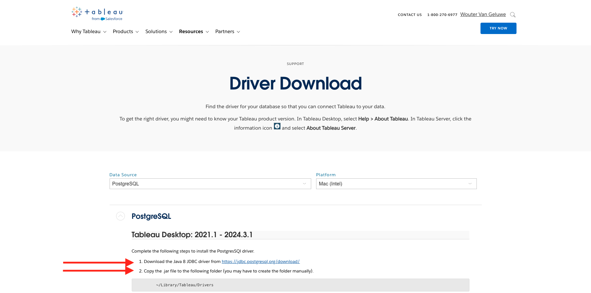

# 2.1.7 Query Service et Tableau

Ouvrez Tableau.

Dans **Se connecter à un serveur**, cliquez sur **Plus** puis sur **PostgreSQL**.

Si vous n&#39;avez pas encore utilisé PostgreSQL avec Tableau, ceci peut s&#39;afficher. Cliquez sur **Télécharger le pilote**.

Suivez les instructions pour télécharger et installer le pilote PostgreSQL.

Une fois l&#39;installation du pilote terminée, quittez et redémarrez Tableau Desktop. Ensuite, après le redémarrage, accédez à **Se connecter à un serveur** puis cliquez de nouveau sur **Plus** et sur **PostgreSQL**.

Tu verras ça.

Accédez à Adobe Experience Platform, à **Requêtes** et à **Informations d’identification**.

À partir de la page **Informations d&#39;identification** de Adobe Experience Platform, copiez le **Hôte** et collez-le dans le champ **Serveur**, copiez le **Base de données** et collez-le dans le champ **Base de données** de Tableau, copiez le **Port** et collez-le dans le champ **Port** dans Tableau, faites de même pour **NomUtilisateur** et **MotDePasse**. Cliquez ensuite sur **Se connecter**.

Dans la liste des tableaux disponibles, localisez le tableau que vous avez créé dans l’exercice précédent, qui s’appelle `--aepUserLdap--_callcenter_interaction_analysis`. Faites-le glisser sur la zone de travail.

Tu verras ça. Cliquez sur **Mettre à jour maintenant**.

Les données d’AEP seront alors disponibles dans Tableau. Cliquez sur **Feuille 1** pour commencer à utiliser les données.

Pour visualiser vos données sur la carte, vous devez convertir la longitude et la latitude en dimensions. Dans **Mesures**, cliquez avec le bouton droit de la souris **Latitude**, puis sélectionnez **Convertir en Dimension** dans le menu. Faites de même pour la mesure **Longitude**.

Faites glisser la mesure **Longitude** vers **Colonnes** et la mesure **Latitude** vers **Lignes**. Automatiquement la carte de **Belgique** apparaîtra avec de petits points représentant les villes dans notre jeu de données.

Sélectionnez **Noms des mesures**, puis cliquez sur **Ajouter à la feuille**.

Vous avez maintenant une carte, avec des points de différentes tailles. La taille indique le nombre d’interactions du centre d’appel pour cette ville spécifique. Pour faire varier la taille des points, accédez au panneau de droite et ouvrez **Valeurs de mesure** (à l’aide de l’icône déroulante). Dans la liste déroulante, sélectionnez **Modifier les tailles**. Jouez avec différentes tailles.

Pour afficher davantage les données par **rubrique d’appel**, faites glisser la dimension **rubrique d’appel** sur **Pages**. Parcourez les différentes **rubriques d’appel** à l’aide de la **rubrique d’appel** sur le côté droit de l’écran :

Vous avez maintenant terminé cet exercice.

## Étapes suivantes

Accédez à l’API [2.1.8 Query Service](./ex8.md){target="_blank"}

Revenez à [Query Service](./query-service.md){target="_blank"}

Revenir à [Tous les modules](./../../../../overview.md){target="_blank"}
