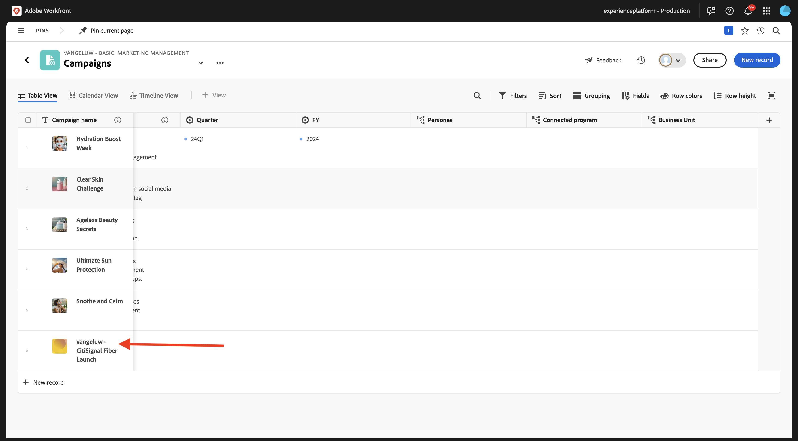
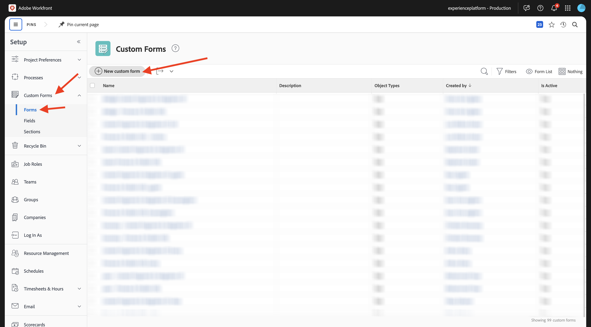

# 1.1.1 Prise en main de Workfront Planning

## Résumé de campagne 1.1.1.1 CitiSignal

Pour comprendre le contexte de CitiSignal et ce qu&#39;ils essaient d&#39;accomplir, téléchargez et lisez le résumé de campagne de CitiSignal ici : [CitiSignal-Fiber-Launch-Winter-2026.pdf](./../../../assets/brief/CitiSignal-Fiber-Launch-Winter-2026.pdf).

## 1.1.1.2 Workfront Planning Terminology

Les principaux objets et concepts de Workfront Planning sont les suivants :

| Terme | Explication |
| --- | ---|
| **Workspace** | Ensemble de types d’enregistrements qui définissent le cycle de vie opérationnel d’une certaine organisation. Un espace de travail est le cadre de travail d’une entité organisationnelle. |
| **Type d’enregistrement** | Nom des types d&#39;objet dans Workfront Planning. Les types d’enregistrements renseignent les espaces de travail. Contrairement au processus Workfront, où les types d&#39;objet sont prédéfinis, dans Workfront Planning, vous pouvez créer vos propres types d&#39;objet. |
| **Enregistrement** | Une instance d’un type d’enregistrement. |
| **modèle Workspace** | Vous pouvez créer un espace de travail à l’aide de modèles prédéfinis. Vous pouvez utiliser les types d’enregistrements et les champs prédéfinis fournis dans un modèle, ou ajouter les vôtres. |
| **Champs** | Les champs sont des attributs que vous pouvez ajouter aux types d’enregistrements. Les champs contiennent des informations sur le type d’enregistrement. |

>[!NOTE]
>
>Le nombre d’objets Workfront Planning que vous pouvez créer est limité. Pour plus d’informations, voir Présentation des limitations d’objet d’Adobe Workfront Planning.

Vous allez maintenant passer directement à l’action et commencer à créer vous-même certains de ces objets.

## 1.1.1.3 Workspace, type d’enregistrement, champs

Accédez à [https://experience.adobe.com/](https://experience.adobe.com/){target="_blank"}. Cliquez pour ouvrir **Workfront**.


Dans Workfront, cliquez pour ouvrir le menu, puis sélectionnez **Planification**.


Vous devriez alors voir ceci. Cliquez sur **Créer un Workspace**.


Cliquez sur **Utiliser le modèle** pour le modèle **Gestion marketing de base**.


Un nouvel espace de travail est maintenant créé. Avant de continuer, vous devez modifier le nom de l’espace de travail. Cliquez sur le **de 3 points...**, puis sélectionnez **Modifier**.


Remplacez le nom par `--aepUserLdap-- - Basic: Marketing Management`. Cliquez sur **Enregistrer**.


Tu devrais avoir ça.


## 1.1.1.4 des taxonomies : type d’enregistrement et champs

Sous **Taxonomies**, cliquez sur **+ Ajouter un type d’enregistrement** puis sélectionnez **Ajouter manuellement**.


Vous devriez alors voir la fenêtre contextuelle **Ajouter un type d’enregistrement**.


Mettez à jour les informations suivantes dans l’onglet **Apparence** :

- Remplacez **Type d’enregistrement sans titre** par `Business Unit`.
- Description : `Defines which BU is leading campaign planning.`.
- Sélectionnez une couleur et une forme pour l’icône de votre choix

Cliquez sur **Enregistrer**.


Cliquez pour ouvrir le type d&#39;enregistrement **Business Unit** nouvellement créé.


Une vue de table vide s&#39;affiche à présent, car aucun enregistrement d&#39;unité opérationnelle n&#39;est encore défini pour le type d&#39;enregistrement que vous venez de créer.


Cliquez sur le bouton de liste déroulante dans le champ **Date de début** puis sélectionnez **Supprimer**.


Sélectionnez **Supprimer**.


Cliquez sur le bouton de liste déroulante dans le champ **Date de fin** puis sélectionnez **Supprimer**.


Sélectionnez **Supprimer**.


Cliquez ensuite sur l’icône **+** pour ajouter un nouveau champ. Faites défiler la liste vers le bas des types de champs disponibles et sélectionnez **Personnes**.


Définissez le **Nom** du champ sur `Business Unit Lead` et définissez la description du champ sur `Business Unit Lead responsible for budget and resources (VP, Head).`

Cliquez sur **Créer**.


Cliquez sur le **de 3 points...** du premier enregistrement et sélectionnez **Afficher**.


Définissez le **Nom** sur `Consumer Services`.

Définissez la **Description** sur `Handles residential offerings like mobile plans, internet packages, and customer support.`.

Définissez le **responsable d’unité opérationnelle** sur vous-même.

Une fois que vous avez terminé, cliquez sur la flèche pour revenir à l’écran précédent.


Cliquez sur le **de 3 points...** sur le deuxième enregistrement et sélectionnez **Afficher**.


Définissez le **Nom** sur `Enterprise & Business Solutions`

Définissez la **Description** sur `Provides connectivity, cloud, and managed services to corporate clients and government entities.`

Définissez le **responsable d’unité opérationnelle** sur vous-même.

Une fois que vous avez terminé, cliquez sur la flèche pour revenir à l’écran précédent.


Cliquez sur le **de 3 points...** sur le troisième enregistrement et sélectionnez **Afficher**.


Définissez le **Nom** sur `Sales & Marketing`

Définissez la **Description** sur `Drives customer acquisition, brand strategy, advertising, and market segmentation.`

Définissez le **responsable d’unité opérationnelle** sur vous-même.

Une fois que vous avez terminé, cliquez sur la flèche pour revenir à l’écran précédent.


Vous avez maintenant créé un nouveau type d&#39;enregistrement, vous avez supprimé et créé des champs et vous avez créé 3 unités opérationnelles. Revenez à l’écran de présentation de Workspace en cliquant sur la flèche dans le coin supérieur gauche.


Vous devriez alors voir ceci.


## 1.1.1.5 types d’enregistrements opérationnels : champs

Cliquez pour ouvrir **Campagnes**.


Cliquez sur l’icône **+** pour créer un champ. Sélectionnez **Nouvelle connexion** puis sélectionnez **Unité opérationnelle**.


Laissez les paramètres par défaut en place. Cliquez sur **Créer**.


Sélectionnez **Ignorer**.


Votre nouveau champ s’affiche alors en mode Tableau.


## 1.1.1.6 Créer un formulaire de demande

Sur l’écran de présentation des campagnes, cliquez sur le **de 3 points...**, puis sélectionnez **Créer un formulaire de demande**.


Remplacez le nom par `Campaign Request Form`. Cliquez sur **Créer**.


Pour l’instant, il n’est pas nécessaire d’apporter des modifications au formulaire. Vous l’utiliserez sans modification. Cliquez d’abord sur **Enregistrer** puis sur **Publier**.


Cliquez sur la flèche située dans le coin supérieur gauche pour revenir à l’écran Aperçu de Request Forms .


Cliquez sur la flèche dans le coin supérieur gauche pour revenir à l’écran Présentation des campagnes .


## 1.1.1.7 Envoyer un nouvel enregistrement à l’aide du formulaire de demande

Dans l’écran Aperçu des campagnes , cliquez sur **+ Nouvel enregistrement**.


Sélectionnez **Soumettre une demande** puis cliquez sur **Continuer**.


Définissez le **Objet** sur `--aepUserLdap-- - New Campaign Creation Request`.

Définissez le **nom de la campagne** sur `--aepUserLdap-- - CitiSignal Fiber Launch`.

Définissez le **résumé de la campagne** sur :

```
The CitiSignal Fiber Launch campaign introduces CitiSignal’s flagship fiber internet service—CitiSignal Fiber Max—to key residential markets. This campaign is designed to build awareness, drive sign-ups, and establish CitiSignal as the go-to provider for ultra-fast, reliable, and future-ready internet. The campaign will highlight the product’s benefits for remote professionals, online gamers, and smart home families, using persona-driven messaging across digital and physical channels.
```

Renseignez les autres champs comme vous le souhaitez.

Cliquez sur **Soumettre la demande**.


Cliquez sur **X** pour fermer la fenêtre contextuelle.


Vous devriez alors voir la campagne nouvellement créée dans la vue d’ensemble.



## 1.1.1.8 Créer un Portfolio et un formulaire personnalisé

À l’étape suivante, vous allez créer une automatisation qui récupérera les informations de la campagne que vous avez créée dans Workfront Planning et qui les utilisera dans Workfront pour créer un programme. Avant de pouvoir créer l’automatisation, vous devez d’abord configurer 2 éléments dans Workfront : un portfolio et un formulaire personnalisé.

Pour créer le portfolio, ouvrez le menu et cliquez sur **Portfolios**.


Cliquez sur **+ Nouveau Portfolio**.


Définissez le nom du portfolio sur `--aepUserLdap-- - Marketing`.


Ouvrez ensuite le menu et cliquez sur **Configuration** pour créer le formulaire personnalisé.


Dans le menu de gauche, accédez à **Custom Forms**, à **Forms** puis cliquez sur **+ Nouveau formulaire personnalisé**.



Sélectionnez **Programme** et cliquez sur **Continuer**.


Remplacez le nom du formulaire par `--aepUserLdap-- - Program Information`.


Ensuite, accédez à **Bibliothèque de champs** et recherchez `budget`. Faites glisser et déposez le champ existant **Budget** dans le formulaire.

Cliquez sur **Appliquer**.


Votre configuration de formulaire personnalisé a maintenant été enregistrée.


## 1.1.1.8 Créer une automatisation

Une fois le portfolio et le formulaire personnalisé créés, vous pouvez créer l’automatisation.

Cliquez pour ouvrir le menu, puis sélectionnez **Planification**.


Cliquez pour ouvrir l’espace de travail que vous avez créé précédemment et qui est nommé `--aepUserLdap-- - Basic: Marketing Management`.


Cliquez pour ouvrir **Campagnes**.


Sur l’écran de présentation des campagnes, cliquez sur le **de 3 points...**, puis sélectionnez **Gérer les automatisations**.


Cliquez sur **Nouvelle automatisation**.


Définissez le nom de l&#39;Automation sur `Campaign to Program`.

Définissez la description sur `This automation will convert a Planning Campaign record to a Workfront Program.`

Cliquez sur **Enregistrer**.


Définissez la **Action** sur **Créer un programme**. Cliquez sur **+ Ajouter un champ connecté**.


Sélectionnez le **portefeuille de programmes** : `--aepUserLdap-- - Marketing`.

Sélectionnez ce **Formulaire personnalisé** : `--aepUserLdap-- Program information`.

Cliquez sur **Enregistrer**.


Vous devriez alors voir ceci. Cliquez sur la flèche pour revenir à l’écran Présentation des campagnes .


Cochez la case en regard de la campagne que vous avez créée précédemment. Cliquez ensuite sur l&#39;automatisation **de Campaign à Program**.


Au bout de quelques secondes, vous devriez voir une confirmation que l’automatisation s’est terminée correctement. Cela signifie qu’en fonction de l’objet Campaign dans Workfront Planning, un programme a été créé dans Workfront.


Pour vérifier le programme dans Workfront, faites défiler l’écran vers la droite et cliquez sur le programme dans la colonne **Programme connecté**.


Vous devriez alors voir le programme qui vient d’être créé par l’automatisation que vous avez configurée.


Étape suivante : [Résumé et avantages](./summary.md){target="_blank"}

Revenir à [Présentation de Workfront Planning](./wfplanning.md){target="_blank"}

[Revenir à tous les modules](./../../../overview.md){target="_blank"}
