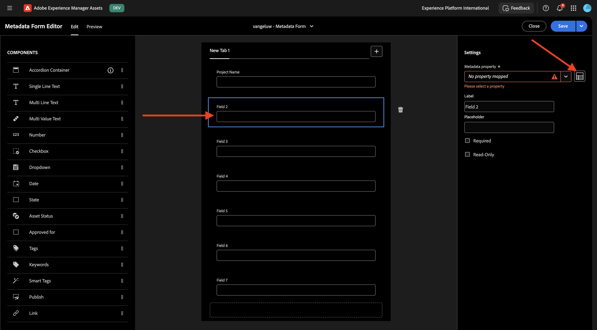
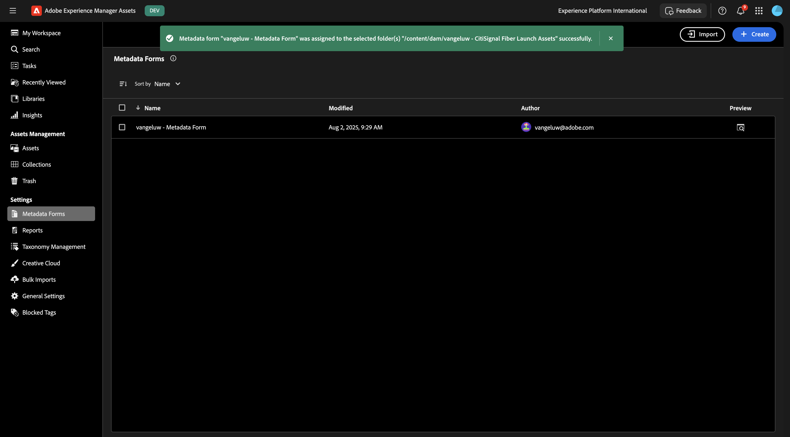

# 1.2.1 Intégration des métadonnées Workfront + AEM Assets CS

>[!IMPORTANT]
>
>Pour effectuer cet exercice, vous devez avoir accès à un environnement de création AEM Assets CS fonctionnel.
>
>Il existe deux options à prendre en compte :
>
>- Si vous participez à l’atelier d’activation technique de GenStudio for CSC, vos instructeurs ont créé pour vous un environnement de création AEM Assets CS. Vérifiez avec eux quel est le nom et comment procéder.
>
>- Si vous suivez le parcours complet du tutoriel One Adobe, passez à l’exercice [Adobe Experience Manager Cloud Service &amp; Edge Delivery Services](./../../../modules/asset-mgmt/module2.1/aemcs.md){target="_blank"}. Suivez les instructions qui s’affichent à cet endroit et vous aurez accès à un tel environnement.

>[!IMPORTANT]
>
>Si vous avez précédemment configuré un programme AEM CS avec un environnement AEM Assets CS, il se peut que votre sandbox AEM CS ait été mis en veille. Étant donné que la réactivation d’un tel sandbox prend entre 10 et 15 minutes, il serait judicieux de lancer le processus de réactivation maintenant afin de ne pas avoir à l’attendre plus tard.

## Terminologie des workflows 1.2.1.1 Workfront

Les principaux objets et concepts de Workfront sont les suivants :

| Nom | Dernière mise à jour |
| ---------------------- | ------------ | 
| Portefeuille | Ensemble de projets présentant des caractéristiques unificatrices. Ces projets se disputent généralement les mêmes ressources, le même budget ou le même créneau horaire. |
| Programme | Sous-ensemble au sein d’un portefeuille, dans lequel des projets similaires peuvent être regroupés afin d’obtenir un bénéfice bien défini. |
| Projet | Une grande quantité de travail qui doit être achevée dans un délai spécifique et qui doit utiliser un budget et un nombre de ressources spécifiques. Pour le rendre gérable, vous divisez le projet en une série de tâches. Lorsque vous terminez toutes les tâches, le projet est également terminé. |
| Modèle de projet | Vous pouvez utiliser des modèles de projet pour capturer la plupart des processus, informations et paramètres répétables associés aux projets de votre entreprise. Après avoir créé des modèles, vous pouvez les joindre à des projets existants ou les utiliser pour créer de nouveaux projets. |
| Tâche | Une activité qui doit être effectuée comme une étape vers l’atteinte d’un objectif final (terminer le projet). Les tâches ne peuvent jamais exister indépendamment. Ils font toujours partie d&#39;un projet. |
| Affectation | Utilisateur, fonction ou équipe affecté à un événement ou à une tâche. Les projets, portefeuilles ou programmes ne peuvent pas avoir d&#39;affectations. |
| Document/Version | Tout fichier joint à un objet dans Workfront. Chaque fois qu’un même document est chargé dans le même objet, un numéro de version lui est attribué. Les utilisateurs et utilisatrices peuvent afficher et modifier plusieurs options d’une version précédente d’un document. |
| Approbation | Un élément de travail donné, tel qu’une tâche, un document ou une feuille de temps, peut nécessiter l’approbation d’un superviseur ou d’un autre utilisateur sur l’élément de travail. Ce processus d’approbation est appelé approbation. |

Accédez à [https://experience.adobe.com/](https://experience.adobe.com/){target="_blank"}. Cliquez pour ouvrir **Workfront**.

Tu verras ça.

## 1.2.1.1 Configurer votre intégration AEM Assets

Cliquez sur l’icône **menu** puis sélectionnez **Configuration**.

Dans le menu de gauche, faites défiler l’écran jusqu’à **Documents** puis cliquez sur **Experience Manager Assets**. Cliquez sur **+ Ajouter l’intégration Experience Manager**.

Pour le nom de votre intégration, utilisez `--aepUserLdap-- - CitiSignal AEM`.

Ouvrez la liste déroulante **Référentiel Experience Manager** et sélectionnez votre instance AEM CS, qui doit être nommée `--aepUserLdap-- - CitiSignal`.

Sous **Métadonnées**, configurez le mappage suivant :

| Champ Workfront | Champ Experience Manager Assets |
| --------------- | ------------------------------ | 
| **Document** > **Nom** | **wm:documentName** |
| **Projet** > **Nom** | **wm:projectName** |
| **Projet** > **Description** | **wm:projectDescription** |
| **Demande de document** > **Statut** | **wm:wm:documentStatus** |
| **Tâche** > **Nom** | **wm:taskName** |
| **Tâche** > **Description** | **wm:taskDescription** |
| **Projet** > **ID** | **wm:projectId** |

Activez le commutateur pour **Synchroniser les métadonnées d’objet**.

Cliquez sur **Enregistrer**.

Votre intégration de Workfront à AEM Assets CS est maintenant configurée.

## 1.2.1.2 Configurer l’intégration des métadonnées avec AEM Assets

Ensuite, vous devez configurer AEM Assets CS de sorte que les champs de métadonnées de la ressource dans Workfront soient partagés avec AEM Assets CS.

Pour ce faire, accédez à [https://experience.adobe.com/](https://experience.adobe.com/). Cliquez sur **Experience Manager Assets**.

Cliquez pour sélectionner votre environnement AEM Assets, qui doit être nommé `--aepUserLdap-- - CitiSignal dev`.

Vous devriez alors voir ceci. Dans le menu de gauche, accédez à **Assets**.

Cliquez ensuite sur **Créer un dossier**.

Nommez votre `--aepUserLdap-- - CitiSignal Fiber Campaign` de dossier et cliquez sur **Créer**.

Ensuite, accédez à **Forms de métadonnées** dans le menu de gauche, puis cliquez sur **Créer**.

Utilisez le `--aepUserLdap-- - Metadata Form` de nom et cliquez sur **Créer**.

Ajoutez 7 nouveaux champs **texte monoligne** au formulaire et sélectionnez le premier champ. Cliquez ensuite sur l’icône **Schéma** en regard du champ **Propriété de métadonnées** du premier champ.

Vous verrez alors cette fenêtre contextuelle. Dans le champ de recherche, saisissez `wm:project` puis sélectionnez le champ **Nom du projet**. Cliquez sur **Sélectionner**.

Remplacez le libellé du champ par `Project Name`. Cliquez sur **Enregistrer**.

Accédez au deuxième champ et cliquez sur l’icône **Schéma** en regard du champ **Propriété de métadonnées**.

Dans le champ de recherche, saisissez `wm:project` puis sélectionnez le champ **Description du projet**. Cliquez sur **Sélectionner**.

Remplacez le libellé du champ par `Project Description`.

Sélectionnez ensuite le troisième champ et cliquez de nouveau sur l’icône **Schéma** en regard du champ **Propriété de métadonnées**.

Vous verrez alors à nouveau cette fenêtre contextuelle. Dans le champ de recherche, saisissez `wm:project` puis sélectionnez le champ **ID du projet**. Cliquez sur **Sélectionner**.

Remplacez le libellé du champ par `Project ID`.

Sélectionnez ensuite le quatrième champ et cliquez de nouveau sur l’icône **Schéma** en regard du champ **Propriété de métadonnées**.

Vous verrez alors à nouveau cette fenêtre contextuelle. Dans le champ de recherche, saisissez `wm:document` puis sélectionnez le champ **Statut du document**. Cliquez sur **Sélectionner**.

Remplacez le libellé du champ par `Document Status`.

Sélectionnez ensuite le cinquième champ et cliquez de nouveau sur l’icône **Schéma** en regard du champ **Propriété de métadonnées**.

Vous verrez alors à nouveau cette fenêtre contextuelle. Dans le champ de recherche, saisissez `wm:document` puis sélectionnez le champ **Nom du document**. Cliquez sur **Sélectionner**.

Remplacez le libellé du champ par `Document Name`.

Sélectionnez ensuite le sixième champ et cliquez de nouveau sur l’icône **Schéma** en regard du champ **Propriété de métadonnées**.

Vous verrez alors à nouveau cette fenêtre contextuelle. Dans le champ de recherche, saisissez `wm:task` puis sélectionnez le champ **Nom de la tâche**. Cliquez sur **Sélectionner**.

Remplacez le libellé du champ par `Task Name`.

Sélectionnez ensuite le septième champ et cliquez de nouveau sur l’icône **Schéma** en regard du champ **Propriété de métadonnées**.

Vous verrez alors à nouveau cette fenêtre contextuelle. Dans le champ de recherche, saisissez `wm:task` puis sélectionnez le champ **Description de la tâche**. Cliquez sur **Sélectionner**.

Remplacez le libellé du champ par `Task Description`.

Remplacez le **Nom de l’onglet** du formulaire par `--aepUserLdap-- - Workfront Metadata`.

Cliquez sur **Enregistrer** et **Fermer**.

Votre **Formulaire de métadonnées** est maintenant configuré.

Ensuite, vous devez affecter le formulaire de métadonnées au dossier que vous avez créé précédemment. Cochez la case correspondant à votre formulaire de métadonnées et cliquez sur **Affecter au(x) dossier(s)**.

Sélectionnez votre dossier, qui doit être nommé `--aepUserLdap-- - CitiSignal Fiber Campaign`. Cliquez sur **Attribuer**.

Le formulaire de métadonnées est maintenant correctement affecté à votre dossier.

Étape suivante : [1.2.2 Vérification avec Workfront](./ex2.md){target="_blank"}

Revenir à [Gestion des workflows avec Adobe Workfront](./workfront.md){target="_blank"}

[Revenir à tous les modules](./../../../overview.md){target="_blank"}
