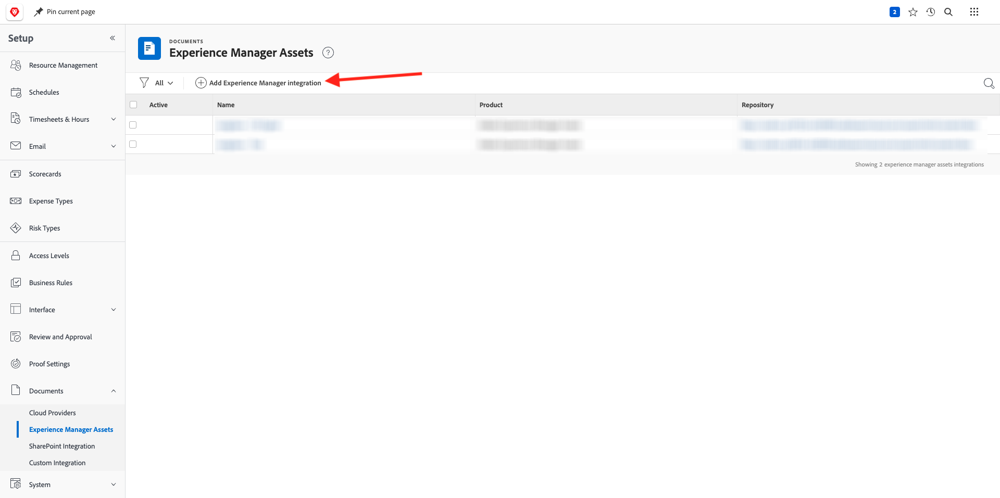
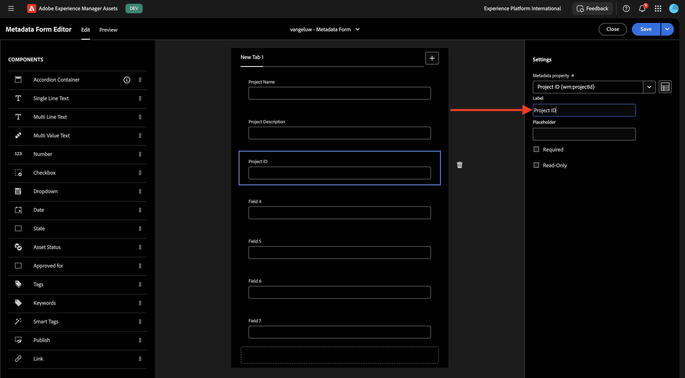
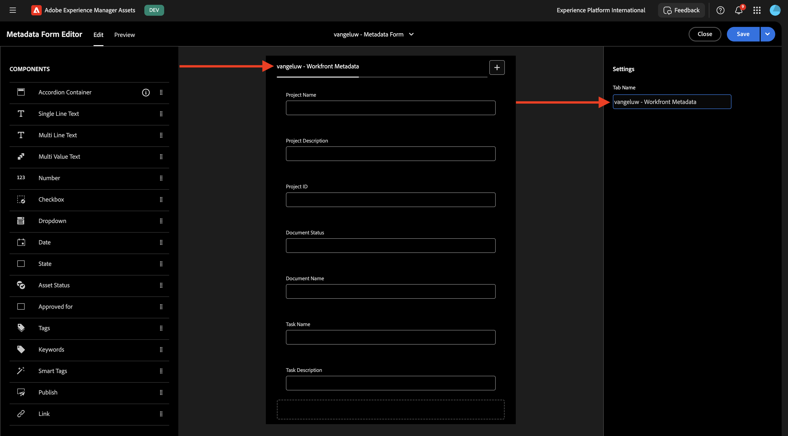
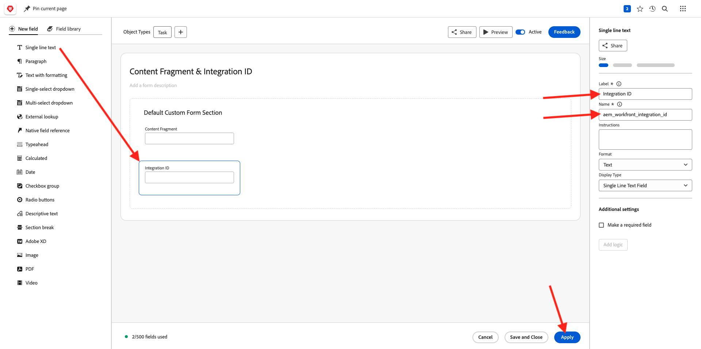

# 1.2.1 Prise en main de Workfront

Connectez-vous à Adobe Workfront en allant sur [https://experienceplatform.my.workfront.com/](https://experienceplatform.my.workfront.com/){target="_blank"}.

Vous voyez alors ceci.

## 1.2.1.1 Configurer votre intégration AEM Assets

Cliquez sur l’icône des 9 points **hamburger**, puis sélectionnez **Configuration**.

Dans le menu de gauche, faites défiler l’écran jusqu’à **Documents** puis cliquez sur **Experience Manager Assets**.

Cliquez sur **+ Ajouter l’intégration Experience Manager**.

Pour le nom de votre intégration, utilisez `--aepUserLdap-- - Citi Signal AEM`.

Ouvrez la liste déroulante **Référentiel Experience Manager** et sélectionnez votre instance AEM CS, qui doit être nommée `--aepUserLdap-- - Citi Signal`.

Sous **Métadonnées**, configurez le mappage suivant :

| Champ Workfront | Champ Experience Manager Assets |
| --------------- | ------------------------------ | 
| **Document** > **Nom** | **wm:documentName** |
| **Projet** > **Description** | **wm:projectDescription** |
| **Tâche** > **Nom** | **wm:taskName** |
| **Tâche** > **Description** | **wm:taskDescription** |

Activez le commutateur pour **Synchroniser les métadonnées d’objet**.

Cliquez sur **Enregistrer**.

Votre intégration de Workfront à AEM Assets CS est maintenant configurée.

## 1.2.1.2 Configurer l’intégration des métadonnées avec AEM Assets

Ensuite, vous devez configurer AEM Assets pour que les champs de métadonnées de la ressource dans Workfront soient partagés avec AEM.

Pour ce faire, accédez à [https://experience.adobe.com/](https://experience.adobe.com/). Cliquez sur **Experience Manager Assets**.

Cliquez pour sélectionner votre environnement AEM Assets, qui doit être nommé `--aepUserLdap-- - Citi Signal dev`.

Vous devriez alors voir ceci. Dans le menu de gauche, accédez à **Assets** puis cliquez sur **Créer un dossier**.

Nommez votre `--aepUserLdap-- - Workfront Assets` de dossier et cliquez sur **Créer**.

Ensuite, accédez à **Forms de métadonnées** dans le menu de gauche, puis cliquez sur **Créer**.

Utilisez le `--aepUserLdap-- - Metadata Form` de nom et cliquez sur **Créer**.

Ajoutez 3 nouveaux champs **texte monoligne** au formulaire et sélectionnez le premier champ. Cliquez ensuite sur l’icône **Schéma** en regard du champ **Propriété de métadonnées**.

Dans le champ de recherche, saisissez `wm:project` puis sélectionnez le champ **Description du projet**. Cliquez sur **Sélectionner**.

Remplacez le libellé du champ par **Description du projet**.

Sélectionnez ensuite le deuxième champ **Texte d’une seule ligne** et cliquez de nouveau sur l’icône **Schéma** en regard du champ **Propriété de métadonnées**.

Vous verrez alors à nouveau cette fenêtre contextuelle. Dans le champ de recherche, saisissez `wm:project` puis sélectionnez le champ **ID du projet**. Cliquez sur **Sélectionner**.

Remplacez le libellé du champ par **ID du projet**.

Sélectionnez le troisième champ **Texte monoligne** et cliquez de nouveau sur l’icône **Schéma** en regard du champ **Propriété de métadonnées**.

Vous verrez alors à nouveau cette fenêtre contextuelle. Dans le champ de recherche, saisissez `wm:project` puis sélectionnez le champ **Nom du projet**. Cliquez sur **Sélectionner**.

Remplacez le libellé du champ par **Nom du projet**. Cliquez sur **Enregistrer**.

Remplacez le **Nom de l’onglet** du formulaire par `--aepUserLdap-- - Workfront Metadata`. Cliquez sur **Enregistrer** et **Fermer**.

Votre **Formulaire de métadonnées** est maintenant configuré.

Ensuite, vous devez affecter le formulaire de métadonnées au dossier que vous avez créé précédemment. Cochez la case correspondant à votre formulaire de métadonnées et cliquez sur **Affecter au(x) dossier(s)**.

Sélectionnez votre dossier, qui doit être nommé `--aepUserLdap-- - Workfront Assets`. Cliquez sur **Attribuer**.

Le formulaire de métadonnées est maintenant correctement affecté à votre dossier.

## 1.2.1.2 Configurer votre intégration AEM Sites

>[!NOTE]
>
>Ce plug-in est actuellement en mode **Accès anticipé** et n’est pas encore disponible pour la plupart des utilisateurs.
>
>Ce plug-in est peut-être déjà installé dans l’instance Workfront que vous utilisez. S’il est déjà installé, vous pouvez consulter les instructions ci-dessous, mais il n’est pas nécessaire de modifier quoi que ce soit dans votre configuration.

Accédez à [https://experience.adobe.com/#/@experienceplatform/aem/extension-manager/universal-editor](https://experience.adobe.com/#/@experienceplatform/aem/extension-manager/universal-editor){target="_blank"}.

Assurez-vous que la **bascule** de ce plug-in est définie sur **Activé**. Cliquez ensuite sur l’icône **engrenage**.

Une fenêtre contextuelle **Configuration de l’extension** s’affiche. Configurez les champs suivants pour utiliser ce plug-in.

| Clé | Valeur |
| --------------- | ------------------------------ | 
| **`IMS_ENV`** | **PROD** |
| **`WORKFRONT_INSTANCE_URL`** | **https://experienceplatform.my.workfront.com** |
| **`SHOW_CUSTOM_FORMS`** | **&#39;{« previewUrl »: true, « publishUrl »: true}&#39;** |

Cliquez sur **Enregistrer**.

Revenez à l’interface utilisateur de Workfront et cliquez sur l’icône des 9 points **hamburger**. Sélectionnez **Configuration**.

Dans le menu de gauche, accédez à **Custom Forms** et sélectionnez **Form**. Cliquez sur **+ Nouveau formulaire personnalisé**.

Sélectionnez **Tâche** et cliquez sur **Continuer**.

Un formulaire personnalisé vide s’affiche alors. Saisissez le nom du formulaire `Content Fragment & Integration ID`.

Effectuez un glisser-déposer d’un nouveau champ **Texte monoligne** sur la zone de travail.

Configurez le nouveau champ comme suit :

- **Libellé** : **Fragment de contenu**
- **Nom** : **`aem_workfront_integration_content_fragment`**

Ajoutez un nouveau champ **Texte monoligne** sur la zone de travail et configurez le nouveau champ comme suit :

- **Libellé** : **ID d’intégration**
- **Nom** : **`aem_workfront_integration_id`**

Cliquez sur **Appliquer**.

Vous devez maintenant configurer un second formulaire personnalisé. Cliquez sur **+ Nouveau formulaire personnalisé**.

Sélectionnez **Tâche** et cliquez sur **Continuer**.

Un formulaire personnalisé vide s’affiche alors. Saisissez le nom du formulaire `Preview & Publish URL`.

Effectuez un glisser-déposer d’un nouveau champ **Texte monoligne** sur la zone de travail.

Configurez le nouveau champ comme suit :

- **Libellé** : **URL de prévisualisation**
- **Nom** : **`aem_workfront_integration_preview_url`**

Ajoutez un nouveau champ **Texte monoligne** sur la zone de travail et configurez le nouveau champ comme suit :

- **Libellé** : **URL de publication**
- **Nom** : **`aem_workfront_integration_publish_url`**

Cliquez sur **Appliquer**.

Vous devriez alors disposer de 2 formulaires personnalisés.

Étape suivante : [1.2.2 Vérification avec Workfront](./ex2.md){target="_blank"}

Revenir à [Gestion des workflows avec Adobe Workfront](./workfront.md){target="_blank"}

[Revenir à tous les modules](./../../../overview.md){target="_blank"}
