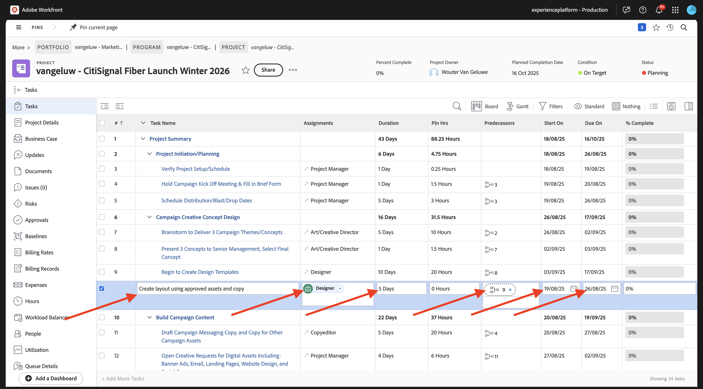
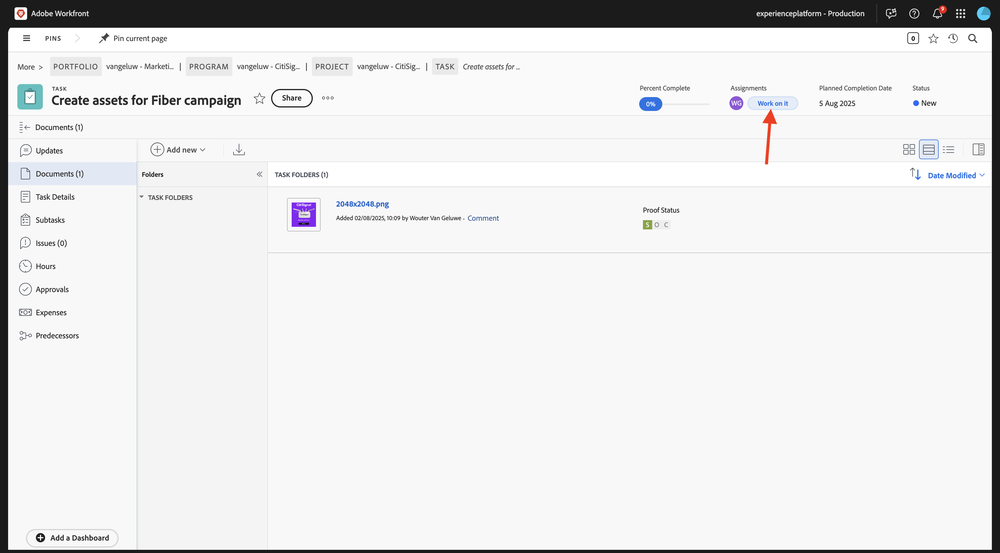
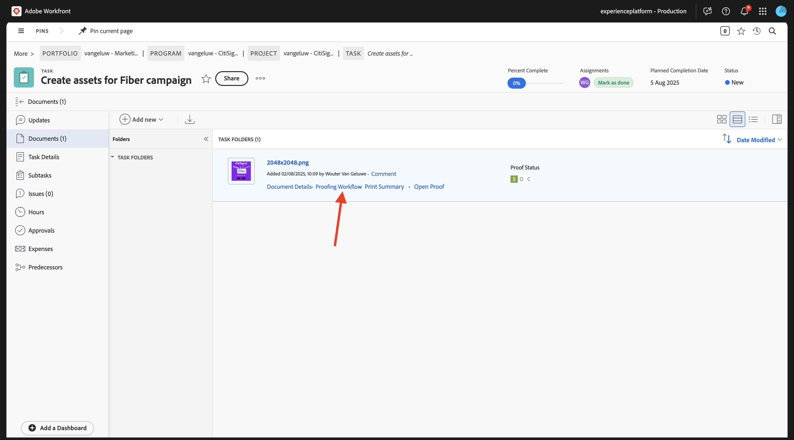

# 1.2.2 Relecture avec Workfront

>[!IMPORTANT]
>
>Si vous avez précédemment configuré un programme AEM CS avec un environnement AEM Assets CS, il se peut que votre sandbox AEM CS ait été mis en veille. Étant donné que la réactivation d’un tel sandbox prend entre 10 et 15 minutes, il serait judicieux de lancer le processus de réactivation maintenant afin de ne pas avoir à l’attendre plus tard.

## 1.2.2.1 Créer un flux d’approbation

Revenez à **Adobe Workfront**. Cliquez sur l&#39;icône **menu** et sélectionnez **Vérification**.

Accédez à **Workflows**, cliquez sur **+ Nouveau** puis sélectionnez **Nouveau modèle**.

Définissez le **Nom du modèle** sur `--aepUserLdap-- - Approval Workflow` et définissez le **Propriétaire du modèle** sur vous-même.

Faites défiler l’écran vers le bas, puis sous **Étapes** > **Étape 1**, ajoutez-vous avec le **Rôle** de **Réviseur et approbateur**.

Cliquez sur **Créer**.

Votre workflow d’approbation de base est maintenant prêt à être utilisé.

## 1.2.2.2 Créer un projet

Ouvrez le **menu** et accédez à **Programmes**.

Cliquez sur le programme que vous avez créé précédemment et qui s’appelle `--aepUserLdap-- CitiSignal Fiber Launch`.

>[!NOTE]
>
>Vous avez créé un programme dans le cadre de l&#39;exercice sur [Workfront Planning](./../module1.1/ex1.md) avec l&#39;automatisation que vous avez créée et exécutée. Si vous ne l&#39;avez pas encore fait, vous pouvez trouver les instructions ici.

Dans votre programme, accédez à **Projets**. Cliquez sur **+ Nouveau projet** puis sélectionnez **Nouveau projet**.

Vous devriez alors voir ceci. Remplacez le nom par `--aepUserLdap-- - CitiSignal Fiber Launch`.

Accédez à **Détails du projet**. Cliquez sur **+Ajouter** sous **Description**.

Définissez la description sur `The CitiSignal Fiber Launch project is used to plan the upcoming launch of CitiSignal Fiber.`

Cliquez sur **Enregistrer les modifications**.

Votre projet est maintenant créé.

## 1.2.2.3 Créer une nouvelle tâche

Accédez à **Tâches** et cliquez sur **+ Nouvelle tâche**.

Saisissez le nom suivant pour votre tâche : `Create assets for Fiber campaign`.

Définissez le champ **Description** sur : `This task is used to track the progress of the creation of the assets for the CitiSignal Fiber Launch Campaign.`

Cliquez sur **Créer une tâche**.

Vous devriez alors voir ceci.

Dans la colonne **Affectation**, ajoutez votre propre nom.

La tâche vous sera alors affectée.

## 1.2.2.4 Ajouter un nouveau document à votre tâche via le flux d’approbation

Cliquez sur le logo **Workfront** pour revenir à la page d&#39;aperçu. Vous devriez alors voir le projet que vous venez de créer apparaître dans la vue d’ensemble. Cliquez sur votre projet pour l’ouvrir.

Dans **Tâches**, cliquez pour ouvrir la tâche.

Accédez à **Documents**. Cliquez sur **+ Ajouter** puis sélectionnez **Document**.

Téléchargez [ce fichier](./images/2048x2048.png) sur votre bureau.

{width="50px" align="left"}

Sélectionnez le fichier **2048x2048.png** et cliquez sur **Ouvrir**.

Tu devrais avoir ça. Pointez sur le document chargé. Cliquez sur **Créer une épreuve** puis choisissez **Épreuve avancée**.

Dans la fenêtre **nouveau BAT**, sélectionnez **Automatisé** puis sélectionnez le modèle de workflow que vous avez créé précédemment et qui doit être nommé `--aepUserLdap-- - Approval Workflow`. Cliquez sur **Créer une épreuve**.

Cliquez sur **Travailler dessus**.

Cliquez sur **Ouvrir l&#39;épreuve**

Vous pouvez maintenant examiner le BAT. Sélectionnez **Ajouter un commentaire** pour ajouter une remarque qui nécessite la modification du document.

Saisissez votre commentaire et cliquez sur **Publier**. Cliquez sur **Fermer**.

Ensuite, vous devez modifier votre rôle de **Réviseur** en **Réviseur et approbateur**. Pour ce faire, revenez à votre tâche et cliquez sur **Workflow de relecture**.

Remplacez votre rôle **Réviseur** par **Réviseur et approbateur**.

Revenez à votre tâche et ouvrez à nouveau l’épreuve. Un nouveau bouton apparaît, **Prendre une décision**. Cliquez dessus.

Sélectionnez **Modifications requises** puis cliquez sur **Prendre une décision**.

Revenez à votre **Tâche** et au **Document**. Vous devez maintenant charger une deuxième image qui prend en compte les commentaires qui ont été fournis.

Téléchargez [ce fichier](./images/2048x2048_buynow.png) sur votre bureau.

{width="50px" align="left"}

Dans l&#39;affichage Tâche, sélectionnez l&#39;ancien fichier image qui n&#39;a pas été approuvé. Cliquez ensuite sur **+ Ajouter nouveau**, sélectionnez **Version** puis **Document**.

Sélectionnez le fichier **2048x2048_buynow.png** et cliquez sur **Ouvrir**.

Tu devrais avoir ça. Cliquez sur **Créer une épreuve** puis sélectionnez à nouveau **Épreuve avancée**.

Tu verras ça. Le **modèle de workflow** est maintenant présélectionné, car Workfront suppose que le workflow d’approbation précédent est toujours valide. Cliquez sur **Créer une épreuve**.

Sélectionnez **Ouvrir l’épreuve**.

Vous pouvez maintenant voir 2 versions du fichier l’une à côté de l’autre.

Cliquez sur **Prendre une décision**, sélectionnez **Approuvé** et cliquez de nouveau sur **Prendre une décision**.

Cliquez sur le **Nom de la tâche** pour revenir à l’aperçu de la tâche.

Vous serez alors de retour dans la vue Tâche avec une ressource approuvée. Cette ressource doit maintenant être partagée vers AEM Assets.

Sélectionnez le document approuvé. Cliquez sur l’icône **flèche de partage** et sélectionnez votre intégration AEM Assets, qui doit être nommée `--aepUserLdap-- - CitiSignal AEM`.

Double-cliquez sur le dossier que vous avez créé précédemment et qui doit être nommé `--aepUserLdap-- - CitiSignal Fiber Launch Assets`.

Cliquez sur **Sélectionner un dossier**.

Au bout de 1 à 2 minutes, votre document sera désormais publié dans AEM Assets. Une icône AEM apparaît en regard du nom du document.

Cliquez sur **Marquer comme terminé** pour terminer cette tâche.

Vous devriez alors voir ceci.

## 1.2.2.5 Afficher votre fichier dans AEM Assets

Accédez à votre dossier dans AEM Assets CS, qui est nommé `--aepUserLdap-- - CitiSignal Fiber Launch Assets`.

Sélectionnez l’image, puis choisissez **Détails**.

Vous verrez ensuite le formulaire de métadonnées que vous avez créé précédemment, avec les valeurs qui ont été renseignées automatiquement par l’intégration entre Workfront et AEM Assets.

Revenir à [Gestion des workflows avec Adobe Workfront](./workfront.md){target="_blank"}

[Revenir à tous les modules](./../../../overview.md){target="_blank"}
