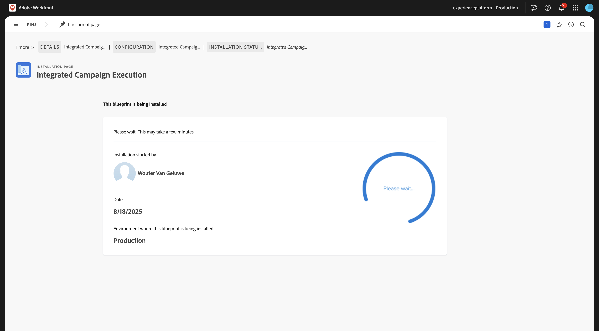
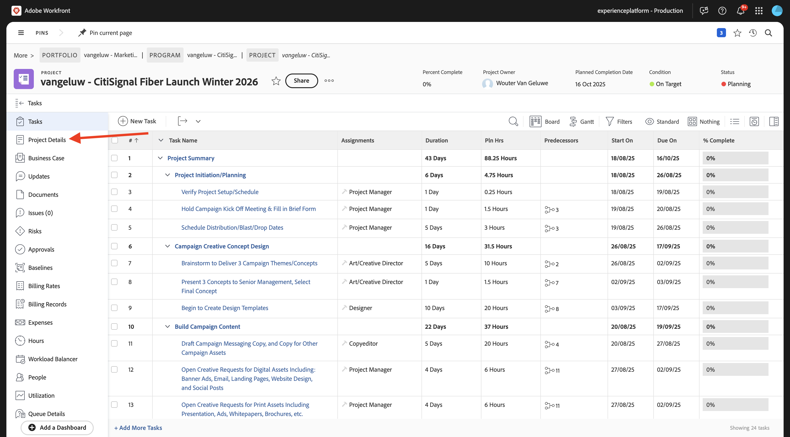
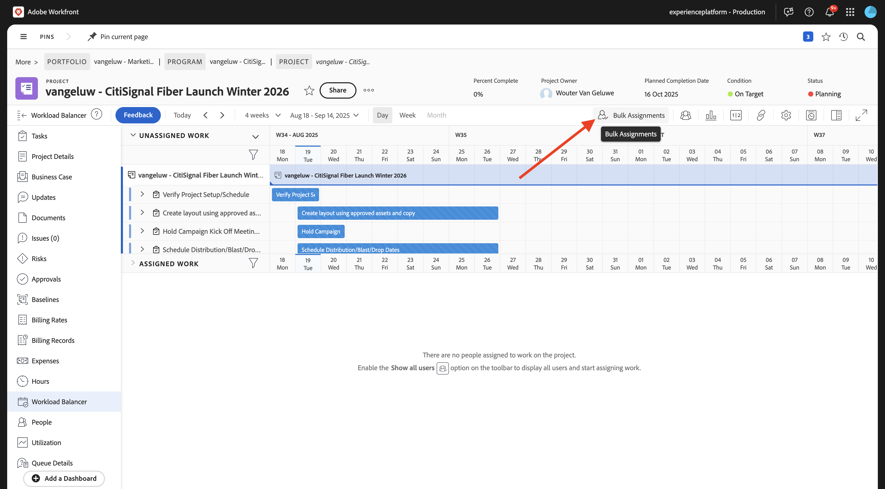
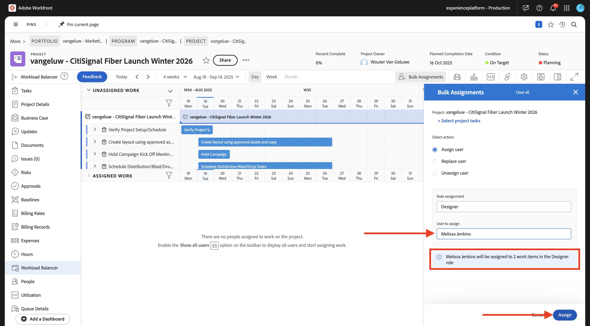
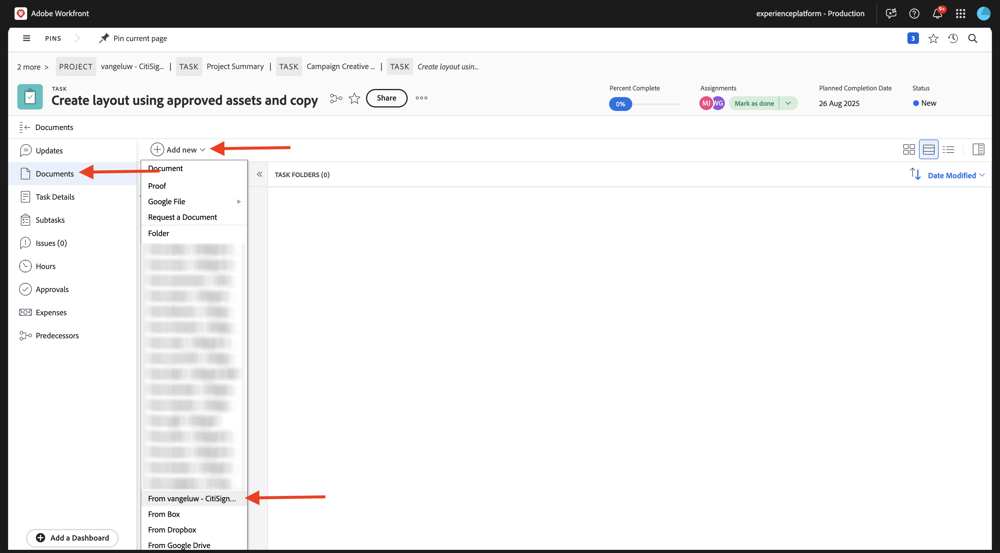
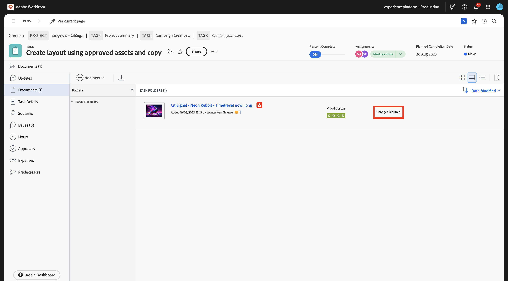
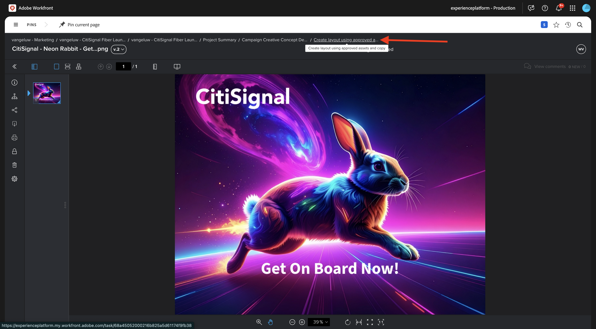
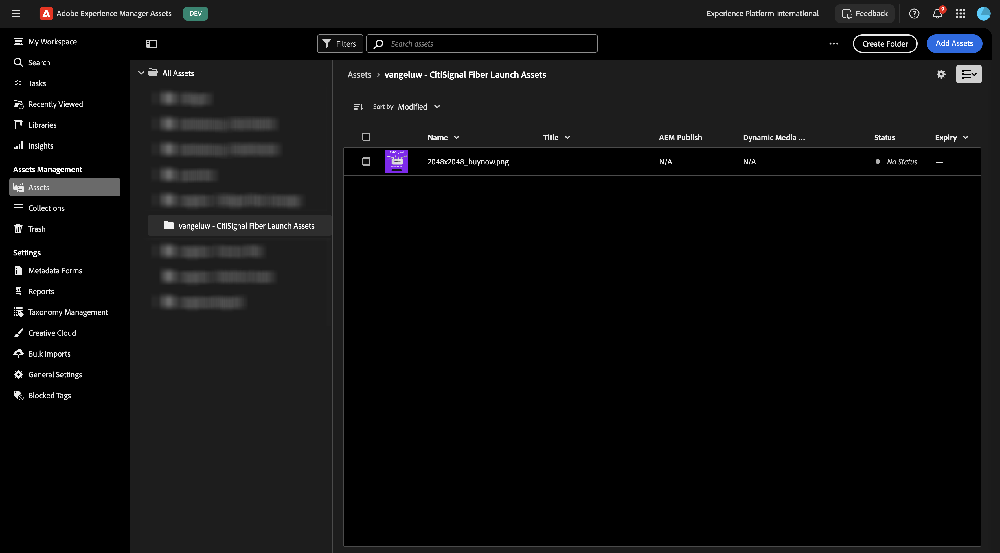

# 1.2.2 Relecture avec Workfront

>[!IMPORTANT]
>
>Si vous avez précédemment configuré un programme AEM CS avec un environnement AEM Assets CS, il se peut que votre sandbox AEM CS ait été mis en veille. Étant donné que la réactivation d’un tel sandbox prend entre 10 et 15 minutes, il serait judicieux de lancer le processus de réactivation maintenant afin de ne pas avoir à l’attendre plus tard.

## 1.2.2.1 Créer un flux d’approbation

Revenez à **Adobe Workfront**. Cliquez sur l&#39;icône **menu** et sélectionnez **Vérification**.

Accédez à **Workflows**, cliquez sur **+ Nouveau** puis sélectionnez **Nouveau modèle**.

Définissez le **Nom du modèle** sur `--aepUserLdap-- - Approval Workflow` et définissez le **Propriétaire du modèle** sur vous-même.

Faites défiler vers le bas, puis sous **Étapes** > **Étape 1**, remplacez le rôle **Créateur d’épreuve** par **Réviseur et approbateur**. Vous pouvez également ajouter n’importe qui d’autre. Par exemple, ajoutez-vous en sélectionnant votre utilisateur et en définissant le **Rôle** de **Réviseur et approbateur**.

Cliquez sur **Créer**.

Votre workflow d’approbation de base est maintenant prêt à être utilisé.

## 1.2.2.2 Activer le plan directeur Workfront

À l’étape suivante, vous allez créer un projet à l’aide d’un modèle. Adobe Workfront vous fournit un certain nombre de plans directeurs disponibles qui doivent simplement être activés.

Pour le cas d&#39;utilisation de CitiSignal, le plan directeur **Exécution de campagne intégrée** est celui que vous devez utiliser.

Pour installer ce plan directeur, ouvrez le menu et sélectionnez **Plans directeurs**.

Sélectionnez le filtre **Marketing** puis faites défiler l’écran vers le bas pour trouver le plan directeur **Exécution de campagne intégrée**. Cliquez sur **Installer**.

Cliquez sur **Continuer**.

Cliquez sur **Installer en l’état...**.

Vous devriez alors voir ceci. L’installation peut prendre quelques minutes.

Après quelques minutes, le plan directeur sera installé.

## 1.2.2.3 Créer un projet

Ouvrez le **menu** et accédez à **Programmes**.

Cliquez sur le programme que vous avez créé précédemment et qui s’appelle `--aepUserLdap-- CitiSignal Fiber Launch`.

>[!NOTE]
>
>Vous avez créé un programme dans le cadre de l&#39;exercice sur [Workfront Planning](./../module1.1/ex1.md) avec l&#39;automatisation que vous avez créée et exécutée. Si vous ne l&#39;avez pas encore fait, vous pouvez trouver les instructions ici.

Dans votre programme, accédez à **Projets**. Cliquez sur **+ Nouveau projet** puis sélectionnez **Nouveau projet à partir d’un modèle**.

Sélectionnez le modèle **Exécution de campagne intégrée** et cliquez sur **Utiliser le modèle**.

Vous devriez alors voir ceci. Remplacez le nom par `--aepUserLdap-- - CitiSignal Fiber Launch Winter 2026` et cliquez sur **Créer un projet**.

Votre projet est maintenant créé. Accédez à **Détails du projet**.

Accédez à **Détails du projet**. Cliquez pour sélectionner le texte actif sous **Description**.

Définissez la description sur `The CitiSignal Fiber Launch project is used to plan the upcoming launch of CitiSignal Fiber.`

Cliquez sur **Enregistrer les modifications**.

Votre projet est maintenant prêt à être utilisé.

Les tâches et les dépendances du projet ont été créées à partir du modèle que vous avez choisi et vous avez été défini comme . propriétaire du projet. Le statut du projet a été défini sur **Planification**. Vous pouvez modifier le statut du projet en sélectionnant une autre valeur dans la liste.

## 1.2.2.4 Créer une nouvelle tâche

Pointez sur la tâche **Commencer à créer des modèles de conception** et cliquez sur le **de 3 points...**.

Sélectionnez l’option **Insérer la tâche ci-dessous**.

Saisissez le nom suivant pour votre tâche : `Create layout using approved assets and copy`.

Définissez le champ **Affectations** sur le rôle **Designer**.
Définissez le champ **Durée** sur **5 jours**.
Définissez le prédécesseur du champ sur **9**.
Saisissez une date pour les champs **Début le** et **Échéance le**.

Cliquez ailleurs dans l&#39;écran pour enregistrer la nouvelle tâche.

Vous devriez alors voir ceci. Cliquez sur la tâche pour l’ouvrir.

Accédez à **Détails de la tâche** et définissez le champ **Description** sur : `This task is used to track the progress of the creation of the assets for the CitiSignal Fiber Launch Campaign.`

Cliquez sur **Enregistrer les modifications**.

Vous devriez alors voir ceci. Cliquez sur le champ **Projet** pour revenir à votre projet.

Dans la vue **Projet**, accédez à **Équilibreur de charge de travail**.

Cliquez sur **Affectations en bloc**.

Sélectionnez le **Affectation de rôle** de **Designer** puis cliquez dans le champ **Utilisateur à affecter**. Tous les utilisateurs disposant d&#39;un rôle **Designer** dans votre instance Workfront s&#39;affichent. Dans ce cas, sélectionnez l’utilisatrice fictive **Melissa Jenkins**.

Cliquez sur **Attribuer**. L&#39;utilisateur que vous avez sélectionné sera désormais affecté aux tâches du projet liées au rôle **Designer**.

Les tâches sont maintenant affectées. Cliquez sur **Tâches** pour revenir à la page **Tâches** Aperçu.

Cliquez sur la tâche que vous avez créée, qui est nommée
**Créer une disposition à l’aide de ressources approuvées et de la copie**.

Vous allez maintenant commencer à travailler sur cette tâche dans le cadre de cet exercice. Vous pouvez voir que Melissa Jenkins est affectée à cette tâche pour le moment. Pour le modifier vous-même, cliquez sur le champ **Affectations** et sélectionnez **M’affecter**.

Cliquez sur **Enregistrer**.

Cliquez sur **Travailler dessus**.

Vous devriez alors voir ceci.

Dans le cadre de cette tâche, vous devez créer une nouvelle image, puis la charger sous forme de document dans Workfront. Vous allez à présent créer cette ressource vous-même à l’aide d’Adobe Express.

## 1.2.2.5 Ajouter un nouveau document à votre projet et lancer le flux d’approbation

Pour cet exercice, vous devez télécharger et utiliser la ressource suivante : [timetravelnow.png](./images/timetravelnow.png)

Accédez à **Documents** pour votre tâche. Cliquez sur **+ Ajouter** puis sélectionnez **Document**.

Cliquez pour sélectionner le fichier `timetravelnow.png`. Cliquez sur **Ouvrir**.

Tu devrais avoir ça.

Pointez sur le document chargé. Cliquez sur **Créer une épreuve** puis choisissez **Épreuve avancée**.

Dans la fenêtre **nouveau BAT**, sélectionnez **Automatisé** puis sélectionnez le modèle de workflow que vous avez créé précédemment et qui doit être nommé `--aepUserLdap-- - Approval Workflow`. Cliquez sur **Créer une épreuve**.

Cliquez sur **Ouvrir l&#39;épreuve**

Vous pouvez maintenant examiner le BAT. Sélectionnez **Ajouter un commentaire** pour ajouter une remarque qui nécessite la modification du document.

Saisissez votre commentaire et cliquez sur **Publier**. Cliquez ensuite sur **Prendre une décision**.

Sélectionnez **Modifications requises** puis cliquez sur **Prendre une décision**.

Revenez à votre **Tâche** et au **Document**. Le texte **Modifications requises** s’affiche également à cet endroit.

Vous devez maintenant apporter des modifications à la conception et charger une nouvelle version de l’image.

## 1.2.2.6 Ajouter une nouvelle version de votre document à votre tâche

Pour cet exercice, vous devez télécharger et utiliser la ressource suivante : [getonboard.png](./images/getonboard.png)

Dans l’affichage Tâche d’Adobe Workfront, sélectionnez l’ancien fichier image qui n’a pas été approuvé. Cliquez ensuite sur **+ Ajouter nouveau**, sélectionnez **Version** puis choisissez **Document**.

Cliquez pour sélectionner le fichier `getonboardnow.png`. Cliquez sur **Ouvrir**.

Tu devrais avoir ça. Cliquez sur **Créer une épreuve** puis sélectionnez à nouveau **Épreuve avancée**.

Tu verras ça. Le **modèle de workflow** est maintenant présélectionné, car Workfront suppose que le workflow d’approbation précédent est toujours valide. Cliquez sur **Créer une épreuve**.

Sélectionnez **Ouvrir l’épreuve**.

Vous pouvez maintenant voir 2 versions du fichier l’une à côté de l’autre. Cliquez sur le bouton **Comparer des BAT**.

Vous devriez alors voir les deux versions de l’image l’une à côté de l’autre. Cliquez sur **Prendre une décision**.

Sélectionnez **Approuvé** et cliquez de nouveau sur **Prendre une décision**.

Fermez la vue **Comparer les épreuves** en fermant la version gauche de l’image. Cliquez sur le **Nom de la tâche** pour revenir à l’aperçu de la tâche.

Vous serez alors de retour dans la vue Tâche avec une ressource approuvée. Cette ressource doit maintenant être partagée vers AEM Assets.

Sélectionnez le document approuvé. Cliquez sur l’icône **flèche de partage** et sélectionnez votre intégration AEM Assets, qui doit être nommée `--aepUserLdap-- - CitiSignal AEM+ACCS`.

Double-cliquez sur le dossier que vous avez créé précédemment et qui doit être nommé `--aepUserLdap-- - CitiSignal Fiber Campaign`.

Cliquez sur **Sélectionner un dossier**.

Au bout de 1 à 2 minutes, votre document sera désormais publié dans AEM Assets. Une icône AEM apparaît en regard du nom du document.

Cliquez sur **Marquer comme terminé** pour terminer cette tâche.

Vous devriez alors voir ceci.

## 1.2.2.7 Afficher votre fichier dans AEM Assets

Accédez à votre dossier dans AEM Assets CS, qui est nommé `--aepUserLdap-- - CitiSignal Fiber Campaign`.

Sélectionnez l’image, puis choisissez **Détails**.

Vous verrez ensuite le formulaire de métadonnées que vous avez créé précédemment, avec les valeurs qui ont été renseignées automatiquement par l’intégration entre Workfront et AEM Assets.

Revenir à [Gestion des workflows avec Adobe Workfront](./workfront.md){target="_blank"}

[Revenir à tous les modules](./../../../overview.md){target="_blank"}
