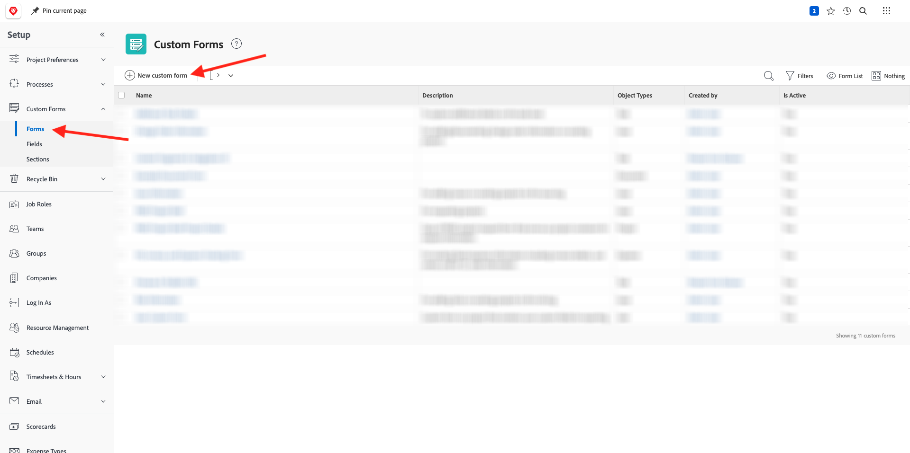
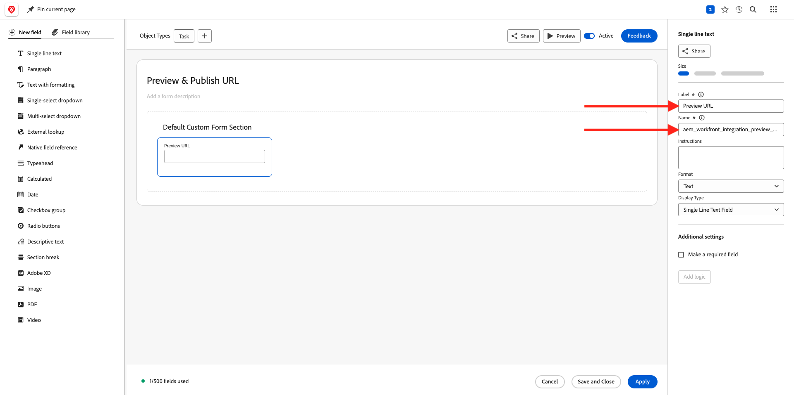

# 1.2.4 Workfront + AEM Sites

Connectez-vous à Adobe Workfront en allant sur [https://experienceplatform.my.workfront.com/](https://experienceplatform.my.workfront.com/){target="_blank"}.

Vous voyez alors ceci.

## 1.2.4.1 Configurer votre intégration AEM Sites

>[!NOTE]
>
>Ce plug-in est actuellement en mode **Accès anticipé** et n’est pas encore disponible pour la plupart des utilisateurs.
>
>Ce plug-in est peut-être déjà installé dans l’instance Workfront que vous utilisez. S’il est déjà installé, vous pouvez consulter les instructions ci-dessous, mais il n’est pas nécessaire de modifier quoi que ce soit dans votre configuration.

Accédez à [https://experience.adobe.com/#/@experienceplatform/aem/extension-manager/universal-editor](https://experience.adobe.com/#/@experienceplatform/aem/extension-manager/universal-editor){target="_blank"}.

Assurez-vous que la **bascule** de ce plug-in est définie sur **Activé**. Cliquez ensuite sur l’icône **engrenage**.

Une fenêtre contextuelle **Configuration de l’extension** s’affiche. Configurez les champs suivants pour utiliser ce plug-in.

| Clé | Valeur |
| --------------- | ------------------------------ | 
| **`IMS_ENV`** | **PROD** |
| **`WORKFRONT_INSTANCE_URL`** | **https://experienceplatform.my.workfront.com** |
| **`SHOW_CUSTOM_FORMS`** | **&#39;{« previewUrl »: true, « publishUrl »: true}&#39;** |

Cliquez sur **Enregistrer**.

Revenez à l’interface utilisateur de Workfront et cliquez sur l’icône des 9 points **hamburger**. Sélectionnez **Configuration**.

Dans le menu de gauche, accédez à **Custom Forms** et sélectionnez **Form**. Cliquez sur **+ Nouveau formulaire personnalisé**.

Sélectionnez **Tâche** et cliquez sur **Continuer**.

Un formulaire personnalisé vide s’affiche alors. Saisissez le nom du formulaire `Content Fragment & Integration ID`.

Effectuez un glisser-déposer d’un nouveau champ **Texte monoligne** sur la zone de travail.

Configurez le nouveau champ comme suit :

- **Libellé** : **Fragment de contenu**
- **Nom** : **`aem_workfront_integration_content_fragment`**

Ajoutez un nouveau champ **Texte monoligne** sur la zone de travail et configurez le nouveau champ comme suit :

- **Libellé** : **ID d’intégration**
- **Nom** : **`aem_workfront_integration_id`**

Cliquez sur **Appliquer**.

Vous devez maintenant configurer un second formulaire personnalisé. Cliquez sur **+ Nouveau formulaire personnalisé**.

Sélectionnez **Tâche** et cliquez sur **Continuer**.

Un formulaire personnalisé vide s’affiche alors. Saisissez le nom du formulaire `Preview & Publish URL`.

Effectuez un glisser-déposer d’un nouveau champ **Texte monoligne** sur la zone de travail.

Configurez le nouveau champ comme suit :

- **Libellé** : **URL de prévisualisation**
- **Nom** : **`aem_workfront_integration_preview_url`**

Ajoutez un nouveau champ **Texte monoligne** sur la zone de travail et configurez le nouveau champ comme suit :

- **Libellé** : **URL de publication**
- **Nom** : **`aem_workfront_integration_publish_url`**

Cliquez sur **Appliquer**.

Vous devriez alors disposer de 2 formulaires personnalisés.

Étape suivante : [1.2.2 Vérification avec Workfront](./ex2.md){target="_blank"}

Revenir à [Gestion des workflows avec Adobe Workfront](./workfront.md){target="_blank"}

[Revenir à tous les modules](./../../../overview.md){target="_blank"}
