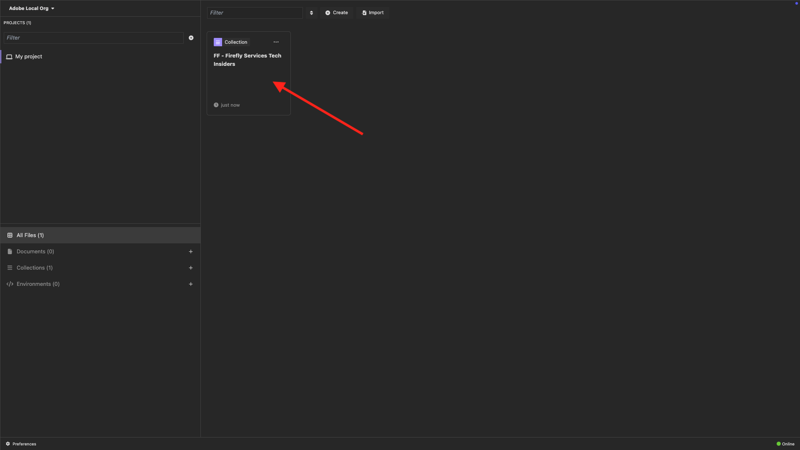

# PostBuster

>[!IMPORTANT]
>
>Les instructions ci-dessous sont destinées uniquement aux employés Adobes.

## Installer PostBuster

Accédez à [https://adobe.service-now.com/esc?id=adb_esc_kb_article&amp;sysparm_article=KB0020542](https://adobe.service-now.com/esc?id=adb_esc_kb_article&amp;sysparm_article=KB0020542).

Cliquez pour télécharger la dernière version de **PostBuster**.


Téléchargez la version adaptée à votre système d’exploitation.


Une fois le téléchargement terminé et installé, ouvrez PostBuster. Vous devriez alors voir ceci. Cliquez sur **Importer**.


Téléchargez [postbuster.json.zip](./assets/postman/postbuster.json.zip) et extrayez-le sur votre bureau.


Cliquez sur **Choisir un fichier**.


Sélectionnez le fichier **postbuster.json**. Cliquez sur **Ouvrir**.


Vous devriez alors voir ceci. Cliquez sur **Scan**.


Cliquez sur **Importer**.


Vous devriez alors voir ceci. Cliquez pour ouvrir la collection importée.



Maintenant, vous voyez votre collection. Vous devez toujours configurer un environnement pour contenir certaines variables d’environnement.


Cliquez sur **Environnement de base** puis sur l’icône **Modifier**.


Vous devriez alors voir ceci.


Copiez l’espace réservé d’environnement ci-dessous et collez-le dans l’**Environnement de base**.

```json
{
	"CLIENT_SECRET": "",
	"API_KEY": "",
	"ACCESS_TOKEN": "",
	"SCOPES": [
		"openid",
		"AdobeID",
		"ff_apis",
		"firefly_api"
	],
	"TECHNICAL_ACCOUNT_ID": "",
	"IMS": "ims-na1.adobelogin.com",
	"IMS_ORG": "",
	"access_token": "",
	"IMS_TOKEN": "",
	"AZURE_STORAGE_URL": "",
	"AZURE_STORAGE_CONTAINER": "",
	"AZURE_STORAGE_SAS_READ": "",
	"AZURE_STORAGE_SAS_WRITE": ""
}
```

Tu devrais avoir ça.


Après avoir parcouru le module **Services de Firefly**, votre environnement doit ressembler à ceci. Vous n’avez pas besoin de le faire maintenant, nous y reviendrons plus tard.


>[!NOTE]
>
>{width="50px" align="left"}
>
>Si vous avez des questions, si vous souhaitez partager des commentaires généraux ou si vous avez des suggestions sur le contenu futur, veuillez contacter directement les initiés techniques, en envoyant un e-mail à **techinsiders@adobe.com**.

[Revenir à tous les modules](./overview.md)
