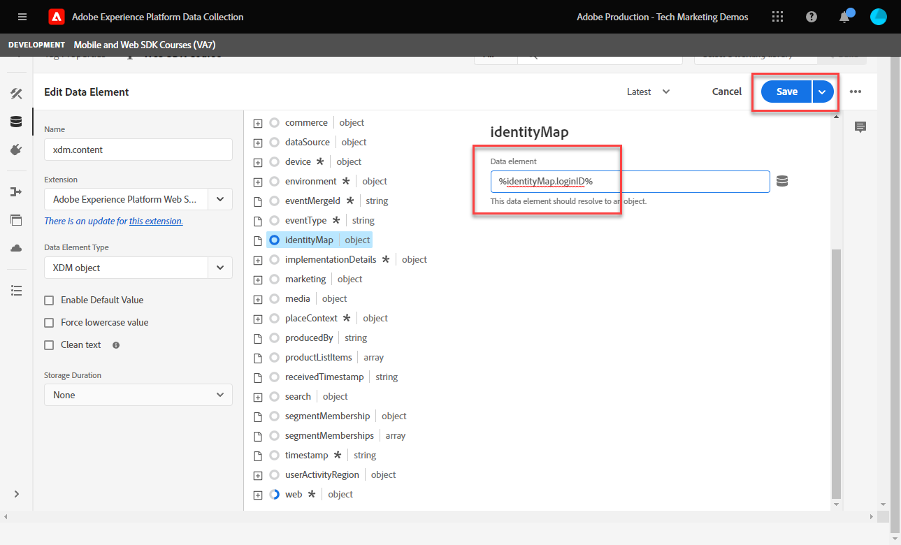

# Créer des éléments de données

Découvrez comment créer les éléments de données essentiels nécessaires pour capturer des données avec le SDK Web Experience Platform. Capturez à la fois les données de contenu et d’identité sur le [Site de démonstration Luma](https://luma.enablementadobe.com/content/luma/us/en.html). Découvrez comment utiliser le schéma XDM que vous avez créé précédemment pour collecter des données à l’aide du type d’élément de données SDK Web Platform appelé Variable.

>[!NOTE]
>
> À des fins de démonstration, les exercices de cette leçon s’appuient sur l’exemple utilisé pendant [Configuration d’un schéma](configure-schemas.md) création d’exemples d’objets XDM qui capturent le contenu affiché et les identités des utilisateurs sur la page [Site de démonstration Luma](https://luma.enablementadobe.com/content/luma/us/en.html).

>[!IMPORTANT]
>
>Les données de cette leçon proviennent de la `[!UICONTROL digitalData]` couche de données sur le site Luma. Pour afficher la couche de données, ouvrez votre console de développement et saisissez `[!UICONTROL digitalData]` pour afficher la couche de données complète disponible.


Quel que soit le SDK Web Platform, vous devez continuer à créer des éléments de données dans votre propriété de balises qui mappent aux variables de collecte de données de votre site web, telles qu’une couche de données, un attribut de HTML ou d’autres. Une fois que vous avez créé ces éléments de données, vous devez les mapper au schéma XDM que vous avez créé lors de la [configuration des schémas](configure-schemas.md) leçon. Par conséquent, la création d’éléments de données se compose de deux actions :

1. Mappage des variables de site web aux éléments de données et
1. Mappage de ces éléments de données à un objet XDM

Pour l’étape 1, vous continuez à mapper votre couche de données aux éléments de données comme vous le faites actuellement, à l’aide de l’un des types d’éléments de données de l’extension de balise Core. Pour l’étape 2, les types d’éléments de données suivants sont disponibles pour l’extension SDK Web Platform :

* Identifiant de fusion d’événements
* Mappage d’identités
* Variable
* Objet XDM

Cette leçon porte sur le type d’élément de données Variable . Vous créez un élément de données pour capturer l’activité des visiteurs Luma en fonction de la couche de données disponible sur le site Luma. Dans la leçon suivante, vous en apprendrez plus sur la carte des identités.

>[!NOTE]
>
> Les types d’éléments de données d’objet de fusion d’événements et XDM sont rarement utilisés pour les cas de périphérie.

## Objectifs d&#39;apprentissage

À la fin de cette leçon, vous pouvez :

* Présentation des différentes approches pour mapper une couche de données à XDM
* Créer des éléments de données pour capturer les données de contenu
* Mise en correspondance des éléments de données avec un élément de données d’objet XDM


## Conditions préalables

Vous comprenez ce qu’est une couche de données, vous connaissez le [Site de démonstration Luma](https://luma.enablementadobe.com/content/luma/us/en.html){target="_blank"} couche de données et savoir comment référencer des éléments de données dans des balises. Vous devez avoir suivi les étapes précédentes suivantes du tutoriel.

* [Configurer un schéma XDM](configure-schemas.md)
* [Configuration d’un espace de noms d’identité](configure-identities.md)
* [Configurer un trains de données](configure-datastream.md)
* [Extension SDK Web installée dans la propriété de balise](install-web-sdk.md)

>[!IMPORTANT]
>
>La variable [Extension du service d’ID Experience Cloud](https://exchange.adobe.com/experiencecloud.details.100160.adobe-experience-cloud-id-launch-extension.html) n’est pas nécessaire lors de l’implémentation du SDK Web de Adobe Experience Platform, car la fonctionnalité du service d’ID est intégrée au SDK Web de Platform.

## Approches de la couche de données

Il existe plusieurs façons de mapper les données de votre couche de données à XDM à l’aide de la fonctionnalité de balises de Adobe Experience Platform. Voici quelques avantages et inconvénients de trois approches différentes :

* [Mise en oeuvre de XDM dans la couche de données](create-data-elements.md#implement-xdm-in-the-data-layer)
* [Mappage à XDM dans le flux de données](create-data-elements.md#map-to-xdm-in-the-datastream)
* [Mappage à XDM dans les balises](create-data-elements.md#map-data-layer-in-tags)

>[!NOTE]
>
>Les exemples de ce tutoriel suivent l’approche Associer à XDM dans les balises .


### Mise en oeuvre de XDM dans la couche de données

Cette approche implique l’utilisation de l’objet XDM entièrement défini comme structure pour votre couche de données. Ensuite, vous mappez l’ensemble de la couche de données à un élément de données d’objet XDM dans les balises Adobe. Si votre implémentation n’utilise pas de gestionnaire de balises, cette approche peut s’avérer idéale, car vous pouvez envoyer des données à XDM directement à partir de votre application à l’aide de la méthode [Commande XDM sendEvent](https://experienceleague.adobe.com/docs/experience-platform/edge/fundamentals/tracking-events.html?lang=en#sending-xdm-data). Si vous utilisez des balises d’Adobe, vous pouvez créer un élément de données de code personnalisé qui capture l’ensemble de la couche de données en tant qu’objet JSON de transfert vers XDM. Ensuite, vous mappez le JSON de transfert au champ d’objet XDM dans l’action Envoyer l’événement.

Vous trouverez ci-dessous un exemple de l’apparence de la couche de données à l’aide du format de couche de données client Adobe :

+++XDM dans l’exemple de couche de données

```JSON
window.adobeDataLayer.push({
"eventType": "web.webPageDetails.pageViews",
"web":{
         "webInteraction":{
            "linkClicks":{
               "id":"",
               "value":""
            },
            "URL":"",
            "name":"",
            "region":"",
            "type":""
         },
         "webPageDetails":{
            "pageViews":{
               "id":"",
               "value":"1"
            },
            "URL":"https://luma.enablementadobe.com/",
            "isErrorPage":"",
            "isHomePage":"",
            "name":"luma:home",
            "server":"enablementadobe.com",
            "siteSection":"home",
            "viewName":""
         },
         "webReferrer":{
            "URL":"",
            "type":""
         }
      }
});
```

+++

Avantages

* Ignore les étapes de mappage de variables de couche de données individuelles à XDM.
* Déploiement peut être plus rapide si votre équipe de développement possède le balisage du comportement numérique

Inconvénients

* Dépendance totale envers l’équipe de développement et le cycle de développement pour la mise à jour des données vers XDM
* Flexibilité limitée car XDM reçoit la charge utile exacte de la couche de données
* Impossible d’utiliser les fonctionnalités intégrées de balises, telles que le raclage, la persistance et les fonctionnalités pour les déploiements rapides.
* Impossible d’utiliser la couche de données pour les pixels tiers
* Impossible de transformer les données entre la couche de données et XDM

### Mappage à XDM dans le flux de données

Cette approche utilise une fonctionnalité intégrée à la configuration de flux de données appelée [Préparation de données pour la collecte de données](https://experienceleague.adobe.com/docs/experience-platform/datastreams/data-prep.html) et ignore le mappage des variables de couche de données sur XDM dans les balises .

Avantages

* Flexibilité, car vous pouvez mapper des variables individuelles à XDM
* Capacité à [calculer les nouvelles valeurs](https://experienceleague.adobe.com/docs/experience-platform/data-prep/functions.html?lang=fr) ou [transformation des types de données](https://experienceleague.adobe.com/docs/experience-platform/data-prep/data-handling.html) d’une couche de données avant de passer à XDM ;
* Exploitation d’un [Interface utilisateur du mappage](https://experienceleague.adobe.com/docs/experience-platform/datastreams/data-prep.html#create-mapping) pour mapper des champs de vos données source à XDM avec une interface utilisateur pointer-cliquer

Inconvénients

* Impossible d’utiliser des variables de couche de données comme éléments de données pour les pixels tiers côté client, mais peut les utiliser avec le transfert d’événement de balises d’Adobe.
* Impossible d’utiliser la fonctionnalité de mise à l’échelle des balises de Adobe Experience Platform
* La complexité de la maintenance augmente lors du mappage de la couche de données dans les balises et dans le flux de données.

### Mappage de la couche de données dans les balises

Cette approche implique le mappage de variables de couche de données individuelles OU d’objets de couche de données à des éléments de données dans des balises et éventuellement à XDM. Il s’agit de l’approche traditionnelle de l’implémentation à l’aide d’un système de gestion des balises.

Avantages

* L’approche la plus flexible qui soit, car vous pouvez contrôler des variables individuelles et transformer des données avant qu’elles ne soient transférées vers XDM.
* Peut utiliser les déclencheurs de balises d’Adobe et la fonctionnalité de mise à l’échelle pour transmettre des données à XDM
* Peut mapper des éléments de données à des pixels tiers côté client

Inconvénients

* La mise en oeuvre peut prendre plus de temps.

>[!TIP]
>
> Couche de données Google
> 
> Si votre entreprise utilise déjà des Google Analytics et dispose de l’objet DataLayer Google traditionnel sur votre site web, vous pouvez utiliser la variable [Extension de la couche de données Google](https://experienceleague.adobe.com/docs/experience-platform/tags/extensions/client/google-data-layer/overview.html?lang=en) dans Balises d’Adobe. Cela vous permet de déployer la technologie Adobe plus rapidement sans avoir à demander l’assistance de votre équipe informatique. Le mappage de la couche de données Google à XDM suit les mêmes étapes que ci-dessus.

>[!IMPORTANT]
>
>Comme nous l’avons vu plus haut, les exemples de ce tutoriel suivent l’approche Associer à XDM dans les balises .

## Créer des éléments de données pour capturer la couche de données

Avant de créer l’objet XDM, créez l’ensemble suivant d’éléments de données pour le [Site de démonstration Luma](https://luma.enablementadobe.com/content/luma/us/en.html){target="_blank"} couche de données :

1. Accédez à **[!UICONTROL Éléments de données]** et sélectionnez **[!UICONTROL Ajouter un élément de données]** (ou **[!UICONTROL Créer un élément de données]** s’il n’existe aucun élément de données existant dans la propriété de balise)

   

1. Nommez l’élément de données `page.pageInfo.pageName`.
1. Utilisez la variable **[!UICONTROL Variable JavaScript]** **[!UICONTROL Type d’élément de données]** pour pointer vers une valeur dans la couche de données de Luma : `digitalData.page.pageInfo.pageName`

1. Cochez les cases correspondant à **[!UICONTROL Forcer la valeur en minuscules]** et **[!UICONTROL Texte clair]** pour normaliser la casse et supprimer les espaces superflus

1. Laisser `None` comme la propriété **[!UICONTROL Durée de stockage]** car cette valeur est différente sur chaque page

1. Sélectionnez **[!UICONTROL Enregistrer]**.

   

Créez ces quatre éléments de données supplémentaires en procédant comme suit :

* **`page.pageInfo.server`**  mappé à
  `digitalData.page.pageInfo.server`

* **`page.pageInfo.hierarchie1`**  mappé à
  `digitalData.page.pageInfo.hierarchie1`

* **`user.profile.attributes.username`**  mappé à
  `digitalData.user.0.profile.0.attributes.username`

* **`user.profile.attributes.loggedIn`** mappé à
  `digitalData.user.0.profile.0.attributes.loggedIn`

* **`cart.orderId`** mappé à `digitalData.cart.orderId` (vous utilisez cette méthode lors de l’événement [Configuration d’Analytics](setup-analytics.md) leçon)


>[!CAUTION]
>
>La variable [!UICONTROL Variable JavaScript] Le type d’élément de données traite les références aux tableaux comme des points plutôt que des crochets. Par conséquent, le fait de référencer l’élément de données username comme `digitalData.user[0].profile[0].attributes.username` **ne fonctionnera pas**.

## Création d’un élément de données Variable

Après avoir créé les éléments de données, mappez-les au XDM à l’aide de la variable **[!UICONTROL Variable]** élément de données qui définit le schéma utilisé pour l’objet XDM. Cet objet doit être conforme au schéma XDM que vous avez créé lors de la [Configuration d’un schéma](configure-schemas.md) leçon.

Pour créer l’élément de données Variable :

1. Sélectionner **[!UICONTROL Ajouter un élément de données]**
1. Nommer votre élément de données `xdm.variable.content`. Il est recommandé d’ajouter le préfixe &quot;xdm&quot; aux éléments de données spécifiques à XDM pour mieux organiser la propriété de balise.
1. Sélectionnez la variable **[!UICONTROL SDK Web Adobe Experience Platform]** comme la propriété **[!UICONTROL Extension]**
1. Sélectionnez la variable **[!UICONTROL Variable]** comme la propriété **[!UICONTROL Type d’élément de données]**
1. Sélectionnez l’Experience Platform approprié. **[!UICONTROL Sandbox]**
1. Sélectionnez les **[!UICONTROL Schéma]**, dans ce cas `Luma Web Event Data`
1. Sélectionnez **[!UICONTROL Enregistrer]**.

   

<!-- There are different ways to map data elements to XDM object fields. You can map individual data elements to individual XDM fields or map data elements to entire XDM objects as long as your data element matches the exact key-value pair schema present in the XDM object. In this lesson, you will capture content data by mapping to individual fields. You will learn how to [map a data element to an entire XDM object](setup-analytics.md#Map-an-entire-array-to-an-XDM-Object) in the [Setup Analytics](setup-analytics.md) lesson. 

Create an XDM object to capture content data:

1. In the left navigation, select **[!UICONTROL Data Elements]**
1. Select **[!UICONTROL Add Data Element]**
1. **[!UICONTROL Name]** the data element **`xdm.content`**
1. As the **[!UICONTROL Extension]** select `Adobe Experience Platform Web SDK`
1. As the **[!UICONTROL Data Element Type]** select `XDM object`
1. Select the Platform **[!UICONTROL Sandbox]** in which you created the XDM schema in during the [Configure an XDM Schema](configure-schemas.md) lesson, in this example `DEVELOPMENT Mobile and Web SDK Courses`
1. As the **[!UICONTROL Schema]**, select your `Luma Web Event Data` schema:

    

    >[!NOTE]
    >
    >The sandbox corresponds to the Experience Platform sandbox in which you created the schema. There can be multiple sandboxes available in your Experience Platform instance, so make sure to select the right one. Always work in development first, then production.

1. Scroll down until you reach the **`web`** object
1. Select to open it

    


1. Map the following web XDM variables to data elements

    * **`web.webPageDetials.name`** to `%page.pageInfo.pageName%`
    * **`web.webPageDetials.server`** to `%page.pageInfo.server%`
    * **`web.webPageDetials.siteSection`** to `%page.pageInfo.hierarchie1%`

    

1. Next, find the `identityMap` object in the schema and select it
 
1. Map to the `identityMap.loginID` data element

1. Select **[!UICONTROL Save]**

   

-->

A la fin de ces étapes, les éléments de données suivants doivent être créés :

| Éléments de données d’extension CORE | Éléments de données du SDK Web Platform |
-----------------------------|-------------------------------
| `cart.orderId` | `xdm.variable.content` |
| `page.pageInfo.hierarchie1` | |
| `page.pageInfo.pageName` | |
| `page.pageInfo.server` | |
| `user.profile.attributes.loggedIn` | |
| `user.profile.attributes.username` | |


>[!TIP]
>
>Dans le futur [Création d’une règle de balise](create-tag-rule.md) leçon, vous découvrez comment la fonction **[!UICONTROL Variable]** l’élément de données vous permet d’empiler plusieurs règles dans des balises à l’aide de la variable **[!UICONTROL Type d’action de mise à jour de variable]**. Ensuite, vous pouvez envoyer indépendamment l’objet XDM à Adobe Experience Platform Edge Network à l’aide d’une **[!UICONTROL Type d’action Envoyer un événement]**.

Une fois ces éléments de données en place, vous êtes prêt à commencer à envoyer des données à Platform Edge Network avec une règle de balises. Mais découvrez tout d’abord comment collecter des identités avec le SDK Web.

[Suivant : ](create-identities.md)

>[!NOTE]
>
>Merci d’avoir consacré du temps à l’apprentissage du SDK Web Adobe Experience Platform. Si vous avez des questions, souhaitez partager des commentaires généraux ou avez des suggestions sur le contenu futur, partagez-les à ce sujet. [Article de discussion de la communauté Experience League](https://experienceleaguecommunities.adobe.com/t5/adobe-experience-platform-launch/tutorial-discussion-implement-adobe-experience-cloud-with-web/td-p/444996)
