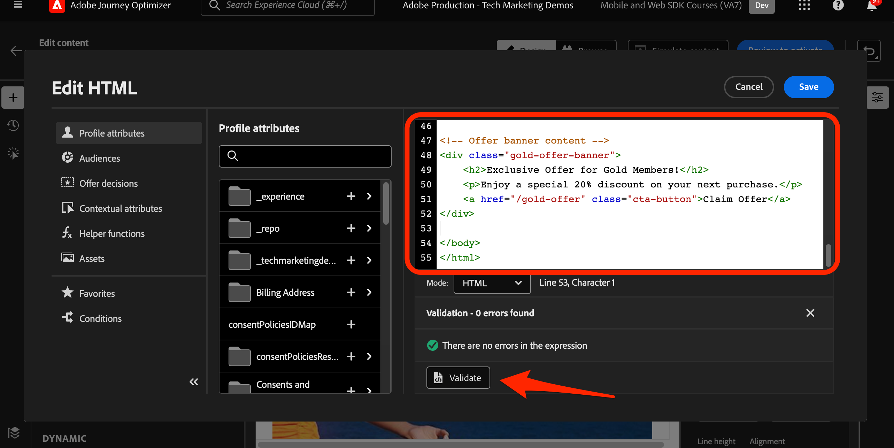

# Configuration d’un canal web avec le SDK web Platform

Découvrez comment mettre en oeuvre le canal web à l’aide du SDK web Platform. Ce guide couvre les conditions préalables fondamentales du canal web, les étapes détaillées de configuration et une section approfondie sur un cas d’utilisation centré sur l’état de fidélité.

En suivant ce guide, les utilisateurs de Journey Optimizer sont à même d’appliquer efficacement le canal web pour une personnalisation en ligne avancée à l’aide du Concepteur web de Journey Optimizer.

## Objectifs d’apprentissage

À la fin de cette leçon, vous pouvez :

* Comprendre la fonction et l’importance du SDK Web pour diffuser l’expérience du canal web.
* Découvrez le processus de création d’une campagne de canal web du début à la fin à l’aide de l’exemple de cas d’utilisation des récompenses de fidélité Luma.
* Configurez les propriétés, les actions et les plannings de campagne dans l’interface.
* Découvrez les fonctionnalités et les avantages de l’extension d’assistance pour l’édition visuelle de Adobe Experience Cloud.
* Découvrez comment modifier le contenu d’une page web, y compris les images, les en-têtes et d’autres éléments, à l’aide du Concepteur web.
* Découvrez comment insérer des offres dans une page web à l’aide du composant de décision Offre.
* Familiarisez-vous avec les bonnes pratiques pour garantir la qualité et le succès d’une campagne de canal web.

## Conditions préalables

Pour terminer les leçons de cette section, vous devez d’abord :

* Assurez-vous que la version de votre extension de balises SDK Web Adobe Experience Platform est 2.16 ou supérieure.
* Si vous utilisez le concepteur web de Journey Optimizer pour créer votre expérience de canal web, vérifiez que vous utilisez les navigateurs Google Chrome ou Microsoft® Edge.
* Assurez-vous également d’avoir téléchargé l’extension de navigateur Adobe Experience Cloud Visual Editing Helper. Activez l’extension de navigateur Visual Editing Helper dans la barre d’outils de votre navigateur avant de créer l’expérience de canal web.
   * Dans le concepteur web de Journey Optimizer, certains sites web peuvent ne pas s’ouvrir de manière fiable pour l’une des raisons suivantes :
      1. Le site web a des politiques de sécurité rigoureuses.
      1. Le site web est incorporé dans un iframe.
      1. Le site d’assurance qualité ou d’évaluation du client n’est pas accessible en externe (il s’agit d’un site interne).
* Assurez-vous que les cookies tiers sont autorisés dans votre navigateur. Il peut être nécessaire de désactiver également tous les bloqueurs d’annonces dans votre navigateur.
* Lors de la création d’expériences web et de l’inclusion de contenu à partir de la bibliothèque Adobe Experience Manager Assets Essentials, il est nécessaire de configurer le sous-domaine pour publier ce contenu. [En savoir plus](https://experienceleague.adobe.com/docs/journey-optimizer/using/web/web-delegated-subdomains.html?lang=en).
* Si vous utilisez la fonction d’expérimentation de contenu, assurez-vous que votre jeu de données web est également inclus dans votre configuration de création de rapports.
* Actuellement, deux types d’implémentations sont pris en charge pour activer la création et la diffusion de campagnes de canal web sur vos propriétés web :
   * Côté client uniquement : pour modifier votre site web, vous devez mettre en oeuvre le SDK Web de Adobe Experience Platform.
   * Mode hybride : vous pouvez utiliser l’API Platform Edge Network Server pour demander une personnalisation côté serveur. La réponse de l’API est ensuite fournie au SDK Web de Adobe Experience Platform pour le rendu des modifications côté client. Pour plus d’informations, consultez la documentation de l’API Adobe Experience Platform Edge Network Server. Vous trouverez des détails supplémentaires et des exemples de mise en oeuvre pour le mode hybride dans cet article de blog.

>[!NOTE]
>
>La mise en oeuvre côté serveur uniquement n’est actuellement pas prise en charge.

## Terminologie

Tout d’abord, vous devez comprendre la terminologie utilisée dans les campagnes de canal web.

* **Canal web**: un support pour la communication ou la diffusion de contenu via le web. Dans le cadre de ce guide, il fait référence au mécanisme par lequel le contenu personnalisé est diffusé aux visiteurs du site Web à l’aide du SDK Web Platform, dans Adobe Journey Optimizer.
* **Surface Web**: fait référence à une propriété web identifiée par une URL où le contenu est diffusé. Elle peut englober une ou plusieurs pages web.
* **Concepteur web de Journey Optimizer**: outil ou interface spécifique dans Journey Optimizer dans lequel les utilisateurs peuvent concevoir leurs expériences de canal web.
* **Assistant d’édition visuelle de Adobe Experience Cloud**: extension de navigateur qui aide à la modification et à la conception visuelles d’expériences de canal web.
* **Datastream**: configuration au sein du service Adobe Experience Platform qui garantit la diffusion des expériences de canal web.
* **Stratégie de fusion**: configuration qui garantit l’activation et la publication précises des campagnes entrantes.
* **Audience**: segment spécifique d’utilisateurs ou de visiteurs du site qui répondent à certains critères.
* **Concepteur web**: interface ou outil permettant de modifier visuellement et de concevoir des expériences web sans enfourcher le code.
* **Éditeur d’expression**: outil dans le concepteur web qui permet aux utilisateurs d’ajouter une personnalisation au contenu web, éventuellement en fonction d’attributs de données ou d’autres critères.
* **Composant de décision d’offre**: composant du concepteur web qui permet de déterminer l’offre la mieux adaptée pour être affichée pour un visiteur spécifique en fonction de la gestion des décisions.
* **Expérience de contenu**: méthode permettant de tester différentes variations de contenu afin de déterminer celle qui fonctionne le mieux en termes de mesure souhaitée, comme les clics entrants.
* **Traitement**: dans le cadre d’expériences de contenu, un traitement fait référence à une variation spécifique de contenu testé par rapport à un autre.
* **Simulation**: mécanisme d’aperçu permettant de visualiser l’expérience du canal web avant de l’activer pour les audiences en direct.

## Configuration du flux de données

Assurez-vous qu’un flux de données est défini dans le service Adobe Experience Platform et que l’option Adobe Journey Optimizer est activée. Cela doit être configuré pour que toute expérience de canal web puisse être diffusée par le SDK web Platform.

Pour configurer Adobe Journey Optimizer dans le flux de données :

1. Accédez au [Collecte de données](https://experience.adobe.com/#/data-collection){target="blank"} .
1. Dans le volet de navigation de gauche, sélectionnez **[!UICONTROL Datastreams]**.
1. Sélectionnez le flux de données SDK Web Luma créé précédemment.

   

1. Sélectionner **[!UICONTROL Modifier]** dans le service Adobe Experience Platform.

   

1. Vérifiez les **[!UICONTROL Adobe Journey Optimizer]** de la boîte.

   

1. Sélectionnez **[!UICONTROL Enregistrer]**.

Cela permet de s’assurer que les événements entrants pour Journey Optimizer sont correctement gérés par Adobe Experience Platform Edge.

## Configuration de la stratégie de fusion

Assurez-vous qu’une stratégie de fusion est définie avec la variable **[!UICONTROL Stratégie de fusion Active-On-Edge]** activée. Cette option de stratégie de fusion est utilisée par les canaux entrants de Journey Optimizer pour assurer l’activation et la publication précises des campagnes entrantes sur le serveur Edge.

Pour configurer l’option dans la stratégie de fusion, procédez comme suit :

1. Accédez au **[!UICONTROL Client]** > **[!UICONTROL Profils]** dans l’interface de l’Experience Platform ou de Journey Optimizer.
1. Sélectionnez la variable **[!UICONTROL Stratégies de fusion]** .
1. Sélectionnez votre stratégie et faites basculer le **[!UICONTROL Stratégie de fusion Active-On-Edge]** dans la fonction **[!UICONTROL Configurer]** étape .

   

## Configuration du jeu de données web pour l’expérimentation de contenu

Pour utiliser des expériences de contenu dans des campagnes de canal web, vous devez vous assurer que le jeu de données web utilisé est également inclus dans votre configuration de création de rapports. Le système de création de rapports Journey Optimizer utilise le jeu de données en lecture seule pour renseigner les rapports d’expérimentation de contenu d’usine.

[L’ajout de jeux de données pour les rapports d’expérience de contenu est détaillé dans cette section](https://experienceleague.adobe.com/docs/journey-optimizer/using/campaigns/content-experiment/reporting-configuration.html?lang=en#add-datasets).

## Présentation du cas d’utilisation - Loyalty Rewards

Dans cette leçon, un exemple de cas d’utilisation Loyalty Rewards est utilisé pour décrire en détail la mise en oeuvre d’une expérience de canal web à l’aide du SDK Web.

Ce cas pratique vous permet de mieux comprendre comment Journey Optimizer peut vous aider à offrir à vos clients les meilleures expériences entrantes, à l’aide des campagnes Journey Optimizer et du Concepteur web.

>[!NOTE]
>
>Comme ce tutoriel est destiné aux implémentateurs, il est intéressant de noter que cette leçon implique un travail d’interface substantiel dans Journey Optimizer. Bien que ces tâches d’interface soient généralement gérées par les marketeurs, il peut s’avérer utile pour les implémenteurs d’obtenir des informations sur le processus, même s’ils ne sont pas responsables de la création finale de campagnes de canal web.

### Créer une campagne de récompenses de fidélité

Commençons par créer la campagne du canal web Loyalty Rewards dans Adobe Journey Optimizer.

Pour créer l&#39;exemple de campagne :

1. Accédez à **[!UICONTROL Gestion des parcours]** > **[!UICONTROL Campagnes]** dans la navigation de gauche
1. Cliquez sur **[!UICONTROL Créer une campagne]** en haut à droite.
1. Dans la section **[!UICONTROL Propriétés]**, indiquez quand exécuter la campagne. Pour le cas d’utilisation des Loyalty Rewards, choisissez **Planifié**.

   

1. Dans le **[!UICONTROL Actions]** , choisissez la **[!UICONTROL Canal web]**. Comme la variable  **[!UICONTROL Surface Web]**, sélectionnez **[!UICONTROL URL de la page]**.

>[!NOTE]
>
>Une surface Web fait référence à une propriété Web identifiée par une URL où le contenu est diffusé. Il peut correspondre à une URL de page unique ou englober plusieurs pages, ce qui vous permet d’appliquer des modifications sur une ou plusieurs pages web.

Choisissez la **[!UICONTROL URL de la page]** option de surface web pour déployer l’expérience sur une page de cette campagne. Saisissez l’URL de la page Luma.

1. Une fois la surface web définie, sélectionnez **[!UICONTROL Créer]**.

   

1. Ajoutez maintenant des détails supplémentaires à la nouvelle campagne de canal web. Tout d’abord, nommez la campagne. Appelez `Luma Loyalty Rewards – Gold Status – October 2023`. Vous pouvez éventuellement ajouter une description à la campagne. Ajoutez également **[!UICONTROL Balises]** pour améliorer la taxonomie globale de campaign.

   

1. Par défaut, la campagne est active pour tous les visiteurs du site. Pour les besoins de ce cas d’utilisation, seuls les membres récompensant leur statut d’or doivent voir l’expérience. Pour l’activer, cliquez sur **[!UICONTROL Sélection de l’audience]** et sélectionnez la variable `Luma Loyalty Rewards – Gold Status` audience.

1. Dans le **[!UICONTROL Espace de noms d’identité]** , sélectionnez l’espace de noms permettant d’identifier les individus dans le segment sélectionné. Puisque vous déployez la campagne sur le site Luma, vous pouvez choisir l’espace de noms ECID. Profils dans la variable `Luma Loyalty Rewards – Gold Status` l’audience ne disposant pas de l’espace de noms ECID parmi leurs différentes identités n’est pas ciblée par la campagne de canal web.

   

1. Planifiez la campagne pour qu’elle commence le 1er décembre à l’aide de la variable **[!UICONTROL Démarrage de campagne]** et se terminent le 31 décembre en utilisant la variable **[!UICONTROL Fin de campagne]** .

   

>[!NOTE]
>
>Gardez à l’esprit que, pour les campagnes de canal web, l’expérience web s’affiche lorsque le visiteur ouvre la page. Par conséquent, contrairement aux autres types de campagnes dans Adobe Journey Optimizer, la variable **[!UICONTROL Déclencheurs d’action]** n’est pas configurable.

### Expérience avec du contenu Loyalty Rewards

Dans le **[!UICONTROL Action]** , vous pouvez éventuellement créer une expérience afin de déterminer quel contenu fonctionne le mieux pour la variable `Luma Loyalty Rewards – Gold Status` audience. Créons et testons deux traitements en tant que composant de la configuration de l&#39;opération.

Pour créer l’expérience de contenu :

1. Cliquez sur **[!UICONTROL Créer une expérience]**.

   

1. Sélectionnez d’abord un **[!UICONTROL Mesure de succès]**. Il s’agit de la mesure permettant de déterminer l’efficacité du contenu. Choisir **[!UICONTROL Clics entrants uniques]**, pour savoir quel traitement de contenu génère le plus de clics sur l’expérience web CTA.

   

1. Lors de la configuration d’une expérience à l’aide du canal web et du choix de la variable **[!UICONTROL Clics entrants]**, **[!UICONTROL Clics entrants uniques]**, **[!UICONTROL Pages vues]**, ou **[!UICONTROL Pages vues uniques]** mesures, la variable **[!UICONTROL Cliquez sur Action]** permet de suivre et de surveiller précisément les clics et les vues sur des pages spécifiques.

1. Vous pouvez éventuellement désigner une **[!UICONTROL Holdout]** qui ne reçoit aucun des deux traitements. Laissez ceci décoché pour l’instant.

1. Si vous le souhaitez, choisissez également **[!UICONTROL Répartir proportionnellement]**. Cochez cette option pour vous assurer que les divisions de traitement sont toujours égales.

[En savoir plus sur les expériences de contenu dans le canal web Adobe Journey Optimizer](https://experienceleague.adobe.com/docs/journey-optimizer/using/campaigns/content-experiment/get-started-experiment.html?lang=en).

### Modification de contenu à l’aide de Visual Helper

Maintenant, créons l’expérience du canal web. Pour ce faire, utilisez Adobe Experience Cloud **[!UICONTROL Visual Helper]**. Cet outil est une extension de navigateur compatible avec Google Chrome et Microsoft® Edge. Assurez-vous d’avoir téléchargé l’extension avant de tenter de créer vos expériences. Assurez-vous également que la page web contient le SDK Web.

1. Dans le **[!UICONTROL Action]** de l&#39;opération, cliquez sur **[!UICONTROL Modifier le contenu]**. Puisque vous avez saisi une URL de page unique comme surface, vous devriez être prêt à commencer à travailler dans le compositeur.

   

1. Cliquez maintenant sur **[!UICONTROL Modifier la page web]** pour commencer la création.

   

1. Commencez par éditer certains éléments à l&#39;aide du compositeur web. Utilisez le menu contextuel pour modifier l’en-tête de l’image à forte identification Luma. Ajustez le style du volet contextuel à droite.

   

1. Ajoutez également une personnalisation au conteneur à l’aide du **[!UICONTROL Editeur d&#39;expression]**.

   

1. Assurez-vous que l’expérience est correctement suivie pour les clics. Choisir **[!UICONTROL Clic sur l’élément de suivi]** dans le menu contextuel.

   

1. Utilisez la variable **[!UICONTROL Composant de décision relative aux offres]** pour insérer des offres dans la page web. Ce composant utilise **[!UICONTROL Gestion des décisions]** pour sélectionner la meilleure offre à diffuser aux visiteurs Luma.

### Modifications de la conception de HTML

Quelques méthodes sont disponibles si vous souhaitez apporter des modifications plus avancées ou personnalisées au site dans le cadre de la campagne Loyalty Rewards.

Utilisez la variable **[!UICONTROL Composants]** pour ajouter du HTML ou du contenu directement au site Luma.

Ajoutez un nouveau composant HTML en haut de la page. Modifiez le HTML dans le composant à partir de l’interface de conception ou **[!UICONTROL Contextuel]** volet.

Vous pouvez également ajouter des modifications de HTML à partir du **[!UICONTROL Modifications]** volet. Ce volet vous permet de sélectionner un composant sur la page et de le modifier à partir de l’interface du concepteur.

Dans l’éditeur, ajoutez le HTML de la fonction `Luma Loyalty Rewards – Gold Status` audience. Sélectionner **[!UICONTROL Valider]**.

Examinez maintenant le nouveau composant de HTML personnalisé pour déterminer l’ajustement et l’aspect.

Modifiez un composant spécifique à l’aide de la fonction **[!UICONTROL Type de sélecteur CSS]** modification.

Ajoutez un code personnalisé à l’aide de la fonction **Page `<head>` type** modification.

Les possibilités sont infinies en utilisant les **[!UICONTROL Visual Helper]**.

### Simulation du contenu Loyalty Rewards

Affichez un aperçu de la page web modifiée avant d’activer la campagne. Gardez à l’esprit que les profils de test doivent être configurés pour simuler les expériences de canal web.

Pour simuler l’expérience :

1. Sélectionner **[!UICONTROL Simulation du contenu]** dans la campagne.

   

1. Sélectionnez un profil de test pour recevoir la simulation. N’oubliez pas que le profil de test doit se trouver dans la variable `Luma Loyalty Rewards – Gold Status` le public pour recevoir le traitement approprié.

1. L&#39;aperçu s&#39;affiche pour le profil de test.

### Activation de la campagne Loyalty Rewards

Enfin, activez la campagne des canaux web.

1. Sélectionner **Réviser pour activer**.

1. Vous êtes invité une dernière fois à confirmer les détails de la campagne. Sélectionner **[!UICONTROL Activer]**. La mise en ligne de la campagne peut prendre jusqu’à 15 minutes.

### AQ de fidélité

Il est recommandé de surveiller la variable **[!UICONTROL Web]** de l’onglet des rapports en ligne et globaux de l’opération pour les indicateurs de performance clés spécifiques à l’opération. Pour cette campagne, surveillez les impressions de l’expérience et le taux de clics.

### Validation des canaux web à l’aide d’Adobe Experience Platform Debugger

L’extension Adobe Experience Platform Debugger, disponible pour Chrome et Firefox, analyse vos pages web pour identifier les problèmes liés à la mise en oeuvre des solutions Adobe Experience Cloud.

Vous pouvez utiliser le débogueur sur le site Luma pour valider l’expérience du canal web en production. Il s’agit d’une bonne pratique une fois que le cas d’utilisation Loyalty Rewards est opérationnel, afin de s’assurer que tout est correctement configuré.

[Découvrez comment configurer le débogueur dans votre navigateur en suivant le guide ici](https://experienceleague.adobe.com/docs/platform-learn/data-collection/debugger/overview.html?lang=en).

Pour commencer la validation à l’aide du débogueur :

1. Accédez à la page web Luma avec l’expérience du canal web.
   <!--
    
    -->
1. Lorsque vous vous trouvez sur la page web, ouvrez le **[!UICONTROL Adobe Experience Platform Debugger]**.
   <!--
    
    -->
1. Accédez à **Résumé**. Vérifiez que la variable **[!UICONTROL Identifiant du flux de données]** correspond à la variable **[!UICONTROL datastream]** in **[!UICONTROL Adobe de la collecte de données]** pour laquelle vous avez activé Adobe Journey Optimizer.
   <!--
    
    -->
1. Vous pouvez ensuite vous connecter au site à l’aide de divers comptes de fidélité Luma et utiliser le débogueur pour valider les requêtes envoyées au réseau Edge Adobe Experience Platform.
   <!--
    
    -->
1. Sous **[!UICONTROL Solutions]** accédez à la **[!UICONTROL SDK Web Experience Platform]**.
   <!--
    
    -->
1. Dans le **Configuration** onglet, activer **[!UICONTROL Activation du débogage]**. Cela permet la journalisation de la session dans une **[!UICONTROL Adobe Experience Platform Assurance]** session.
   <!--
    
    -->
1. Connectez-vous au site à l’aide de divers comptes de fidélité Luma et utilisez le débogueur pour valider les requêtes envoyées à l’ **[!UICONTROL Réseau Adobe Experience Platform Edge]**. Toutes ces requêtes doivent être capturées dans **[!UICONTROL Assurance]** pour le suivi des journaux.
<!--
   
-->