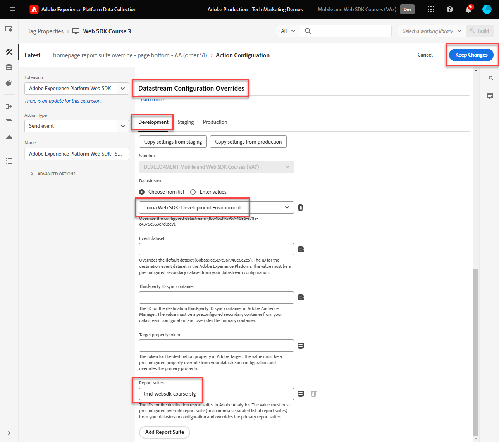
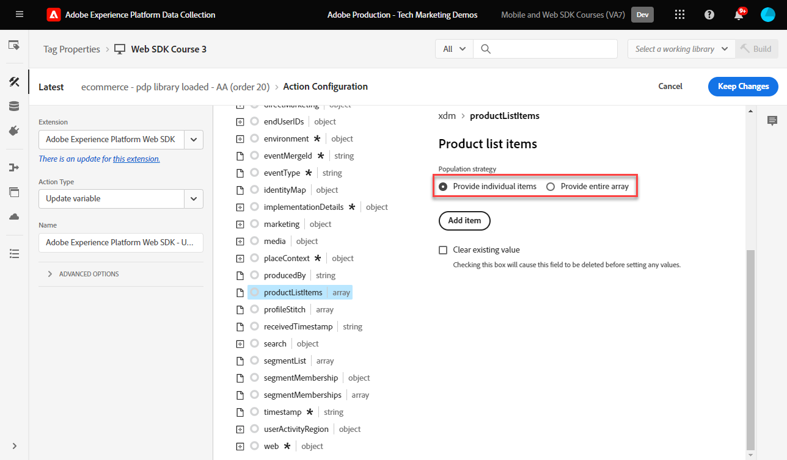
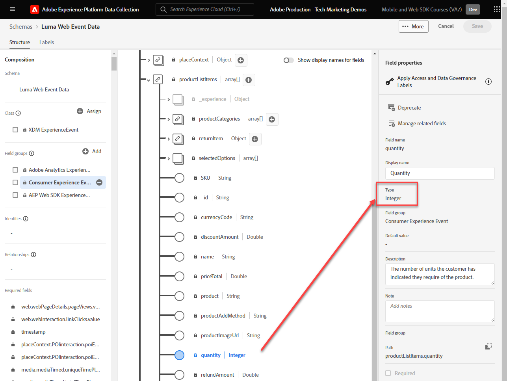

# Configuration d’Adobe Analytics avec le SDK Web de Platform

Découvrez comment configurer Adobe Analytics à l’aide de [SDK Web Experience Platform](https://experienceleague.adobe.com/docs/platform-learn/data-collection/web-sdk/overview.html?lang=fr), créez des règles de balise pour envoyer des données à Adobe Analytics et vérifiez qu’Analytics capture les données comme prévu.

[Adobe Analytics](https://experienceleague.adobe.com/docs/analytics.html?lang=fr) est une application de pointe qui vous permet de comprendre vos clients en tant que personnes et d’orienter votre activité grâce aux renseignements sur vos clients.


## Objectifs d&#39;apprentissage

À la fin de cette leçon, vous saurez comment :

* Configuration d’un schéma XDM pour Adobe Analytics
* Comprendre la différence entre les variables XDM mappées automatiquement et manuellement pour Analytics
* Configuration d’un flux de données pour activer Adobe Analytics
* Remplacement d’un flux de données pour envoyer des données à une autre suite de rapports Adobe Analytics
* Mappage d’éléments de données de tableau individuels ou entiers à l’objet XDM
* Utilisez le type d’action Mettre à jour la règle de variable pour empiler plusieurs règles dans un événement XDM.
* Capture des pages vues dans Adobe Analytics avec l’objet XDM
* Capture des données de commerce électronique avec l’objet XDM pour la chaîne de produit Adobe Analytics
* Définir un eVar de marchandisage de syntaxe de produit à l’aide de XDM
* Les variables Adobe Analytics sont définies avec l’objet XDM à l’aide du débogueur Experience Platform.
* Utilisation de règles de traitement Adobe Analytics pour définir des variables personnalisées
* La validation des données est capturée par Adobe Analytics à l’aide de Adobe Experience Platform Assurance
* La validation des données est capturée par Adobe Analytics à l’aide de rapports en temps réel

## Conditions préalables

Vous connaissez les balises, Adobe Analytics et la variable [Site de démonstration Luma](https://luma.enablementadobe.com/content/luma/us/en.html){target="_blank"} fonction de connexion et d’achat.

Vous avez besoin d’au moins un identifiant de suite de rapports de test/développement. Si vous ne disposez pas d’une suite de rapports de test/développement que vous pouvez utiliser pour ce tutoriel, [créez-en une](https://experienceleague.adobe.com/docs/analytics/admin/manage-report-suites/new-report-suite/t-create-a-report-suite.html?lang=fr).

Vous devez avoir suivi toutes les étapes des sections précédentes du tutoriel :

* Configuration initiale
   * [Configurer un schéma XDM](configure-schemas.md)
   * [Configuration d’un espace de noms d’identité](configure-identities.md)
   * [Configurer un trains de données](configure-datastream.md)
* Configuration des balises
   * [Installer l’extension SDK Web](install-web-sdk.md)
   * [Créer des éléments de données](create-data-elements.md)
   * [Création d’identités](create-identities.md)
   * [Création d’une règle de balise](create-tag-rule.md)
   * [Validation avec le débogueur Adobe Experience Platform](validate-with-debugger.md)

Vous devez également [Activation de l’accès des utilisateurs à Adobe Experience Platform Assurance](https://experienceleague.adobe.com/docs/experience-platform/assurance/user-access.html) afin que vous puissiez valider vos données Adobe Analytics avec Adobe Experience Platform Assurance. (Si vous avez accès aux schémas, aux espaces de noms d’identité et aux flux de données, vous aurez déjà accès à Assurance)

## Schémas XDM et variables Analytics

Félicitations ! Vous avez déjà configuré un schéma compatible avec Adobe Analytics dans la variable [Configuration d’un schéma](configure-schemas.md) leçon ! Toutefois, pour Adobe Analytics, il existe deux approches générales pour définir XDM pour Adobe Analytics.

<!-- Implementing Platform Web SDK should be as product-agnostic as possible. For Adobe Analytics, mapping eVars, props, and events doesn't occur during schema creation, nor during the tag rules configuration as it has been done traditionally. Instead, every XDM key-value pair becomes a Context Data Variable that maps to an Analytics variable in one of two ways: 

1. Automatically mapped variables using reserved XDM fields
1. Manually mapped variables using Analytics Processing Rules

To understand what XDM variables are auto-mapped to Adobe Analytics, please see [Variables automatically mapped in Analytics](https://experienceleague.adobe.com/docs/experience-platform/edge/data-collection/adobe-analytics/automatically-mapped-vars.html?lang=en). Any variable that is not auto-mapped must be manually mapped. -->

1. **XDM indépendant du produit**: maintenez une paire clé-valeur sémantique de schéma XDM et utilisez [Règles de traitement Adobe Analytics](https://experienceleague.adobe.com/docs/analytics/admin/admin-tools/manage-report-suites/edit-report-suite/report-suite-general/c-processing-rules/processing-rules.html) pour mapper les champs XDM aux eVars, aux props, etc. Par un schéma XDM sémantique, nous voulons dire que les noms de champ eux-mêmes ont une signification. Par exemple, le nom du champ `web.webPageDetails.pageName` a plus de sens que dire `prop1` ou `evar3`.

   >[!IMPORTANT]
   >
   > Tous les champs du schéma XDM deviennent disponibles pour Adobe Analytics en tant que variables de données contextuelles avec le préfixe suivant. `a.x.`. Par exemple : `a.x.web.webinteraction.region`

1. **XDM spécifique à Analytics**: utilisez un groupe de champs Adobe Analytics personnalisé dans le schéma XDM appelé `Adobe Analytics ExperienceEvent Template`

L’Adobe d’approche que les clients préfèrent est le suivant : **XDM spécifique à Analytics**, car elle ignore l’étape de mappage dans l’interface des règles de traitement d’Adobe Analytics. Les étapes de cette leçon utilisent la méthode **XDM spécifique à Analytics** approche.

## Mappage de XDM à Adobe Analytics

De nombreux champs XDM sont automatiquement mappés aux variables Analytics.

Le schéma créé dans la variable [Configuration d’un schéma](configure-schemas.md) La leçon contient quelques variables mappées automatiquement aux variables Analytics, comme indiqué dans ce tableau :

| XDM vers les variables mappées automatiquement dans Analytics | Variable Adobe Analytics |
|-------|---------|
| `identitymap.ecid.[0].id` | mid |
| `web.webPageDetails.name` | s.pageName |
| `web.webPageDetails.server` | s.server |
| `web.webPageDetails.siteSection` | s.channel |
| `commerce.productViews.value` | prodView |
| `commerce.productListViews.value` | scView |
| `commerce.checkouts.value` | scCheckout |
| `commerce.purchases.value` | Achat |
| `commerce.order.currencyCode` | s.currencyCode |
| `commerce.order.purchaseID` | s.purchaseID |
| `productListItems[].SKU` | s.products=;product name;;; (primary - voir la remarque ci-dessous) |
| `productListItems[].name` | s.products=;product name;;; (fallback - voir la remarque ci-dessous) |
| `productListItems[].quantity` | s.products=;;quantité du produit;; |
| `productListItems[].priceTotal` | s.product=;;;prix du produit; |

>[!NOTE]
>
>Les sections individuelles de la chaîne de produit Analytics sont définies par le biais de différentes variables XDM sous la variable `productListItems` .
>Depuis le 18 août 2022, `productListItems[].SKU` est prioritaire pour le mappage au nom du produit dans la variable s.products .
>La valeur définie sur `productListItems[].name` est mappé sur le nom du produit uniquement si `productListItems[].SKU` n’existe pas. Dans le cas contraire, il n’est pas mappé et est disponible dans les données contextuelles.
>Ne définissez pas de chaîne vide ni de valeur nulle sur  `productListItems[].SKU`. Cela a pour effet indésirable de mapper le nom du produit dans la variable s.products .

Pour obtenir la liste des mappages la plus récente, reportez-vous à la section [Mappage des variables Analytics dans Adobe Experience Edge](https://experienceleague.adobe.com/docs/experience-platform/edge/data-collection/adobe-analytics/automatically-mapped-vars.html?lang=fr).

Pour les variables XDM qui ne sont pas automatiquement mappées, utilisez la variable `Adobe Analytics ExperienceEvent Template` groupe de champs comme décrit dans la section suivante.


## Configuration du flux de données

Le SDK Web Platform envoie les données de votre site Web vers Platform Edge Network. Votre flux de données indique ensuite à Platform Edge Network à laquelle de vos suites de rapports Adobe Analytics doit transférer ces données.

1. Accédez à [Collecte de données](https://experience.adobe.com/#/data-collection){target="blank"} interface
1. Dans le volet de navigation de gauche, sélectionnez **[!UICONTROL Datastreams]**
1. Sélectionnez la `Luma Web SDK: Development Environment` datastream

   

1. Sélectionnez **[!UICONTROL Ajouter un service]**.
   
1. Sélectionner **[!UICONTROL Adobe Analytics]** comme la propriété **[!UICONTROL Service]**
1. Saisissez le  **[!UICONTROL Identifiant de suite de rapports]** de votre suite de rapports de développement
1. Sélectionnez **[!UICONTROL Enregistrer]**.

   

   >[!TIP]
   >
   >Pour ajouter d’autres suites de rapports, sélectionnez **[!UICONTROL Ajouter une suite de rapports]** équivaut au balisage multisuite.

>[!WARNING]
>
>Dans ce tutoriel, vous configurez uniquement la suite de rapports Adobe Analytics pour votre environnement de développement. Lorsque vous créez des flux de données pour votre propre site web, vous créez des flux de données et des suites de rapports supplémentaires pour vos environnements d’évaluation et de production.

### Configuration d’un remplacement de suite de rapports de flux de données

Vous pouvez modifier les données de suite de rapports Adobe Analytics envoyées aux visiteurs sur certaines pages. Pour configurer un paramètre de remplacement de flux de données pour Adobe Analytics :

1. Modifiez la variable **[!UICONTROL Adobe Analytics]** en ouvrant la  puis en sélectionnant **[!UICONTROL Modifier]**

   

1. Sélectionnez la variable **[!UICONTROL Options avancées]** pour ouvrir **[!UICONTROL Remplacements de suites de rapports]**

1. Sélectionnez les suites de rapports à remplacer. Dans ce cas, `Web SDK Course Dev` et `Web SDK Course Stg`

1. Sélectionner Enregistrer

   

Plus loin dans cette leçon [créer une règle pour envoyer une page vue à une autre suite de rapports avec remplacement de la chaîne de données ;](setup-analytics.md###send-a-page-view-to-a-different-report-suite-with-datastream-override).

## Créer des éléments de données de commerce électronique supplémentaires

Ensuite, capturez les données supplémentaires de la couche de données Luma et envoyez-les à Platform Edge Network. Bien que la leçon porte sur les exigences Adobe Analytics courantes, toutes les données capturées peuvent facilement être envoyées vers d’autres destinations en fonction de votre configuration de flux de données. Par exemple, si vous avez terminé la leçon Adobe Experience Platform, les données supplémentaires que vous capturez dans cette leçon sont également envoyées à Platform.

Lors de la leçon Créer des éléments de données, vous [éléments de données JavaScript créés](create-data-elements.md#create-data-elements-to-capture-the-data-layer) qui a capturé le contenu et les détails de l’identité. Vous créez maintenant des éléments de données supplémentaires pour capturer des données de commerce électronique. Parce que la variable [Site de démonstration Luma](https://luma.enablementadobe.com/content/luma/us/en.html){target="_blank"} utilise différentes structures de couche de données pour les pages Détails du produit et les produits du panier. vous devez créer des éléments de données distincts pour chaque scénario. Utilisez des éléments de données de code personnalisé pour obtenir ce dont vous avez besoin de la couche de données Luma, ce qui peut être ou non nécessaire lors de l’implémentation sur votre propre site. Dans ce cas, vous devez passer en revue un tableau d’articles du panier pour obtenir les détails spécifiques de chaque produit. Utilisez les fragments de code fournis ci-dessous :

1. Ouvrez la propriété de balise que vous utilisez pour le tutoriel.

1. Accédez à **[!UICONTROL Éléments de données]**

1. Sélectionner **[!UICONTROL Ajouter un élément de données]**

1. Nommez-le **`product.productInfo.sku`**

1. Utilisez la variable **[!UICONTROL Code personnalisé]** **[!UICONTROL Type d’élément de données]**

1. Laissez les cases à cocher pour **[!UICONTROL Forcer la valeur en minuscules]** et **[!UICONTROL Texte clair]** unchecked

1. Laisser `None` comme la propriété **[!UICONTROL Durée de stockage]** car cette valeur est différente sur chaque page

1. Sélectionner **[!UICONTROL Ouvrir l’éditeur]**

   

1. Copiez-collez le code suivant


   ```javascript
   var cart = digitalData.product;
   var cartItem;
   cart.forEach(function(item){
   cartItem = item.productInfo.sku;
   });
   return cartItem;
   ```

1. Sélectionner **[!UICONTROL Enregistrer]** pour enregistrer le code personnalisé

1. Sélectionner **[!UICONTROL Enregistrer]** enregistrement de l’élément de données

Suivez les mêmes étapes pour créer ces éléments de données supplémentaires :

* **`product.productInfo.title`**

  ```javascript
  var cart = digitalData.product;
  var cartItem;
  cart.forEach(function(item){
  cartItem = item.productInfo.title;
  });
  return cartItem;
  ```

<!--* **`product.productInfo.name`**

    ```javascript
    var cart = digitalData.product;
    var cartItem;
    cart.forEach(function(item){
    cartItem = item.productInfo.name;
    });
    return cartItem;
    ```-->

<!--* **`cart.productInfo`**

    ```javascript
    var cart = digitalData.cart.cartEntries; 
    var cartItem = [];
    cart.forEach(function(item, index, array){
    var qty;
    if(window.location.pathname.includes("thank-you.html")){
    qty = parseInt(item.qty);
    }else{
    qty = "";
    }
    var price = parseInt(item.price);
    cartItem.push({
    "SKU": item.sku,
    "quantity": qty,
    "priceTotal": price
    });
    });
    return cartItem; 
    ```-->

* **`cart.productInfo`**

  ```javascript
  var cart = digitalData.cart.cartEntries; 
  var cartItem = [];
  cart.forEach(function(item, index, array){
  cartItem.push({
  "SKU": item.sku
  });
  });
  return cartItem; 
  ```

* **`cart.productInfo.purchase`**

  ```javascript
  var cart = digitalData.cart.cartEntries; 
  var cartItem = [];
  cart.forEach(function(item, index, array){
  var qty = parseInt(item.qty);
  var price = parseInt(item.price);
  cartItem.push({
  "SKU": item.sku,
  "quantity": qty,
  "priceTotal": price
  });
  });
  return cartItem; 
  ```

  >[!TIP]
  >
  > Ce fragment de code contient un paramètre eVar1 personnalisé utilisé pendant la leçon eVars de marchandisage des produits .

Après avoir ajouté ces éléments de données et créé les éléments précédents dans la variable [Création d’éléments de données](create-data-elements.md) Pour la leçon, vous devez disposer des éléments de données suivants :

| Éléments de données |
-----------------------------|
| `cart.orderId` |
| `cart.productInfo` |
| `cart.productInfo.purchase` |
| `identityMap.loginID` |
| `page.pageInfo.hierarchie1` |
| `page.pageInfo.pageName` |
| `page.pageInfo.server` |
| `product.productInfo.sku` |
| `product.productInfo.title` |
| `user.profile.attributes.loggedIn` |
| `user.profile.attributes.username` |
| `xdm.variable.content` |

<!-- 
>[!IMPORTANT]
>
>In this tutorial, you will create a different XDM object for each event. That means you must remap variables that would be considered to be "globally" available on every hit, such as page name and identityMap. However, you may [Merge Objects](https://experienceleague.adobe.com/docs/experience-platform/tags/extensions/adobe/core/overview.html#merged-objects) or use [Mapping Tables](https://exchange.adobe.com/experiencecloud.details.103136.mapping-table.html) to manage your XDM objects more efficiently in a real-life situation. For this lesson, the global variables are considered as:
>
>* **[!UICONTROL identityMap]** to capture the authenticated ID as per the [Create Identity Map Data Element](create-data-elements.md#create-identity-map-data-element) exercise in the [Create Data Elements](create-data-elements.md) lesson.
>* **[!UICONTROL web]** object to capture content as per the [content XDM object](create-data-elements.md#map-content-data-elements-to-XDM-Schema-individually) exercise in the [Create Data Elements](create-data-elements.md) lesson on every data element above. 
-->

## Création de règles supplémentaires

Dans le [Création d’une règle de balise](create-tag-rule.md) leçon, vous configurez une `all pages global content variables - library loaded - AA (order 1)` règle [création d’un objet XDM de base à l’aide de la propriété **[!UICONTROL Mettre à jour la variable]** **[!UICONTROL types d’actions]**](create-tag-rule.md#create-tag-rule). Les exercices suivants enrichissent cet objet XDM pour capturer des données supplémentaires spécifiques à certaines pages.

### Incrémenter les pages vues

Puisque vous envoyez maintenant des données à Adobe Analytics, nous vous recommandons de mapper un champ XDM supplémentaire pour indiquer une page vue. Bien que, techniquement, Analytics n’ait pas besoin de traiter une balise en tant que page vue, il est utile d’avoir un moyen standard d’indiquer une page vue pour d’autres applications en aval.

1. Ouvrez le `all pages global content variables - library loaded - AA (order 1)` règle
1. Ouvrez le **[!UICONTROL Mettre à jour la variable]** action
1. Faites défiler la page vers le bas et sélectionnez cette option pour ouvrir jusqu’à `web.webPageDetails`
1. Sélectionnez cette option pour ouvrir le **[!UICONTROL pageViews]** objet
1. Définir **[!UICONTROL value]** to `1`
1. Sélectionner **[!UICONTROL Conserver les modifications]**

   


### Envoi d’une page vue à une autre suite de rapports avec remplacement du flux de données

Créez une règle pour envoyer un appel de page vue supplémentaire à une autre suite de rapports. Utilisez la fonction de remplacement de la banque de données pour modifier la suite de rapports d’une page à l’aide de la variable **[!UICONTROL Envoyer un événement]** Action.

1. Créez une règle, nommez-la. `homepage report suite override - library loaded - AA (order 51)`

1. Sélectionnez le signe plus sous **[!UICONTROL Événement]** pour ajouter un nouveau déclencheur

1. Sous **[!UICONTROL Extension]**, sélectionnez **[!UICONTROL Core]**

1. Sous **[!UICONTROL Type d’événement]**, sélectionnez **[!UICONTROL bibliothèque chargée]**

1. Nommez-le `Core - library loaded - order 51`

1. Sélectionner pour ouvrir **[!UICONTROL Options avancées]**, saisissez `51`. Cela garantit que la règle s’exécute après la `all pages global content variables - library loaded - AA (order 50)` qui définit le XDM de ligne de base avec le **[!UICONTROL Mettre à jour la variable]** type d’action.

   

1. Sous **[!UICONTROL Conditions]**, sélectionnez sur **[!UICONTROL Ajouter]**

1. Laisser **[!UICONTROL Type de logique]** as **[!UICONTROL Normal]**

1. Laisser **[!UICONTROL Extensions]** as **[!UICONTROL Core]**

1. Sélectionner **[!UICONTROL Type de condition]** as **[!UICONTROL Chemin sans chaîne de requête]**

1. À droite, laissez le champ **[!UICONTROL Regex]** bouton désactivé

1. Sous **[!UICONTROL path est égal à]** set `/content/luma/us/en.html`. Pour le site de démonstration Luma, la règle ne se déclenche que sur la page d’accueil.

1. Sélectionner **[!UICONTROL Conserver les modifications]**

   

1. Sous **[!UICONTROL Actions]** select **[!UICONTROL Ajouter]**

1. Comme la variable **[!UICONTROL Extension]**, sélectionnez **[!UICONTROL SDK Web Adobe Experience Platform]**

1. Comme la variable **[!UICONTROL Type d’action]**, sélectionnez **[!UICONTROL Envoyer un événement]**

1. Comme la variable **[!UICONTROL Type]**, sélectionnez `web.webpagedetails.pageViews`

1. Comme la variable **[!UICONTROL Données XDM]**, sélectionnez la variable `xdm.variable.content` que vous avez créé dans la variable [Création d’éléments de données](create-data-elements.md) leçon

   

1. Faites défiler l’écran vers le bas jusqu’à **[!UICONTROL Remplacements des configurations de flux de données]** section

1. Laissez le champ **[!UICONTROL Développement]** onglet sélectionné.

   >[!TIP]
   >
   >    Cet onglet détermine dans quel environnement de balises le remplacement se produit. Pour cet exemple, vous spécifiez uniquement l’environnement de développement, mais lorsque vous déployez ceci en production, pensez à le faire également dans la variable **[!UICONTROL Production]** environnement.


1. Sélectionnez la variable **[!UICONTROL Datastream]**, dans ce cas `Luma Web SDK: Development Environment`

1. Sous **[!UICONTROL Suites de rapports]**, sélectionnez le site de rapports pour lequel vous souhaitez remplacer le rapport. Dans ce cas, `tmd-websdk-course-stg`.


   >[!TIP]
   >
   >La liste des suites de rapports affichées ici est déterminée par la variable [configuration d’un remplacement de suite de rapports de flux de données](configure-datastream.md###configure-a-datastream-report-suite-override) étape . Ajouter une suite de rapports équivaut au balisage multi-suite.

1. Sélectionner **[!UICONTROL Conserver les modifications]**

1. Et **[!UICONTROL Enregistrer]** votre règle

   

### Enrichissement de l’objet XDM à l’aide de la variable Update

En utilisant la variable **[!UICONTROL Mettre à jour la variable]** type d’action vous pouvez créer des règles supplémentaires pour enrichir le &quot;contenu global XDM&quot; avant qu’il ne soit envoyé au [!UICONTROL Plateforme Edge Network]. Pour ce faire, séquencez les nouvelles règles avant le `all pages send event - library loaded - AA (order 50)` qui envoie l’événement [!UICONTROL Plateforme Edge Network].

>[!TIP]
>
>L’ordre des règles détermine la règle qui s’exécute en premier lorsqu’un événement est déclenché. Si deux règles possèdent le même type d’événement, celle dont le nombre est le plus faible s’exécute en premier.
> 
>

## Définition de la chaîne de produit

Avant de procéder à la mise en correspondance avec la chaîne de produit, il est important de comprendre qu’il existe deux objets principaux dans le schéma XDM utilisés pour capturer des données de commerce électronique ayant des relations spéciales avec Adobe Analytics :

1. La variable `commerce` définit des événements Analytics tels que `prodView`, `scView`, et `purchase`
1. La variable `productListItems` définit des dimensions Analytics telles que `productID`.

Voir [Collecte de données commerciales et de produits](https://experienceleague.adobe.com/docs/experience-platform/edge/data-collection/collect-commerce-data.html?lang=en) pour plus d’informations.


Commencez par effectuer le suivi des consultations de produit sur la page des détails du produit de Luma.

1. Dans le volet de navigation de gauche, sélectionnez **[!UICONTROL Règles]** puis sélectionnez **[!UICONTROL Ajouter une règle]**
1. Nommez-le  [!UICONTROL `ecommerce - pdp library loaded - AA (order 20)`]
1. Sélectionnez la variable  Sous Événement pour ajouter un nouveau déclencheur
1. Sous **[!UICONTROL Extension]**, sélectionnez **[!UICONTROL Core]**
1. Sous **[!UICONTROL Type d’événement]**, sélectionnez **[!UICONTROL bibliothèque chargée]**
1. Nommez-le `Core - library loaded - order 20`
1. Sélectionner pour ouvrir **[!UICONTROL Options avancées]**, saisissez `20`. Cela garantit que la règle s’exécute après la `all pages global content variables - library loaded - AA (order 1)` qui définit les variables de contenu globales, mais avant l’événement `all pages send event - library loaded - AA (order 50)` qui envoie l’événement XDM.

   

1. Sous **[!UICONTROL Conditions]**, sélectionnez sur **[!UICONTROL Ajouter]**
1. Laisser **[!UICONTROL Type de logique]** as **[!UICONTROL Normal]**
1. Laisser **[!UICONTROL Extensions]** as **[!UICONTROL Core]**
1. Sélectionner **[!UICONTROL Type de condition]** as **[!UICONTROL Chemin sans chaîne de requête]**
1. Sur la droite, activez l’option **[!UICONTROL Regex]** basculer
1. Sous **[!UICONTROL path est égal à]** set `/products/`. Pour le site de démonstration Luma, la règle se déclenche uniquement sur les pages de produits.
1. Sélectionner **[!UICONTROL Conserver les modifications]**

   

1. Sous **[!UICONTROL Actions]** select **[!UICONTROL Ajouter]**
1. Sélectionner **[!UICONTROL SDK Web Adobe Experience Platform]** extension
1. Sélectionner **[!UICONTROL Type d’action]** as **[!UICONTROL Mettre à jour la variable]**
1. Faites défiler l’écran vers le bas jusqu’à `commerce` et sélectionnez pour l’ouvrir.
1. Ouvrez le **[!UICONTROL productViews]** objet et définition **[!UICONTROL value]** to `1`

   

   >[!TIP]
   >
   >La définition de commerce.productViews.value=1 dans XDM correspond automatiquement à la variable `prodView` dans Analytics

Il est également important de comprendre que vous pouvez **[!UICONTROL fournir des attributs individuels ;]** vers des champs XDM individuels ou **[!UICONTROL fournir un tableau entier ;]** à un objet XDM.



### Mappage d’attributs individuels à un objet XDM

En raison de la structure de couche de données sur Luma, vous pouvez mapper sur des variables individuelles pour capturer des données sur la page des détails du produit du site de démonstration Luma.

1. Faites défiler l’écran jusqu’à et sélectionnez `productListItems` tableau
1. Sélectionner **[!UICONTROL Fournir des éléments individuels]**
1. Sélectionner **[!UICONTROL Ajouter un élément]**

   

   >[!CAUTION]
   >
   >La variable **`productListItems`** est un `array` type de données afin qu’il s’attende à ce que les données entrent dans une collection d’éléments. En raison de la structure de couche de données du site de démonstration Luma et parce qu’il est possible d’afficher un seul produit à la fois sur le site Luma, vous ajoutez des éléments individuellement. Lors de l’implémentation sur votre propre site web, en fonction de la structure de votre couche de données, vous pouvez fournir un tableau entier.

1. Sélectionner pour ouvrir **[!UICONTROL Élément 1]**
1. Mappez **`productListItems.item1.SKU`** à `%product.productInfo.sku%`.

   

1. Rechercher `eventType` et définissez-le sur `commerce.productViews`

1. Ne sélectionnez pas encore Conserver les modifications .

### Définition d’un eVar de marchandisage dans la chaîne de produit

En utilisant la variable `Adobe Analytics ExperienceEvent Template` groupe de champs pour définir le schéma XDM, vous pouvez mapper des variables à des eVars de marchandisage ou des événements dans la chaîne de produit. On parle également de paramètre **Marchandisage Syntaxe du produit**. Remarquez que la variable `_experience` objet sous `productListItems` > `Item 1`. Définition de toute variable sous cette option [!UICONTROL objet] définit les eVars ou événements de syntaxe de produit.

1. Sélectionner pour ouvrir `_experience > analytics > customDimensions > eVars > eVar1`

1. Définissez la variable **[!UICONTROL Valeur]** to `%product.productInfo.title%`

1. Sélectionner **[!UICONTROL Conserver les modifications]**

   

1. Sélectionner **[!UICONTROL Enregistrer]** pour enregistrer la règle

<!--
1. The **[!UICONTROL Type]** field has a drop-down list of values to choose from. Select `[!UICONTROL commerce.productViews]`

    [!TIP]
    >
    >The value selected here has no effect on how data is mapped to Analytics, however it is recommended to thoughtfully apply this variable, as it is used in Adobe Experience Platform's segment builder interface. The value selected is available to use in the `[!UICONTROL c.a.x.eventtype]` context data variable downstream.

1. Under **[!UICONTROL XDM Data]**, select the `[!UICONTROL xdm.commerce.prodView]` XDM object data element
1. Select **[!UICONTROL Keep Changes]**

    

1. Your rule should look similar to the below. Select **[!UICONTROL Save]**

     -->


### Mappage d’un tableau entier à un objet XDM

Comme nous l’avons vu précédemment, le site de démonstration Luma utilise une structure de couche de données différente pour les produits du panier. L’élément de données de code personnalisé `cart.productInfo` vous avez créé des boucles précédentes à l’aide de la fonction `digitalData.cart.cartEntries` objet de couche de données et le convertit en schéma d’objet XDM requis. Le nouveau format **doit correspondre exactement** le schéma défini par la variable `productListItems` du schéma XDM.

Pour illustrer cela, reportez-vous à la comparaison ci-dessous de la couche de données du site Luma (à gauche) avec l’élément de données traduit (à droite) :


Comparez l’élément de données à la variable `productListItems` structure (indice, il doit correspondre).

>[!IMPORTANT]
>
>Notez comment les variables numériques sont traduites, avec des valeurs de chaîne dans la couche de données, telles que `price` et `qty` reformaté en nombres dans l’élément de données. Ces exigences de format sont importantes pour l’intégrité des données dans Platform et sont déterminées lors de la [configuration des schémas](configure-schemas.md) étape . Dans l’exemple : **[!UICONTROL quantity]** utilise la variable **[!UICONTROL Entier]** type de données.
> 

Revenez à la mise en correspondance de l’objet XDM avec un tableau entier. Répétez les mêmes étapes que pour créer la variable `ecommerce - pdp library loaded - AA (order 20)` règle :

1. Nommez-le  [!UICONTROL `ecommerce - cart library loaded - AA (order 20)`]
1. Sélectionnez la variable  Sous Événement pour ajouter un nouveau déclencheur
1. Sous **[!UICONTROL Extension]**, sélectionnez **[!UICONTROL Core]**
1. Sous **[!UICONTROL Type d’événement]**, sélectionnez **[!UICONTROL bibliothèque chargée]**
1. Nommez-le `Core - library loaded - order 20`
1. Sélectionner pour ouvrir **[!UICONTROL Options avancées]**, saisissez `20`
1. Sélectionner **[!UICONTROL Conserver les modifications]**

   

1. Sous **[!UICONTROL Conditions]**, sélectionnez sur **[!UICONTROL Ajouter]**
1. Laisser **[!UICONTROL Type de logique]** as **[!UICONTROL Normal]**
1. Laisser **[!UICONTROL Extensions]** as **[!UICONTROL Core]**
1. Sélectionner **[!UICONTROL Type de condition]** as **[!UICONTROL Chemin sans chaîne de requête]**
1. À droite, **ne pas** activez la variable **[!UICONTROL Regex]** basculer
1. Sous **[!UICONTROL path est égal à]** set `/content/luma/us/en/user/cart.html`. Pour le site de démonstration Luma, la règle se déclenche uniquement sur la page de panier.
1. Sélectionner **[!UICONTROL Conserver les modifications]**

   

1. Sous **[!UICONTROL Actions]** select **[!UICONTROL Ajouter]**
1. Sélectionner **[!UICONTROL SDK Web Adobe Experience Platform]** extension
1. Sélectionner **[!UICONTROL Type d’action]** as **[!UICONTROL Mettre à jour la variable]**
1. Faites défiler l’écran vers le bas jusqu’à `commerce` et sélectionnez pour l’ouvrir.
1. Ouvrez le **[!UICONTROL productListViews]** objet et définition **[!UICONTROL value]** to `1`

   

   >[!TIP]
   >
   >La définition de commerce.productListViews.value=1 dans XDM correspond automatiquement à la variable `scView` dans Analytics

<!--1. Create an **[!UICONTROL XDM object]** **[!UICONTROL Data Element Type]** named **`xdm.commerce.cartView`**
1. Select the same Platform sandbox and XDM schema you are using for this tutorial
1. Open the **[!UICONTROL commerce]** object
1. Open the **[!UICONTROL productListViews]** object and set `value` to `1`

    >[!TIP]
    >
    >This step is equivalent to setting `scView` event in Analytics -->

1. Faites défiler l’écran jusqu’à et sélectionnez **[!UICONTROL productListItems]** tableau

1. Sélectionner **[!UICONTROL Fournir un tableau entier]**

1. Associer à **`cart.productInfo`** élément de données

1. Sélectionner `eventType` et définissez sur `commerce.productListViews`

1. Sélectionner **[!UICONTROL Conserver les modifications]**

1. Sélectionner **[!UICONTROL Enregistrer]** pour enregistrer la règle

Créez deux autres règles pour le passage en caisse et l’achat suivant le même modèle avec les différences suivantes :

**Nom de la règle**: `ecommerce - checkout library loaded - AA (order 20)`

* **[!UICONTROL Condition]**: /content/luma/us/en/user/checkout.html
* Définissez `eventType` sur `commerce.checkouts`.
* Définir **Événement XDM Commerce**: commerce.checkout.value à `1`

  >[!TIP]
  >
  >Cela équivaut à définir `scCheckout` dans Analytics

**Nom de la règle**: `ecommerce - purchase library loaded - AA (order 20)`

* **[!UICONTROL Condition]**: /content/luma/us/en/user/checkout/order/thank-you.html
* Définissez `eventType` sur `commerce.purchases`.
* Définir **Événement XDM Commerce**: commerce.purchase.value à `1`

  >[!TIP]
  >
  >Cela équivaut à définir `purchase` dans Analytics

Il existe d’autres étapes pour capturer toutes les `purchase` variables d’événements :

1. Ouvrir **[!UICONTROL commerce]** objet
1. Ouvrez le **[!UICONTROL order]** objet
1. Carte **[!UICONTROL purchaseID]** à la fonction `cart.orderId` élément de données
1. Définir **[!UICONTROL currencyCode]** à la valeur codée en dur `USD`

   

   >[!TIP]
   >
   >Cela équivaut à définir `s.purchaseID` et `s.currencyCode` dans Analytics


1. Faites défiler l’écran jusqu’à et sélectionnez **[!UICONTROL productListItems]** tableau
1. Sélectionner **[!UICONTROL Fournir un tableau entier]**
1. Associer à **`cart.productInfo.purchase`** élément de données
1. Sélectionnez **[!UICONTROL Enregistrer]**.

Lorsque vous avez terminé, les règles suivantes doivent être créées.


<!--
## Create additional rules for Platform Web SDK

With the **[!UICONTROL Update variabl]**e and **[!UICONTROL Send Event]** Action Types of Platform Web SDK, its possible to sequence the **[!UICONTROL Send Event]** action to trigger after all **[!UICONTROL Update variable]** action types run. This is called Rule Stacking, and you use it to customize the baseline XDM created depending on the type of page you are on.  

In this exercise, you create individual rules per e-commerce event and use conditions so the rules fire on the right pages. 

Repeat the same for all other e-commerce events using the following parameters:

**Rule name**: cart view - library load - AA

* **[!UICONTROL Event Type]**: Library Loaded (Page Top)
* **[!UICONTROL Condition]**: /content/luma/us/en/user/cart.html
* **Type value under Web SDK - Send Action**: commerce.productListViews
* **XDM data for Web SDK - Send Action:** `%xdm.commerce.cartView%`

**Rule name**: checkout - library load - AA

* **[!UICONTROL Event Type]**: Library Loaded (Page Top)
* **[!UICONTROL Condition]** /content/luma/us/en/user/checkout.html
* **Type for Web SDK - Send Action**: commerce.checkouts
* **XDM data for Web SDK - Send Action:** `%xdm.commerce.checkout%`

**Rule name**: purchase - library load - AA

* **[!UICONTROL Event Type]**: Library Loaded (Page Top)
* **[!UICONTROL Condition]** /content/luma/us/en/user/checkout/order/thank-you.html
* **Type for Web SDK - Send Action**: commerce.purchases
* **XDM data for Web SDK - Send Action:** `%xdm.commerce.purchase%`
-->


## Créer votre environnement de développement

Ajoutez vos nouveaux éléments de données et vos nouvelles règles à vos `Luma Web SDK Tutorial` bibliothèque de balises et recréez votre environnement de développement.

Félicitations ! L’étape suivante consiste à valider votre mise en oeuvre Adobe Analytics par le biais du SDK Web Experience Platform.

## Validation d’Adobe Analytics pour le SDK Web Platform

Dans le [Debugger](validate-with-debugger.md) leçon, vous avez appris à inspecter la requête XDM côté client avec Platform Debugger et la console de développement du navigateur, ce qui est similaire à la façon dont vous déboguez une `AppMeasurement.js` Mise en oeuvre d’Analytics. Vous avez également appris à valider les demandes côté serveur de Platform Edge Network envoyées aux applications Adobe et à afficher une charge utile entièrement traitée à l’aide d’Assurance.

Pour valider qu’Analytics capture correctement les données par le biais du SDK Web Experience Platform, vous devez suivre deux étapes pour :

1. Validation de la manière dont les données sont traitées par l’objet XDM sur Platform Edge Network, à l’aide de la fonction Edge Trace du débogueur Experience Platform
1. Validation du traitement des données par Analytics à l’aide de règles de traitement et de rapports en temps réel
1. Validation du traitement complet des données par Analytics à l’aide de Adobe Experience Platform Assurance

### Utilisation d’Edge Trace

Découvrez comment vérifier qu’Adobe Analytics capture l’ECID, les pages vues, la chaîne de produit et les événements de commerce électronique avec la fonction Edge Trace du débogueur Experience Platform.

### Validation des identifiants Experience Cloud

1. Accédez au [Site de démonstration Luma](https://luma.enablementadobe.com/content/luma/us/en.html){target="_blank"}
1. Sélectionnez le bouton de connexion en haut à droite et utilisez les informations d’identification à l’adresse : test@adobe.com p: test pour vous authentifier
1. Ouvrez le débogueur Experience Platform et [basculez la propriété de balise sur le site sur votre propre propriété de développement.](validate-with-debugger.md#use-the-experience-platform-debugger-to-map-to-your-tags-property)


1. Pour activer Edge Trace, accédez à Experience Platform Debugger, dans le volet de navigation de gauche, sélectionnez **[!UICONTROL Journaux]**, puis sélectionnez la variable **[!UICONTROL Edge]** et sélectionnez **[!UICONTROL Connexion]**

   

1. Il sera vide pour l’instant.

   

1. Actualisez la page Luma et vérifiez à nouveau le débogueur Experience Platform, car les données doivent passer. La ligne commençant par **[!UICONTROL Mappage automatique Analytics]** est la balise Adobe Analytics
1. Sélectionnez cette option pour ouvrir les deux `[!UICONTROL mappedQueryParams]` Liste déroulante et deuxième liste déroulante pour afficher les variables Analytics

   

   >[!TIP]
   >
   >La deuxième liste déroulante correspond à l’identifiant de suite de rapports Analytics auquel vous envoyez des données. Elle doit correspondre à votre propre suite de rapports, et non à celle de la capture d’écran.

1. Faire défiler vers le bas pour trouver `[!UICONTROL c.a.x.identitymap.ecid.[0].id]`. Il s’agit d’une variable de données contextuelles qui capture ECID.
1. Continuez à faire défiler l’écran vers le bas jusqu’à ce que vous voyiez Analytics `[!UICONTROL mid]` Variable . Les deux identifiants correspondent à l’identifiant Experience Cloud de votre appareil.
1. Sur le site Luma,

   

   >[!NOTE]
   >
   >Puisque vous êtes connecté, prenez quelques instants pour valider l’ID authentifié. `112ca06ed53d3db37e4cea49cc45b71e` pour l’utilisateur **`test@adobe.com`** est également capturé dans la variable `[!UICONTROL c.a.x.identitymap.lumacrmid.[0].id]`

### Remplacements de suites de rapports

Au-dessus, vous avez configuré un remplacement de la chaîne de données pour la variable [Page d’accueil Luma](https://luma.enablementadobe.com/content/luma/us/en.html).  Validation de cette configuration

1. Recherchez une ligne avec **[!UICONTROL Configuration du flux de données après application du remplacement]**. Vous y trouverez la suite de rapports principale et les suites de rapports supplémentaires qui ont été configurées pour les remplacements de suite de rapports.

   

1. Faites défiler l’écran jusqu’à la ligne commençant par **[!UICONTROL Mappage automatique Analytics]**  et vérifiez que la variable `[!UICONTROL reportSuiteIds]` affiche la suite de rapports que vous avez spécifiée dans vos configurations de remplacement.

   

### Pages vues du contenu

Accédez à une page de produit telle que [Page produit Didi Sport Watch](https://luma.enablementadobe.com/content/luma/us/en/products/gear/watches/didi-sport-watch.html#24-WG02).  Vérifiez que les pages vues du contenu sont capturées par Analytics.

1. Recherchez `[!UICONTROL c.a.x.web.webpagedetails.pageviews.value]=1`.
1. Faites défiler l’écran vers le bas pour afficher la `[!UICONTROL gn]` Variable . Il s’agit de la syntaxe dynamique Analytics de la variable `[!UICONTROL s.pageName]` Variable . Il capture le nom de la page à partir de la couche de données.

   

### Chaîne de produit et événements de commerce électronique

Comme vous vous trouvez déjà sur une page de produit, cet exercice continue d’utiliser la même trace Edge pour valider que les données de produit sont capturées par Analytics. Les événements de chaîne de produit et de commerce électronique sont automatiquement associés à des variables XDM dans Analytics. Tant que vous avez mappé sur le `productListItem` Variable XDM pendant [configuration d’un schéma XDM pour Adobe Analytics](setup-analytics.md#configure-an-xdm-schema-for-adobe-analytics), le réseau Platform Edge s’occupe de mapper les données aux variables d’analyse appropriées.

**Commencez par valider que la variable `Product String` est défini**

1. Recherchez `[!UICONTROL c.a.x.productlistitems.][0].[!UICONTROL sku]`. La variable capture la valeur de l’élément de données que vous avez mappée à la variable `productListItems.item1.sku` plus tôt dans cette leçon
1. Recherchez également `[!UICONTROL c.a.x.productlistitems.][0].[!UICONTROL _experience.analytics.customdimensions.evars.evar1]`. La variable capture la valeur de l’élément de données auquel vous avez mappé `productListItems.item1._experience.analytics.customdimensions.evars.evar1`
1. Faites défiler l’écran vers le bas pour afficher la `[!UICONTROL pl]` Variable . Il s’agit de la syntaxe dynamique de la variable de chaîne de produit Analytics.
1. Notez que le nom du produit de la couche de données est mappé à la fois à la `[!UICONTROL c.a.x.productlistitems.][0].[!UICONTROL sku]` et la variable `[!UICONTROL product]` du paramètre de la chaîne products.  En outre, le titre du produit de la couche de données est mappé à evar1 de marchandisage dans la chaîne de produits.

   

   Le suivi Edge traite `commerce` événements légèrement différents `productList` dimensions. Une variable de données contextuelles n’est pas mappée de la même manière que le nom du produit est mappé sur `[!UICONTROL c.a.x.productlistitem.[0].name]` ci-dessus. À la place, le suivi Edge affiche le mappage automatique de l’événement final dans Analytics. `event` Variable . Platform Edge Network mappe ce contenu en conséquence tant que vous mappez à la XDM appropriée. `commerce` Variable while [configuration du schéma pour Adobe Analytics](setup-analytics.md#configure-an-xdm-schema-for-adobe-analytics); dans ce cas, la variable `commerce.productViews.value=1`.

1. De retour dans la fenêtre du débogueur Experience Platform, faites défiler l’écran jusqu’au `[!UICONTROL events]` est définie sur `[!UICONTROL prodView]`

1. Remarque `[!UICONTROL c.a.x.eventType]` est défini sur `commerce.productViews` car vous vous trouvez sur une page de produits.

   >[!TIP]
   >
   > La variable `ecommerce - pdp library loaded - AA (order 20)` la règle remplace la valeur de `eventType` défini par la variable `all pages global content variables - library loaded - AA (order 1)` car elle est définie pour se déclencher ultérieurement dans la séquence.


   

**Validez le reste des événements de commerce électronique et les chaînes de produits définis pour Analytics.**

1. Ajouter [Didi Sport Watch](https://luma.enablementadobe.com/content/luma/us/en/products/gear/watches/didi-sport-watch.html#24-WG02) au panier
1. Accédez au [Page Panier](https://luma.enablementadobe.com/content/luma/us/en/user/cart.html), vérifiez Edge Trace pour

   * `eventType` défini sur `commerce.productListViews`
   * `[!UICONTROL events: "scView"]`, et
   * la chaîne de produit est définie

   

1. Passez à l’extraction, cochez Edge Trace pour

   * `eventType` défini sur `commerce.checkouts`
   * `[!UICONTROL events: "scCheckout"]`, et
   * la chaîne de produit est définie

   

1. Remplissez uniquement les **Prénom** et **Nom** champs du formulaire d’expédition et sélectionnez **Continuer**. Sur la page suivante, sélectionnez **Passer commande**
1. Sur la page de confirmation, vérifiez Edge Trace pour

   * `eventType` défini sur `commerce.purchases`
   * Événement d’achat en cours de définition `[!UICONTROL events: "purchase"]`
   * Variable de code de devise en cours de définition `[!UICONTROL cc: "USD"]`
   * Identifiant d’achat défini dans `[!UICONTROL pi]`
   * Chaîne de produit `[!UICONTROL pl]` définition du nom, de la quantité et du prix du produit

   

## Règles de traitement et rapports en temps réel

Maintenant que vous avez validé les balises Analytics avec Edge Trace, vous pouvez également valider que les données sont traitées par Analytics à l’aide des rapports en temps réel. Avant de vérifier les rapports en temps réel, vous devez configurer les règles de traitement pour Analytics. `props` selon les besoins.

### Règles de traitement pour les mappages Analytics personnalisés

Dans cet exercice, vous mappez une variable XDM à une prop afin de pouvoir l’afficher dans les rapports en temps réel. Suivez les mêmes étapes que pour tout mappage personnalisé que vous devez effectuer pour n’importe quel mappage `eVar`, `prop`, `event`ou accessible via les règles de traitement.

1. Dans l’interface utilisateur d’Analytics, accédez à [!UICONTROL Administration] > [!UICONTROL Outils d’administration] > [!UICONTROL Suites de rapports]
1. Sélectionnez la suite de rapports de développement/test que vous utilisez pour le tutoriel > [!UICONTROL Modifier les paramètres] > [!UICONTROL Général] > [!UICONTROL Règles de traitement]

   

1. Création d’une règle pour **[!UICONTROL Remplacer la valeur de]** `[!UICONTROL Product SKU (prop1)]` to `a.x.productlistitems.0.sku`. N’oubliez pas d’ajouter votre note expliquant pourquoi vous créez la règle et nommez son titre. Sélectionnez **[!UICONTROL Enregistrer]**.

   

   >[!IMPORTANT]
   >
   >La première fois que vous mappez à une règle de traitement, l’interface utilisateur ne vous affiche pas les variables de données contextuelles de l’objet XDM. Pour corriger les éléments qui sélectionnent une valeur, cliquez sur Enregistrer pour revenir à la modification. Toutes les variables XDM doivent maintenant apparaître.

1. Accédez à [!UICONTROL Modifier les paramètres] >  [!UICONTROL Temps réel]. Configurez les trois avec les paramètres ci-dessous afin de pouvoir valider les pages vues du contenu, les consultations de produits et les achats.

   

1. Répétez les étapes de validation. Vous devriez constater que les rapports en temps réel renseignent les données en conséquence.

   **Pages vues**
   

   **Consultations produits**
   

   **Achats**
   

1. Dans l’interface utilisateur de Workspace, créez un tableau pour afficher le flux de commerce électronique complet du produit que vous avez acheté.

   

Pour en savoir plus sur le mappage des champs XDM aux variables Analytics, visionnez la vidéo [Mappage des variables du SDK Web dans Adobe Analytics](https://experienceleague.adobe.com/docs/analytics-learn/tutorials/analysis-use-cases/internal-site-search/map-web-sdk-variables-into-adobe-analytics.html).

## Validation d’Adobe Analytics à l’aide de Adobe Experience Platform Assurance

Adobe Experience Platform Assurance est un produit de Adobe Experience Cloud qui vous aide à inspecter, à tester, à simuler et à valider la manière dont vous collectez des données ou diffusez des expériences avec votre site web et votre application mobile.

Vous avez vérifié ci-dessus que Adobe Analytics capture l’ECID, les pages vues, la chaîne de produit et les événements de commerce électronique avec la fonction Edge Trace du débogueur Experience Platform.  Vous avez également validé ce mappage de prop1 à l’aide des règles de traitement et des rapports en temps réel.  Ensuite, vous validez ces mêmes événements à l’aide de Adobe Experience Platform Assurance.

>[!NOTE]
>
>Pour valider vos données Adobe Analytics avec Adobe Experience Platform Assurance, vous devez [Activation de l’accès des utilisateurs à Adobe Experience Platform Assurance](https://experienceleague.adobe.com/docs/experience-platform/assurance/user-access.html)

### Accès à Adobe Experience Platform Assurance

Vous pouvez accéder à Assurance de plusieurs façons :

1. Via l’interface Adobe Experience Platform
1. Via l’interface de collecte de données Adobe Experience Platform
1. Journaux d’exploration dans l’Adobe Experience Platform Debugger (recommandé)

Pour accéder à l’assurance via Adobe Experience Platform, faites défiler la page vers le bas et sélectionnez **[!UICONTROL Assurance]** dans la navigation du rail de gauche sous **[!UICONTROL COLLECTE DE DONNÉES]**.  Sélectionnez la variable **[!UICONTROL &quot;Tutoriel du SDK Web 3&quot;]** pour accéder aux événements générés dans la section précédente.


Pour accéder à l’assurance via la collecte de données Adobe Experience Platform, sélectionnez **[!UICONTROL Assurance]** dans la navigation du rail de gauche sous **[!UICONTROL COLLECTE DE DONNÉES]**.  Sélectionnez la variable **[!UICONTROL &quot;Tutoriel du SDK Web 3&quot;]** pour accéder aux événements générés dans la section précédente.\


Pour accéder à l’assurance par le biais d’Adobe Experience Platform Debugger, accédez à Experience Platform Debugger, dans le volet de navigation de gauche, sélectionnez **[!UICONTROL Journaux]**, puis sélectionnez la variable **[!UICONTROL Edge]** et sélectionnez **[!UICONTROL Connexion]**.  Une fois la connexion au réseau Edge établie, sélectionnez l’icône de lien externe. Nous vous recommandons d’accéder à la sûreté via le débogueur, car les sessions web doivent actuellement être démarrées à partir du débogueur.


Dans le **[!UICONTROL &quot;Tutoriel du SDK Web 3&quot;]** Entrée de la session d’assurance **[!UICONTROL &quot;hitdebugger&quot;]** dans la barre de recherche des événements pour filtrer les résultats sur les données Adobe Analytics Post-traitées.


### Validation des identifiants Experience Cloud avec Assurance

Pour vérifier qu’Adobe Analytics capture l’ECID, sélectionnez une balise et ouvrez la charge utile.  Le fournisseur de cette balise doit être : **[!UICONTROL com.adobe.analytics.hitdebugger]**


Faites défiler l’écran jusqu’à **[!UICONTROL mcvisId]** pour vérifier que l’ECID est correctement capturé.


### Validation des pages vues de contenu avec Assurance

À l’aide de la même balise, vérifiez que les pages vues du contenu sont mappées à la variable Adobe Analytics correcte.
Faites défiler jusqu’à **[!UICONTROL pageName]** pour valider que la variable `Page Name` est correctement capturé


### Validation de la chaîne de produit et des événements de commerce électronique avec Assurance

En suivant les mêmes cas d’utilisation de validation utilisés lors de la validation avec le débogueur Experience Platform ci-dessus, continuez à utiliser la même balise pour valider la variable `Ecommerce Events` et la variable `Product String`.

1. Recherchez la payload où l’événement **[!UICONTROL events]** contain `prodView`
   
1. Faites défiler jusqu’à **[!UICONTROL product-string]** pour valider la variable `Product String`.
   * Notez que `Product SKU` et `Merchandizing eVar1`.
1. Faites défiler l’écran vers le bas et validez `prop1`, que vous avez configuré à l’aide des règles de traitement de la section précédente, contient la variable `Product SKU`\
   

Continuez à valider votre mise en oeuvre en consultant les événements de panier, de passage en caisse et d’achat.

1. Recherchez la payload où l’événement **[!UICONTROL events]** contain `scView` et validez la chaîne de produit.
   
1. Recherchez la payload où l’événement **[!UICONTROL events]** contain `scCheckout` et validez la chaîne de produit.
   
1. Recherchez la payload où l’événement **[!UICONTROL events]** contain `purchase`
   
1. Lors de la validation de la variable `purchase` , notez que la variable `Product String` doit contenir la variable `Product SKU`, `Product Quantity` , et `Product Total Price`.
1. En outre, pour la variable `purchase` validez la variable `purchase-id` et/ou `purchaseId` sont définis


Félicitations ! Tu l&#39;as fait ! C’est la fin de la leçon et vous êtes maintenant prêt à mettre en oeuvre Adobe Analytics avec le SDK Web Platform pour votre propre site web.

[Suivant : ](setup-audience-manager.md)

>[!NOTE]
>
>Merci d’avoir consacré du temps à l’apprentissage du SDK Web Adobe Experience Platform. Si vous avez des questions, souhaitez partager des commentaires généraux ou avez des suggestions sur le contenu futur, partagez-les à ce sujet. [Article de discussion de la communauté Experience League](https://experienceleaguecommunities.adobe.com/t5/adobe-experience-platform-launch/tutorial-discussion-implement-adobe-experience-cloud-with-web/td-p/444996)
