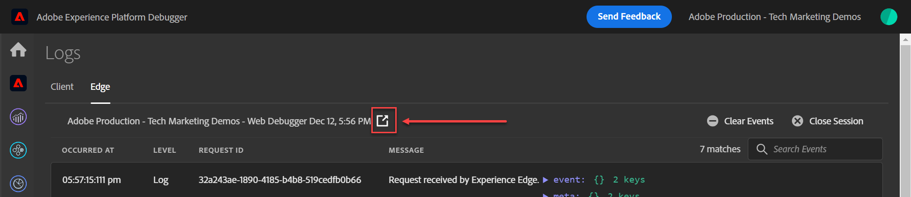

# Validation des mises en oeuvre du SDK Web avec Experience Platform Assurance

## Démarrer une session d’assurance

Adobe Experience Platform Assurance est un produit de Adobe Experience Cloud qui vous aide à inspecter, à tester, à simuler et à valider la manière dont vous collectez des données ou diffusez des expériences.

En savoir plus sur [Assurance Adobe](https://experienceleague.adobe.com/docs/experience-platform/assurance/home.html?lang=en).

Chaque fois que vous activez Edge Trace, une session d’assurance est lancée en arrière-plan.

Pour afficher la session Assurance,

1. Une fois Edge Trace activé, une icône de lien sortant s’affiche en haut de l’écran. Sélectionnez l’icône pour ouvrir Assurance. Un nouvel onglet s’ouvre dans votre navigateur.

   

1. Sélectionnez la ligne avec l’événement appelé Adobe Response Handle.
1. Un menu s’affiche à droite. Sélectionnez la variable `+` signe en regard de `[!UICONTROL ACPExtensionEvent]`
1. Effectuez un zoom avant en sélectionnant `[!UICONTROL payload > 0 > payload > 0 > namespace]`. L’identifiant affiché sous la dernière `0` correspond au `ECID`. Vous le savez par la valeur qui apparaît sous `namespace` match `ECID`

   

   >[!CAUTION]
   >
   >Vous pouvez voir une valeur ECID tronquée en raison de la largeur de la fenêtre. Il vous suffit de sélectionner la barre de gestion dans l’interface et de faire glisser le curseur vers la gauche pour afficher l’ensemble de l’ECID.

Dans les futures leçons, vous utiliserez Assurance pour valider les payloads entièrement traités atteignant une application d’Adobe activée dans votre flux de données.

Avec un objet XDM qui se déclenche maintenant sur une page et avec les connaissances nécessaires pour valider votre collecte de données, vous êtes prêt à configurer les applications Adobe individuelles à l’aide du SDK Web Platform.