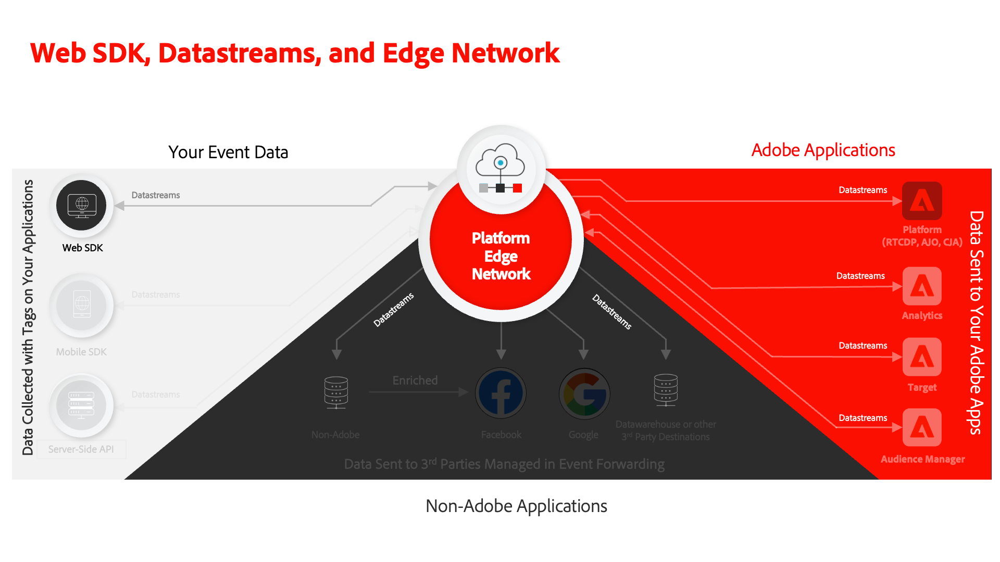

# Configurer un trains de données

Découvrez comment configurer un flux de données pour le SDK web d’Adobe Experience Platform.

[Datastreams](https://experienceleague.adobe.com/fr/docs/experience-platform/datastreams/overview) indiquer à l’Edge Network Adobe Experience Platform où envoyer les données collectées par le SDK Web Platform. Dans la configuration des flux de données, vous activez les applications Experience Cloud, votre compte Experience Platform et le transfert des événements.

## Objectifs d&#39;apprentissage

À la fin de cette leçon, vous saurez comment :

* Création dʼun flux de données
* Prise en main des remplacements de flux de données

## Conditions préalables

Avant de configurer votre flux de données, vous devez avoir terminé les leçons suivantes :

* [Configuration d’un schéma](configure-schemas.md)
* [Configuration d’un espace de noms d’identité](configure-identities.md)

## Création dʼun flux de données

Vous pouvez maintenant créer un flux de données pour indiquer à Platform Edge Network où envoyer les données collectées par le SDK Web.

**Pour créer un flux de données :**

1. Ouvrez le [Interface de collecte de données](https://launch.adobe.com/){target="_blank"}
1. Assurez-vous que vous vous trouvez dans le bon environnement de test

   >[!NOTE]
   >
   >Si vous êtes client d’une application basée sur Platform telle que Real-Time CDP ou Journey Optimizer, nous vous recommandons d’utiliser un environnement de test de développement pour ce tutoriel. Si ce n’est pas le cas, utilisez le **[!UICONTROL Prod]** sandbox.

1. Accédez à **[!UICONTROL Datastreams]** dans la navigation de gauche
1. Sélectionner **[!UICONTROL Nouvelle structure de données]**
1. Entrée `Luma Web SDK: Development Environment` comme la propriété **[!UICONTROL Nom]**. Ce nom est référencé ultérieurement lorsque vous configurez l’extension SDK Web dans la propriété de balise.
1. Sélectionner **[!UICONTROL Enregistrer]**

   

   >[!NOTE]
   >
   >Il n’est pas nécessaire de sélectionner un schéma. Une sélection de schéma n’est requise que si vous utilisez le [Préparation de données pour la collecte de données](/help/data-collection/edge/data-prep.md) fonction .

Sur l’écran suivant, vous pouvez ajouter des services tels que des applications d’Adobe à la banque de données, mais vous n’ajouterez aucun service à ce stade. Vous le ferez plus tard dans les leçons. [Configuration d’un Experience Platform](setup-experience-platform.md), [Configuration d’Analytics](setup-analytics.md), [Configuration de l’Audience Manager](setup-audience-manager.md), [Configuration de Target](setup-target.md), ou [Transfert d’événement](setup-event-forwarding.md).

>[!NOTE]
>
>Lors de l’implémentation du SDK Web Platform sur votre propre site web, vous devez créer trois flux de données à mapper à vos trois environnements de balises (développement, évaluation et production). Si vous utilisez le SDK Web Platform avec des applications basées sur Platform telles qu’Adobe Real-time Customer Data Platform ou Adobe Journey Optimizer, vous devez veiller à créer ces flux de données dans les environnements de test Platform appropriés.

## Remplacement d’un flux de données

[Remplacements des flux de données](https://experienceleague.adobe.com/en/docs/experience-platform/datastreams/overrides) vous permettent de définir des configurations supplémentaires pour votre flux de données, puis de remplacer votre configuration par défaut sous certaines conditions.

Le remplacement de la configuration du flux de données est un processus en deux étapes :

1. Tout d’abord, vous définissez des remplacements de flux de données dans la configuration du service de flux de données. Vous pouvez par exemple définir d’autres suites de rapports Analytics, espaces de travail Target ou jeux de données Platform à utiliser comme remplacements.
1. Ensuite, vous envoyez les remplacements à l’Edge Network par une action d’événement d’envoi de SDK Web ou par une configuration dans l’extension de balise SDK Web.

Dans le [Configuration d’Adobe Analytics](setup-analytics.md) leçon : vous remplacez la suite de rapports pour une page à l’aide de l’action Envoyer l’événement du SDK Web Platform.

Vous êtes maintenant prêt à installer l’extension SDK Web Platform dans votre propriété de balise !

[Suivant : ](install-web-sdk.md)

>[!NOTE]
>
>Merci d’avoir consacré du temps à l’apprentissage du SDK Web Adobe Experience Platform. Si vous avez des questions, souhaitez partager des commentaires généraux ou avez des suggestions sur le contenu futur, partagez-les à ce sujet. [Article de discussion de la communauté Experience League](https://experienceleaguecommunities.adobe.com/t5/adobe-experience-platform-data/tutorial-discussion-implement-adobe-experience-cloud-with-web/td-p/444996)
