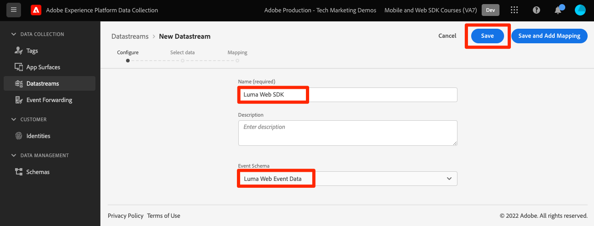

# Configurer un train de données

Découvrez comment activer un flux de données et configurer des solutions Experience Cloud.

Les flux de données indiquent à Adobe Experience Platform Edge Network où envoyer les données collectées par le SDK Web Platform. Dans la configuration des flux de données, vous activez les applications Experience Cloud, votre compte Experience Platform et le transfert des événements. Voir [Principes de base de la configuration d’un flux de données](https://experienceleague.adobe.com/docs/experience-platform/edge/fundamentals/datastreams.html?lang=fr) pour plus d’informations.

## Objectifs d&#39;apprentissage

À la fin de cette leçon, vous saurez comment :

* Création dʼun flux de données
* Activation des applications Experience Cloud
* Activer l’Experience Platform

## Conditions préalables

Avant de configurer votre flux de données, vous devez avoir terminé les leçons suivantes :

* [Configuration des autorisations](configure-permissions.md)
* [Configuration d’un schéma](configure-schemas.md)
* [Configuration d’un espace de noms d’identité](configure-identities.md)

## Création dʼun flux de données

Vous pouvez maintenant créer un flux de données pour indiquer à Platform Edge Network où envoyer les données collectées par le SDK Web.

**Pour créer un flux de données :**

1. Ouvrez le [Interface de collecte de données](https://launch.adobe.com/){target="_blank"}
1. Assurez-vous que vous vous trouvez dans le bon environnement de test.

   >[!NOTE]
   >
   >Si vous êtes le client d’une application basée sur Platform comme Real-Time CDP, nous vous recommandons d’utiliser un environnement de test de développement pour ce tutoriel. Si ce n’est pas le cas, utilisez la variable **[!UICONTROL Prod]** sandbox.

1. Accédez à **[!UICONTROL Datastreams]** dans le volet de navigation de gauche
1. Sélectionner **[!UICONTROL Nouvelle structure de données]** sur le côté droit de l’écran.
1. Entrée `Luma Web SDK` comme la propriété **[!UICONTROL Nom]**. Ce nom est référencé ultérieurement lorsque vous configurez l’extension SDK Web dans la propriété de balise.
1. Sélectionnez votre `Luma Web Event Data` comme la propriété **[!UICONTROL Schéma d’événement]**
1. Sélectionnez **[!UICONTROL Enregistrer]**

   

   >[!AVAILABILITY]
   >
   >La fonctionnalité de mappage sera intégrée ultérieurement à ce tutoriel.

Sur l’écran suivant, vous pouvez ajouter des services tels que des applications d’Adobe à la banque de données, mais vous n’ajouterez aucun service à ce stade du tutoriel. Vous le ferez plus tard dans les leçons. [Configuration d’un Experience Platform](setup-experience-platform.md), [Configuration d’Analytics](setup-analytics.md), [Configuration de l’Audience Manager](setup-audience-manager.md), [Configuration de Target](setup-target.md)ou [Transfert d’événement](setup-event-forwarding.md).

>[!NOTE]
>
>Lors de l’implémentation du SDK Web Platform sur votre propre site web, vous devez créer trois flux de données à mapper à vos trois environnements de balises (développement, évaluation et production). Si vous utilisez le SDK Web Platform avec des applications basées sur Platform telles qu’Adobe Real-time Customer Data Platform ou Adobe Journey Optimizer, vous devez veiller à créer ces flux de données dans les environnements de test Platform appropriés.

Vous êtes maintenant prêt à installer l’extension SDK Web Platform dans votre propriété de balise !

[Suivant : ](install-web-sdk.md)

>[!NOTE]
>
>Merci d’avoir consacré du temps à l’apprentissage du SDK Web Adobe Experience Platform. Si vous avez des questions, souhaitez partager des commentaires généraux ou avez des suggestions sur le contenu futur, partagez-les à ce sujet. [Article de discussion de la communauté Experience League](https://experienceleaguecommunities.adobe.com/t5/adobe-experience-platform-launch/tutorial-discussion-implement-adobe-experience-cloud-with-web/td-p/444996)
