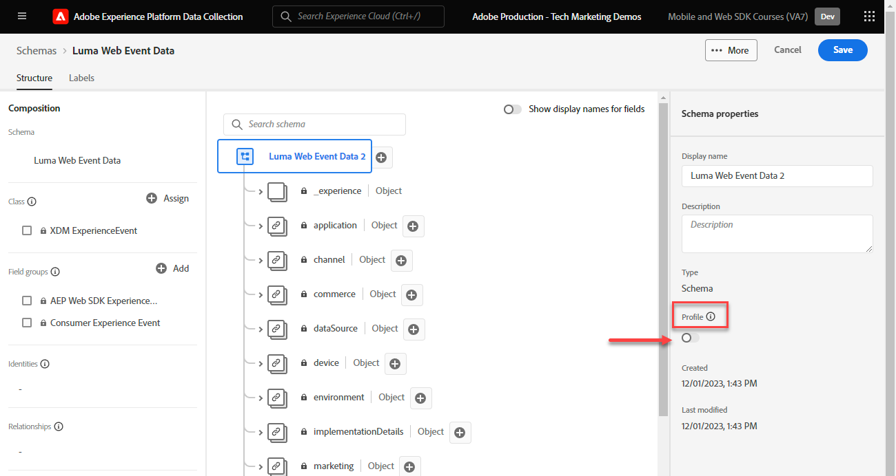

# Création d’un schéma XDM pour les données web

Découvrez comment créer un schéma XDM pour les données web dans l’interface de collecte de données.

Les schémas de modèle de données d’expérience (XDM) sont les blocs de création, les principes et les bonnes pratiques pour la composition de schémas dans Adobe Experience Platform.

Le SDK web Platform utilise votre schéma pour normaliser vos données d’événement web, les envoyer au réseau Platform Edge et, en fin de compte, transférer les données vers toute application Experience Cloud configurée dans le flux de données. Cette étape est essentielle, car elle définit un modèle de données standard requis pour ingérer des données d’expérience client dans Experience Platform et permet aux services et applications en aval de fonctionner conformément à ces normes.

>[!NOTE]
>
> À des fins de démonstration, les exercices de cette leçon créent un exemple de schéma pour capturer le contenu consulté et les produits achetés par les clients dans la variable [Site de démonstration Luma](https://luma.enablementadobe.com/content/luma/us/en.html). Bien que vous puissiez utiliser ces étapes pour créer un schéma différent à vos propres fins, il est recommandé de suivre d’abord la création de l’exemple de schéma pour découvrir les fonctionnalités de l’éditeur de schémas.

Pour en savoir plus sur les schémas XDM, suivez le cours &quot;[Modèle de vos données d’expérience client avec XDM](https://experienceleague.adobe.com/?recommended=ExperiencePlatform-D-1-2021.1.xdm)&quot; ou voir la variable [Présentation du système XDM](https://experienceleague.adobe.com/docs/experience-platform/xdm/home.html?lang=fr).

## Objectifs d&#39;apprentissage

À la fin de cette leçon, vous saurez comment :

* Création d’un schéma XDM dans l’interface de collecte de données
* Ajout de groupes de champs à votre schéma XDM
* Création de schémas XDM pour les données d’événement web à l’aide des bonnes pratiques

## Conditions préalables

Toutes les autorisations d’utilisateur et d’approvisionnement nécessaires pour la collecte de données et Adobe Experience Platform décrites dans la section [Configuration des autorisations](configure-permissions.md) leçon.

## Créer un schéma XDM

Les schémas XDM sont la méthode standard pour décrire les données en Experience Platform, ce qui permet à toutes les données conformes aux schémas d’être réutilisées dans une organisation sans conflit, voire partagées entre plusieurs organisations. Pour en savoir plus, voir la section [Principes de base de la composition des schémas](https://experienceleague.adobe.com/docs/experience-platform/xdm/schema/composition.html?lang=fr).

Au cours de cet exercice, vous allez créer un schéma XDM à l’aide des groupes de champs de ligne de base recommandés pour capturer les données d’événement web sur la variable [Site de démonstration Luma](https://luma.enablementadobe.com/content/luma/us/en.html){target=&quot;_blank&quot;} :

1. Ouvrez le [Interface de collecte de données](https://launch.adobe.com/){target=&quot;_blank&quot;}
1. Assurez-vous que vous vous trouvez dans le bon environnement de test.

   >[!NOTE]
   >
   >Si vous êtes client d’une application basée sur Platform telle que la plateforme de données clients en temps réel, nous vous recommandons d’utiliser un environnement de test de développement pour ce tutoriel.

1. Accédez à **[!UICONTROL Schémas]** dans le volet de navigation de gauche
1. Sélectionnez la **[!UICONTROL Création d’un schéma]** en haut à droite
1. Dans le menu déroulant, sélectionnez **[!UICONTROL XDM ExperienceEvent]**

## Ajouter des groupes de champs

Comme nous l’avons déjà mentionné, XDM est le cadre de base qui normalise les données d’expérience client en fournissant des structures et des définitions communes à utiliser dans les services Adobe Experience Platform en aval. En adhérant aux normes XDM, _toutes les données d’expérience client_ peut être intégré à une représentation commune. Cette approche vous permet d’obtenir des informations précieuses à partir des actions des clients, de définir des audiences de clients par le biais de segments et d’exprimer les attributs du client à des fins de personnalisation à l’aide de données provenant de plusieurs sources. Voir [Bonnes pratiques relatives à la modélisation des données](https://experienceleague.adobe.com/docs/experience-platform/xdm/schema/best-practices.html?lang=en) pour plus d’informations.

Dans la mesure du possible, il est recommandé d’utiliser des groupes de champs existants et de respecter un modèle et des conventions d’affectation des noms indépendant du produit. Pour toute donnée propre à votre organisation qui ne correspond pas aux groupes de champs prédéfinis ci-dessus, vous pouvez créer un groupe de champs personnalisé. Voir [Création d’un schéma à l’aide de l’éditeur de schémas](https://experienceleague.adobe.com/docs/experience-platform/xdm/tutorials/create-schema-ui.html?lang=en#create) pour obtenir des instructions plus détaillées sur les schémas personnalisés.

>[!TIP]
> 
>Dans cet exercice, vous ajoutez les groupes de champs prédéfinis recommandés pour la collecte de données web : _**[!UICONTROL Mixin ExperienceEvent du SDK Web AEP]**_, et _**[!UICONTROL Événement d’expérience client]**_.

1. Conserver **[!UICONTROL Utiliser un groupe de champs existant]** Bouton radio sélectionné
1. Recherchez [!UICONTROL `AEP Web SDK ExperienceEvent Mixin`].
1. Cochez la case
1. Recherchez [!UICONTROL `Consumer Experience Event`].
1. Cochez la case
1. Sélectionner **[!UICONTROL Ajouter des groupes de champs]**

   

Une fois les groupes de champs sélectionnés, vous êtes prêt à nommer votre schéma. Une convention d’affectation de nom courante pour les schémas XDM consiste à nommer le schéma après la source des données :

1. Dans le **[!UICONTROL Composition**] , sélectionnez `Untitled schema name`
1. Dans le **[!UICONTROL Propriétés du schéma]** , accédez au panneau **[!UICONTROL Nom d’affichage]** `Luma Web Event Data`
1. Sélectionnez **[!UICONTROL Enregistrer]**

Avec les deux groupes de champs, notez que vous avez accès aux paires clé-valeur les plus couramment utilisées requises pour la collecte de données sur le Web. Lorsque vous cliquez sur l’un des noms de groupe de champs, l’interface met en évidence les regroupements de paires clé-valeur qui lui appartiennent. Dans l’exemple ci-dessous, vous pouvez voir à quels groupes appartiennent. **[!UICONTROL Événement d’expérience client]**.

Cette leçon n&#39;est qu&#39;un point de départ. Lors de la création de votre propre schéma d’événements web, vous devez explorer et documenter les besoins de votre entreprise. Ce processus est similaire à la création d’une [Document sur les besoins de l’entreprise](https://experienceleague.adobe.com/docs/analytics-learn/tutorials/implementation/implementation-basics/creating-a-business-requirements-document.html?lang=fr) et [Référence de conception de solution](https://experienceleague.adobe.com/docs/analytics-learn/tutorials/implementation/implementation-basics/creating-and-maintaining-an-sdr.html) pour une mise en oeuvre Adobe Analytics, mais doit inclure des exigences pour _tous les destinataires de données en aval_ telles que les destinations de transfert de Platform, de Target et d’événement.

### Objet identityMap

Un ensemble spécial de données est nécessaire pour identifier les utilisateurs web appelés `[!UICONTROL identityMap]`.

Il s’agit d’un objet obligatoire pour toute collecte de données Web, car il contient l’identifiant Experience Cloud requis pour identifier les utilisateurs sur le Web. C’est également la clé de la définition des ID de client internes pour les utilisateurs authentifiés. `[!UICONTROL identityMap]` est abordé plus en détail dans la section [Configuration des identités](configure-identities.md) leçon. Elle est automatiquement incluse dans tous les schémas à l’aide de la variable **[!UICONTROL XDM ExperienceEvent]** classe .

>[!IMPORTANT]
>
> Il est possible d’activer **[!UICONTROL Profil]** pour un schéma avant d’enregistrer votre schéma. **Ne pas** l’activer à ce stade. Une fois qu’un schéma est activé pour Profile, il ne peut pas être désactivé ni supprimé. De plus, les champs ne peuvent plus être supprimés du schéma après ce point. Il est important de tenir compte de ces implications ultérieurement lorsque vous travaillez avec vos propres données dans votre environnement de production.
>
>Ce paramètre est décrit plus en détail lors de la [Configuration d’Experience Platform](setup-experience-platform.md) leçon.
>

Vous pouvez maintenant référencer ce schéma lorsque vous ajoutez l’extension SDK Web à votre propriété de balise.

[Suivant : ](configure-identities.md)

>[!NOTE]
>
>Merci d’avoir consacré du temps à l’apprentissage du SDK Web Adobe Experience Platform. Si vous avez des questions, souhaitez partager des commentaires généraux ou avez des suggestions sur le contenu futur, partagez-les à ce sujet. [Article de discussion de la communauté Experience League](https://experienceleaguecommunities.adobe.com/t5/adobe-experience-platform-launch/tutorial-discussion-implement-adobe-experience-cloud-with-web/td-p/444996)
